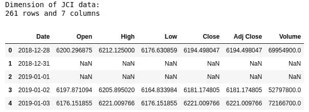
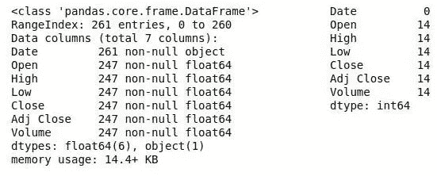
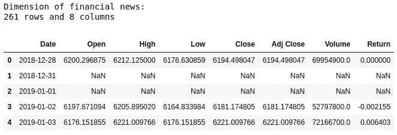
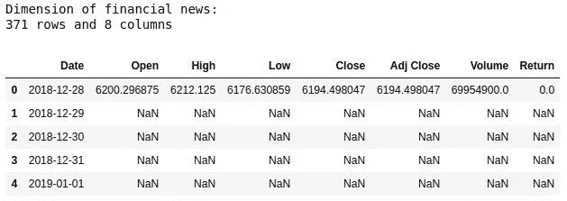
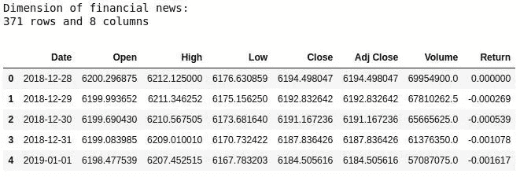
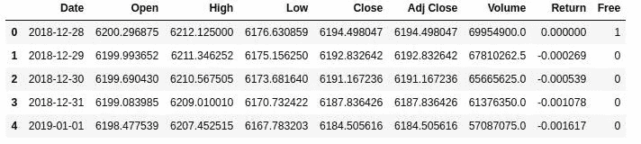

# 用 Python 实现股票数据内插的凹函数

> 原文：<https://towardsdatascience.com/curve-function-to-interpolate-stocks-data-cd01523ed0a0?source=collection_archive---------38----------------------->


照片由[威廉·艾文](https://unsplash.com/@firmbee?utm_source=medium&utm_medium=referral)在 [Unsplash](https://unsplash.com?utm_source=medium&utm_medium=referral) 上拍摄

## [动手教程](https://towardsdatascience.com/tagged/hands-on-tutorials)

## 雅加达综合指数的案例研究(JCI)

## 目录(仅适用于 web)

```
1 [Overview](#5838)
2 [Let’s Practice with Python](#587f)
3 [Conclusion](#5ffa)
4 [References](#f360)
```

## 概观

股票投资者必须考虑的一个特征是不稳定性。因此，投资者必须制定一个聪明的策略来获得投资的资本收益，例如，财务预测。分析师必须从财务数据中找出模式和见解。例如，我们需要创建雅加达综合指数(JCI)的数据分析。这些数据很容易在雅虎上下载。金融。但是，我们分析的一个考虑因素是数据的缺失值。

一般证券交易所周一到周五上班，除非是节假日。为了进行插值，Mittal 和 Goel (2012)提出了凹函数。如果给定日期的 JCI 值为 *X* ，下一个可用值为 *Y* ，中间缺少 *n* 天，则 *X1* 的第一个缺失值可以使用`**(*X+Y*)/2**`来近似，并对其他缺失值重复。

## 让我们用 Python 来练习一下

在我们开始曲线功能之前，首先我们必须从 Yahoo！金融。你可以很容易地选择任何股票，但对于本教程，我将使用 2019 年的 JCI 数据。负责人向我的 [**GitHub 的**](https://github.com/audhiaprilliant/Natural-Language-based-Financial-Forecasting) 回购了数据。

```
# Import libraries
import pandas as pd   # Dataframe manipulation
import numpy as np    # Mathematics operation
import datetime       # Date and time
# Load the data
ihsg_data = pd.read_csv('Datasets/^JKSE.csv')
print('Dimension of JCI data:\n{}'.format(ihsg_data.shape[0]),
      'rows and {}'.format(ihsg_data.shape[1]),'columns')
ihsg_data.head()
```



JCI 的原始资料(图片由作者提供)

```
# Get the metadata of columns
ihsg_data.info()
# Check missing value
ihsg_data.isna().sum()
```



JCI 数据中的元数据和缺失值信息(图片由作者提供)

导入数据后，我们创建将应用于数据的函数。这些功能如下:

*   `**imput_date**`:输入我们数据中未列出的日期
*   `**return_stocks**`:计算股票回报率
*   `**curve_function**`:使用曲线功能对缺失值进行插值

插值股票数据的凹函数

让我们运行`**return_stocks**`的第一个函数。输出是带有新的 return 列的数据集。我们对熊猫使用的`**pipe**`方法如下:

```
# Calculate the return of stocks
ihsg_data_clean = ihsg_data.pipe(return_stocks,col='Adj Close', date='Date')
print('Dimension of financial news:\n{}'.format(ihsg_data_clean.shape[0]),
      'rows and {}'.format(ihsg_data_clean.shape[1]),'columns')
ihsg_data_clean.head()
```



应用`**return_stocks**`功能后的 JCI 数据(图片由作者提供)

在运行了`**return_stocks**`函数之后，我们得到了数据中列出的所有日期的返回结果，但是问题是如果我们的日期为空，我们如何在返回结果中插入缺失值。所以，在实现`**curve_function**`之前，我们需要以区间形式提供日期。很简单，运行`**imput_date**`的功能即可。代码和结果如下。

```
# Input the missing data on date column
ihsg_data_clean = ihsg_data_clean.pipe(imput_date,col='Date')
print('Dimension of financial news:\n{}'.format(ihsg_data_clean.shape[0]),
      'rows and {}'.format(ihsg_data_clean.shape[1]),'columns')
ihsg_data_clean.head()
```



应用`**imput_date**`功能后的 JCI 数据(图片由作者提供)

那好吧。`**Date**`列上缺失的数据已经由`**imput_date**`函数填充。结果很棒。现在，我们必须确定这些日期是否是自由日。理论上，交易活动是从周一到周五，这是我们的原始数据，只提供交易日的信息。`**curve_function**`使用来自这里的信息，所以我们必须提供它。

```
# Create dummy variable for deterimining free day or not
free = []
for i in range(ihsg_data_clean.shape[0]):
    if pd.isna(ihsg_data_clean.iloc[i]['Volume']):
        free.append(0)
    else:
        free.append(1)
```

在确定了某个具体日期是否是自由日之后，我们只需轻松运行`**curve_function**`的主函数即可。

```
# Interpolate the return by curve function
ihsg_data_curve = ihsg_data_clean.pipe(curve_function)
print('Dimension of financial news:\n{}'.format(ihsg_data_curve.shape[0]),
      'rows and {}'.format(ihsg_data_curve.shape[1]),'columns')
ihsg_data_curve.head()
```



应用`**curve_function**`功能后的 JCI 数据(图片由作者提供)

最后一步是将自由日的列与上表合并。当我们用这些数据进行分析时，它是有用的。关于原始数据的信息仍然存在，我们可以使用`**Free**`列对其进行过滤。

```
# Concatenate previous-interpolated data with dummy
ihsg_data = pd.concat([ihsg_data_curve,pd.Series(free,name='Free')],axis=1)
ihsg_data.head()
```



最终数据还是 JCI(图片由作者提供)

用于实现凹面功能的笔记本

## 结论

凹函数是在股票——金融数据中进行数据分析或机器学习之前，第一个也是至关重要的数据预处理。每日股票数据的模式被假定为平稳线性。使用凹函数，分析师可以捕获一年中 365 天的股票数据可用性，但可以根据需要进行定制。

请前往我的 [**GitHub repo**](https://github.com/audhiaprilliant/Natural-Language-based-Financial-Forecasting) 查看完成的代码。

## 参考

[1] A .米塔尔，a .戈埃尔。 [*利用 Twitter 情绪分析进行股票预测*](http://cs229.stanford.edu/proj2011/GoelMittal-StockMarketPredictionUsingTwitterSentimentAnalysis.pdf) (2012 年)[http://cs 229 . Stanford . edu/proj 2011/goelmittalstockkmarkedpredictionusingtwittersentimentanalysis . pdf](http://cs229.stanford.edu/proj2011/GoelMittal-StockMarketPredictionUsingTwitterSentimentAnalysis.pdf)。