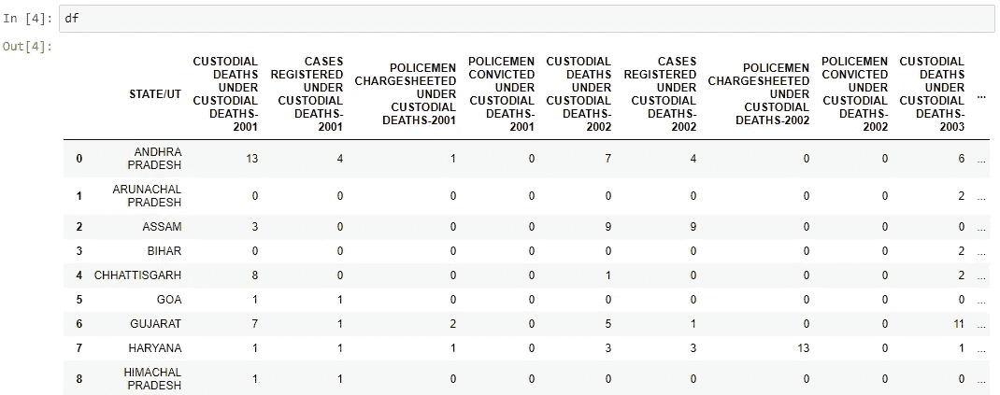
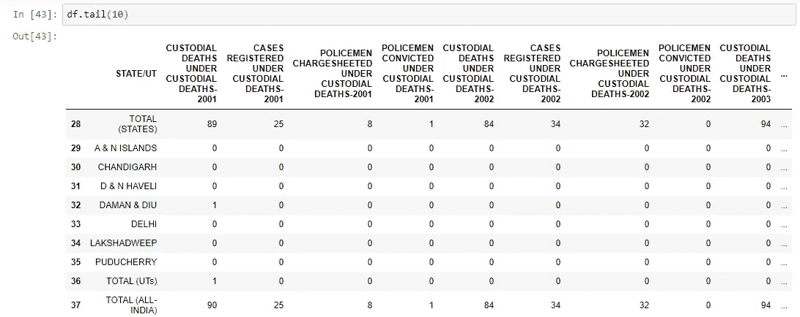
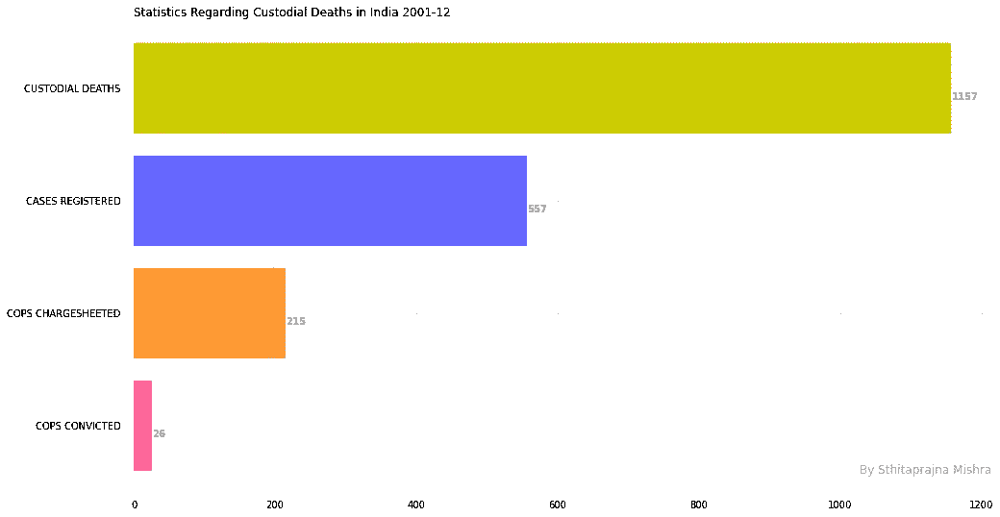
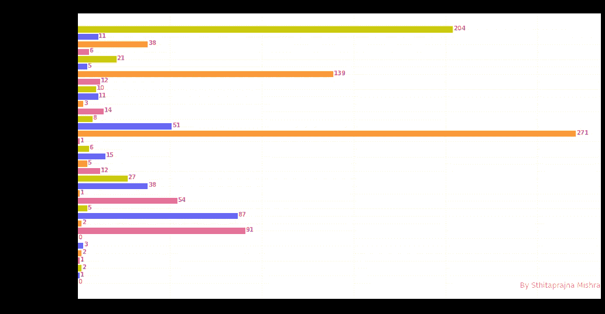
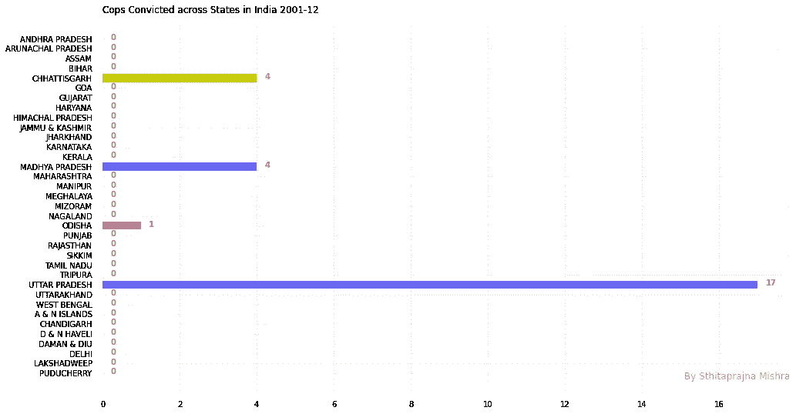
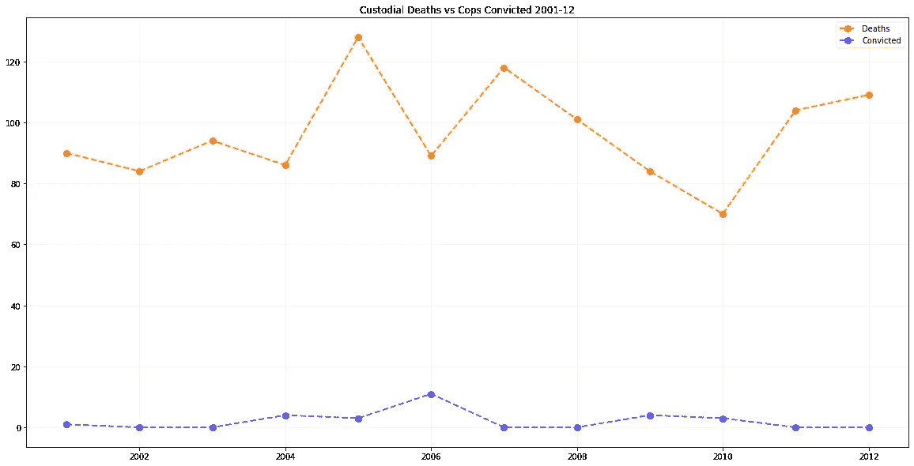
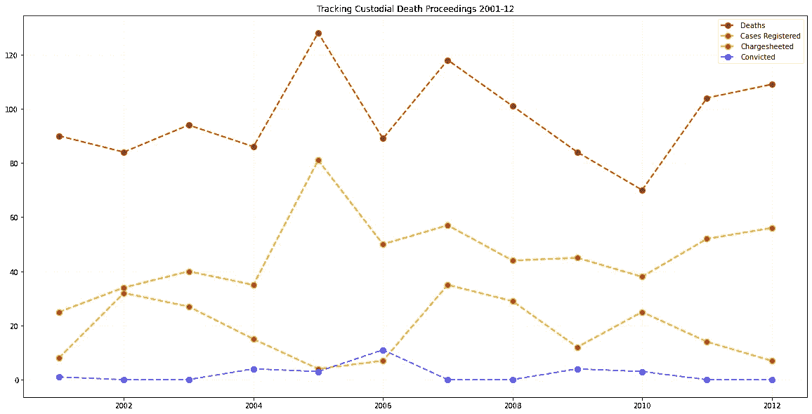

# 拘留死亡:分析数据揭露警察暴行

> 原文：<https://towardsdatascience.com/custodial-deaths-analyzing-data-to-uncover-police-brutality-ae19fa539312?source=collection_archive---------39----------------------->

## 大量警察在羁押期间死亡却逍遥法外，而且这一趋势还在上升。


[叶韩晶](https://unsplash.com/@yejinghan)在[上拍照](http://www.unsplash.com)

今年 6 月，印度惊觉一对父子死于警方的监禁酷刑。他们如何受到性侵犯和极其残忍的虐待的悲惨故事提醒人们，监禁中的酷刑和随后的死亡在印度已经成为一种常态。

警察一再利用大量人口不知道宪法赋予他们的权利这一事实。

## 在这篇文章中，我从[开放政府数据(OGD)平台印度](http://data.gov.in)获取了数据，以了解印度羁押期间死亡有多普遍，以及罪犯是否受到惩罚。

OGD 印度是一个支持印度政府开放数据倡议的平台。

该门户是对印度政府各部委、部门和组织发布的数据集、文档、服务、工具和应用程序的单点访问。

数据在网站上完全免费提供，任何人都可以访问。

在这篇文章中，我使用了一个数据集，其中包含了 2001 年至 2012 年印度在押人员死亡的所有数据。

**注意**:包含所有代码和可视化的 Jupyter 笔记本在我的 Github 资源库中，其链接在本文末尾提到。

# 数据分析

第一步是导入所有必需的库。

```
import numpy as np
import pandas as pd
import matplotlib.pyplot as plt
```

然后，我查看数据集，了解数据是如何存储的。

```
df = pd.read_csv("CD.csv")
df
```



行包含州，列包含数据，每 4 列包含每年的数据。

但是向下滚动时，我注意到有 3 行(索引 28、36、37)没有表示与州有关的数据。



当我稍后执行数据可视化时，我会记住这一点。

目前，该数据集包含每年的数据，但没有汇总数据。为了执行数据分析，我将向这个数据集中再添加 4 列。

第一栏将显示 2001 年至 2012 年间羁押中死亡的总人数。

```
#Total custodial deaths per statetotal_deaths_per_state = []
per_state = 0

for row in range(0, 38):
    per_state = 0
    for col in range(1, len(df.columns), 4):
        #print(df.iloc[row, col])
        per_state += df.iloc[row, col]
    total_deaths_per_state.append(per_state)

print(total_deaths_per_state)
```

我从“2001 年羁押中死亡数”栏下的“**羁押中死亡数”开始，进行第 4 步，得出下一年的数据，以此类推，直到 2012 年，同时将每年的数据附加到一个列表中。**

我将列表转换成 panda 系列，并将其作为新列添加到数据集。

```
x = pd.Series(total_deaths_per_state)
df['TOTAL CUSTODIAL DEATHS'] = x.values
df.head()
```

同样，我添加了其余 3 列——登记的案件总数、被指控的警察总数和被定罪的警察总数。

完成后，我将其保存为一个新的数据集。

```
df.to_csv("CD_Updated.csv", index = False)
```

可视化将在我之前创建的新数据集“CD_Updated.csv”上执行。

```
final_df = pd.read_csv("CD_Updated.csv")
final_df.tail(10)
```

# 数据结果

## 1.拘留期间死亡、登记的案件、被指控的警察、被定罪的警察

我通过选择最后 4 列和最底部的一行(包含整个国家的数据)来获取必要的单元格，并使用 Matplotlib 绘制条形图。

```
x1_values = list(["CUSTODIAL DEATHS", "CASES REGISTERED", "COPS CHARGESHEETED", "COPS CONVICTED"])
y1_values = list(df.iloc[37, -4:]) #last row and last 4 columns# Figure Size 
fig, ax = plt.subplots(figsize =(16, 9)) 

# Horizontal Bar Plot 
ax.barh(x1_values, y1_values, color = ["#cccc00", "#6666ff", "#ff9933", "#ff6699"]) 

# Remove axes splines 
for s in ['top', 'bottom', 'left', 'right']: 
    ax.spines[s].set_visible(False) 

# Remove x, y Ticks 
ax.xaxis.set_ticks_position('none') 
ax.yaxis.set_ticks_position('none') 

# Add padding between axes and labels 
ax.xaxis.set_tick_params(pad = 5) 
ax.yaxis.set_tick_params(pad = 10) 

# Add x, y gridlines 
ax.grid(b = True, color ='grey', 
        linestyle ='-.', linewidth = 0.5, 
        alpha = 0.2) 

# Show top values  
ax.invert_yaxis() 

# Add annotation to bars 
for i in ax.patches: 
    plt.text(i.get_width()+0.2, i.get_y()+0.5,  
             str(round((i.get_width()), 2)), 
             fontsize = 10, fontweight ='bold', 
             color ='grey')# Add title 
ax.set_title('Statistics Regarding Custodial Deaths in India 2001-12', 
             loc ='left', ) 

# Add Text watermark 
fig.text(0.9, 0.15, 'By Sthitaprajna Mishra', fontsize = 12, 
         color ='grey', ha ='right', va ='bottom', 
         alpha = 0.7) 

# Show Plot 
plt.show()
```



这里的数字差异非常令人震惊。

在 12 年中，有 1157 人在被警方拘留期间死亡，而只有 26 名警察被判有罪。

## 2.跨州羁押死亡

我得到了这个图的 y 值和 x 值。

```
x2_values = list(final_df['STATE/UT'].values)
y2_values = list(final_df['TOTAL CUSTODIAL DEATHS'].values)
```

但是，包含 x 值的列表还包含 3 行，它们是州、联邦直辖区(UTs)和整个国家的总计。我在一开始看数据时就指出了这一点，记得吗？

现在，我将这 3 行从 x 值中移除。

```
x2_values.remove('TOTAL (ALL-INDIA)')
x2_values.remove('TOTAL (UTs)')
x2_values.remove('TOTAL (STATES)')
```

我还必须删除所有这些行的相应 y 值。我回到我的数据集，记下这些行的索引，并从我的 y 值中删除它们。

```
y2_values.remove(y2_values[37])
y2_values.remove(y2_values[36])
y2_values.remove(y2_values[28])
```

在获得坐标轴的正确值后，我绘制了图表。

```
# Figure Size 
fig, ax = plt.subplots(figsize =(16, 9)) 

# Horizontal Bar Plot 
ax.barh(x2_values, y2_values, color = ["#cccc00", "#6666ff", "#ff9933", "#ff6699"]) 

# Remove axes splines 
for s in ['top', 'bottom', 'left', 'right']: 
    ax.spines[s].set_visible(False) 

# Remove x, y Ticks 
ax.xaxis.set_ticks_position('none') 
ax.yaxis.set_ticks_position('none') 

# Add padding between axes and labels 
ax.xaxis.set_tick_params(pad = 5) 
ax.yaxis.set_tick_params(pad = 10) 

# Add x, y gridlines 
ax.grid(b = True, color ='grey', 
        linestyle ='-.', linewidth = 0.5, 
        alpha = 0.2) 

# Show top values  
ax.invert_yaxis() 

# Add annotation to bars 
for i in ax.patches: 
    plt.text(i.get_width()+0.2, i.get_y()+0.5,  
             str(round((i.get_width()), 2)), 
             fontsize = 10, fontweight ='bold', 
             color ='grey')# Add title 
ax.set_title('Custodial Deaths across States in India 2001-12', 
             loc ='left', ) 

# Add Text watermark 
fig.text(0.9, 0.15, 'By Sthitaprajna Mishra', fontsize = 12, 
         color ='grey', ha ='right', va ='bottom', 
         alpha = 0.7) 

# Show Plot 
plt.show()
```



当我们看一下全国拘留期间的死亡人数时，几乎所有的州都是两位数。

印度拘留死亡人数最多的 3 个邦是马哈拉施特拉邦、安得拉邦和古吉拉特邦，其中马哈拉施特拉邦有 271 人死亡。

## 3.跨州定罪的警察

我获取这个图形的 y 值和 x 值。

```
y3_values = list(final_df['TOTAL POLICEMEN CONVICTED'].values)
x3_values = list(final_df['STATE/UT'].values)
```

因为我想绘制一个跨州的图表，并且不希望显示我的国家数据，所以我去掉了那些行，就像我在前面的可视化中所做的那样，然后绘制数据。

```
x3_values.remove('TOTAL (ALL-INDIA)')
x3_values.remove('TOTAL (UTs)')
x3_values.remove('TOTAL (STATES)')#duplicate values present, hence use del instead of remove
del y3_values[37]
del y3_values[36]
del y3_values[28]# Figure Size 
fig, ax = plt.subplots(figsize =(16, 9)) 

# Horizontal Bar Plot 
ax.barh(x3_values, y3_values, color = ["#cccc00", "#6666ff", "#ff9933", "#ff6699"]) 

# Remove axes splines 
for s in ['top', 'bottom', 'left', 'right']: 
    ax.spines[s].set_visible(False) 

# Remove x, y Ticks 
ax.xaxis.set_ticks_position('none') 
ax.yaxis.set_ticks_position('none') 

# Add padding between axes and labels 
ax.xaxis.set_tick_params(pad = 5) 
ax.yaxis.set_tick_params(pad = 10) 

# Add x, y gridlines 
ax.grid(b = True, color ='grey', 
        linestyle ='-.', linewidth = 0.5, 
        alpha = 0.2) 

# Show top values  
ax.invert_yaxis() 

# Add annotation to bars 
for i in ax.patches: 
    plt.text(i.get_width()+0.2, i.get_y()+0.5,  
             str(round((i.get_width()), 2)), 
             fontsize = 10, fontweight ='bold', 
             color ='grey')# Add title 
ax.set_title('Cops Convicted across States in India 2001-12', 
             loc ='left', ) 

# Add Text watermark 
fig.text(0.9, 0.15, 'By Sthitaprajna Mishra', fontsize = 12, 
         color ='grey', ha ='right', va ='bottom', 
         alpha = 0.7) 

# Show Plot 
plt.show()
```



与上图形成鲜明对比的是，这张图显示了在大多数州，没有一个警察被定罪。

另一个严峻的事实是，关押期间死亡人数最多的前三个州在 12 年里也没有定罪。

## 4.多年来采取的行动

现在，我想绘制一个多线图表，显示多年来羁押死亡分布与被定罪的警察，以判断每年对与羁押死亡有关的警察采取了多少行动。

我的 x 值将是 2001-12 年。

```
x4_values = [i for i in range(2001, 2013)]
```

由于这是一个多线图，我将有 2 个不同的 y 值。第一个 y 值将是监管死亡的分布。

```
y4_1_values = []for i in range(1, 48, 4):
    y4_1_values.append(int(final_df.iloc[37, i]))
```

第二个 y 值是被定罪警察的分布。

```
y4_2_values = []for i in range(4, 52, 4):
    y4_2_values.append(int(final_df.iloc[37, i]))

print(y4_2_values)
```

现在，我绘制图表。

```
# plotting the line 1 points 
plt.plot(x4_values, y4_1_values, label = "Deaths", color="#ff9900", linestyle='dashed', linewidth = 2, 
         marker='o', markerfacecolor='#ff3300', markersize=8)# plotting the line 2 points 
plt.plot(x4_values, y4_2_values, label = "Convicted", color= "#6666ff", linestyle='dashed', linewidth = 2, 
         marker='o', markerfacecolor='blue', markersize=8)# Add x, y gridlines 
plt.grid(b = True, color ='grey', 
        linestyle ='-.', linewidth = 0.5, 
        alpha = 0.2)plt.title('Custodial Deaths vs Cops Convicted 2001-12')
plt.legend()
```



从这个数字中可以看出死亡人数和被定罪的警察人数之间的差异。虽然从 2007 年至 2010 年，羁押期间的死亡人数似乎有所下降，但自那以后，死亡人数一直在增加，而且似乎只是在上升。

另一方面，警察被定罪的情节似乎是一条直线。

## 5.跟踪司法程序

在看到如此强烈对比的数字后，我想找出司法系统在哪里动摇了。

针对警察的案件数量减少了吗？还是法院不会公布对警察的指控？还是司法当局没有给足够多的警察定罪的错？

为了获得整个数据集的整体视图，我绘制了一个更详细的多线图。

我得到了所有登记案件和所有警察的 y 值，并将它们一起绘制出来。

```
y5_1_values = [] #cases registeredfor i in range(2, 48, 4):
    y5_1_values.append(int(final_df.iloc[37, i]))y5_2_values = [] #cops chargesheetedfor i in range(3, 48, 4):
    y5_2_values.append(int(final_df.iloc[37, i]))# plotting the line 'death' points 
plt.plot(x4_values, y4_1_values, label = "Deaths", color= "#cc3300", linestyle='dashed', linewidth = 2, 
         marker='o', markerfacecolor='#802000', markersize=8)# plotting the line 1 points 
plt.plot(x4_values, y5_1_values, label = "Cases Registered", color="#ff9900", linestyle='dashed', linewidth = 2, 
         marker='o', markerfacecolor='#ff3300', markersize=8)# plotting the line 2 points 
plt.plot(x4_values, y5_2_values, label = "Chargesheeted", color= "#cccc00", linestyle='dashed', linewidth = 2, 
         marker='o', markerfacecolor='#808000', markersize=8)# plotting the line 3 points 
plt.plot(x4_values, y4_2_values, label = "Convicted", color= "#6666ff", linestyle='dashed', linewidth = 2, 
         marker='o', markerfacecolor='blue', markersize=8)# Add x, y gridlines 
plt.grid(b = True, color ='grey', 
        linestyle ='-.', linewidth = 0.5, 
        alpha = 0.2)plt.title('Tracking Custodial Death Proceedings 2001-12')
plt.legend()
```



这个数字让我们更详细地发现了缺乏行动的地方。

虽然在所有拘留期间死亡的案件中，只有不到 50%的案件是针对警察的，但受到指控的警察人数非常少。其中，被定罪的警察人数更少。

这一分析的结果表明，在对警察采取行动时，司法系统是多么的脆弱。

这背后的一个主要原因是，由于害怕成为警察的目标，受害者提起的案件数量很少，这是可以理解的，因为尽管有这么多针对警察的案件登记，但几乎没有几份起诉书被公布。

除非越来越多的人站出来，司法部门采取合理的行动，否则警察将继续逍遥法外。

尽管这一数据相对较旧，但它仍然有效，或者更糟，差距甚至更大，因为这种情况近年来才有所增加。

如果你想看看更多的数据，并在自己挖掘的同时进行研究，我建议你访问[开放政府数据(OGD)平台印度](http://data.gov.in)。

**Github 库:**

【https://github.com/sthitaprajna-mishra/custodial_deaths 