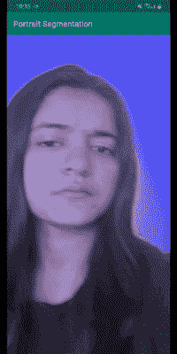
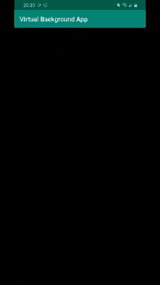
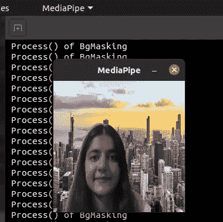
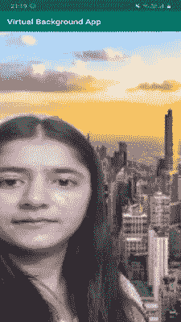

# 创建虚拟背景应用程序

> 原文：<https://towardsdatascience.com/custom-calculators-in-mediapipe-5a245901d595?source=collection_archive---------12----------------------->

## 如何创建一个具有人像分割和媒体管道的缩放式虚拟背景应用程序

这是我正在撰写的 MediaPipe 系列的第 2 部分。

> 之前，我们看到了如何开始使用 MediaPipe 并将其用于您自己的 tflite 模型。如果你还没看过，在这里查看一下[。](https://blog.gofynd.com/mediapipe-with-custom-tflite-model-d3ea0427b3c1)

我们尝试在现有的细分渠道中使用纵向细分 tflite 模型，并在 MediaPipe 中使用计算器



纵向分段媒体管道—第 1 部分

厌倦了蓝色的背景后，我决定用一些虚拟的缩放背景，比如美丽的星星或者疯狂的云来玩玩:)



虚拟云背景—第 2 部分

为此，我编写了一个自定义计算器，并将其用于现有的管道。

所以今天我将展示我是如何制作这个应用程序的

> 在我们开始之前，我建议你浏览一下解释基本计算器流程的这部分文档。
> 
> [https://Google . github . io/media pipe/framework _ concepts/calculators . html](https://google.github.io/mediapipe/framework_concepts/calculators.html)

现在，让我们从代码开始

## 1.从第 1 部分克隆肖像分割库

```
$ git clone [https://github.com/SwatiModi/portrait-segmentation-mediapipe.git](https://github.com/SwatiModi/portrait-segmentation-mediapipe.git)
```

## 2.管道的新流程(在图表中进行更改。pbtxt 文件)

之前，渲染/着色是由*重新着色计算器完成的，*它使用图像和遮罩 gpu 缓冲区作为输入，并返回 gpu 缓冲区渲染输出(使用 opengl 渲染)

这里，为了用图像(jpg/png)替换背景，我使用了 OpenCV 操作。

> **注意** : OpenCV 操作在 CPU-Image frame 数据类型上执行，而 opengl 操作在 GPU-Image-buffer 数据类型上执行

[portrait _ segmentation . Pb txt](https://github.com/SwatiModi/virtual-background-app/blob/master/mediapipe/graphs/portrait_segmentation/portrait_segmentation.pbtxt)

我们将**用*背景屏蔽计算器*替换**重新计算器

```
*node {
  calculator: "BackgroundMaskingCalculator"
  input_stream: "IMAGE_CPU:mask_embedded_input_video_cpu"
  input_stream: "MASK_CPU:portrait_mask_cpu"
  output_stream: "OUTPUT_VIDEO:output_video_cpu"
  }*
```

*这个计算器将转换后的图像和蒙版(都是 ImageFrame 数据类型)作为输入，并用给定的图像改变背景。*

*为了将图像和遮罩 GpuBuffer 转换成 ImageFrame，我使用了*GpuBufferToImageFrameCalculator。**

## *3.编写计算器文件(background _ masking _ Calculator . cc 文件)*

*在这里，我们将编写处理和创建背景遮罩效果的逻辑*

*[background _ masking _ calculator . cc](https://github.com/SwatiModi/virtual-background-app/blob/master/mediapipe/calculators/image/background_masking_calculator.cc)*

*将此***background _ masking _ calculator . cc****放入**media pipe/calculators/image/****

**a.扩展基本计算器**

**b.GetContract()**

**这里我们只是验证我们的输入和它们的数据类型**

**c.打开()**

**准备计算器的每图运行状态。**

**d.流程()**

**background_masking_calculator 中 Process()方法的小概述**

**获取输入，转换为 OpenCV Mat 并进一步处理以获得所需的输出**

## **4.将***background _ masking _ calculator . cc 添加到包含依赖关系*** 的图像文件夹的构建文件中**

**[在](https://github.com/SwatiModi/virtual-background-app/blob/master/mediapipe/calculators/image/BUILD)[media pipe/calculators/image](https://github.com/SwatiModi/virtual-background-app/tree/master/mediapipe/calculators/image)中构建文件**

**我们需要这样做，以便在编译和执行时计算器是可用的和可访问的**

**您在这里看到的 dep(依赖项)是您在计算器中使用的导入**

**此处使用的名称也在图形构建文件中引用**

## **5.将 background _ masking _ calculator . cc 添加到图形构建文件中**

**[在图形/纵向 _ 分段中建立](https://github.com/SwatiModi/virtual-background-app/blob/master/mediapipe/graphs/portrait_segmentation/BUILD)文件**

**添加*背景 _ 蒙版 _ 计算器*到 deps 并删除*重新着色 _ 计算器*，我们现在不使用**

**现在我们已经准备好构建了，我们只需要添加资产(要在背景上隐藏的图像)**

> ****注意**:这种资产读取方法在桌面上尝试时非常简单，但在 Android 版本上则完全不同。**

**因此，我们将逐一查看桌面和 Android 版本**

# **桌面版本:**

**在 background _ masking _ calculator . cc 中，将资产文件读取为**

**现在，我们准备建造**

****

```
**bazel build -c opt --copt -DMESA_EGL_NO_X11_HEADERS --copt -DEGL_NO_X11  mediapipe/examples/desktop/portrait_segmentation:portrait_segmentation_gpu**
```

**构建将在大约 10–15 分钟内成功完成**

```
**INFO: Build completed successfully, 635 total actions**
```

**现在，您可以使用以下代码运行管道**

```
**GLOG_logtostderr=1 bazel-bin/mediapipe/examples/desktop/portrait_segmentation/portrait_segmentation_gpu   --calculator_graph_config_file=mediapipe/graphs/portrait_segmentation/portrait_segmentation.pbtxt**
```

**网络摄像头启动，您将能够看到输出窗口**

****

**虚拟背景应用程序—桌面构建**

# **Android 版本:**

## **1.导出背景遮罩图像**

**将以下代码添加到 testdata 文件夹(包含背景资产图像的文件夹)中的[构建](https://github.com/SwatiModi/virtual-background-app/blob/master/mediapipe/calculators/image/testdata/BUILD)文件中**

```
**exports_files(
    srcs = glob(["**"]),
)**
```

## **2.将资源添加到 android 应用程序使用的 android_library**

**将文件和 tflite 模型一起添加到 android_library**

**在 android 项目中修改[在 **examples/android/…中构建**](https://github.com/SwatiModi/virtual-background-app/blob/master/mediapipe/examples/android/src/java/com/google/mediapipe/apps/portraitsegmentationgpu/BUILD)文件。/portraitsegmentationgpu/**

## **3.在 background_masking_calculator 中读取此图像文件**

**这里，首先使用 MediaPipe 的 *PathToResourceAsFile* 方法，我们尝试查看资产是否可用，如果可用，我们使用它的值作为文件的路径来读取它**

> **另外，这个方法是 mediapipe/util/ folder 中 resource_util.h 的一部分。所以无论何时你导入一个新文件到你的计算器中，确保将它添加到 **pt 中提到的**构建文件中。4**

## **现在我们准备建造 APK**

****

```
**# BUILD 
bazel build -c opt --config=android_arm64 mediapipe/examples/android/src/java/com/google/mediapipe/apps/portraitsegmentationgpu# On successfully building the APK, it printsINFO: Elapsed time: 1499.898s, Critical Path: 753.09s
INFO: 2002 processes: 1849 linux-sandbox, 1 local, 152 worker.
INFO: Build completed successfully, 2140 total actions**
```

**首次构建时，这大约需要 20-25 分钟，因为它会下载构建的所有外部依赖项。下次它将使用缓存的依赖项，因此构建速度会更快。**

```
**# INSTALL
adb install bazel-bin/mediapipe/examples/android/src/java/com/google/mediapipe/apps/portraitsegmentationgpu/portraitsegmentationgpu.apk**
```

**现在，您已经准备好运行 APK 并测试它了。**

****

**虚拟背景应用程序— Android Build**

**在这里，我们成功地添加了我们自己的计算器，并修改了管道和图表，首先在桌面上测试，然后最终在 Android 上进行最小的更改。**

**欢迎在评论中提问，或者你可以亲自联系我。**

**你可以在[**swatimodi.com**](https://swatimodi.com)找到更多关于我的信息**

## **参考**

1.  **[https://blog . gofynd . com/media pipe-with-custom-TF lite-model-d3ea 0427 B3 C1](https://blog.gofynd.com/mediapipe-with-custom-tflite-model-d3ea0427b3c1)**
2.  **[https://media pipe . readthedocs . io/en/latest/framework _ concepts . html](https://mediapipe.readthedocs.io/en/latest/framework_concepts.html)**
3.  **[https://mediapipe.readthedocs.io/en/latest/calculator.html](https://mediapipe.readthedocs.io/en/latest/calculator.html)**
4.  **[https://github.com/google/mediapipe/issues](https://github.com/google/mediapipe/issues)**
5.  **从这里获取代码—[https://github.com/SwatiModi/virtual-background-app](https://github.com/SwatiModi/virtual-background-app)**