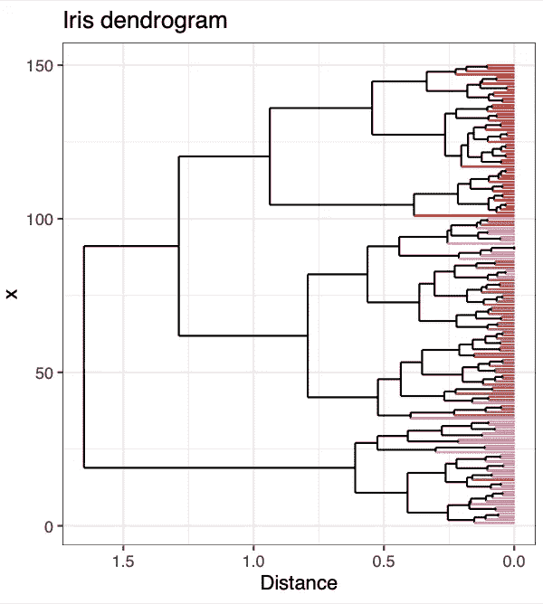
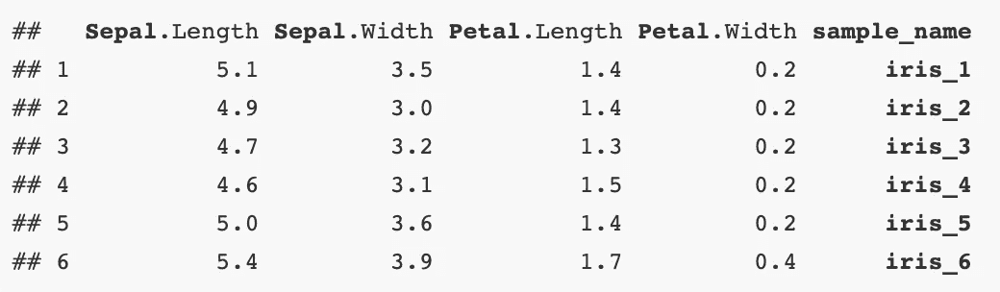
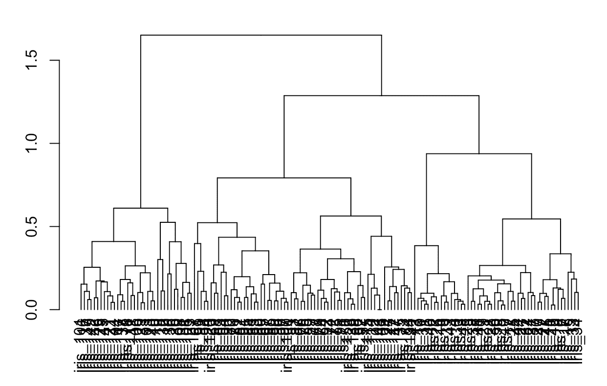
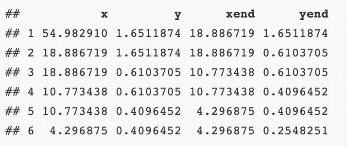
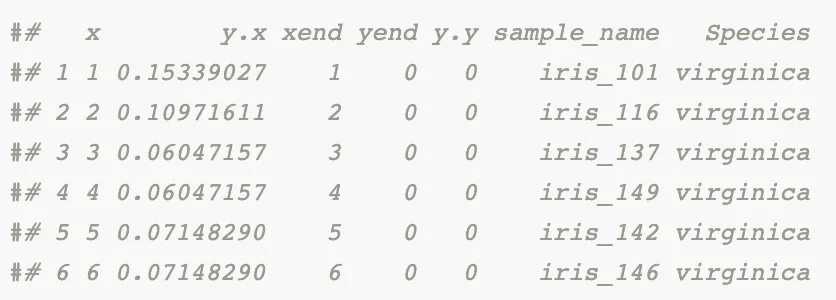

# 自定义着色树状图以 R 结尾

> 原文：<https://towardsdatascience.com/custom-coloring-dendrogram-ends-in-r-f1fa45e5077a?source=collection_archive---------45----------------------->



作者图片

作为一名研究微生物群落数据的研究生，我从事的大多数项目都涉及某种聚类分析。对于其中的一个，我想用元数据中的一个变量来给一个树状图的两端着色，以可视化该变量是否作为另一个图形的一部分跟随聚类。R 中有一些优秀的包，比如 [ggdendro](https://cran.r-project.org/web/packages/ggdendro/index.html) ，它允许您在树状图下绘制彩色条来表示组是如何聚类的，或者通过聚类本身来给终端段着色。

也就是说，我仍然没有找到一种简单的方法来基于用户定义的元数据改变树状图本身的终端颜色，我个人认为在某些情况下这可能更美观。本教程描述了我是如何做到的，并提供了可复制的[代码](https://github.com/mselensky/mselensky.github.io/blob/master/post/dendro-color/dendro_color_tutorial.R)，如果你希望做同样的事情！

# 树状图基础

在我开始之前，树状图到底是什么？

树状图是[层次聚类](https://www.statisticshowto.com/hierarchical-clustering/#:~:text=A%20dendrogram%20is%20a%20type,any%20type%20of%20grouped%20data)的图形表示。聚类可以以不同的方式构建(即自顶向下或自底向上)，最常见的是在 R 中通过在距离矩阵上应用`hclust()`。树状图是通过将节点连接到分支或其他节点来构建的，从而产生一个树状图形，该图形基于多个变量来显示各个事物如何相互关联。

假设我们想要从众所周知的 [R-core 数据集](https://www.rdocumentation.org/packages/datasets/versions/3.6.2/topics/iris)中比较单个虹膜如何聚类。该数据帧包含四个数字向量(`Sepal.Length`、`Sepal.Width`、`Petal.Length`和`Petal.Width`)以及一个字符向量(`Species`)。我们可以很容易地构建并绘制一个包含所有这些以 R 为基数的数字数据的树状图，但是如果我们想根据鸢尾的种类对末端片段进行着色，以可视化物种是否遵循由`hclust()`确定的聚类呢？

# 步骤 1:安装软件包

对于本教程，您需要加载三个 R 包:`tidyverse`用于数据操作和可视化，`ggdendro`用于将树状图分段数据提取到数据帧中，`RColorBrewer`用于为树状图末端制作自动定制调色板。如果你想让你的树状图具有交互性，一定要加载`plotly`。

```
pacman::p_load(tidyverse, ggdendro, RColorBrewer, plotly)
```

# 步骤 2:加载数据

现在我们要将`iris`数据帧加载到我们的环境中。作为生物信息学家，我们通常有映射到每个观察结果的样本名称，所以我们希望从一开始就创建自己的名称(`sample_name`)。

有了微生物群落数据，我的工作流程本质上涉及两个对象:一个巨大的 ASV 矩阵(扩增子序列变体；该术语用于描述基于`sample_name`的 DNA 序列相似性)丰度的分类，以及与每个样本相关的元数据。为了模拟这一点，我们将把`iris`分成`numeric_data`和`metadata`，根据 T8，我们将计算距离并构建一个树状图，为了我们的目的，T9 将简单地包含每个`sample_name`的鸢尾种类。对于这个工作流，每个观察都有一个`sample_name`标识符是很重要的；它将是最后融合一切的基础。

```
# label rows with unique sample_name
dat <- iris %>%
 mutate(sample_name = paste(“iris”, seq(1:nrow(iris)), sep = “_”)) # create unique sample ID# save non-numeric metadata in separate dataframe
metadata <- dat %>%
 select(sample_name, Species)# extract numeric vectors for distance matrix
numeric_data <- dat %>%
 select(Sepal.Length, Sepal.Width, Petal.Length, Petal.Width, sample_name)# check data 
head(numeric_data)
```



作者图片

# 步骤 3:标准化数据并创建树状图

在我们制作树状图之前，我们将使用`dist()`基于`numeric_data`计算一个距离矩阵。在进行此计算之前，最好对数据进行标准化处理；因此，我将在 0 到 1 的范围内对向量中的所有值进行归一化。

这样做之后，我们可以创建一个距离矩阵(`dist_matrix`)并从我们的标准化数据中生成一个`dendrogram`。

```
# normalize data to values from 0 to 1 
numeric_data_norm <- numeric_data %>%
 select(sample_name, everything()) %>%
 pivot_longer(cols = 2:ncol(.), values_to = “value”, names_to = “type”) %>%
 group_by(type) %>%
 mutate(value_norm = (value-min(value))/(max(value)-min(value))) %>% # normalize data to values 0–1
 select(sample_name, value_norm) %>%
 pivot_wider(names_from = “type”, values_from = “value_norm”) %>%
 column_to_rownames(“sample_name”)# create dendrogram from distance matrix of normalized data
dist_matrix <- dist(numeric_data_norm, method = “euclidean”)
dendrogram <- as.dendrogram(hclust(dist_matrix, method = “complete”))
```

# 步骤 4:使用 ggdendro 提取树状图片段数据

现在让我们快速地看一下使用基数 R 时我们的树状图是什么样子的:

```
plot(dendrogram)
```



作者图片

好吧，它不是很漂亮，但是请原谅我。这是一个有用的视图，展示了我们将如何使用`ggdendro::dendro_data()`从树状图对象中提取坐标数据，以生成一个更好的图形。每个树状图都是通过在 x 和 y 网格上的点之间添加单独的线段来绘制的。

当我们应用`dendro_data()`并查看提取的分段数据时，我们看到每个树状图有四个向量:`x`、`y`、`xend`和`yend`。您在基数 R 图中看到的每条水平线或垂直线最终都是由以下数据帧中的一行构成的:

```
# extract dendrogram segment data
dendrogram_data <- dendro_data(dendrogram)
dendrogram_segments <- dendrogram_data$segments # contains all dendrogram segment datahead(dendrogram_segments)
```



作者图片

我们将把这些坐标数据分成两个数据帧:`dendrogram_segments`，包含所有线段，和`dendrogram_ends`，仅包含图形的终端分支。如上图所示，当 y 方向的值为 0(即`yend == 0`)时，仅包括图底部的单个线段:

```
# get terminal dendrogram segments
dendrogram_ends <- dendrogram_segments %>%
 filter(yend == 0) %>% # filter for terminal dendrogram ends
 left_join(dendrogram_data$labels, by = “x”) %>% # .$labels contains the row names from dist_matrix (i.e., sample_name)
 rename(sample_name = label) %>%
 left_join(metadata, by = “sample_name”) # dataframe now contains only terminal dendrogram segments and merged metadata associated with each iris
```

查看`dendrogram_ends`，我们现在有一个数据帧，其中包含与`sample_name`和`Species`向量匹配的树状图坐标数据。我们现在准备在`ggplot2`开始绘图！

```
head(dendrogram_ends)
```



作者图片

# 步骤 5:使用 RColorBrewer(可选)基于元数据变量为树状图末端生成自定义调色板

如果您想要基于感兴趣的元数据向量包含多少唯一变量来动态创建颜色列表，您可以运行以下代码。在这个例子中，我们的`metadata`只包含三种鸢尾，所以这可以相当快地手动完成。但是，如果数据集中的唯一元数据变量的数量超过这个数目，就像微生物群落数据中常见的那样，那么您可能希望自动执行这个过程。

```
# Generate custom color palette for dendrogram ends based on metadata variableunique_vars <- levels(factor(dendrogram_ends$Species)) %>% 
 as.data.frame() %>% rownames_to_column(“row_id”) # count number of unique variables
color_count <- length(unique(unique_vars$.))# get RColorBrewer palette
get_palette <- colorRampPalette(brewer.pal(n = 8, name = “Set1”))# produce RColorBrewer palette based on number of unique variables in metadata:
palette <- get_palette(color_count) %>% 
 as.data.frame() %>%
 rename(“color” = “.”) %>%
 rownames_to_column(var = “row_id”)
color_list <- left_join(unique_vars, palette, by = “row_id”) %>%
 select(-row_id)
species_color <- as.character(color_list$color)
names(species_color) <- color_list$.
```

如果您不想在本教程中使用上述代码，您可以手动创建一个命名的字符向量作为替代:

```
# Alternatively, create a custom named vector for iris species color:species_color <- c(“setosa” = “#E41A1C”, “versicolor” = “#CB6651”, “virginica” = “#F781BF”)
```

# 第 6 步:绘制自定义颜色的树状图！

现在是时候绘制我们的树状图了！您将需要为`geom_segment`定义两个几何图形:一个绘制从步骤 4 中提取的所有未着色的分段数据，另一个仅绘制树状图的末端分支，这是我们将在上一步骤中用`species_color`着色的部分。如果你用`plotly`(见下文)包装这个图，我建议增加一个额外的`text`美学来控制哪些信息将显示在你的输出上。

```
p <- ggplot() +
 geom_segment(data = dendrogram_segments, 
 aes(x=x, y=y, xend=xend, yend=yend)) +
 geom_segment(data = dendrogram_ends,
 aes(x=x, y=y.x, xend=xend, yend=yend, color = Species, text = paste(‘sample name: ‘, sample_name,
 ‘<br>’,
 ‘species: ‘, Species))) + # test aes is for plotly
 scale_color_manual(values = species_color) +
 scale_y_reverse() +
 coord_flip() + theme_bw() + theme(legend.position = “none”) + ylab(“Distance”) + # flipped x and y coordinates for aesthetic reasons
 ggtitle(“Iris dendrogram”)

p
```


作者图片

如果你想变得更有趣，你可以用 [plotly](https://plotly.com/r/) 包装你的 ggplot，使你的树状图具有交互性！确保指定`tooltip = “text”`来控制显示哪些信息。

```
ggplotly(p, tooltip = “text”)
```

现在你已经知道了——树图的末端由元数据中的一个变量动态着色！正如我们所看到的，iris 的种类似乎遵循由`hclust()`确定的层次聚类，这可以通知您在探索性分析管道中完成的进一步测试。