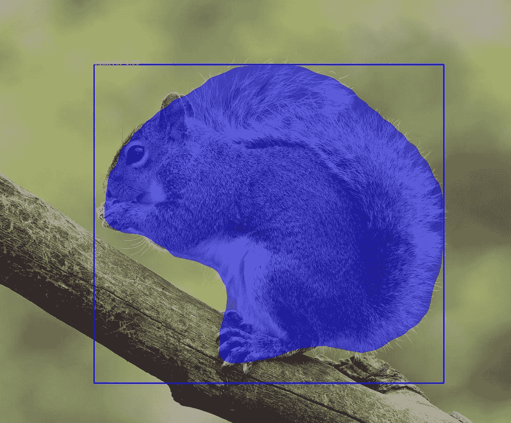
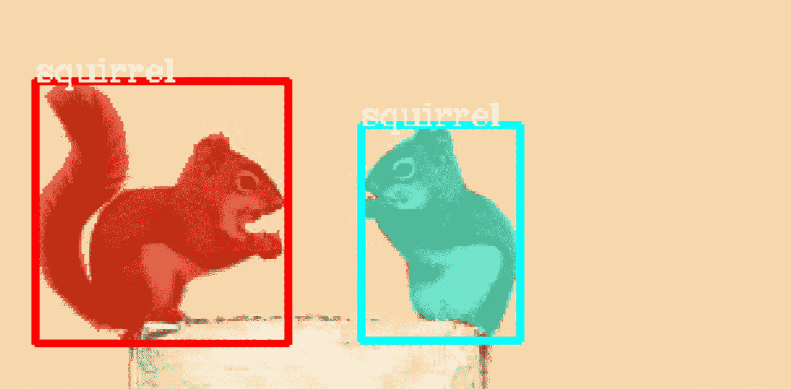
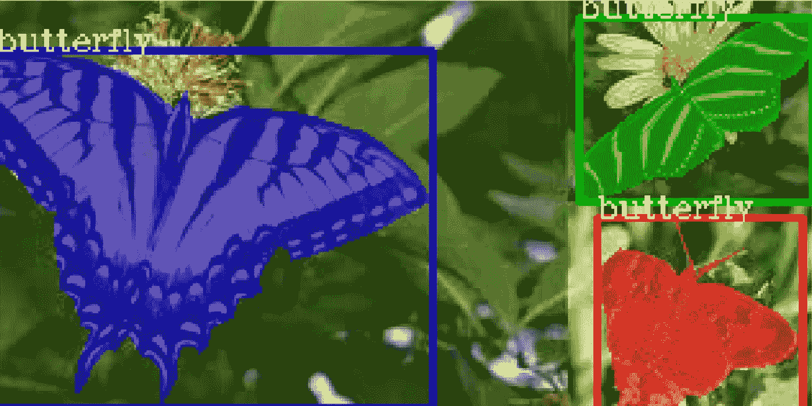
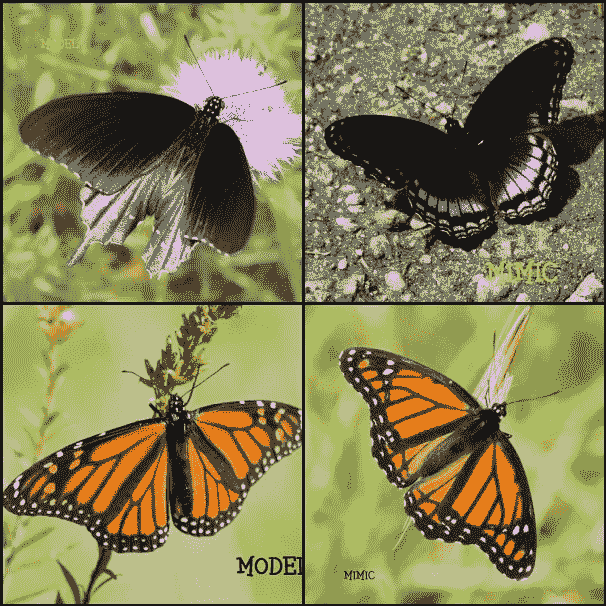
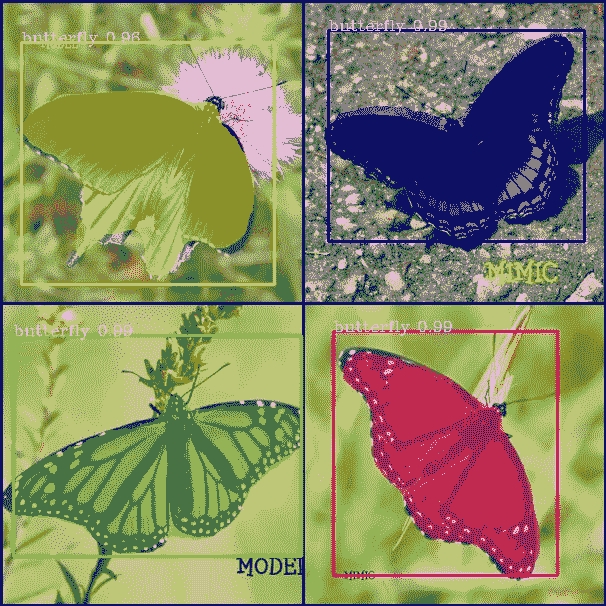
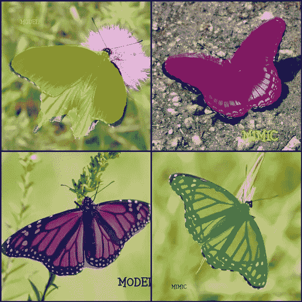
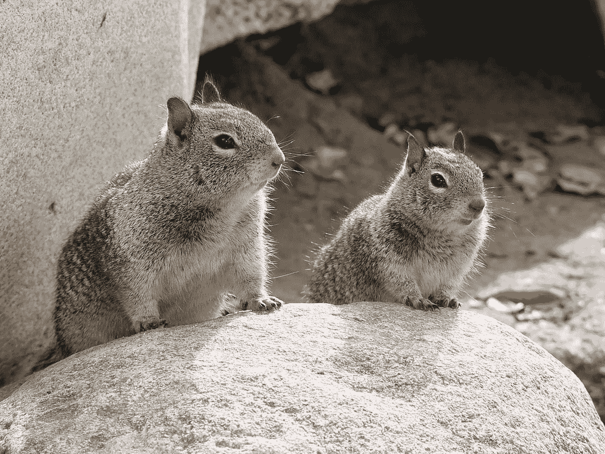
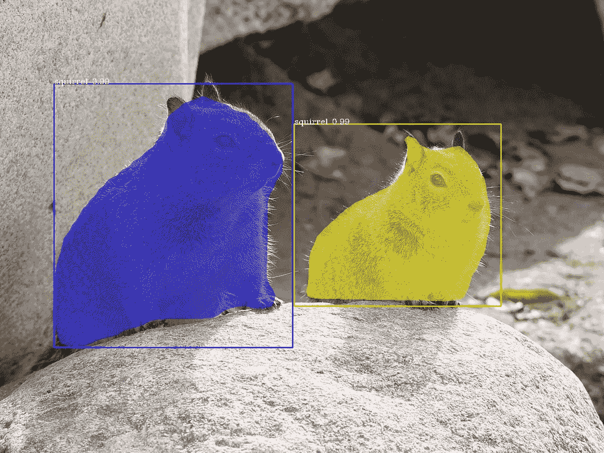

# 用 7 行代码进行自定义实例分段训练。

> 原文：<https://towardsdatascience.com/custom-instance-segmentation-training-with-7-lines-of-code-ff340851e99b?source=collection_archive---------3----------------------->

## 用 7 行代码训练您的数据集，以实现实例分割和对象检测。



图片来源:[Wikicommons.com](https://commons.wikimedia.org/wiki/File:Eastern_Grey_Squirrel.jpg)(CC0)

图像分割是计算机视觉的一个重要领域，它应用于生活的各个领域。PixelLib 是一个库，创建该库是为了方便将分段应用于现实生活中的问题。它支持 Coco 模型的对象实例分割。使用 coco 模型的分段是有限的，因为您不能执行超出 coco 中可用的 80 个类的分段。现在只需 7 行代码就可以用 PixelLib 库训练你的自定义对象分割模型。

安装 PixelLib 及其依赖项:

安装 Tensorflow 与:(PixelLib 支持 tensorflow 2.0 及以上版本)

*   *pip3 安装张量流*

安装 imgaug，包括:

*   *pip3 安装 imgaug*

安装 PixelLib 与

*   pip3 安装 pixellib

如果已安装，请使用以下工具升级至最新版本:

*   pip3 安装 pixellib —升级

## 训练自定义模型所需的步骤。

*第一步:*

**准备您的数据集:**

我们的目标是创建一个可以对蝴蝶和松鼠执行实例分割和对象检测的模型。

为要检测的对象收集图像，并为自定义训练标注数据集。 *Labelme* 是用来对对象进行多边形标注的工具。创建一个根目录或文件夹，并在其中创建培训和测试文件夹。分离训练(至少 300 张)和测试所需的图像。将您要用于训练的图像放入 train 文件夹，将您要用于测试的图像放入 test 文件夹。您将注释 train 和 test 文件夹中的两个图像。下载 [Nature 的数据集](https://github.com/ayoolaolafenwa/PixelLib/releases/download/1.0.0/Nature.zip)作为本文中的样本数据集，解压到 images’文件夹。这个数据集将作为一个指南，让你知道如何组织你的图像。请确保数据集目录的格式与其相同。Nature 是一个数据集，有两个类 *butterfly* 和 *squirrel。*每类有 300 幅图像用于训练，每类有 100 幅图像用于测试，即 600 幅图像用于训练，200 幅图像用于验证。自然是一个有 800 张图片的数据集。

阅读这篇文章来学习如何使用 *labelme* 来注释对象。

[](https://medium.com/@olafenwaayoola/image-annotation-with-labelme-81687ac2d077) [## 使用 Labelme 的图像注释

### Labelme 是多边形注记最方便的注记工具之一。这篇文章解释了如何使用 labelme…

medium.com](https://medium.com/@olafenwaayoola/image-annotation-with-labelme-81687ac2d077) 

```
Nature >>train>>>>>>>>>>>> image1.jpg
                           image1.json
                           image2.jpg
                           image2.json >>test>>>>>>>>>>>>  img1.jpg
                           img1.json
                           img2.jpg
                           img2.json 
```

注释后的文件夹目录示例。

**注意:** PixelLib 支持用 Labelme 标注。如果您使用其他注释工具，它将与库不兼容。

*第二步:*

**可视化数据集**

在训练之前可视化样本图像，以确认遮罩和边界框生成良好。

```
import pixellib
from pixellib.custom_train import instance_custom_trainingvis_img = instance_custom_training()
```

我们导入了 *pixellib* ，从 *pixellib* 我们导入了类*instance _ custom _ training*并创建了该类的一个实例。

```
vis_img.load_dataset("Nature”)
```

我们使用 *load_dataset 函数加载数据集。* PixelLib 要求多边形标注为 coco 格式。当您调用 *load_dataset* *函数时，*train 和 test 文件夹中的单个 json 文件将分别转换成单个 *train.json* 和 *test.json* 。*训练*和测试 json 文件将作为训练和测试文件夹位于根目录中。新文件夹目录现在将如下所示:

```
Nature >>>>>>>>train>>>>>>>>>>>>>>> image1.jpg
               train.json           image1.json
                                    image2.jpg
                                    image2.json >>>>>>>>>>>test>>>>>>>>>>>>>>> img1.jpg
                  test.json           img1.json
                                      img2.jpg
                                      img2.json
```

在 *load_dataset 函数*中，注释是从 jsons 的文件中提取的。从注释的多边形点生成遮罩，并且从遮罩生成边界框。封装遮罩所有像素的最小框被用作边界框。

```
vis_img.visualize_sample()
```

当您调用此函数时，它会显示一个带有遮罩和边框的示例图像。



太好了！数据集适合训练， *load_dataset 函数*成功地为图像中的每个对象生成遮罩和边界框。在 HSV 空间中为遮罩生成随机颜色，然后将其转换为 RGB。

*最后一步:*

**使用数据集训练自定义模型**

这是执行训练的代码。只需 7 行代码，您就可以训练数据集。

```
train_maskrcnn.modelConfig(network_backbone = "resnet101", num_classes= 2, batch_size = 4) 
```

我们调用函数 *modelConfig，即*模型的配置。它采用以下参数:

*   **network_backbone:** 这是 CNN 网络，用作 *mask-rcnn* 的特征提取器。使用的特征提取器是 *resnet101。*
*   **num_classes:** 我们将类的数量设置为数据集中对象的类别。在这种情况下，我们在自然界的数据集中有两个类(蝴蝶和松鼠)。
*   **batch_size:** 这是训练模型的批量。它被设置为 4。

```
train_maskrcnn.load_pretrained_model("mask_rcnn_coco.h5")train_maskrcnn.load_dataset(“Nature”)
```

我们将使用迁移学习技术来训练模型。Coco 模型已经在 80 个类别的对象上进行了训练，它已经学习了许多将有助于训练模型的特征。我们调用函数 *load_pretrained_model 函数*来加载 *mask-rcnn coco 模型*。我们*使用 *load_dataset 函数加载*数据集。*

从[这里](https://github.com/ayoolaolafenwa/PixelLib/releases/download/1.2/mask_rcnn_coco.h5)下载 coco 模型。

```
train_maskrcnn.train_model(num_epochs = 300, augmentation=True,path_trained_models = “mask_rcnn_models”)
```

最后，我们调用 train 函数来训练 *mask r-cnn* 模型。我们称之为 *train_model 函数。*该函数采用以下参数:

*   **num_epochs** :训练模型所需的次数。它被设置为 *300* 。
*   **扩充:**数据扩充应用于数据集。这是因为我们希望模型学习对象的不同表示。
*   **path_trained_models:** 这是在训练过程中保存训练好的模型的路径。具有最低验证损失的模型被保存。

```
Using resnet101 as network backbone For Mask R-CNN modelTrain 600 images 
Validate 200 images Applying augmentation on dataset Checkpoint Path: mask_rcnn_modelsSelecting layers to trainEpoch 1/200
100/100 - 164s - loss: 2.2184 - rpn_class_loss: 0.0174 - rpn_bbox_loss: 0.8019 - mrcnn_class_loss: 0.1655 - mrcnn_bbox_loss: 0.7274 - mrcnn_mask_loss: 0.5062 - val_loss: 2.5806 - val_rpn_class_loss: 0.0221 - val_rpn_bbox_loss: 1.4358 - val_mrcnn_class_loss: 0.1574 - val_mrcnn_bbox_loss: 0.6080 - val_mrcnn_mask_loss: 0.3572

Epoch 2/200
100/100 - 150s - loss: 1.4641 - rpn_class_loss: 0.0126 - rpn_bbox_loss: 0.5438 - mrcnn_class_loss: 0.1510 - mrcnn_bbox_loss: 0.4177 - mrcnn_mask_loss: 0.3390 - val_loss: 1.2217 - val_rpn_class_loss: 0.0115 - val_rpn_bbox_loss: 0.4896 - val_mrcnn_class_loss: 0.1542 - val_mrcnn_bbox_loss: 0.3111 - val_mrcnn_mask_loss: 0.2554

Epoch 3/200
100/100 - 145s - loss: 1.0980 - rpn_class_loss: 0.0118 - rpn_bbox_loss: 0.4122 - mrcnn_class_loss: 0.1271 - mrcnn_bbox_loss: 0.2860 - mrcnn_mask_loss: 0.2609 - val_loss: 1.0708 - val_rpn_class_loss: 0.0149 - val_rpn_bbox_loss: 0.3645 - val_mrcnn_class_loss: 0.1360 - val_mrcnn_bbox_loss: 0.3059 - val_mrcnn_mask_loss: 0.2493 
```

这是训练日志。它显示了用于训练 *mask-rcnn* 的网络主干，即 *resnet101* ，用于训练的图像数量和用于验证的图像数量。在 *path_to_trained models* 目录中，模型按照有效性损失减少的原则保存，典型的模型名称如下:***mask _ rcnn _ model _ 25–0.55678*，** it 保存为及其对应的有效性损失。

**网络骨干:**

有两个网络骨干用于训练 *mask-rcnn*

*   *Resnet101*
*   *Resnet50*

**谷歌 colab:** 谷歌 colab 提供单个 12GB 英伟达特斯拉 K80 GPU，可连续使用长达 12 小时。

**使用 Resnet101:** 训练 Mask-RCNN 消耗大量内存。在使用 *resnet101* 作为网络主干的 google colab 上，你将能够以 4 的批量进行训练。默认的网络主干是 *resnet101* 。Resnet101 被用作默认主干，因为它在训练期间似乎比 resnet50 更快地达到更低的验证损失。对于包含多个类和更多图像的数据集，这种方法也更有效。

**使用 resnet 50:**resnet 50 的优点是占用内存较少。因此，根据 colab 随机分配 GPU 的方式，您可以在 google colab 上使用 6 或 8 的 batch_size。

支持 *resnet50* 的修改代码会是这样的。

完整代码

与原代码的主要区别在于，在模型的配置函数中，我们将 *network_backbone* 设置为 *resnet50* ，并将批量大小改为 6 *。*

培训日志中的唯一区别是:

```
Using resnet50 as network backbone For Mask R-CNN model
```

说明我们在用 resnet50 进行训练。

**注意:**给出的 batch _ sizes 是用于 google colab 的样本。如果您使用的是功能较弱的 GPU，请减少批量大小。例如，对于配有 4G RAM GPU 的 PC，resnet50 或 resnet101 的批处理大小都应该为 1。我使用批量大小 1 在我的 PC 的 GPU 上训练我的模型，训练了不到 100 个历元，它产生了 0.263 的验证损失。这是有利的，因为我的数据集并不大。配有更强大 GPU 的 PC 应该可以使用批量大小为 2。如果您有一个包含更多类和更多图像的大型数据集，您可以使用 google colab 免费访问 GPU。最重要的是，尝试使用更强大的 GPU，并为更多的纪元进行训练，以产生一个自定义模型，该模型将跨多个类高效地执行。

通过使用更多图像进行训练来获得更好的结果。建议培训的最低要求是每个班级 300 张图片。

**车型评测**

当我们完成训练后，我们应该评估验证损失最低的模型。模型评估用于访问测试数据集上已训练模型的性能。从[这里](https://github.com/ayoolaolafenwa/PixelLib/releases/download/1.0.0/Nature_model_resnet101.h5)下载训练好的模型。

输出

```
mask_rcnn_models/Nature_model_resnet101.h5 evaluation using iou_threshold 0.5 is 0.890000
```

模型的 mAP(平均精度)为 0.89。

你可以一次评估多个模型，你只需要传入模型的文件夹目录。

输出日志

```
mask_rcnn_models\Nature_model_resnet101.h5 evaluation using iou_threshold 0.5 is 0.890000mask_rcnn_models\mask_rcnn_model_055.h5 evaluation using iou_threshold 0.5 is 0.867500mask_rcnn_models\mask_rcnn_model_058.h5 evaluation using iou_threshold 0.5 is 0.8507500
```

使用 Resnet50 进行评估

**注意:C** 如果您正在评估 resnet50 型号，请将 network_backbone 更改为 resnet50。

**用自定义模型进行推理**

我们对模型进行了训练和评估。下一步是观察模型在未知图像上的表现。

我们将在我们训练过的班级上测试这个模型。

*Sample1.jpg*



资料来源:Wikicommons.com(CC0)

```
import pixellib
from pixellib.instance import custom_segmentation segment_image =custom_segmentation()
segment_image.inferConfig(num_classes= 2, class_names= ["BG", "butterfly", "squirrel"])
```

我们导入了用于执行推理的类 *custom_segmentation* ，并创建了该类的一个实例。我们调用了模型配置的函数并引入了一个额外的参数 *class_names。*

```
class_names= ["BG", "butterfly", "squirrel"])
```

**class_names:** 这是一个列表，包含模型被训练的类的名称。“背景”是指图像的背景。它是第一个类，并且必须与类名一起提供。

**注意:**如果你有多个类，并且你不知道如何根据它们的类 id 来排列这些类的名字，在数据集的文件夹中的 *test.json* 中，检查类别列表。

```
{"images": [{
"height": 205,"width": 246,"id": 1,"file_name": "C:\\Users\\olafe\\Documents\\Ayoola\\PIXELLIB\\Final\\Nature\\test\\butterfly (1).png"},],
"categories": [{"supercategory": "butterfly","id": 1,"name": "butterfly"},{"supercategory": "squirrel","id": 2,"name": "squirrel"}],
```

从上面 *test.json* 目录的样本中可以观察到，test.json 中*图片列表*之后是*物体类别列表。类名和它们对应的类 id 都在那里。*蝴蝶*有一个类 id *1* 而*松鼠*有一个类 id *2* 。记住，第一个 id“0”是为背景保留的。*

```
segment_image.load_model("mask_rcnn_model/Nature_model_resnet101.h5)segment_image.segmentImage("sample1.jpg", show_bboxes=True, output_image_name="sample_out.jpg")
```

定制模型被加载，我们调用函数来分割图像。



当参数 *show_bboxes* 设置为 *True，*我们将能够执行带有对象检测的实例分割。

```
test_maskrcnn.segmentImage(“sample1.jpg”,show_bboxes = False, output_image_name=”sample_out.jpg”)
```



当 *show_bboxes* 被设置为 *False* 时，我们仅获得分段屏蔽。

*Sample2.jpg*



资料来源:Wikicommons.com

```
test_maskrcnn.segmentImage(“sample2.jpg”,show_bboxes = True, output_image_name=”sample_out.jpg”)
```



> 哇！我们已经成功地训练了一个定制模型，用于在蝴蝶和松鼠上执行实例分割和对象检测。

## **用自定义模型进行视频分割。**

**样本 _ 视频 1**

我们想对视频中的蝴蝶进行分割。

```
test_video.process_video("video.mp4", show_bboxes = True,  output_video_name="video_out.mp4", frames_per_second=15)
```

调用函数 *process_video* 对视频中的对象进行分割。

它采用以下参数:-

*   *video_path:* 这是我们想要分割的视频文件的路径。
*   *每秒帧数:*该参数用于设置已保存视频文件的每秒帧数。在这种情况下，它被设置为 15，即保存的视频文件每秒将有 15 帧。
*   *output _ video _ name:T*his 是保存的分段视频的名称*。*输出的视频将保存在您当前的工作目录中。

**输出 _ 视频**

与我们的自定义模型的另一个分段视频样本。

您可以使用以下代码使用您的自定义模型执行实时摄像机分段:

您将用 *process_camera 功能替换 process_video 功能。*在函数中，我们替换了要捕获的视频文件路径，即我们正在处理摄像机捕获的帧流，而不是视频文件。为了显示摄像机画面，我们添加了额外的参数:

*   *显示帧:*该参数处理分段摄像机帧的显示。
*   这是显示的摄像机框架的名称。

访问 Google colab 为训练自定义数据集而设置的笔记本。

[](https://colab.research.google.com/drive/1LIhBcxF6TUQUQCMEXCRBuF4a7ycUmjuw?usp=sharing) [## 谷歌联合实验室

### 编辑描述

colab.research.google.com](https://colab.research.google.com/drive/1LIhBcxF6TUQUQCMEXCRBuF4a7ycUmjuw?usp=sharing) 

> [访问 Pixellib 的官方 Github 库](https://github.com/ayoolaolafenwa/PixelLib)
> 
> [访问 Pixellib 的官方文档](https://pixellib.readthedocs.io/en/latest/)

通过以下方式联系我:

邮箱:【olafenwaayoola@gmail.com 

领英:[阿尤拉·奥拉芬娃](https://www.linkedin.com/in/ayoola-olafenwa-003b901a9/)

推特: [@AyoolaOlafenwa](https://twitter.com/AyoolaOlafenwa)

脸书:[阿尤拉·奥拉芬娃](https://web.facebook.com/ayofen)