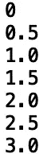
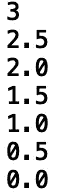
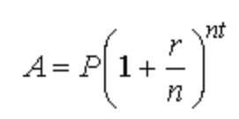
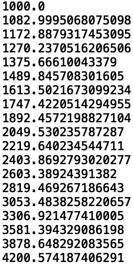
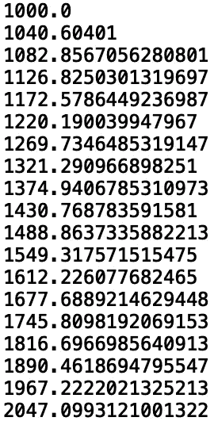

# 使用 Python 生成器定制迭代模式

> 原文：<https://towardsdatascience.com/custom-iteration-patterns-with-python-generators-12b98e552b38?source=collection_archive---------32----------------------->

## 创建定制迭代模式


[来源](https://www.pexels.com/photo/abstract-art-background-blue-430207/)

Python 有几个内置的迭代模式，比如由“range()”和“reversed()”方法提供的那些模式。“range()”方法接受“start”和“stop”参数，并返回一个我们可以迭代的不可变序列。“reverse()”方法接受一个输入序列并返回反向迭代器。假设我们想要实现一个定制的迭代模式，其行为与这些内置函数不同。在这篇文章中，我们将讨论如何在 python 中实现定制迭代模式。

我们开始吧！

首先，让我们创建一个迭代模式，它产生一个不断增加的浮动范围。该函数将接受“开始”、“停止”和“增量”参数:

```
def increment_pattern(start, stop, increment):
```

接下来，我们将初始化将要增加的变量， *x* :

```
def increment_pattern(start, stop, increment):
    x = start
```

现在，让我们写一个控制流条件，这样，只要一个 *x* 小于或等于“停止”输入值，随后的任何过程都将继续:

```
def increment_pattern(start, stop, increment):
    x = start
    while x < stop:
```

由于我们想编写一个定制的迭代模式，类似于' range()'，我们想返回一个生成器。我们使用“yield”关键字来实现这一点:

```
def increment_pattern(start, stop, increment):
    x = start
    while x < stop:
        yield x
```

最后，我们增加值， *x* :

```
def increment_pattern(start, stop, increment):
    x = start
    while x <= stop:
        yield x
        x += increment
```

我们现在可以在“for-loop”中调用我们的生成器，并迭代值。让我们传入‘开始’= 0，‘停止’= 3，让我们递增 0.5:

```
for value in increment_pattern(0, 3, 0.5):
    print(value)
```



我们还可以定义一个递减模式。让我们定义一个新的函数并改变 while 循环条件，使 x 大于或等于‘stop’值。让我们也反复减去减量值:

```
def decrement_pattern(start, stop, decrement):
    x = start
    while x >= stop:
        yield x
        x -= decrement
```

在“for-loop”内的函数调用中，让我们交换 start 和 stop 的值，并递减 0.5:

```
for value in decrement_pattern(3, 0, 0.5):
    print(value)
```



最后，我们来看一个更实际的例子。让我们使用一个定制的迭代模式来生成一个对应于指数增长函数的值列表。具体来说，让我们考虑复利的例子:



等式中的各项如下:

1.  **A** 表示经过一段时间后的金额
2.  **P** 代表原则，也就是你开始的钱数
3.  **r** 代表利率
4.  **n** 是复利的倍数
5.  代表以年为单位的时间量

假设你出生时在一个储蓄账户里有 1000 美元，你想计算你每年会有多少钱，直到你年满 18 岁，每月复利 8%。让我们定义我们的复利函数。这里，我们将原则初始化为开始时的 1000 美元。我们还将年份 *t* 初始化为“开始”值。我们还写下了这样一个条件:当年份 *t，*小于‘停止’时，我们将递增:

```
def compound_interest_monthly(start, stop, increment):
    t= start
    principle = 1000
    while t < stop:
```

接下来，我们定义等式中的利息部分:

```
def compound_interest_monthly(start, stop, increment):
    ...
        interest = (1+ 0.08/12)**(12*t)
```

然后我们返回生成器并增加我们的年份:

```
def compound_interest_monthly(start, stop, increment):
    ...
        interest = (1+ 0.08/12)**(12*t)
        yield principle*interest
        t+= increment
```

总功能如下:

```
def compound_interest_monthly(start, stop, increment):
    t= start
    principle = 1000
    while t< stop:
        interest = (1+ 0.08/12)**(12*t)
        yield principle*interest
        t+= increment
```

让我们称我们的生成器为“for-loop ”,其中“start ”= 0 年,“stop ”= 19 年，每年递增:

```
for value in compound_interest_monthly(0, 19, 1):
    print(value)
```



让我们看看复利，从相同的原则开始，在相同的时间段内，以 4%的利率按季度复利计算:

```
def compound_interest_quarterly(start, stop, increment):
    t= start
    principle = 1000
    while t< stop:
        interest = (1+ 0.04/4)**(4*t)
        yield principle*interest
        t+= increment
```

让我们迭代我们的生成器:

```
for value in compound_interest_quarterly(0, 19, 1):
    print(value)
```



我就讲到这里，但是您可以自己随意摆弄代码。

# 结论

总之，在这篇文章中，我们讨论了如何用 python 中的生成器定义定制迭代模式。我们创建了定制的递增和递减迭代模式，允许我们生成一系列的浮点。然后我们开发了一个更实用的定制迭代模式来计算复利。我希望你觉得这篇文章有趣/有用。这篇文章中的代码可以在 [GitHub](https://github.com/spierre91/medium_code/blob/master/basic_python/custom_iterators.py) 上找到。感谢您的阅读！