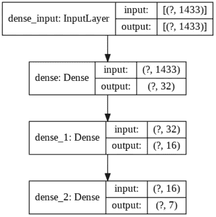
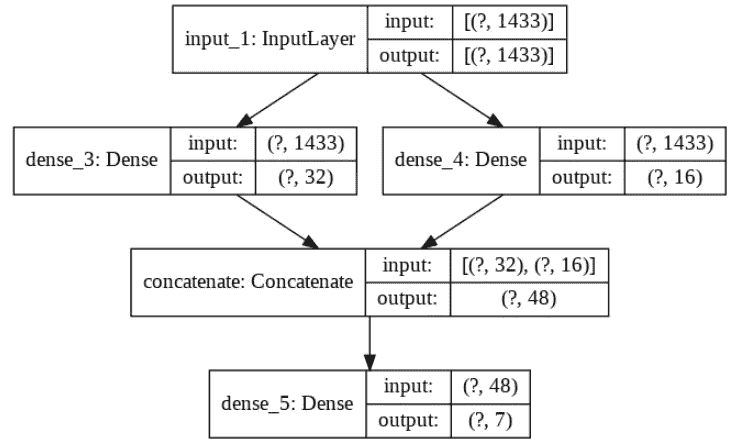
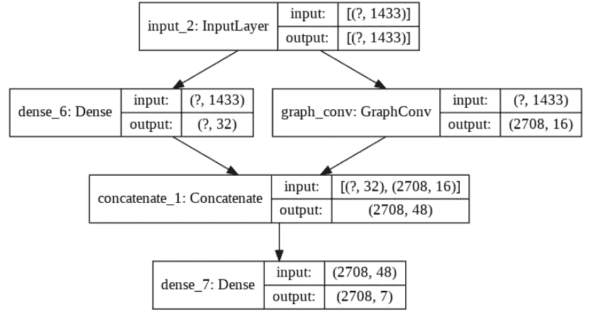

# Keras 中的自定义神经网络:街头战士构建图表指南

> 原文：<https://towardsdatascience.com/custom-neural-networks-in-keras-a-street-fighters-guide-to-build-a-graphcnn-e91f6b05f12e?source=collection_archive---------33----------------------->

## 如何建立具有自定义结构和层的神经网络:Keras 中的图形卷积神经网络(GCNN)。

在我们生活中的某个时刻，Tensorflow **Keras** 中预定义的图层已经不够用了！我们想要更多！我们希望建立具有创造性结构和奇异层的定制神经网络！幸运的是，我们可以通过定义自定义层和模型，在 Keras 中轻松执行这项任务。在这个循序渐进的教程中，我们将建立一个具有并行层的神经网络，包括图形卷积层。等一下！什么是图上的卷积？

## 图形卷积神经网络

在传统的神经网络层中，我们执行层输入矩阵 *X* 和可训练权重矩阵 *W* 之间的矩阵乘法。然后我们应用激活函数 *f.* 因此，下一层的输入(当前层的输出)可以表示为 *f(XW)。*在图卷积神经网络中，我们假设相似的实例在图中连接(例如，引用网络、基于距离的网络等)。)并且来自邻域的特征在(无人监督的)任务中可能是有用的。设 *A* 是图的邻接矩阵，那么我们要在一个卷积层中执行的操作就是 *f(AXW)* 。对于图中的每个节点，我们将聚集来自其他连接节点的特征，然后将该聚集乘以权重矩阵，然后应用激活。这种图形卷积公式是最简单的。这对于我们的教程来说很好，但是 graphCNN 要复杂得多！

好吧！现在，我们准备好了！

## 第一步。准备

首先，我们需要导入一些包。

```
# Import packages
from tensorflow import __version__ as tf_version, float32 as tf_float32, Variable
from tensorflow.keras import Sequential, Model
from tensorflow.keras.backend import variable, dot as k_dot, sigmoid, relu
from tensorflow.keras.layers import Dense, Input, Concatenate, Layer
from tensorflow.keras.losses import SparseCategoricalCrossentropy
from tensorflow.keras.utils import plot_model
from tensorflow.random import set_seed as tf_set_seed
from numpy import __version__ as np_version, unique, array, mean, argmax
from numpy.random import seed as np_seed, choice
from pandas import __version__ as pd_version, read_csv, DataFrame, concat
from sklearn import __version__ as sk_version
from sklearn.preprocessing import normalizeprint("tensorflow version:", tf_version)
print("numpy version:", np_version)
print("pandas version:", pd_version)
print("scikit-learn version:", sk_version)
```

您应该收到作为输出的导入包的版本。在我的例子中，输出是:

```
tensorflow version: 2.2.0 
numpy version: 1.18.5 
pandas version: 1.0.4 
scikit-learn version: 0.22.2.post1
```

在本教程中，我们将使用 [CORA](https://relational.fit.cvut.cz/dataset/CORA) 数据集:

> Cora 数据集包括 2708 份科学出版物，分为七类。引文网络由 5429 个链接组成。数据集中的每个出版物由 0/1 值的词向量来描述，该词向量指示字典中相应词的存在与否。这部词典由 1433 个独特的单词组成。

让我们加载数据，创建邻接矩阵并准备特征矩阵。

```
# Load cora datadtf_data = read_csv("https://raw.githubusercontent.com/ngshya/datasets/master/cora/cora_content.csv").sort_values(["paper_id"], ascending=True)
dtf_graph = read_csv("https://raw.githubusercontent.com/ngshya/datasets/master/cora/cora_cites.csv")# Adjacency matrix
array_papers_id = unique(dtf_data["paper_id"])
dtf_graph["connection"] = 1
dtf_graph_tmp = DataFrame({"cited_paper_id": array_papers_id, "citing_paper_id": array_papers_id, "connection": 0})
dtf_graph = concat((dtf_graph, dtf_graph_tmp)).sort_values(["cited_paper_id", "citing_paper_id"], ascending=True)
dtf_graph = dtf_graph.pivot_table(index="cited_paper_id", columns="citing_paper_id", values="connection", fill_value=0).reset_index(drop=True)
A = array(dtf_graph)
A = normalize(A, norm='l1', axis=1)
A = variable(A, dtype=tf_float32)# Feature matrix
data = array(dtf_data.iloc[:, 1:1434])# Labels
labels = array(
    dtf_data["label"].map({
        'Case_Based': 0,
        'Genetic_Algorithms': 1,
        'Neural_Networks': 2,
        'Probabilistic_Methods': 3,
        'Reinforcement_Learning': 4,
        'Rule_Learning': 5,
        'Theory': 6
    })
)# Check dimensions
print("Features matrix dimension:", data.shape, "| Label array dimension:", labels.shape, "| Adjacency matrix dimension:", A.shape)
```

最后，让我们定义一些对神经网络训练有用的参数。

```
# Training parameters
input_shape = (data.shape[1], )
output_classes = len(unique(labels))
iterations = 50
epochs = 100
batch_size = data.shape[0]
labeled_portion = 0.10
```

正如您可以从上面的代码中推断出的，对于每个模型，我们将执行 50 次迭代，在每次迭代中，我们将随机选择 10%的标记集(训练集)，并训练模型 100 个时期。

需要指出的是，本教程的范围不是在 CORA 数据集上训练最准确的模型。相反，我们只想提供一个用 keras 定制层实现定制模型的例子！

## 模型 1:具有连续层的神经网络

作为基线，我们使用具有**顺序层**的标准神经网络(一个熟悉的 **keras 顺序模型**)。

```
# Model 1: standard sequential neural networktf_set_seed(1102)
np_seed(1102)model1 = Sequential([
    Dense(32, input_shape=input_shape, activation='relu'),
    Dense(16, activation='relu'),
    Dense(output_classes, activation='softmax')
], name="Model_1")
model1.save_weights("model1_initial_weights.h5")model1.summary()
plot_model(model1, 'model1.png', show_shapes=True)
```

我们可以绘制模型来查看顺序结构。



图片作者。模型 1 的结构:连续致密层。

让我们看看这个模型表现如何。

```
# Testing model 1tf_set_seed(1102)
np_seed(1102)acc_model1 = []for _ in range(iterations): mask = choice([True, False], size=data.shape[0], replace=True, p=[labeled_portion, 1-labeled_portion])
    labeled_data = data[mask, :]
    unlabeled_data = data[~mask, :]
    labeled_data_labels = labels[mask]
    unlabeled_data_labels = labels[~mask] model1.load_weights("model1_initial_weights.h5") model1.compile(
        optimizer='adam',
        loss=SparseCategoricalCrossentropy(from_logits=False),
        metrics=['accuracy']
    ) model1.fit(labeled_data, labeled_data_labels, epochs=epochs, batch_size=batch_size, verbose=0) acc_model1.append(sum(argmax(model1.predict(unlabeled_data, batch_size=batch_size), axis=1) == unlabeled_data_labels) / len(unlabeled_data_labels) * 100)print("\nAverage accuracy on unlabeled set:", mean(acc_model1), "%")
```

你应该获得 55%的平均准确率。

## 模型 2:具有平行层的神经网络

下面介绍一个对之前模型的小修改。这一次我们希望有一个具有两个平行隐藏层的网络。我们使用 [**Keras 功能 API**](https://keras.io/guides/functional_api/) 。使用函数式 API，我们可以构建具有非线性拓扑的模型、具有共享层的模型以及具有多个输入或输出的模型。基本上，我们需要将每一层分配给一个变量，然后引用该变量来连接不同的层，以便创建一个有向无环图(DAG)。然后，可以通过传递输入层和输出层来构建模型。

```
# Model 2: neural network with parallel layerstf_set_seed(1102)
np_seed(1102)m2_input_layer = Input(shape=input_shape)
m2_dense_layer_1 = Dense(32, activation='relu')(m2_input_layer)
m2_dense_layer_2 = Dense(16, activation='relu')(m2_input_layer)
m2_merged_layer = Concatenate()([m2_dense_layer_1, m2_dense_layer_2])
m2_final_layer = Dense(output_classes, activation='softmax')(m2_merged_layer)model2 = Model(inputs=m2_input_layer, outputs=m2_final_layer, name="Model_2")
model2.save_weights("model2_initial_weights.h5")model2.summary()
plot_model(model2, 'model2.png', show_shapes=True)
```

平行层 *m2_dense_layer_1* 和 *m2_dense_layer_2* 依赖于同一个输入层 *m2_input_layer* ，然后在 *m2_merged_layer* 中串接形成一个唯一层。这个神经网络应该是这样的:



图片作者。模型 2 的结构:平行密集层。

让我们测试这个模型。

```
# Testing model 2tf_set_seed(1102)
np_seed(1102)acc_model2 = []for _ in range(iterations): mask = choice([True, False], size=data.shape[0], replace=True, p=[labeled_portion, 1-labeled_portion])
    labeled_data = data[mask, :]
    unlabeled_data = data[~mask, :]
    labeled_data_labels = labels[mask]
    unlabeled_data_labels = labels[~mask] model2.load_weights("model2_initial_weights.h5")
    model2.compile(
        optimizer='adam',
        loss=SparseCategoricalCrossentropy(from_logits=False),
        metrics=['accuracy']
    ) model2.fit(labeled_data, labeled_data_labels, epochs=epochs, batch_size=batch_size, shuffle=False, verbose=0) acc_model2.append(sum(argmax(model2.predict(unlabeled_data, batch_size=batch_size), axis=1) == unlabeled_data_labels) / len(unlabeled_data_labels) * 100)print("\nAverage accuracy on unlabeled set:", mean(acc_model2), "%")
```

平均准确率近 60% (+5)！

## 模型 2:具有图形 conv 层的神经网络

到目前为止，我们已经看到了如何使用 Keras Functional API 创建自定义网络结构。如果我们需要用用户定义的操作定义**自定义层**怎么办？在我们的例子中，我们想定义一个简单的**图卷积层**，如本教程开始时所解释的。为此，我们需要从类**层**创建一个子类，并定义方法 **__init__** 、 **build** 和 **call** 。

```
# Graph convolutional layerclass GraphConv(Layer): def __init__(self, num_outputs, A, activation="sigmoid", **kwargs):
        super(GraphConv, self).__init__(**kwargs)
        self.num_outputs = num_outputs
        self.activation_function = activation
        self.A = Variable(A, trainable=False) def build(self, input_shape):
        # Weights
        self.W = self.add_weight("W", shape=[int(input_shape[-1]), self.num_outputs])
        # bias
        self.bias = self.add_weight("bias", shape=[self.num_outputs]) def call(self, input):
        if self.activation_function == 'relu':
            return relu(k_dot(k_dot(self.A, input), self.W) + self.bias)
        else:
            return sigmoid(k_dot(k_dot(self.A, input), self.W) + self.bias)
```

在初始化过程中，你可以要求和保存任何有用的参数(如激活函数，输出神经元的数量)。在我们的例子中，我们还需要邻接矩阵 *A* 。在构建方法中，初始化层的可训练权重。在 call 方法中，声明了向前传递计算。

与前面的模型一样，我们定义了一个具有平行层的网络。

```
# Model 3: neural network with graph convolutional layertf_set_seed(1102)
np_seed(1102)m3_input_layer = Input(shape=input_shape)
m3_dense_layer = Dense(32, activation='relu')(m3_input_layer)
m3_gc_layer = GraphConv(16, A=A, activation='relu')(m3_input_layer)
m3_merged_layer = Concatenate()([m3_dense_layer, m3_gc_layer])
m3_final_layer = Dense(output_classes, activation='softmax')(m3_merged_layer)model3 = Model(inputs=m3_input_layer, outputs=m3_final_layer, name="Model_3")model3.save_weights("model3_initial_weights.h5")model3.summary()
plot_model(model3, 'model3.png', show_shapes=True)
```

它看起来像前面的模型，但有一层是卷积的:每个实例的固有特征与从邻域计算的聚合特征连接在一起。



图片作者。模型 3 的结构:卷积层和自定义结构。

在编制该模型时应进一步注意。由于卷积层需要整个邻接矩阵，我们需要传递整个特征矩阵(标记和未标记的实例)，但是模型应该只在标记的实例上训练。因此，我们定义了一个定制的损失函数，其中稀疏分类 cossentropy 仅在标记的实例上计算。此外，我们将未标记实例的标签随机化，以确保它们不会在训练中使用。

```
# Testing model 3tf_set_seed(1102)
np_seed(1102)acc_model3 = []for i in range(iterations):
    mask = choice([True, False], size=data.shape[0], replace=True, p=[labeled_portion, 1-labeled_portion])
    unlabeled_data_labels = labels[~mask]
    # Randomize the labels of unlabeled instances
    masked_labels = labels.copy()
    masked_labels[~mask] = choice(range(7), size=sum(~mask), replace=True) model3.load_weights("model3_initial_weights.h5")
    model3.compile(
        optimizer='adam', 
        loss=lambda y_true, y_pred: SparseCategoricalCrossentropy(from_logits=False)(y_true[mask], y_pred[mask]),
        metrics=['accuracy']
    ) model3.fit(data, masked_labels, epochs=epochs, batch_size=batch_size, shuffle=False, verbose=0) predictions = argmax(model3.predict(data, batch_size=batch_size), axis=1)
    acc_model3.append(sum(predictions[~mask] == unlabeled_data_labels) / len(unlabeled_data_labels) * 100)print("\nAverage accuracy on unlabeled set:", mean(acc_model3), "%")
```

这个实验的平均准确率为 63% (+3)。

有趣的是，在最后一个实验中，我们基本上是在用 graphCNN 执行一个 [**半监督学习**](https://en.wikipedia.org/wiki/Semi-supervised_learning) **:来自未标记实例的信息与标记实例一起用于构建一个**基于图的直推模型**。**

包含代码的完整 Jupyter 笔记本可以在[这里](https://github.com/ngshya/tf-notes/blob/master/graphcnn_keras_custom_layer.ipynb)找到。

## 参考

*   [https://tkipf.github.io/graph-convolutional-networks/](https://tkipf.github.io/graph-convolutional-networks/)
*   [https://www.tensorflow.org/api_docs/python/tf/keras](https://www.tensorflow.org/api_docs/python/tf/keras)

联系人:[LinkedIn](https://www.linkedin.com/in/shuyiyang/)|[Twitter](https://twitter.com/deltarule)