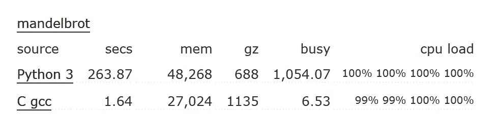
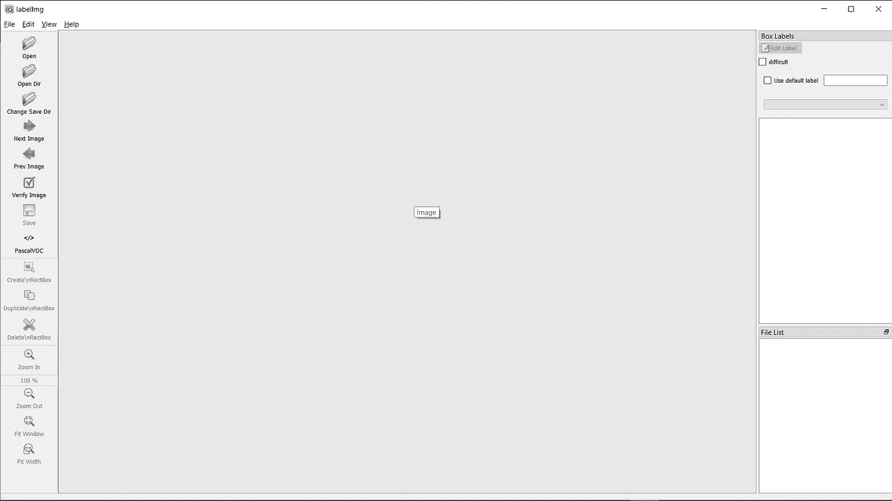
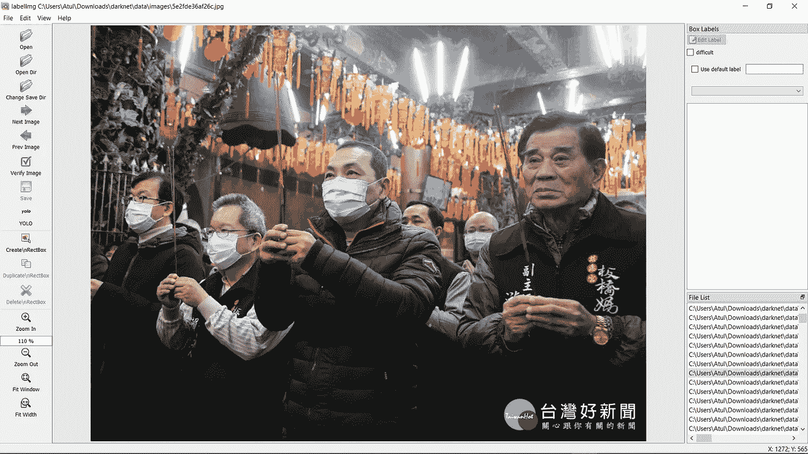
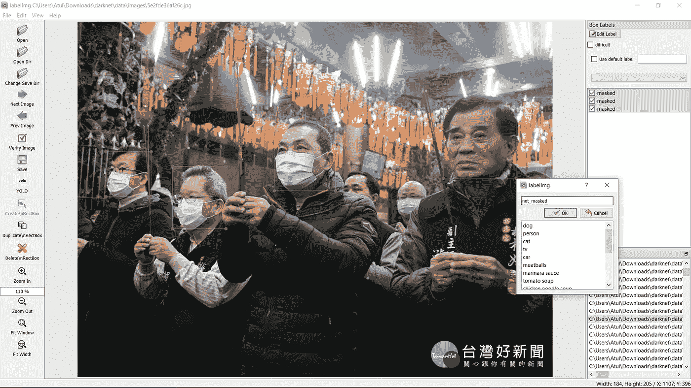
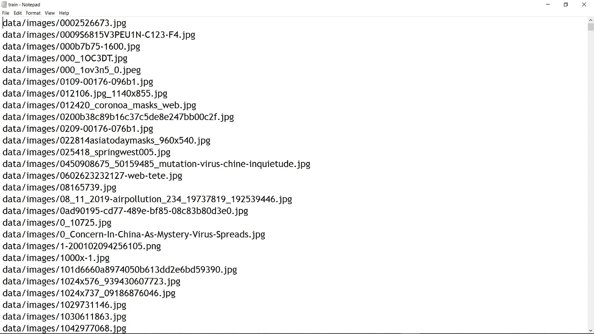
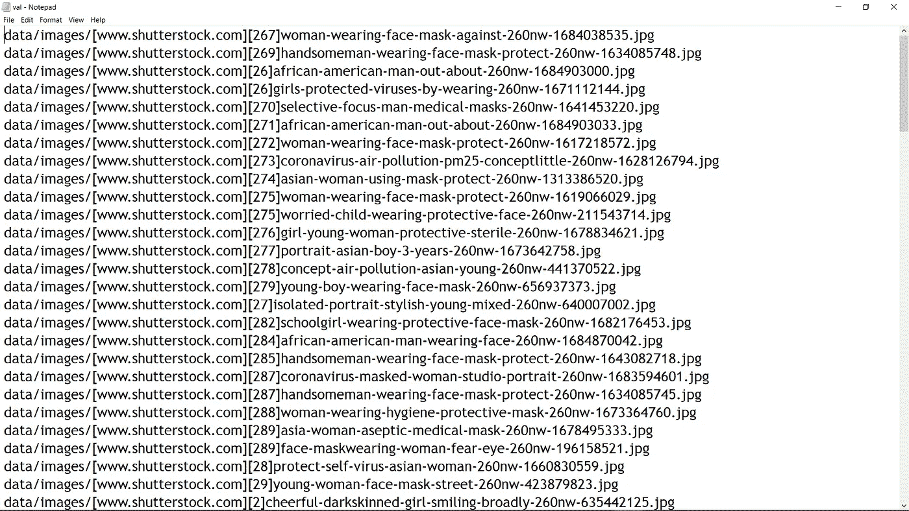

# 使用暗网的自定义对象检测

> 原文：<https://towardsdatascience.com/custom-object-detection-using-darknet-9779170faca2?source=collection_archive---------3----------------------->

## 创建自定义对象检测器指南—第 1 部分

以 15 fps 的速度输出视频

> *在这篇文章中，你将使用* ***【暗网】*** *训练模型进行蒙版检测。*
> 
> **本文可参考训练任何自定义物体探测器**

引用:视频输出可以在 YouTube 上通过彭博快带获得，用于训练的下载图片可以在 Kaggle 上作为开源获得。这些图片是我个人电脑的截图。非常感谢我的同事 Shauryasikt Jena

您无需从头开始训练自己的模型，而是可以在现有模型的基础上进行构建，并根据自己的目的对其进行微调，而不需要太多的计算能力。我用 Google Colab 进行训练，用 CPU(本地机器)进行测试。

## 什么是暗网？

Darknet 是一个开源的神经网络框架。这是一个快速和高度准确的(定制训练模型的准确性取决于训练数据、时期、批量大小和一些其他因素)**框架，用于实时对象检测**(也可用于图像)。最重要的原因是它很快，因为它是用 C 和 CUDA 编写的。

为了了解 C 有多快—



Mandelbrot 集合执行时间的比较

欲了解更多对比数据，请访问本页

 [## python 3 vs C gcc——哪些程序最快？计算机语言基准游戏

### Python 3 C gcc -哪些程序最快？

benchmarksgame-team.pages.debian.net](https://benchmarksgame-team.pages.debian.net/benchmarksgame/fastest/python3-gcc.html) 

# 内容

1.  装置
2.  收集图像
3.  给图像加标签
4.  获取和设置暗网
5.  训练我们的暗网

让我们开始吧，非常简单。只需浏览文章并按照步骤操作即可。谢谢:)

# 1.装置

我们将在 Google colab 上训练我们的模型，因此没有额外的库需要安装

但是如果你在本地机器上测试这个模型，这里有你需要的库—

```
opencv==4.2.0
tensorflow==1.13.2
numpy==1.18.1
pandas==1.0.2
keras==2.3.1
matplotlib==3.2.0
PIL==7.0.0
ffmpeg==4.2.2
```

请分别使用 anaconda cloud 或 Pypi 上的 conda 或 pip 在您的本地系统上安装这些库。

注意:ffmpeg 用于保存输出视频文件，因此需要特定的版本。

```
conda install ffmpeg
```

# 2.收集图像

你可以通过点击下载从这个链接获得图片—

[](https://www.kaggle.com/vtech6/medical-masks-dataset) [## 医用口罩数据集

### 人们戴着医用口罩的照片

www.kaggle.com](https://www.kaggle.com/vtech6/medical-masks-dataset) 

注:该链接包含一个 zip 文件，其中的图像及其标签/注释已经存在**，但**确保它们是正确的(相对于屏蔽/非屏蔽的坐标)。只是为了确保我手动标记它，这样我就不需要再次训练模型。

下载的文件将只有大约 700 张图片，这不足以获得良好的准确性。你也可以从这些链接中得到它们..

[](https://www.kaggle.com/shreyashwaghe/face-mask-dataset) [## 面罩数据集

### Kaggle 是世界上最大的数据科学社区，拥有强大的工具和资源来帮助您实现您的数据…

www.kaggle.com](https://www.kaggle.com/shreyashwaghe/face-mask-dataset) 

你可以从这里得到蒙版和非蒙版的图像—

[](https://www.kaggle.com/ahmetfurkandemr/mask-datasets-v1) [## 掩膜数据集 V1

### 戴口罩和不戴口罩的人。

www.kaggle.com](https://www.kaggle.com/ahmetfurkandemr/mask-datasets-v1) 

现在你已经收集了 1300 多张图片(如果可能的话，你可以添加更多的图片，这肯定会提高准确性)，这是一个有点繁琐但很重要的步骤。

# 3.标记

在收集了大约 1300 或更多的图像后，你必须手动标记它们。是的，这是一个非常繁琐的任务，但正确标记图像是非常重要的，否则它会反映在模型上，精度不会令人满意！

要给图像加标签，你可以使用一个非常有名的工具 ***Labelimg。***

你可以在你的系统上克隆这个链接—

[](https://github.com/tzutalin/labelImg) [## 佐他林/标签

### LabelImg 是一个图形化的图像注释工具。它是用 Python 写的，使用 Qt 作为它的图形界面…

github.com](https://github.com/tzutalin/labelImg) 

注意:克隆完成后，我建议您查看安装步骤，因为您必须在命令提示符下写两三行

关于安装指南，您可以观看任何**标签安装**视频。别担心，安装很容易，但是标签部分是……你知道我的意思。

1.  转到文件并打开包含图像的文件夹



这是运行 labelimg.py 后的样子

2.单击“创建”复选框，开始标记蒙版图像



从目录中打开图像

3.拖动遮罩周围的区域，然后键入 masked


遮罩图像的标签

4.我们也需要非蒙版，因此同样的程序点击创建/选择框，拖动非蒙版面，并标记为非蒙版



非遮罩面部的标签

5.标记每张脸后，保存并移动到下一张图片

> 老实说，根据你的速度，你需要 2 到 3 个小时来完成这项工作。所以祝你好运；)

# 4.获取和设置暗网

**获得暗网**

你可以直接在 google colab 上克隆这个 GitHub 库用于训练—

[](https://github.com/pjreddie/darknet) [## pjreddie/darknet

### Darknet 是用 C 和 CUDA 编写的开源神经网络框架。它速度快，易于安装，并支持 CPU…

github.com](https://github.com/pjreddie/darknet) 

注意:除了这个存储库之外，还有另一个存储库，它是 pjreddie 的派生版本。我使用 pjreddie 是因为在第一次尝试时，它对我来说很好。

**设置暗网**

1.  你需要一个名为 darknet53.conv.74 的文件，你可以从[这里](https://pjreddie.com/media/files/darknet53.conv.74)下载并放入 darknet
2.  在 cfg 文件夹中，使用记事本创建一个名为 yolov3_custom_train.cfg 的文件，将 yolov3.cfg 中的所有内容复制到新文件中。复制这 22 行，而不是文件中的行

```
[net]
#Testing
#batch=1
#subdivisions=1
#Training
batch=24
subdivisions=8
width=416
height=416
channels=3
momentum=0.9
decay=0.0005
angle=0
saturation = 1.5
exposure = 1.5
hue=.1learning_rate=0.001
burn_in=1000
max_batches = 6000
policy=steps
steps=5400
scales=.1,.1
```

在文件中使用 ctrl + f 搜索[yolo],并在各处进行这些更改(将有三个[yolo]块)。

注意:更改将发生在每个*【yolo】的 ***和【yolo】正上方的【卷积】块*中，仅此而已。cfg，别忘了保存！***

```
[convolutional]
size=1
stride=1
pad=1
filters=21
activation=linear[yolo]
mask = 6,7,8
anchors = 10,13,  16,30,  33,23,  30,61,  62,45,  59,119,  116,90,  156,198,  373,326
classes=2
num=9
jitter=.3
ignore_thresh = .7
truth_thresh = 1
random=1
```

让我们简单了解一下我们刚刚做了什么..

我们改变了类=2，因为我们有两个类 ***屏蔽*** 和 ***非 _ 屏蔽*** 并且在[卷积]中，过滤器=21

过滤器数量的公式是—

过滤器=(类别数+ 5)*3

3.使用记事本在数据文件夹中创建一个名为 yolo.names 的新文件，并复制以下几行..

```
masked
not_masked
```

..完成后，保存它。(我们需要这个文件进行测试)

4.创建另外两个文件 train.txt 和 val.txt，并在 training 95% Validation-5%中划分您的图像。

```
darknet
    ├── cfg
    |   
    ├── data
    |   ├── images
    |          ├── some_image.jpg
    |          ├── other_image.jpg
    |          ├── ...
    |   ├── labels
    |          ├── Some_image.txt
    |          ├── other_image.txt
    |          ├── ...
    |   ├── train.txt 
    |   ├── val.txt
    |
    ├── ...
    .
    .
    ├── darknet53.conv.74
    ...
```

现在棘手的部分来了..您已经下载的**图像**应该放在 darknet 的图像文件夹中**，而**注释/标签放在**文件夹中。在 train.txt 和 val.txt 中，你必须像这样给出每个图像的路径..**



train.txt 包含全部图像的 95%



val.txt 包含总图像的剩余 5%

提示:你可以写一个简单的 python 代码来做这件事，只需要 2 分钟，不需要手动写全部内容

5.使用记事本创建一个文件“yolo.data ”,并将其粘贴到该文件中..

```
classes= 2
train  = data/train.txt
valid  = data/val.txt
names = data/yolo.names
backup = backup
```

# 5.训练我们的暗网

最期待的部分终于来了。从这里开始，你不需要做任何事情，只需要运行一些代码，然后等待训练完成。

现在只要把你的 darknet 文件夹上传到 google drive 上，我们就快成功了。

提示:如果在任何情况下 **google colab 因为你的 **GPU 运行时间已经超过**而自动断开与**的连接，你可以保存你生成的权重文件的检查点，这样你就可以从那个时期继续，也可以测试哪个权重文件给出最好的结果。您可以转到 examples 文件夹中的 detector.c 文件并进行这些更改，以便每 100 个时期后获得权重文件，1000 个时期后获得每 1000 个时期后的权重

在我的驱动器中你的 darknet 文件夹外创建一个备份文件夹

```
void train_detector(char *datacfg, char *cfgfile, char *weightfile, int *gpus, int ngpus, int clear)
{ .... 
  ....
  ....
  if(i%1000==0 || (i < 1000 && i%100 == 0)){
#ifdef GPU
    if(ngpus != 1) sync_nets(nets, ngpus, 0);
#endif
       char buff[256];
       sprintf(buff, "%s/%s_%d.weights", backup_directory, base, i);
       save_weights(net, buff);
    }
```

**现在我们就快到了，只要确保你有训练模型所需的一切，因为你不想再做一遍。**

**行..现在让我们训练模型(耶..最后)**

**最简单的步骤就在这里，但首先要确保你给出的路径是正确的。一个细胞一个细胞地运行这些代码。**将 colab 运行时改为 GPU****

**注意:下面的命令只适用于 linux，因此我们使用 Google Colab**

```
google.colab import drive
drive.mount('/content/drive')#If you have a zipped darknet
!unzip "/content/drive/My Drive/darknet.zip"%cd /content/darknet
!make
!chmod +x ./darknet!rm /content/darknet/backup -r
!ln -s /content/drive/'My Drive'/backup /content/darknet!sudo apt install dos2unix
!dos2unix ./data/train.txt
!dos2unix ./data/val.txt
!dos2unix ./data/yolo.data
!dos2unix ./data/yolo.names
!dos2unix ./cfg/yolov3_custom_train.cfg#To start the training
%cd /content/darknet
!./darknet detector train data/yolo.data cfg/yolov3_custom_train.cfg darknet53.conv.74
```

**注意:当你从一个检查点开始训练，比如说在 2000 个纪元后，只需将训练命令改为..**

```
!./darknet detector train data/yolo.data cfg/yolov3_custom_train.cfg yolov3_custom_train_2000.weights
```

> **就是这样！！感谢您通读整篇文章**

## **为了部署这个经过训练的模型，请看看我的下一篇文章—**

**[](/real-time-custom-object-detection-a95d955cecda) [## 实时自定义对象检测

### 测试用于对象检测的定制训练暗网模型

towardsdatascience.com](/real-time-custom-object-detection-a95d955cecda) 

> 想了解更多关于暗网的信息，请点击这个链接

[](https://pjreddie.com/darknet/) [## darknet:C 语言中的开源神经网络

### darknet:c 语言中的开源神经网络。

pjreddie.com](https://pjreddie.com/darknet/)**