# 对象检测:在 Karens 攻击 Keras 和 OpenCV 之前阻止他们

> 原文：<https://towardsdatascience.com/custom-object-detection-using-keras-and-opencv-ddfe89bb3c3?source=collection_archive---------33----------------------->

## 关于如何构建自己的面部检测系统的演练，该系统可以确定某人是否戴着面具，或者他们是快乐、中立还是愤怒。

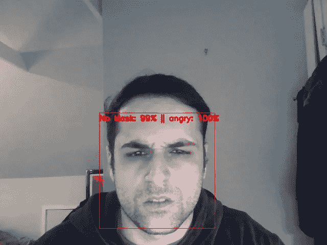

模型演示(作者照片)

在新冠肺炎时代，我们已经看到戴口罩可以大大减少病毒的传播。然而，正如我们有时在网上看到的，有很多人强烈反对这种说法。网上的视频显示，当人们被要求遵守这个协议时，他们变得非常不满。在这个项目中，我将向您展示如何创建一个神经网络，它可以检测某人是否戴着面具，如果没有，我们将检测他们脸上的面部表情。随着规模的扩大，这可以应用于当地企业，以便经理们可以检测到某人是否戴着面具，以及他们是否确实是一个准备罢工的卡伦。

照片来自 [Giphy](https://media.giphy.com/media/j1svspDN51FBUeQpFz/giphy.gif)

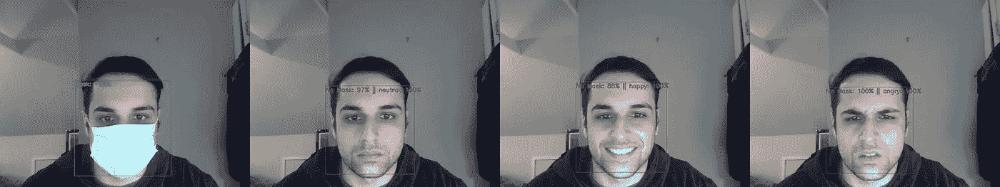

模型演示(作者照片)

** *本教程的代码可以在我的*[*GitHub*](https://github.com/HeeebsInc/FaceMaskEmotionDetection)** **上找到

# 要求

*   克拉斯
*   OpenCV
*   NumPy
*   Matplotlib
*   tqdm
*   Sklearn

# 数据

1.  面罩:~12K 图像数据集( [Kaggle](https://www.kaggle.com/ashishjangra27/face-mask-12k-images-dataset?select=Face+Mask+Dataset) )
2.  情感:~30K 图像数据集( [Kaggle](https://www.kaggle.com/msambare/fer2013) )

# 掩模检测

这个项目的第一步是建立一个神经网络，可以检测一个人是否戴着面具。对于这一部分，我们将使用 Mobilenet。

在构建模型之前，我们需要提取每张图像并对其进行预处理，以便可以将它输入 Mobilenet。在上面的数据集中，我们看到在最外层有三个目录:(1)训练，(2)测试，和(3)验证。下面是如何提取每个图像，为 mobilenet 预处理它们，并将它们保存到 NumPy 数组的代码。

运行上面的单元格后，您应该会看到这样的窗口。

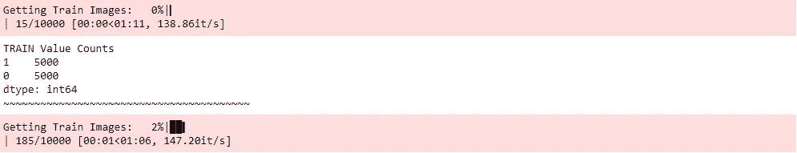

列车测试拆分(作者供图)

在后面的小节中，我们将重用函数 get_image_value，这就是为什么我们要传递一个参数，说明应该为哪个模型类型检索图像。

现在我们有了图像值，是时候建立神经网络来检测遮罩了。确保在当前目录中有一个名为 ModelWeights 的文件夹。在这个文件夹中，我们将保存我们训练的每个模型的权重。

上面，我们指定模型应该训练 2000 个纪元。因为模型可能不需要 2000 个历元，我们包括了一个早期停止参数，以防止模型在连续 5 次迭代后过度拟合，而损失没有变化。运行上面的单元格后，您应该会看到如下窗口:

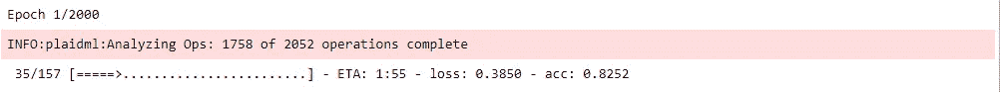

训练完成后，您应该会在 ModelWeights 文件夹中看到一个名为 Mobilenet_Masks.h5 的. h5 文件。在该文件中，存储了模型的权重，稍后当我们将该神经网络应用于实时视频时，将会使用该文件。

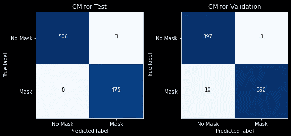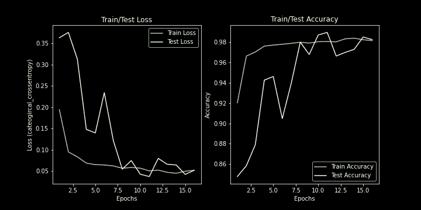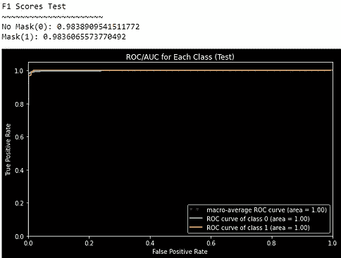

上面，我们看到了 mobilenet 培训的 ROC 得分、混淆矩阵和损失/准确性。考虑到我们使用的数据量，这些指标已经很不错了。对于验证集，只有 13 幅图像被错误分类。至于损耗和准确度，损耗能够低于 0.1，准确度远高于 94%。最后，ROC 分数显示了巨大的成功，因为每个班级都有 1.0 的满分，而每个班级的 f 1 分数都大于 0.98。

# 情感检测

与上一个模型一样，我们必须首先提取图像值，并将它们放入一个 NumPy 数组中。正如我前面提到的，我们将在一个新的函数中重用 get_image_value 函数，该函数被设计为只提取情感图像。该数据集包含 7 个类别:愤怒、快乐、中性、悲伤、厌恶、恐惧和惊讶。对于这个项目，我们将只关注前三类:愤怒、快乐和中立。此外，我们将用于训练的模型将采用大小为(48，48，3)的输入图像，这比(224，224，3)的 mobilenet 维度小得多。

情绪训练测试分裂(作者照片)

正如你在上面看到的，我们限制每个类最多只能包含 4000 张图片。这样做是为了让训练更快，这样我们就可以在平衡班级的情况下正确地跟踪学生的表现。

运行上面的代码后，您应该会看到一个与之前类似的窗口，如下所示:

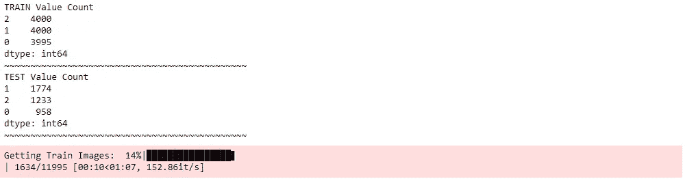

情绪训练测试分裂(作者照片)

现在我们有了训练测试分离阵列，我们将建立神经网络来检测一个人脸上的情绪。下面是如何建立这个神经网络的代码。与 mobilenet 不同，我们不会对数据集应用增强。

情绪训练(作者供图)

运行上面的代码后，您应该会看到一个类似这样的窗口:

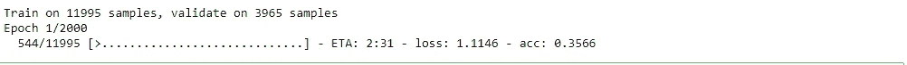

情绪训练(作者供图)

一旦训练完成，您应该找到一个名为 Normal_Emotions.h5 的. h5 文件，它将包含模型的权重。与我们之前训练的模型一样，这将用于下面的实时视频部分。

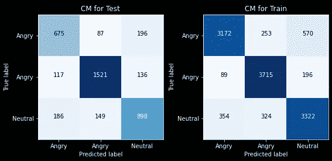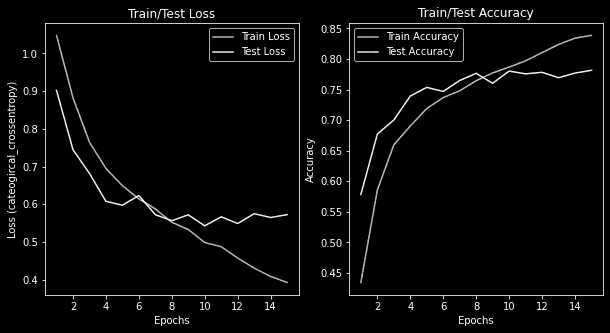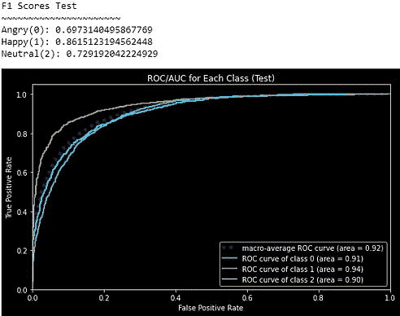

上面，我们看到了情绪模型的 ROC 分数、混淆矩阵和损失/准确性。考虑到我们使用的数据量，这些指标相当不错，但不如 mobilenet。对于训练集，在大约 12，000 幅图像中，只有 1，786 幅图像被错误分类。至于损耗和准确度，损耗能够低于 0.7，准确度保持在 70-75%之间。最后，ROC 分数显示了相当好的成功，因为每个类都保持了大于 0.9 的分数，而每个类的 F1 分数都在 0.7 到 0.9 之间。

# 部署

现在我们已经训练好了每个模型，我们将使用 OpenCV 将它们应用于现场视频。对于这一部分，您必须在本地机器上安装网络摄像头。

在我们进入代码之前，让我先解释一下这是如何工作的。

1.  使用[哈尔级联分类器](https://opencv-python-tutroals.readthedocs.io/en/latest/py_tutorials/py_objdetect/py_face_detection/py_face_detection.html)，我们将在一个视频帧中找到人脸的坐标([下载链接](https://github.com/HeeebsInc/FaceMaskEmotionDetection/blob/master/ModelWeights/haarcascade_frontalface_default.xml)
2.  在找到人脸的坐标后，我们将提取该部分，也称为我们的感兴趣区域(ROI)。
3.  因为我们想弄清楚是否存在一个遮罩，所以我们将首先将 ROI 重新整形为(224，224)，以便可以将其输入到我们的 mobilenet 模型中。
4.  如果 mobilenet 模型预测有一个掩码，那么它将继续而不使用情感模型。
5.  但是，如果 mobilenet 模型预测没有遮罩，那么它将再次使用 ROI 并将其输入到情感模型中。

下面是它如何工作的代码。乍一看，for 循环中似乎有很多条件，但只要慢慢读，就会明白。

运行上面的代码后，会弹出一个如下所示的窗口。要停止此过程，请按键盘上的“q”按钮。

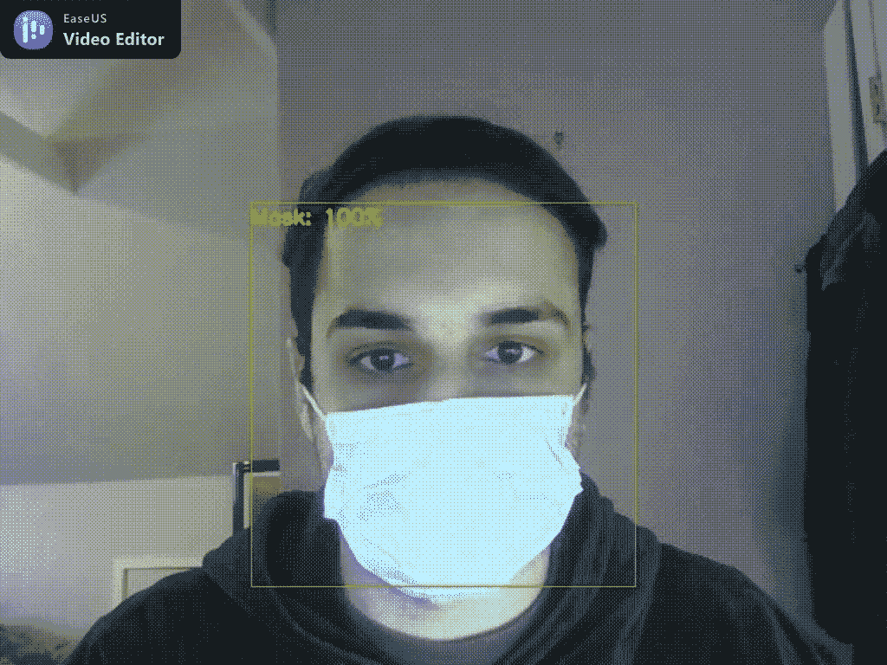

模型演示(作者照片)

## 限制

*   据我所知，如果画面中的人戴着眼镜，这个模型很难区分面具是否存在。
*   更多包含戴口罩戴眼镜的人的数据将改善这种局限性

**未来方向**

*   我打算找一台能探测热量的相机(如果我能找到一台价格实惠的话)
*   使用摄像头来检测热量以及这些其他功能有利于防止人们在发现发烧时进入商店。

**此外，我目前正在寻找一份数据科学方面的工作，所以如果你在这方面有任何建议，请通过**[**LinkedIn**](https://www.linkedin.com/in/samuel-mohebban-b50732139/)**联系我！**

**本教程的代码可以在我的*[*GitHub*](https://github.com/HeeebsInc/FaceMaskEmotionDetection)** **上找到