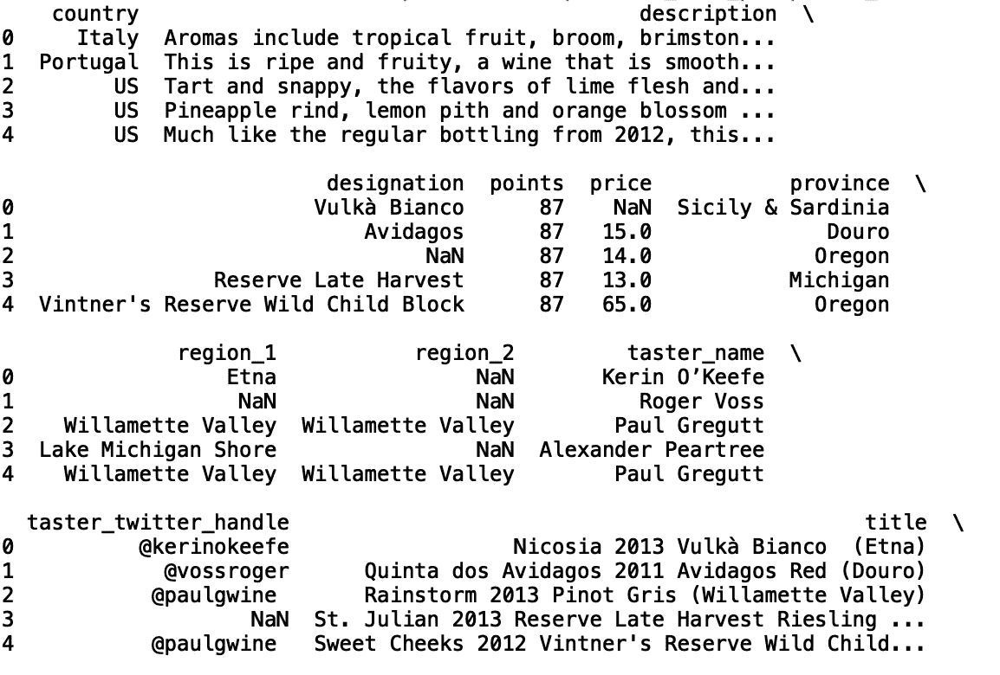
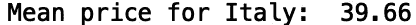
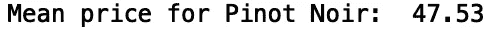
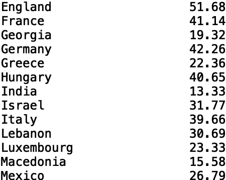
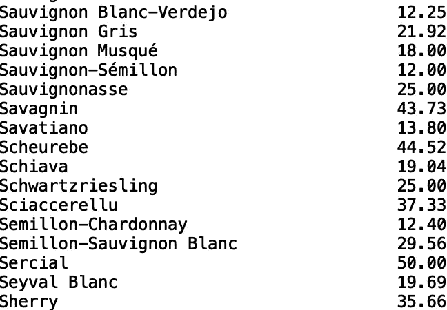
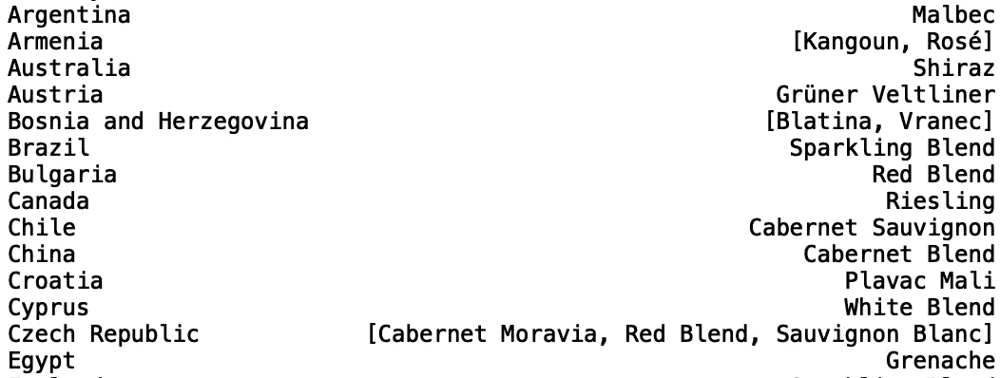

# 自定义熊猫统计功能

> 原文：<https://towardsdatascience.com/custom-pandas-statistics-functions-731e767d4807?source=collection_archive---------33----------------------->

## 生成统计数据的三个有用的 Pandas 函数


照片由[像素](https://www.pexels.com/photo/books-business-computer-connection-459654/)上的 [Pixabay](https://www.pexels.com/@pixabay) 拍摄

Pandas 是一个有用的 python 库，可用于各种数据任务，包括统计分析、数据插补、数据争论等等。在本帖中，我们将介绍三个有用的自定义函数，它们允许我们从数据中生成统计数据。

我们开始吧！

出于我们的目的，我们将使用*葡萄酒评论*数据集，可以在[这里](https://www.kaggle.com/zynicide/wine-reviews)找到。

首先，让我们导入 pandas 和 numpy 包:

```
import pandas as pd 
import numpy as np
```

接下来，让我们将显示列和行的最大数量设置为“None”:

```
pd.set_option('display.max_columns', None)
pd.set_option('display.max_rows', None)
```

现在，让我们读入数据:

```
df = pd.read_csv('winemag-data-130k-v2.csv')
```

接下来，我们将打印前五行数据，以了解列类型及其值(列结果被截断):

```
print(df.head())
```



我们可以考虑一个有趣的函数，它为分类列中的给定类别生成数值列的平均值。该函数将接受一个分类列名、该分类列的分类值和一个数字列名:

```
def get_category_mean(categorical_column, categorical_value, numerical_column):
```

在函数中，我们需要过滤该类别值的数据帧，并取该类别数值的平均值:

```
def get_category_mean(categorical_column, categorical_value, numerical_column):
    df_mean = df[df[categorical_column] == categorical_value]
    mean_value = df_mean[numerical_column].mean()
```

最后，我们可以使用 python“f 字符串”来打印结果:

```
def get_category_mean(categorical_column, categorical_value, numerical_column):
    df_mean = df[df[categorical_column] == categorical_value]
    mean_value = df_mean[numerical_column].mean()
    print(f"Mean {categorical_column} for  {numerical_column}", np.round(mean_value, 2))
```

现在，让我们调用包含分类列“国家”、国家值“意大利”和数字列“价格”的函数:

```
get_category_mean('country', 'Italy', 'price')
```



我们也可以调用类别为“品种”、品种值为“黑皮诺”、数值列为“价格”的函数:

```
get_category_mean('variety', 'Pinot Noir', 'price')
```



我们可以考虑的另一个函数是为分类列中的每个分类值生成数字列的平均值。我们可以使用熊猫的“分组”方法来实现这一点:

```
def groupby_category_mean(categorical_column, numerical_column):
    df_groupby = df.groupby(categorical_column)[numerical_column].mean()
    df_groupby = np.round(df_groupby,2)
    print(df_groupby)
```

如果我们用“国家”和“价格”调用我们的函数，我们将打印每个国家的平均价格(为了清楚起见，结果被截断):

```
groupby_category_mean('country', 'price')
```



为了进行健全性检查，我们看到我们得到了与上一个函数中相同的意大利平均价格。我们还可以将该函数应用于葡萄酒品种和价格(为了清楚起见，结果被截断):

```
groupby_category_mean('variety', 'price')
```



我们将讨论的最后一个函数为另一个分类列的每个值生成分类列的模式。我们也可以使用熊猫的“分组”方法来实现这一点:

```
def groupby_category_mode(categorical_column1, categorical_column2):
    df_groupby = df.groupby(categorical_column1)[categorical_column2].agg(pd.Series.mode)
    print(df_groupby)
```

让我们找到每个国家的葡萄酒品种。这将告诉我们每个国家最常出现的葡萄酒品种:

```
groupby_category_mode('country', 'variety')
```



我将在这里停下来，但是您可以自己随意摆弄代码和数据。

## 结论

总之，在这篇文章中，我们讨论了如何使用 Pandas 定义三个自定义函数来从数据中生成统计洞察。首先，我们展示了如何定义一个函数，在给定分类列和类别值的情况下，计算数字列的平均值。然后，我们展示了如何使用“groupby”方法为分类列中的每个类别生成数值列的平均值。最后，我们展示了如何为一个分类列的每个值生成另一个分类列的模式。如果你有兴趣学习更多关于熊猫的数据操作、机器学习甚至只是 python 编程的一些基础知识，请查看[*Python for Data Science and Machine Learning:Python 编程、熊猫和 Scikit-初学者学习教程*](https://www.amazon.com/dp/B08N38XW2Q/ref=sr_1_1?dchild=1&keywords=sadrach+python&qid=1604966500&s=books&sr=1-1) 。我希望你觉得这篇文章有用/有趣。这篇文章中的代码可以在 [GitHub](https://github.com/spierre91/medium_code/blob/master/pandas_tutorials/pandas_custom_functions.py) 上找到。感谢您的阅读！