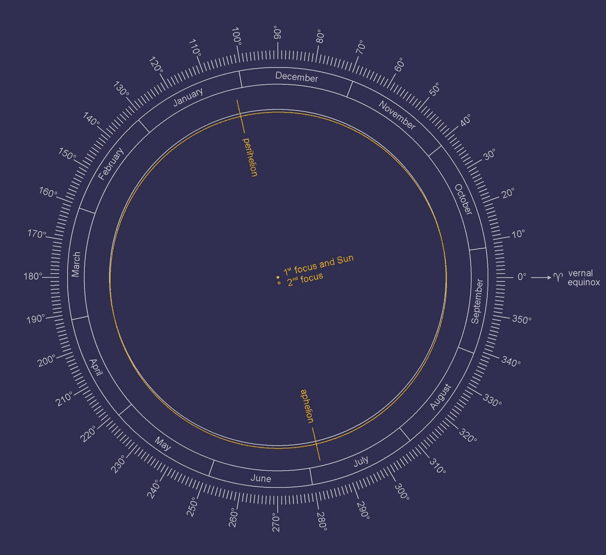
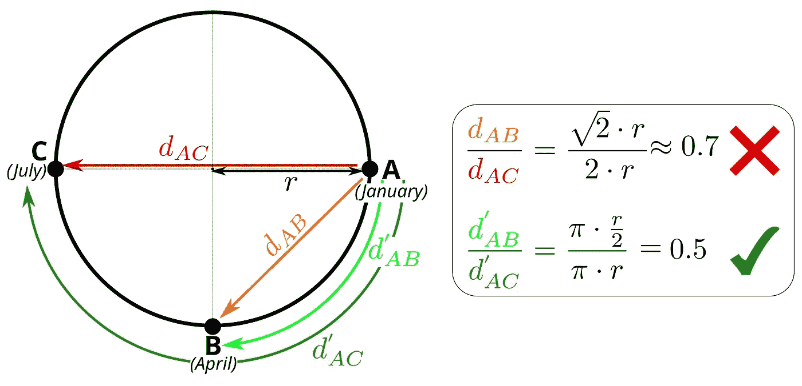
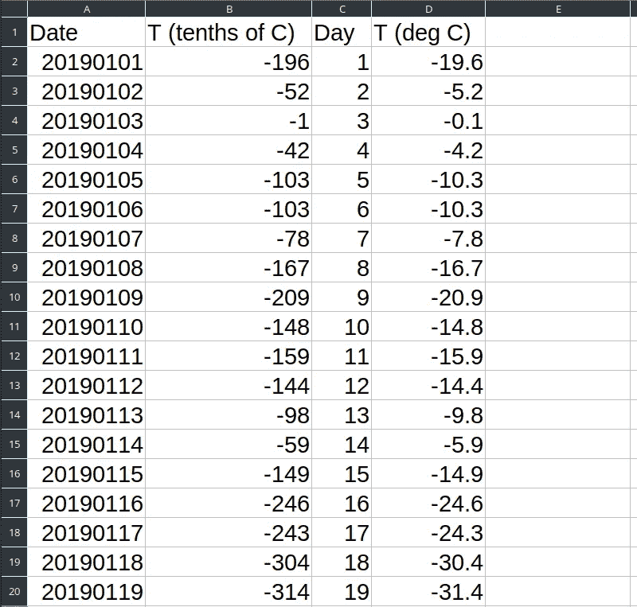
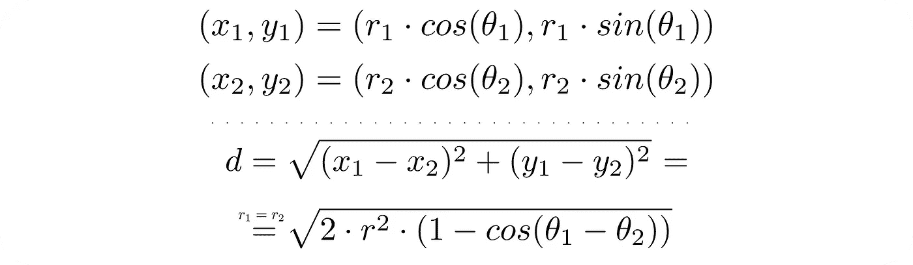
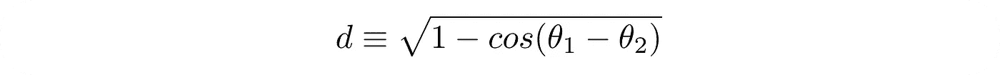
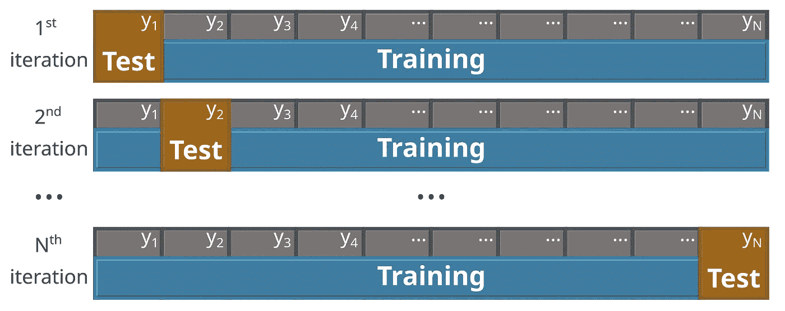

# scikit-learn 中带有最近邻回归的自定义用户定义指标

> 原文：<https://towardsdatascience.com/custom-user-defined-metrics-with-nearest-neighbors-regression-in-scikit-learn-8bec2f303499?source=collection_archive---------36----------------------->

## 自定义度量教程:预测日平均温度

阿道夫·费利克斯在 [Unsplash](https://unsplash.com?utm_source=medium&utm_medium=referral) 上拍摄的照片

在过去的几年里，公众可用的数据科学工具的数量急剧增加。一个这样的工具是 Python 库 [scikit-learn](https://scikit-learn.org/stable/) (通常被称为 sklearn)。对于 scikit-learn 最近的介绍性概述，您可以看看最近由 [Sadrach Pierre](/a-brief-tour-of-scikit-learn-sklearn-6e829a9db2fd) 发表的帖子。

在这篇文章中，我将讨论 k 近邻回归。具体来说，我们将了解如何使用用户定义的指标。这个领域受到的关注少得惊人。我将给出一个简单的例子，在这个例子中，实现我们自己的距离度量是有益的。我们将详细了解如何实现这一点，并评论这种方法的优点。

# 教程概述

任何具有 Python 基础知识的人都可以阅读本教程，完整的代码作为参考。教程中使用的所有数据、代码和图像都在这个 [Github 资源库](https://github.com/marcosdelcueto/Tutorial_kNN_custom_metric)中提供。本教程分为不同的部分:

*   kNN 回归简介
*   自定义指标的应用示例
*   创建数据集
*   实施自定义指标
*   交叉验证以优化 k
*   不同指标的准确度比较

# kNN 回归简介

当试图预测新点的目标属性( *y* )时，kNN 对近邻的目标属性值进行加权平均，以计算新点的 *y* 值。通常，可以通过考虑最近的近邻具有更显著的影响来提高预测精度。这是通过用与其距离成反比的权重对所有 k 个最近的邻居进行加权来实现的。在 scikit-learn 中，我们只需在 kNN 回归器中选择选项**weights =‘distance’**就可以做到这一点。这意味着更近的点(更小的距离)在预测中将具有更大的权重。形式上，目标资产在新点 *n* 处的价值，与 *k* 最近的邻居，计算如下:

关于 kNN 回归的更详细的解释，以及权重函数的影响，请随意参考我最近关于这些主题的博客文章。

# 自定义指标的应用示例

作为对定义自定义指标感兴趣的一个例子，我们使用一个简单的数据集，该数据集包含加拿大气象站 2019 年每天的平均温度。我们的数据集由一个描述符(一年中的某一天)和一个目标属性(气象站的日平均温度)组成。

在 [2019](http://www.astropixels.com/ephemeris/perap2001.html) 年，地球与太阳的最远距离(远日点)为 1.521×10⁸公里，最近距离(近日点)为 1.471×10⁸公里。这两个值非常相似(相差~3%)，所以为了简单起见，我们在这里假设地球的轨道是圆形的。这种近似可以在下图中可视化，其中围绕太阳的实际轨道以橙色显示，圆形近似轨道以白色显示。

图片由 [Sch](https://de.wikipedia.org/wiki/Benutzer:Sch) 在[维基共享](https://commons.wikimedia.org/wiki/File:EarthsOrbit_en.png)下 [CC BY-SA 3.0](https://creativecommons.org/licenses/by-sa/3.0/deed.en)

在一年中，地球绕太阳转一圈。因此，一年中两个日期之间的*距离*可以计算为地球在此期间沿其轨道运行的距离。沿着轨道的两点之间的距离，与我们最初可能天真地计算出的直接欧几里得距离不同。

在下图中，我们显示了两点 B 和 C 相对于初始点 A *的相对距离。*例如，当我们直接使用欧几里德度量(红色)计算 A-B 和 A-C 距离的比率时，我们得到大约 0.7，这意味着 A-B 距离大约是 A-C 距离的 70%。但是，如果我们考虑沿圆周(绿色)计算的距离，我们得到 A-B 距离是 A-C 距离的 50%。我们可以很容易地观察到最后一个度量是如何正确描述我们的问题的:1 月和 4 月之间的*距离*是*的 50%*

作者图片

# 创建数据集

我们从美国国家海洋和大气管理局 climate.gov 站获取温度数据。我们重点关注加拿大马尼托巴省天鹅河站(CA00504K80K 站)2019 年的数据。

原始数据由*日期* (YYYYMMDD)和 *T* (十分之一摄氏度)组成。我们将数据转换为**天**(从 1 到 365)和 **T** (摄氏度)。我们提供了这四列的数据，虽然代码中只使用了最后两列，2019 年的 364 天(缺少 7 月 30 日的数据)。下面我们展示这些数据的样子，完整的数据集在这个 [Github 仓库](https://github.com/marcosdelcueto/Tutorial_kNN_custom_metric)中提供。

# 实施自定义指标

在 scikit-learn 中，k-NN 回归默认使用欧几里德距离，尽管还有更多的[距离度量](https://scikit-learn.org/stable/modules/generated/sklearn.neighbors.DistanceMetric.html)可用，例如曼哈顿和切比雪夫。此外，我们可以使用关键字 *metric* 来使用用户定义的函数，该函数读取两个数组 *X1* 和 *X2* ，其中包含我们想要计算其距离的两个点的坐标。

下面，我们展示了一个带有函数 *mimic_minkowski* 的简单代码，因此使用 **metric=mimic_minkowski** 会产生与使用默认 minkowski(欧几里得)度量和**metric =‘Minkowski’**完全相同的结果。

因为我们想研究圆周上各点的距离，所以使用极坐标非常方便。我们在下面展示了由此产生的距离方程。

请注意，我们的函数将用于计算距离之间的相对差异，因此我们可以将上述等式简化为:

在我们的数据集中，我们有每天的日期，所以我们可以很容易地将时差转换成角度差(θ₁-θ₂).假设地球的轨道是圆形的，并且以恒定的速度运动，我们可以将一年中 Day₁和 Day₂两天之间的差异转换为角度差异，如下所示。

最后，我们可以创建我们的 *custom_metric* 函数，如下所示。

# 交叉验证以优化 k

选择 k 个最近邻的最佳数量以进行精确预测的简单方法是使用网格搜索。网格搜索包括尝试不同的 *k* 值，最后选择一个最小化预测误差的值。

与任何机器学习模型一样，人们面临着选择将用于训练模型的数据和将用于测试模型准确性的数据的任务。

由于我们有相对少量的低维数据，我们将使用留一交叉验证(对于更复杂的数据集，可以选择 k 倍交叉验证)。为了对具有 *N* 个样本的数据集使用留一交叉验证，人们用 *N-1* 个点训练机器学习模型，并使用剩余的点作为测试。这被重复 *N* 次，所以每个点正好被用作一次测试。这种交叉验证的示意图如下所示。

作者图片

结果，每个点都有一个预测值。然后，将每个点的预测值与其实际值进行比较。作为误差指标，我们使用了均方根误差(rmse)。最后，我们可以比较针对不同的 *k* 值获得的(rmse ),并选择最小化 rmse 的值作为最佳的 *k* 值。包括这个网格搜索在内的完整代码如下所示。

使用该代码，我们得到最小 rmse 是在 k=2 时获得的，结果是 **rmse=2.725 C** 。这意味着我们可以估计 2019 年任何一天的日平均温度，只需知道今年剩余时间的日平均温度，平均误差为 2.725 摄氏度。

# 不同指标的准确度比较

我们可以合理地问，使用这一新指标的好处是什么。如果我们在上面代码的第 39 行更改为 **metric= 'minkowski'** ，我们得到最佳邻居的数量为 k=2，平均误差为 **rmse=2.740 C** 。因为我们使用一个非常简单的例子，只有一个描述符，使用一个更合理的度量标准的改进很小:大约 0.5%。

然而，人们应该始终确保使用合理的度量标准。此外，这 0.5%的误差可能对你的问题至关重要。此外，随着数据集复杂性的增加，采用适当指标的改进可能会增加。

# 结论

我们已经介绍了 k-最近邻回归的基础知识以及如何将其应用于简单的数据集。我们还看到了如何实现用户定义的定制度量函数，以及如何使用正确的度量来提高您的预测准确性。

请记住，这里展示的数据集、代码、图像等。在这个 [Github 库](https://github.com/marcosdelcueto/Tutorial_kNN_custom_metric)中提供。

这个教程对你有帮助吗？让我知道你是否能够成功实现你自己的距离度量！