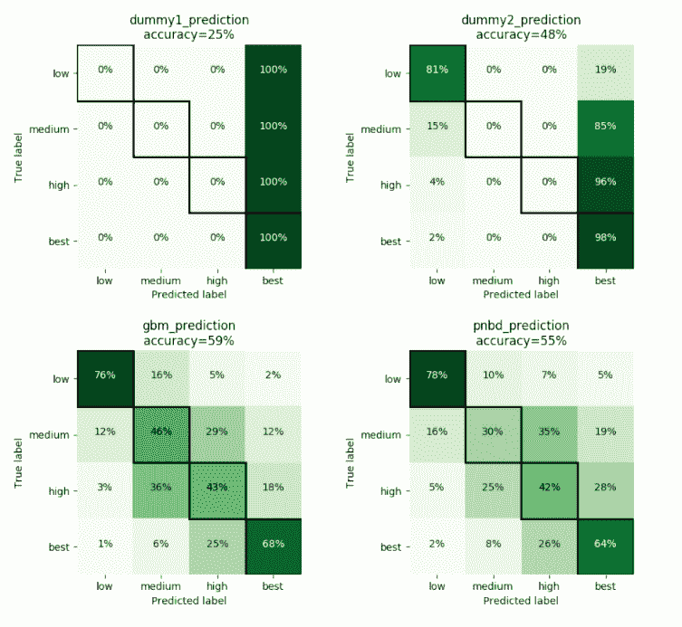

# 客户行为建模:聚合统计的问题

> 原文：<https://towardsdatascience.com/customer-behavior-modeling-the-problem-with-aggregate-statistics-be369d95bcaa?source=collection_archive---------28----------------------->

## **使用综合统计数据来判断客户行为模型的强度不是一个好主意**

作为一名数据科学家，我花了相当多的时间思考客户终身价值(CLV)以及如何对其建模。一个强大的 CLV 模型实际上是一个强大的客户行为模型——你越能预测下一步行动，你就能越好地量化 CLV。

在这篇文章中，我希望通过一个玩具和现实世界的例子来证明，**为什么使用综合统计来判断客户行为模型的强度是一个坏主意**。

相反，最好的 CLV 模型是在个体层面上有最强预测的模型。探索客户生命周期价值的数据科学家应该主要，也可能是唯一，使用个人层面的指标来充分理解 CLV 模型的优势和劣势。


CLV 模型本质上是猜测一个人在你店里购物的频率以及他们会花多少钱。rupixen.com 在 [Unsplash](https://unsplash.com?utm_source=medium&utm_medium=referral) 上[拍照](https://unsplash.com/@rupixen?utm_source=medium&utm_medium=referral)

# **第 1 章什么是 CLV，为什么它很重要？**

虽然这是为数据科学家准备的，但我想说明本文的业务分支，因为理解业务需求将告知我为什么持有某些观点，以及为什么对我们所有人来说掌握好的 CLV 模型的额外好处是重要的。

CLV:顾客将来会花多少钱

CLV 是一个商业关键绩效指标，在过去的几年里，它的受欢迎程度激增。原因是显而易见的:如果你的公司能够准确预测客户在未来几个月或几年的花费，你就可以根据预算调整他们的体验。从市场营销到客户服务，再到整体商业战略，这都有着巨大的应用空间。

以下是“精确 CLV”可以帮助实现的业务应用的快速列表:

*   营销受众生成
*   断代分析
*   客户服务票订购
*   营销提升分析
*   CAC 投标封顶营销
*   折扣活动
*   VIP 购买体验
*   忠诚度计划
*   分割
*   董事会报告

还有很多，这些只是我想到最快的。


伟大的数字营销源于对客户的深刻理解。[活动创建者](https://unsplash.com/@campaign_creators?utm_source=medium&utm_medium=referral)在 [Unsplash](https://unsplash.com?utm_source=medium&utm_medium=referral) 上的照片

有如此多的商业计划处于危险之中，精通技术的公司正忙于寻找哪种模式最能抓住他们客户群的 CLV。最流行和最常用的客户终身价值模型使用总收入百分比误差(ARPE)等统计数据，根据总指标来衡量它们的实力。我之所以知道这一点，是因为我的许多客户已经用汇总统计数据将他们的内部 CLV 模型与我的模型进行了比较。

我认为这是一个严重的错误。

下面的两个例子，一个是玩具，一个是真实的，将有望展示总体统计数据是如何把我们引入歧途，并隐藏在个体水平上非常明显的模型缺陷的。这是特别有先见之明的，因为大多数业务用例在个体层面上需要一个强大的 CLV 模型，而不仅仅是在集合层面上。

# **第二章一个玩具例子**

当你依赖于总体指标而忽略个体层面的不准确性时，你就错过了很大一部分技术叙述。考虑以下 4 个客户及其 1 年 CLV 的示例:


这个示例包括高、低、中 CLV 客户，以及一个不满意的客户，为智能模型创建了一个很好的分布来捕获。

现在，考虑以下验证指标:

1.  **MAE** :平均绝对误差(预测之间的平均差异)

3. **ARPE** :总收入百分比误差(总收入和预测收入之间的总体差异)

**MAE** 是在客户层面上，而 **ARPE** 又是一个聚合统计。这些验证指标的值越低越好。

这个例子将展示一个集合统计如何掩盖低质量模型的缺点。

要做到这一点，可以将一个虚拟的平均值猜测与 CLV 模型进行比较，两者相差 20%。

**模型 1:假人**

虚拟模型只会猜测每个顾客 40 美元。

**车型二:CLV 车型**

该模型试图在客户层面做出准确的模型预测。


我们可以使用这些数字来计算三个验证指标。


这个例子说明了一个总体上相当差的模型(CLV 模型差 20%以上)在个体层面上实际上是更好的。

为了让这个例子更好，让我们给预测添加一些噪声。

```
# Dummy Sampling:
# randomly sampling a normal dist around $40 with a SD of $5np.random.normal (40,5,4)OUT: (44.88, 40.63, 40.35, 42.16)#CLV Sampling:
# randomly sampling a normal dist around answer with a SD of $15
max (0, np.random.normal (0,15)),
max (0, np.random.normal (10, 15)),
max (0, np.random.normal (50,15)),
max  (0, np.random.normal (100, 15))OUT: (0, 17.48, 37.45, 81.41)
```


上面的结果表明，即使一个人的统计数据比你希望的百分比高，这些 CLV 数的分布也更符合我们所寻找的:一个区分高 CLV 客户和低 CLV 客户的模型。如果你只看 CLV 模型的综合指标，你就错过了故事的主要部分，你可能最终为你的企业选择了错误的模型。

但是，即使汇总一个在个人层面上计算的误差指标，比如 MAE 或 MAPE 等替代指标，也可能隐藏关于你的模型的优点和缺点的关键信息。主要是，**其创建 CLV 分数的精确分布的能力。**

为了进一步探讨这个问题，让我们来看一个更现实的例子

# **第三章一个真实的例子**

恭喜你！你，读者，被我刚刚虚构的电子商务公司 BottleRocket Brewing Co 聘为数据科学家。(我们将使用的数据基于我为这篇文章挑选的一家真实的电子商务公司)


有趣(虚假)的事实:BottleRocket Brewing 在加州是一个相当受欢迎的品牌。照片由[海伦娜·洛佩斯](https://unsplash.com/@wildlittlethingsphoto?utm_source=medium&utm_medium=referral)在 [Unsplash](https://unsplash.com?utm_source=medium&utm_medium=referral) 拍摄

作为数据科学家，您的首要任务是:为 BottleRocket 的业务选择最佳的 CLV 模型…

……但是“最好”是什么意思呢？

但你没有被吓住，你用以下模型做了一个实验:

1.  **帕累托/NBD 模型(PNBD)**

帕累托/NBD 模型是一个非常受欢迎的选择，也是当今大多数数据驱动的 CLV 预测的模型。引用文档:

*1987 年推出的帕累托/NBD 模型将活跃客户交易的[负二项分布]与异质退出过程结合在一起，至今仍被认为是购买直到死亡模型的黄金标准* [*【链接】*](https://www.jstor.org/stable/2631608?seq=1)

但另一方面，该模型学习两种分布，一种是流失概率，另一种是交易时间间隔(ITT)，并通过从这些分布中取样来进行 CLV 预测。

**用更多的技术细节描述 BTYD 模型有点超出了本文的范围，本文主要讨论错误度量。如果你对关于 BTYD 模型的更深入的文章感兴趣，请发表评论，我很乐意写一篇后续文章！更新:查看[我关于 BTYD 车型的文章](/customer-behavior-modeling-buy-til-you-die-models-6f9580e38cf4) **

**2。梯度增压机(GBM)**

梯度增强机器模型是一种流行的机器学习模型，其中弱树被训练和组装在一起以形成强的整体分类器。

**与 BTYD 模型一样，我不会详细介绍 GBM 是如何工作的，但是如果您想让我写一些关于方法/模型的东西，请在下面再次发表评论

**3。虚拟 CLV**

这个模型被简单地定义为:

```
Calculate the average ITT for the business
Calculate the average spend over 1yrIf someone has not bought within 2x the average purchase time:
    Predict $0
Else:
    Predict the average 1y spend
```

**4。非常哑的假人模型(Avg 假人)**

该模型仅猜测所有客户超过 1 年的平均支出。包括作为模型性能的基线

**第 3.1 章汇总指标**

我们可以将所有这些模型的预测整合到一个漂亮的小熊猫数据框架“combined_result_pdf”中，如下所示:

```
combined_result_pdf.head()
```


给定这个客户表，我们可以使用下面的代码计算误差指标:

```
from sklearn.metrics import mean_absolute_erroractual = combined_result_pdf['actual']
rev_actual = sum(actual)for col in combined_result_pdf.columns:
    if col in ['customer_id', 'actual']:
        continue
    pred = combined_result_pdf[col]
    mae = mean_absolute_error(y_true=actual, y_pred=pred)
    print(col + ": ${:,.2f}".format(mae))

    rev_pred = sum(pred)
    perc = 100*rev_pred/rev_actual
    print(col + ": ${:,} total spend ({:.2f}%)".format(pred, perc))
```

通过这四个模型，我们尝试预测瓶装旧酒客户的 1 年 CLV，按 MAE 评分排序:


这张表格中有一些有趣的见解:

1.  GBM 似乎是 CLV 的最佳模式
2.  PNBD，尽管是一个受欢迎的 CLV，似乎是最糟糕的。事实上，它比一个简单的 if/else 规则列表更糟糕，只比一个只猜测平均值的模型稍微好一点！
3.  尽管 GBM 是最好的，但它只比虚拟的 if/else 规则列表模型好几个美元

如果数据科学家/客户接受的话，第三点特别有意思。如果这些结果的解释者真的认为一个简单的 if/else 模型可以捕捉 GBM 可以捕捉的几乎所有复杂性，并且比常用的 PNBD 模型更好，那么一旦成本、训练速度和可解释性都被考虑在内，显然“最佳”模型将是虚拟 CLV。

这让我们回到了最初的主张——**，即总体误差指标，即使是在个体层面上计算的，也会掩盖模型的一些缺点。**为了证明这一点，让我们将数据框架重新加工成混淆矩阵。


统计数据有时非常令人困惑。对于混淆矩阵，它们是字面上的混淆。照片由[内森·杜姆劳](https://unsplash.com/@nate_dumlao?utm_source=medium&utm_medium=referral)在 [Unsplash](https://unsplash.com?utm_source=medium&utm_medium=referral) 上拍摄

**迷你章:什么是混淆矩阵？**

单从它的名字来看，理解一个混乱矩阵听起来令人困惑&具有挑战性。但是理解这篇文章中的观点是至关重要的，也是添加到您的数据科学工具包中的一个强大工具。

一个**混淆矩阵**是一个表格，它概括了分类的准确性，以及模型常见的错误分类。一个简单的混淆矩阵可能如下所示:


上面混淆矩阵的对角线，突出显示的绿色，反映了正确的预测——当它实际上是一只猫的时候预测它是一只猫，等等。这些行的总和将达到 100%，这使我们能够很好地了解我们的模型捕捉回忆行为的情况，或者我们的模型在给定特定标签的情况下正确猜测的概率。

从上面的混淆矩阵中我们还可以看出..

1.  在给定真实标签为猫的情况下，该模型在预测猫方面表现出色(猫召回率为 90%)
2.  这个模型很难区分狗和猫，经常把狗误认为猫。这是模型最常犯的错误。
3.  虽然有时会把猫误认为狗，但这远没有其他错误常见

记住这一点，让我们探索我们的 CLV 模型如何使用混淆矩阵捕捉客户行为。一个强大的模型应该能够正确地将低价值客户和高价值客户进行分类。我更喜欢这种可视化的方法，而不是像 CLV 分数直方图那样的东西，因为它揭示了建模分布的哪些元素是强的和弱的。

为此，我们将把货币价值预测转换为低、中、高和最佳的量化 CLV 预测。这些将从每个模型预测生成的分位数中提取。

最佳模型将正确地将客户分为低/中/高/最佳这四类。因此每个模型我们将制作一个如下结构的混淆矩阵:


并且最佳模型将具有落在该对角线内的最多数量的预测。

**Ch。3.2 各项指标**

这些混淆矩阵可以用下面的代码片段从我们的 Pandas DF 中生成:

```
from sklearn.metrics import confusion_matrix
import matplotlib.patches as patches
import matplotlib.colors as colors# Helper function to get quantiles
def get_quant_list(vals, quants):
    actual_quants = []

    for val in vals:
        if val > quants[2]:
            actual_quants.append(4)
        elif val > quants[1]:
            actual_quants.append(3)
        elif val > quants[0]:
            actual_quants.append(2)
        else:
            actual_quants.append(1)
    return(actual_quants)# Create Plot
fig, axes = plt.subplots(nrows=int(num_plots/2)+(num_plots%2),ncols=2, figsize=(10,5*(num_plots/2)+1))fig.tight_layout(pad=6.0)
tick_marks = np.arange(len(class_names))
plt.setp(axes, xticks=tick_marks, xticklabels=class_names, yticks=tick_marks, yticklabels=class_names)# Pick colors
cmap = plt.get_cmap('Greens')# Generate Quant Labels
plt_num = 0
for col in combined_result_pdf.columns:
    if col in ['customer_id', 'actual']:
        continue
    quants = combined_result_pdf[col]quantile(q=[0.25,0.5,0.75])
    pred = combined_result_pdf[col]
    pred_quants = get_quant_list(pred,quants)

    # Generate Conf Matrix
    cm = confusion_matrix(y_true=actual_quants, y_pred=pred_quants)
    ax = axes.flatten()[plt_num]
    accuracy = np.trace(cm) / float(np.sum(cm))
    misclass = 1 - accuracy
     # Clean up CM code
    cm = cm.astype('float') / cm.sum(axis=1)[:, np.newaxis] *100
    ax.imshow(cm, interpolation='nearest', cmap=cmap)
    ax.set_title('{} Bucketting'.format(col))
    thresh = cm.max() / 1.5

    for i, j in itertools.product(range(cm.shape[0]), range(cm.shape[1])): ax.text(j, i, "{:.0f}%".format(cm[i, j]), horizontalalignment="center", color="white" if cm[i, j] > thresh else "black")

    # Clean Up Chart
    ax.set_ylabel('True label')
    ax.set_xlabel('Predicted label')
    ax.set_title('{}\naccuracy={:.0f}%'.format(col,100*accuracy))
    ax.spines['top'].set_visible(False)
    ax.spines['right'].set_visible(False)
    ax.spines['bottom'].set_visible(False)
    ax.spines['left'].set_visible(False)
    for i in [-0.5,0.5,1.5,2.5]:
        ax.add_patch(patches.Rectangle((i,i),
        1,1,linewidth=2,edgecolor='k',facecolor='none')) plt_num += 1
```

这会生成以下图表:



图表的颜色表示某个预测/实际分类的集中程度——绿色越深，落入该方块的示例越多。

与上面讨论的混淆矩阵示例一样，对角线(用黑线突出显示)表示客户的适当分类。

**第 3.3 章:分析**

**假人模特(第一排)**

**Dummy1** ，每次只预测平均值，分布只有平均值。它没有区分高价值客户和低价值客户。

稍微好一点的是， **Dummy2** 要么预测 0 美元，要么预测平均值。这意味着它可以对分销提出一些要求，事实上，分别获得 81%的最低价值客户和 98%的最高价值客户。

但是这些模型的主要问题是，当涉及到区分客户群时，这些模型没有什么复杂性，这一点在研究 MAE 时并不明显(但是如果你知道它们的标签是如何生成的，这一点就很明显了)。对于第 1 章中列出的所有业务应用程序，这是构建一个强大的 CLV 模型的全部要点，区分客户类型是成功的关键

**CLV 车型(底排)**

首先，不要让整体的准确性吓到你。同样，我们可以通过汇总统计数据来隐藏事实，我们也可以通过推出的准确性度量来隐藏分布建模的强度。

其次，与上表相反，从这张图中可以很清楚地看出，虚拟模型如此命名是有原因的——这些第二排模型实际上是在捕捉一个分布。即使 Dummy2 捕获了更高比例的低价值客户，这也可能是长尾 CLV 分布的产物。很明显，这些是你想要选择的模型。

看对角线，我们可以看到 GBM 在预测大多数类别方面都有重大改进。主要的错误标注——少了两个方格——大大减少了。GBM 方面最大的增长是对中等水平客户的认可，这是一个很好的迹象，表明分布是健康的，我们的预测是现实的。

# **Ch4。结尾**

如果你只是浏览了这篇文章，你可能会认为 GBM 是一个更好的 CLV 模型。这可能是真的，但模型选择更复杂。您可能想问的一些问题:

*   我想预测未来很多年吗？
*   我想预测客户流失吗？
*   我想预测交易的数量吗？
*   我有足够的数据来运行监督模型吗？
*   我在乎可解释性吗？

虽然这些问题与本文的主题无关，但是在将您的模型换成 GBM 之前，需要回答这些问题。


选择正确的模型需要对您的业务和用例有深刻的理解。由[布雷特·乔丹](https://unsplash.com/@brett_jordan?utm_source=medium&utm_medium=referral)在 [Unsplash](https://unsplash.com?utm_source=medium&utm_medium=referral) 上拍摄的照片

选择模型时要考虑的第一个基本变量是您正在处理的公司数据。通常 BTYD 模型工作良好，并可与 ML 替代方案相媲美。但是 BTYD 模型对客户行为做了一些强有力的假设，所以如果这些假设被打破，它们的表现就不是最优的。进行模型比较对于做出正确的模型决策至关重要。

虽然个体层面的问题对于虚拟模型来说是显而易见的，但公司通常会通过运行“幼稚的”/“简单的”/“基于 excel 的”模型来做这件事，从而成为这些问题的牺牲品，即尝试在您的整个客户群中应用一个聚合数字。在一些公司，CLV 可以简单地定义为将收入平均分配给所有客户。这可能适用于一两份董事会报告，但实际上，这并不是计算如此复杂数字的适当方法。事实是，并非所有的客户都是平等的，你的公司越早将注意力从总体客户指标转移到强有力的个人层面预测，你就能越有效地营销、制定战略并最终找到你的最佳客户。

希望这本书读起来和写起来一样令人愉快，内容丰富。

感谢阅读！