# 客户流失分析

> 原文：<https://towardsdatascience.com/customer-churn-analysis-4f77cc70b3bd?source=collection_archive---------4----------------------->

## 决策树分类器在客户流失分析和预测中的应用。

客户流失是全球信用卡公司、有线电视服务提供商、SASS 和电信公司等企业面临的最重要和最具挑战性的问题之一。尽管看起来不是最有趣的，但客户流失指标可以帮助企业提高客户保持率。

[freestocks](https://unsplash.com/@freestocks?utm_source=unsplash&utm_medium=referral&utm_content=creditCopyText) 在 [Unsplash](https://unsplash.com/s/photos/customer-subscription?utm_source=unsplash&utm_medium=referral&utm_content=creditCopyText) 上拍摄的客户流失照片

我们可以通过将客户分成不同的类别来对客户流失进行分类。合同流失适用于有线电视公司和 SAAS 服务提供商等企业，是指客户决定不再继续使用到期的合同。另一方面，自愿流失是指客户决定取消现有服务，这适用于预付费手机和流媒体订阅提供商等公司。也有消费者没有完成交易就离开可能的购买的时候。我们可以将这些情况归类为非合同流失，这适用于依赖零售场所、在线商店或在线借贷服务的企业。最后，还有非自愿流失，例如，客户不能支付他们的信用卡账单，不再留在信用卡公司。

客户流失的原因可能各不相同，并且需要领域知识来正确定义，但是一些常见的原因是:产品使用率低，服务差，而其他地方的价格更好。不管不同行业的具体原因是什么，有一点适用于每个领域，那就是获取新客户的成本要高于留住现有客户的成本。这对公司的运营成本和营销预算有直接影响。

rupixen.com 在 [Unsplash](https://unsplash.com/s/photos/ecommerce?utm_source=unsplash&utm_medium=referral&utm_content=creditCopyText) 上[拍照](https://unsplash.com/@rupixen?utm_source=unsplash&utm_medium=referral&utm_content=creditCopyText)

由于客户流失在企业中的重要性，利益相关者正在投入更多的时间和精力来找出他们组织内部的原因，他们如何准确预测可能停止与他们做生意的现有客户的类型，以及他们可以做些什么来最大限度地减少客户流失。

避免客户流失的最好方法是了解你的客户，而了解你的客户的最好方法是通过历史和新的客户数据。

在本文中，我们将浏览一些消费者数据，看看我们如何利用数据洞察和预测建模来提高客户保持率。在我们的分析中，我们将使用 Python 和各种机器学习算法进行预测。

**我们的第一个客户数据集**来自一家信用卡公司，在那里我们可以查看客户属性，如性别、年龄、任期、余额、他们订阅的产品数量、他们的估计工资以及他们是否停止了订阅。

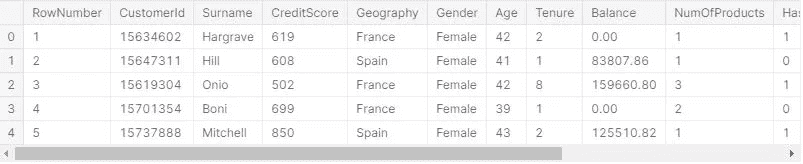

我们可以看到我们的数据集，但我们也希望确保数据是干净的，因此作为清理过程的一部分，我们会查看缺失的值和数据类型。

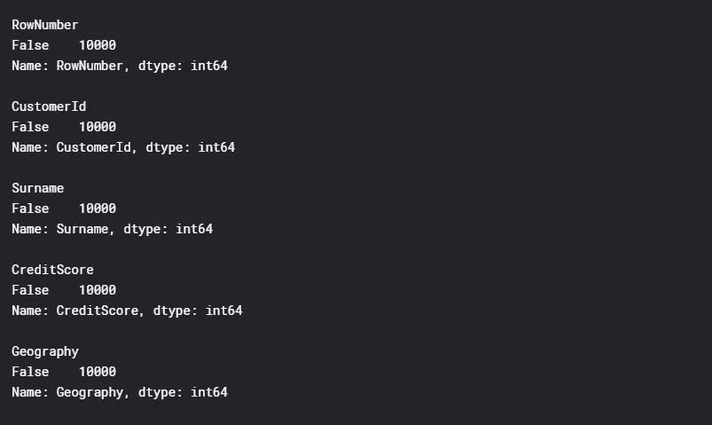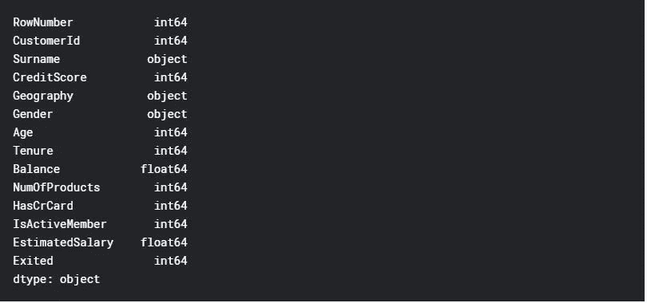

当我们查看统计数据时，我们看到我们客户的平均年龄为 39 岁，客户成为会员的平均月数为 5，预计平均工资为 10 万英镑。

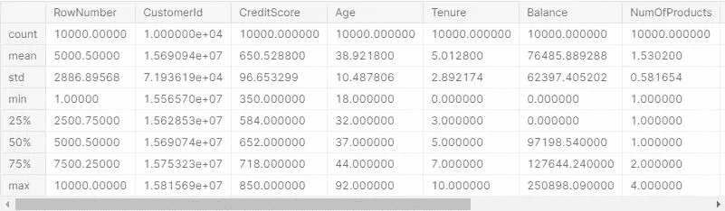

当我们观察预计薪资的性别和地理分布时，我们发现在法国和西班牙，男性客户的预计平均薪资高于女性，而在德国，女性客户的预计平均薪资更高。

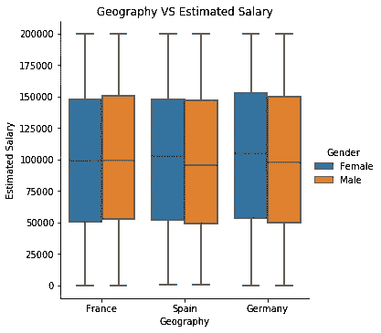

当我们看年龄和信用评分之间的关系时，为了明确定义相关性，线性关系非常弱。

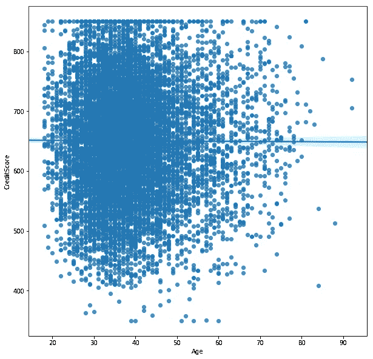

基于我们的基本探索性分析，我们可以定义重要的客户属性，这些属性可以为我们提供最佳的洞察力，以便预测可能流失的客户类型。我们可以继续这一分析来回答一些基本问题，例如，“较低的估计工资会增加流失率吗？”或者“较低的信用评分会增加客户流失率吗？”诸如此类。我们可以用不同的方式对数据集进行分组和汇总，以从客户属性中获得更多的洞察力。我们将在下一个数据集中深入探讨这些问题。现在，让我们开始考虑预测哪些客户会流失。

在这种情况下，我们可以将目标(响应)变量标记为客户流失。这意味着我们可以创建一个分类模型，并执行不同的算法方法，如决策树、随机森林、逻辑回归或支持向量机。当谈到机器学习模型时，我们寻找两个主要条件；1-特征集的正态分布，2-特征集的相同尺度。

在这个数据集中，我们可以选择信用评分，地理位置，性别，年龄，任期和估计工资属性作为特征集，流失作为目标变量。

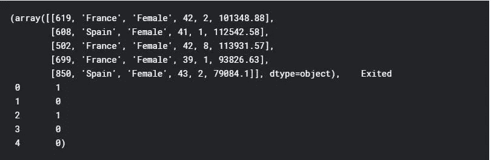

我们必须确保将分类变量更新为数字变量，因为我们将应用的机器学习技术要求所有客户属性都是数字的。

我们可以进一步随机地将我们的数据集分为训练和测试数据集，以便用训练数据集拟合我们的模型，并用测试数据集测试预测。其思路是用训练数据集训练模型，用测试数据集测试预测。如果我们不使用训练和测试数据集，而是使用整个数据集，该算法将只对我们的数据集进行准确的预测，而不会对任何新的数据进行预测。

在此数据集中，让我们使用 DecisionTreeClassifier 和 RandomForestClassifier 来创建我们的模型和预测，进一步评估它们，看看哪一个更好。

根据度量评估，虽然决策分类器模型有 73%的预测是准确的，但 RandomForestClassifier 模型有 82%的预测是准确的。在这种情况下，我们更喜欢使用随机森林。

当我们观察流失和未流失客户的分布时，我们看到数据是公正的。这意味着我们不能仅仅依赖预测模型的准确性度量分数。让我们看看**第二个客户数据集**，看看我们是否可以做更好的分析和预测模型。

这次，我们将查看一家电信公司及其现有的客户属性，例如他们当前的计划、费用、所在州的位置、客户服务呼叫量、客户时长和客户流失率。

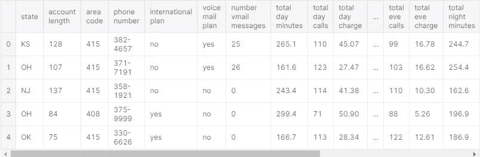

数据集中没有缺失数据，并且数据类型正确。让我们看看分类值和它们的独特值。

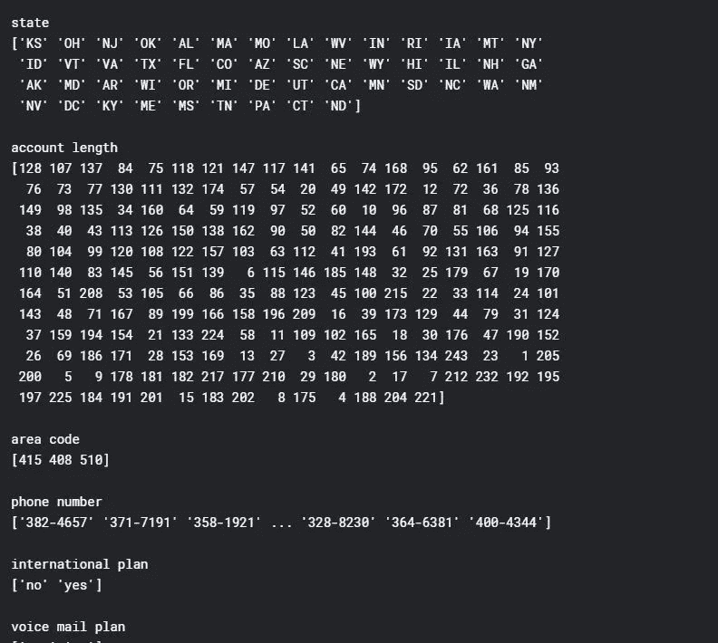

当我们查看州和流失率时，我们看到加利福尼亚州和新泽西州是流失率最高的州。

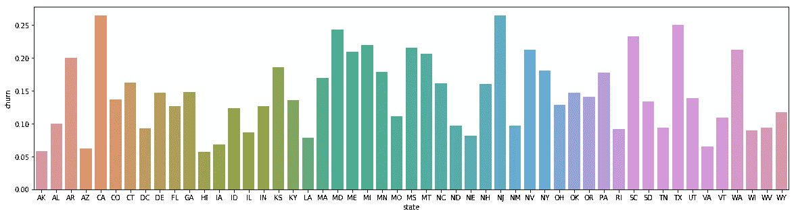

我们还发现，国际计划客户的流失率较高，而语音邮件计划客户的流失率较低。

留在公司的顾客比离开公司的顾客多得多。如果您还记得之前对信用卡公司的分析，这意味着数据中的不平衡，并对预测模型的开发产生影响。(我们之前没有提到的一个重要方面是，我们没有使用电话号码、客户 id 或账号等唯一标识符来选择功能。)

糟糕的客户服务是客户流失的众所周知的原因之一。在我们的案例中，我们可以看到客户服务呼叫量和客户流失率之间存在很强的正线性关系。

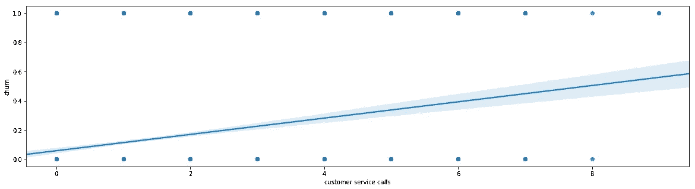

有了这个数据集，让我们开发多个不同的模型，并对它们进行评估，看看哪一个最适合解决我们的客户流失业务问题。

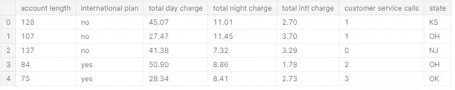

与之前的信用卡客户数据集类似，我们需要执行预处理，并将分类变量更新为数值变量，以便创建我们的模型。

现在，我们准备分割数据集来训练/测试和创建我们的模型。先说随机森林。

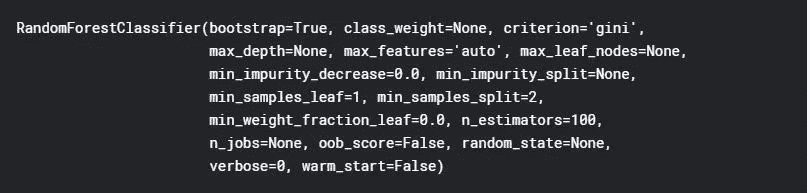

我们为预测电信公司客户流失而创建的随机森林模型的准确率为 0.89。然而，我们应该进一步分析这一点，因为数据是公正的。

我们可以查看其他评估指标，如交叉验证矩阵，它将为我们提供真阳性、假阳性、真阴性和假阴性的数量、精确度、召回率和 f1 分数。通过查看哪些特征对预测贡献最大，我们还可以了解我们可以做些什么来改进模型。

该模型预测 560 个真阴性，13 个假阳性，54 个假阴性，40 个真阳性。

当我们用随机森林分类器评估模型时，我们看到:

精确度分数是 0.729

回忆分数是 0.372

ROC 曲线如下:

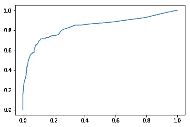

AUC 分数(roc 曲线下的面积)是 0.83，f1 分数是 0.49。

我们还发现，为了从模型中获得最佳性能，我们需要将 n 估计量设置为 30。(目前，我们的模型使用 100)

我们可以进一步查看特征的重要性，看看哪些特征对预测的影响最大。

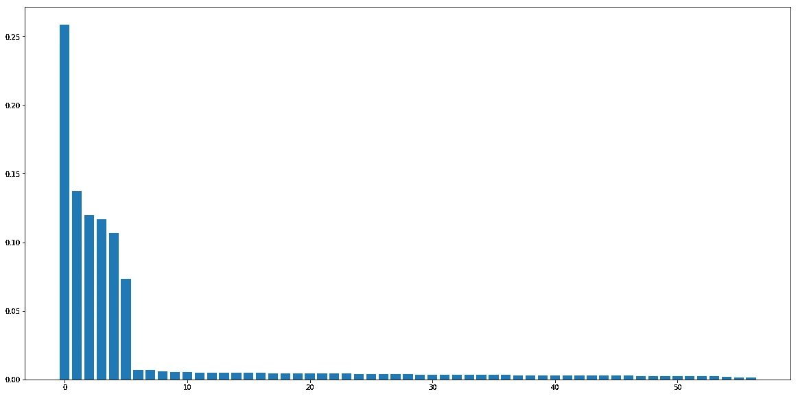

最重要的是，我们可以明确地从模型中移除状态。

让我们使用支持向量机创建另一个模型。

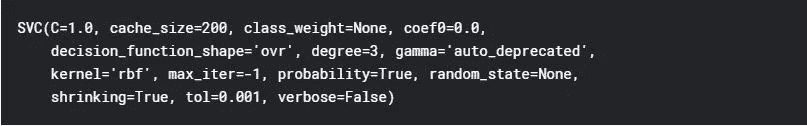

当我们创建模型并查看准确性时，我们已经看到支持向量机的准确性分数低于随机森林分类。

当我们创建模型并查看准确性时，我们已经看到支持向量机的准确性分数低于随机森林分类。

该模型预测 567 个真阴性，6 个假阳性，83 个假阴性，11 个真阳性。尽管假阳性计数略有下降，但与 RandomForestClassifier 相比，真阳性明显较少。

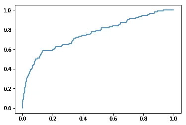

精确度分数(0.647)和召回分数(0.11)都比随机分类器低得多。roc 曲线下面积(auc)为 0.83，与随机森林分类器相同。支持向量机的最佳选择度是 1。(当前设置为默认值 3)。

基于我们创建的两个预测模型，我们用随机森林分类器创建的第一个模型将是更好的选择。我们还可以调整这个模型，并通过更新 n_estimator 和从特征集中删除状态变量来改进它，以便更好地预测。

借助现有的数据消费者洞察，公司可以预测客户可能的需求和问题，针对他们制定适当的战略和解决方案，满足他们的期望并保留他们的业务。基于预测分析和建模，企业可以通过细分和提供定制的解决方案，有针对性地集中注意力。分析客户在使用服务的生命周期中流失是如何发生的以及何时发生的，将使公司能够采取更多先发制人的措施。