# 利用分类建模预测客户流失

> 原文：<https://towardsdatascience.com/customer-churn-analysis-eda-a688c8a166ed?source=collection_archive---------15----------------------->

## 第 1 部分:探索性数据分析

在今天的商业世界里，竞争是激烈的，每个顾客都是有价值的。理解客户是最重要的，包括能够理解客户的行为模式。**客户流失率**是商业客户(在 SaaS 平台上非常普遍)离开商业业务并把钱带到别处的比率。了解客户流失对公司的成功至关重要，而流失分析是了解客户的第一步。

由[粘土银行](https://unsplash.com/@claybanks?utm_source=medium&utm_medium=referral)在 [Unsplash](https://unsplash.com?utm_source=medium&utm_medium=referral) 上拍摄

我决定从一个 [Kaggle 数据集](https://www.kaggle.com/blastchar/telco-customer-churn/kernels?sortBy=hotness&group=everyone&pageSize=20&datasetId=13996&language=Python)中执行客户流失分析，该数据集给出了一家电信公司(Telcom)的客户信息数据，试图更好地了解他们的客户流失可能性。虽然我们最终将构建一个分类模型来预测客户流失的可能性，但我们必须首先深入探索数据分析(EDA)流程，以更好地了解我们的数据。包含代码和笔记本的 Github 库可以在[这里](https://github.com/andrewcole33/telco_churn_analysis)找到。

# 数据

如上所述，数据来源于 Kaggle。在我们的数据集中，我们有 7043 行(每行代表一个唯一的客户)和 21 列:19 个特征，1 个目标特征(客户流失)。数据由数字和分类特征组成，因此我们需要分别处理每种数据类型。

**目标:**

*   客户流失—客户是否流失(是，否)

**数字特征:**

*   任期——客户在公司工作的月数
*   月度费用—每月向客户收取的费用
*   总费用——向客户收取的总费用

**分类特征:**

*   CustomerID
*   性别—男/女
*   老年人—客户是否是老年人(1，0)
*   合作伙伴—客户是否有合作伙伴(是，否)
*   受抚养人——客户是否有受抚养人(是，否)
*   电话服务—客户是否有电话服务(是，否)
*   多条线路—客户是否有多条线路(是，否，无电话服务)
*   互联网服务—客户的互联网服务类型(DSL、光纤、无)
*   在线安全—客户是否有在线安全插件(是、否、无互联网服务)
*   OnlineBackup —客户是否有在线备份插件(是、否、无互联网服务)
*   设备保护—客户是否有设备保护附件(是、否、无互联网服务)
*   技术支持—客户是否有技术支持附加服务(是、否、无互联网服务)
*   流媒体电视—客户是否有流媒体电视(是，否，无互联网服务)
*   流媒体电影—客户是否有流媒体电影(是，否，无互联网服务)
*   合同—客户合同的期限(每月、1 年、2 年)
*   无纸账单—客户是否有无纸账单(是，否)
*   支付方式—客户的支付方式(电子支票、邮寄支票、银行转账(自动)、信用卡(自动))

# 目标

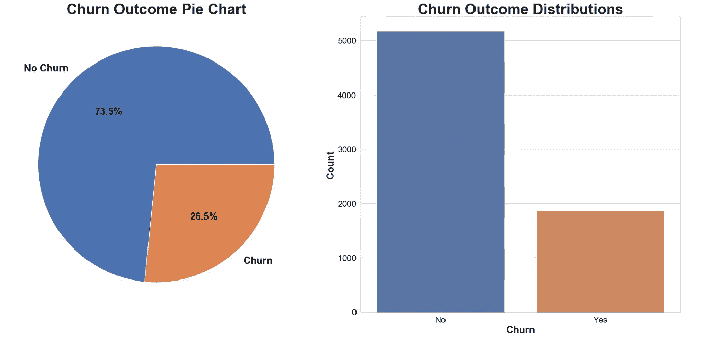

我们可以从左边的饼图中看到，我们的数据集中大约有 27%的电信客户最终会流失。这看起来确实是一个相当高的数字，但是由于我不在电信公司工作，也没有电信领域知识的经验，我将只考虑它的价值，而不会过多地考虑它。由于这是我们的目标变量，我们将在大多数变量的 EDA 中使用 Churn 作为一个元素。

# 数字特征

使用数字特征时，我们可以查看的最具信息性的统计数据之一是数据的分布。我们将使用一个核密度估计图来显示相关变量的概率分布。此图将向我们展示新数据点落在数据集上的可能性最大的位置。我们将为所有数字要素创建一个 KDE。

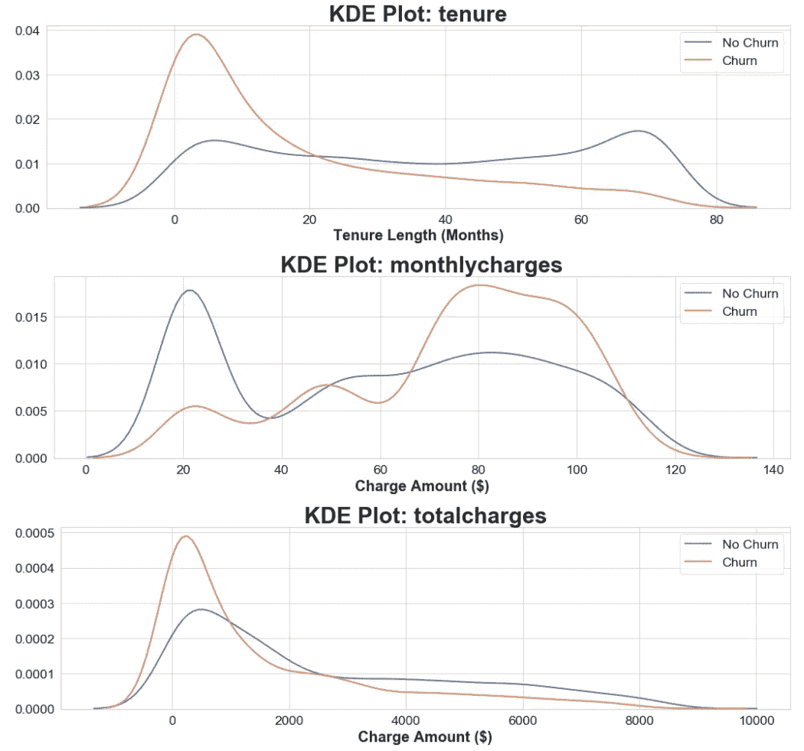

为了以稍微不同的方式查看我们的数据以获得更多的信息，并且因为“任期”由月份表示，这可能是一个 bi 噪音，我决定根据他们的任期对客户进行分组。

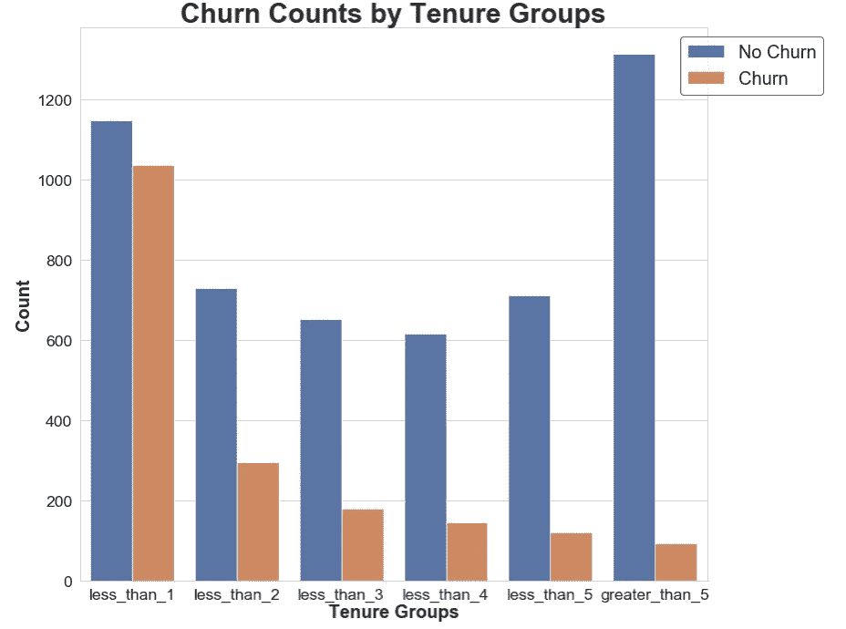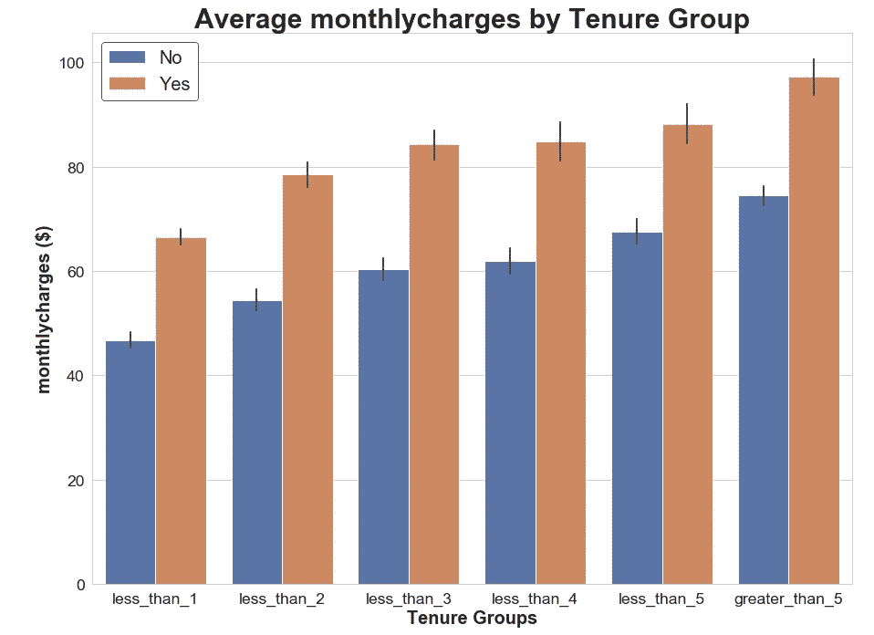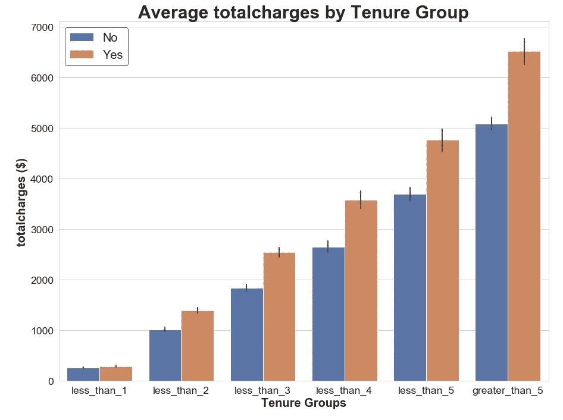

**结论:**

*   客户流失最有可能发生在任期的 20 个月之前。
*   流失的客户最有可能每月收费超过 60 美元。
*   一般来说，随着月费的增加，客户流失的可能性也会增加
*   总费用的分布非常普遍，因此我们将重点关注“每月费用”的显著性

# 分类特征

## 性别

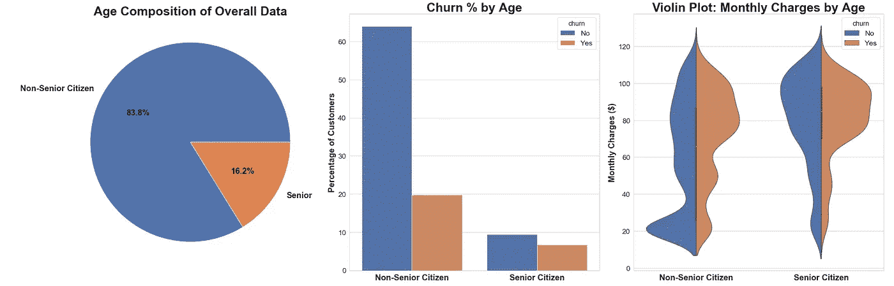

**结论:**

*   我们的数据中，老年人明显少于非老年人
*   *总的来说，*更多的非老年人会比老年人流失
*   老年公民比非老年公民流失的比例更高
*   一旦月费超过 60 美元，老年人和非老年人都开始流失
*   非老年人最有可能每月收费 20 美元左右
*   与老年人相比，非老年人在每月收费低于 60 美元的情况下更容易流失

## 合作伙伴和家属

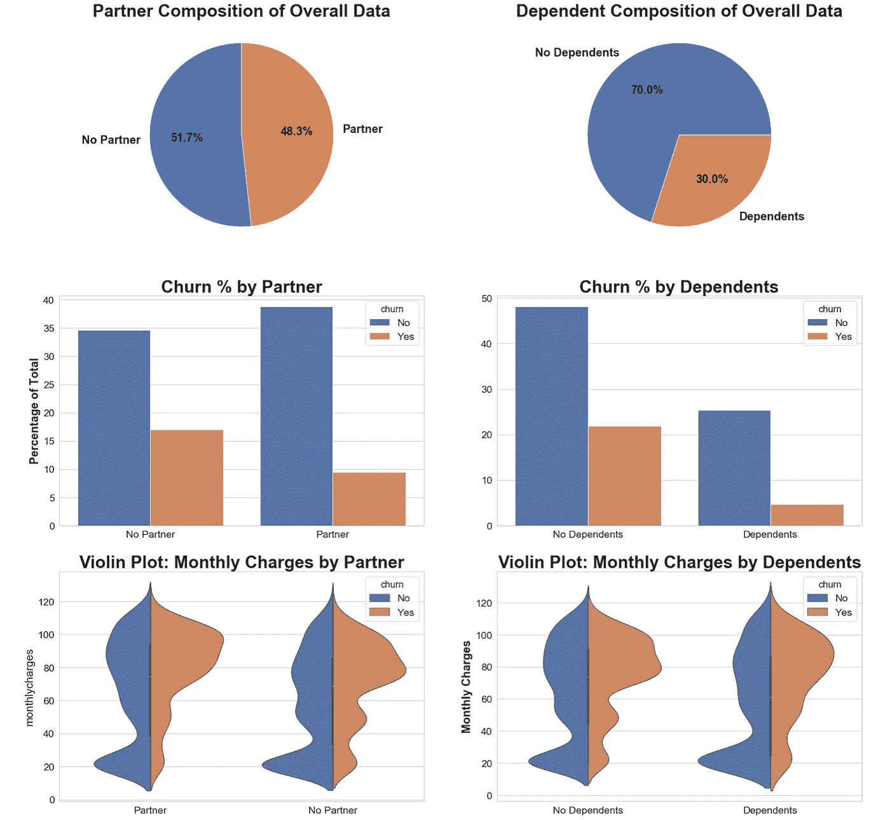

**结论:**

*   对于有合作伙伴的客户，数据集是分开的
*   那些没有伴侣的人比那些有伴侣的人流失率略高
*   没有家眷的客户比有家眷的客户流失率略高
*   对于合作伙伴价值和从属价值而言，流失和不流失客户的月费用非常相似

## 电话服务和线路数量

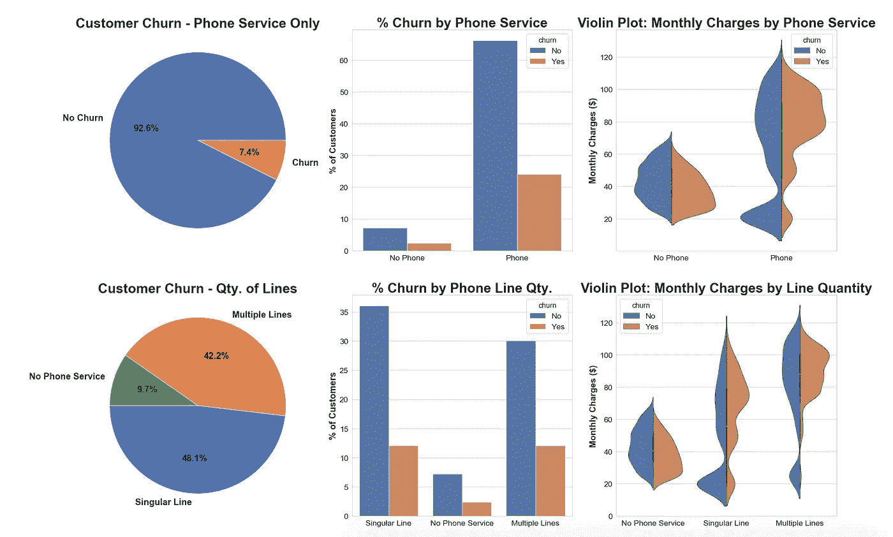

**结论:**

*   只有电话服务的客户不会比其他客户流失更多
*   只有电话服务的人 25%的时间会流失
*   使用电话服务的客户只需支付更高的月平均费用
*   拥有多条线路的客户与拥有单一线路的客户的流失率大致相同
*   拥有多条电话线的用户比拥有单一电话线的用户更频繁地支付更高的月费

## 互联网服务

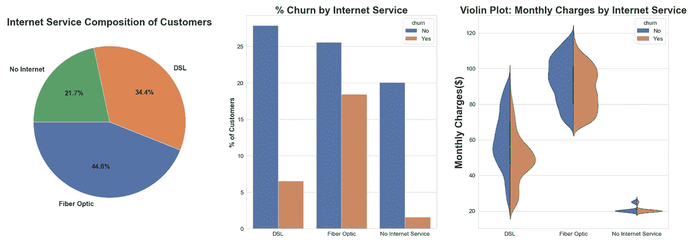

**结论:**

*   光纤是最受欢迎的互联网选择
*   光纤互联网客户流失率远远高于 DSL 或无互联网客户
*   光纤是一项非常昂贵的服务，当客户拥有这项服务时，他们的流失率会比没有这项服务时稍高
*   当 DSL 用户的月费用在 40 到 60 美元之间时，他们最有可能流失。

## 附加服务

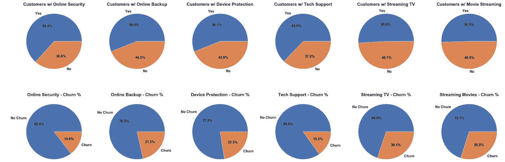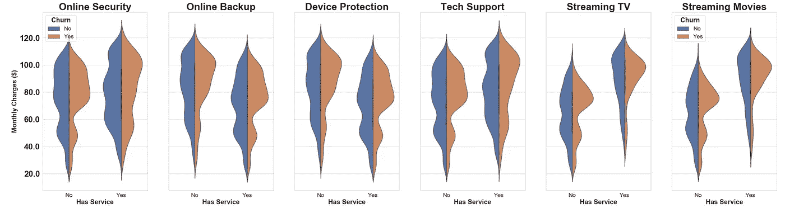

**结论:**

*   拥有电视流媒体和/或电影流媒体服务的客户比所有其他附加服务的客户流失更多
*   大多数类别的客户流失率将在每月 100 美元左右达到峰值

## 契约

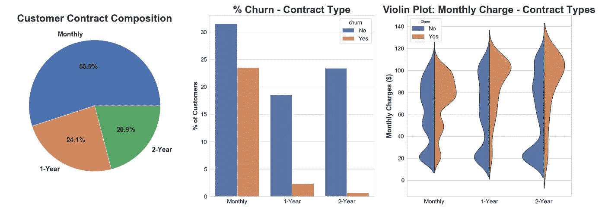

**结论:**

*   超过一半的顾客选择每月付款
*   越来越多的客户因月度计划而流失
*   计划越长，流失率越低
*   合同时间越长，月费通常越高

## 无纸化账单和支付

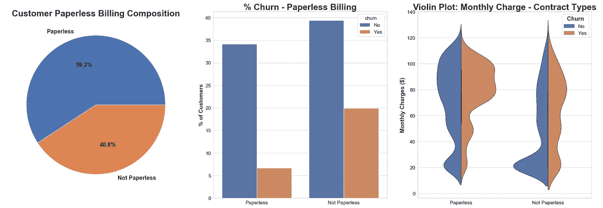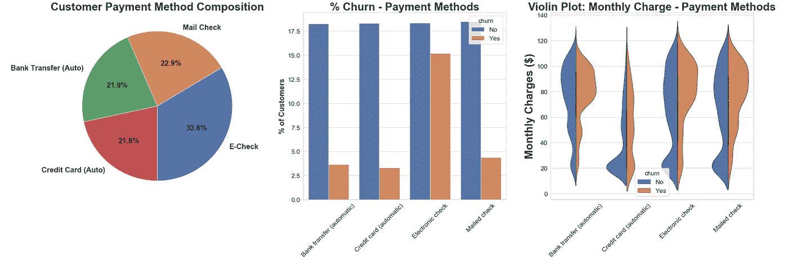

**支付结论:**

*   非无纸化计费的客户流失率比无纸化客户高出近 15%
*   当每月价格低于 60 美元时，无纸客户的流失率与非无纸客户相似，一旦超过 60 美元，无纸客户的流失率就比非无纸客户高
*   使用电子支票支付的客户流失率比使用所有其他支付方式的客户高出 10%
*   无论月费多少，用信用卡支付的顾客都有稳定的流失率，而用银行转账、电子支票或邮寄支票支付的顾客，一旦月费超过 60 英镑，他们的流失率就会上升。

# 后续步骤

因此，我们刚刚浏览了数据集的每个要素，并探索了每个要素的至少几个不同方面。正如任何项目中的 EDA 一样，总是有更多的方法来处理数据集以继续学习。与任何数据科学项目一样，拥有业务领域和底层数据理解的坚实基础至关重要。既然我们已经看了关键特征和它们相互作用的方式，我们可以开始构建我们的分类模型了。看看我的下一篇[博客](/predicting-customer-churn-using-logistic-regression-c6076f37eaca)来看看它的实际效果吧！