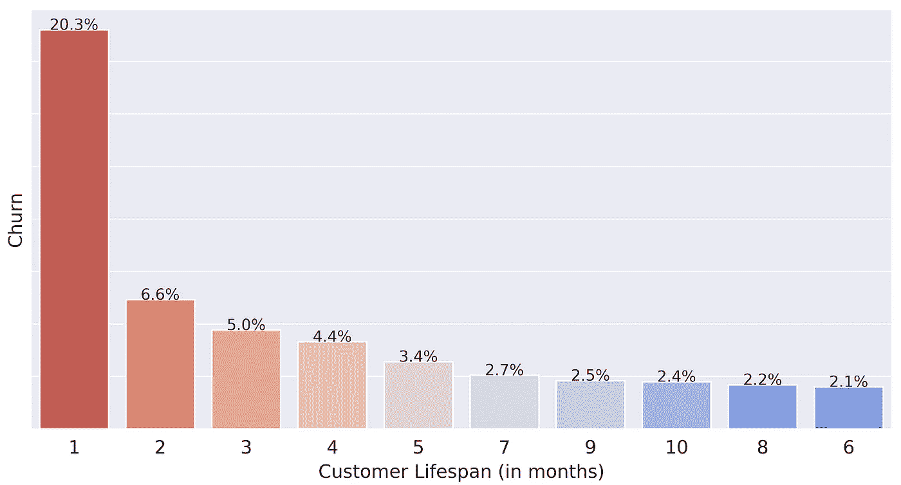
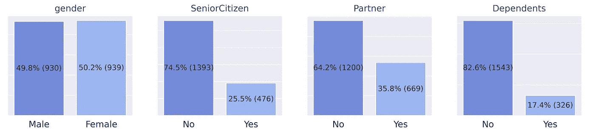
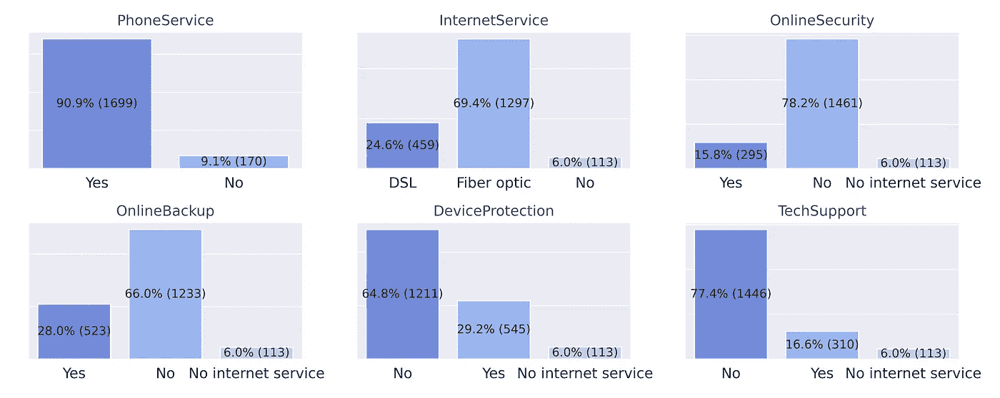
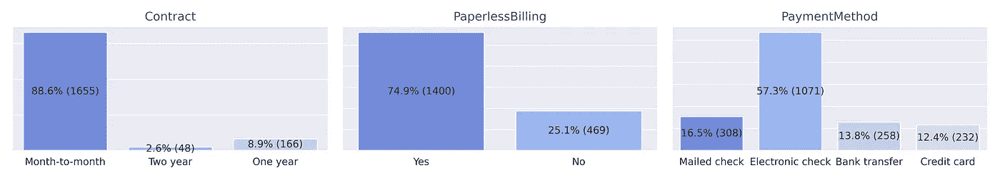
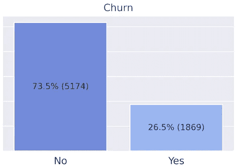
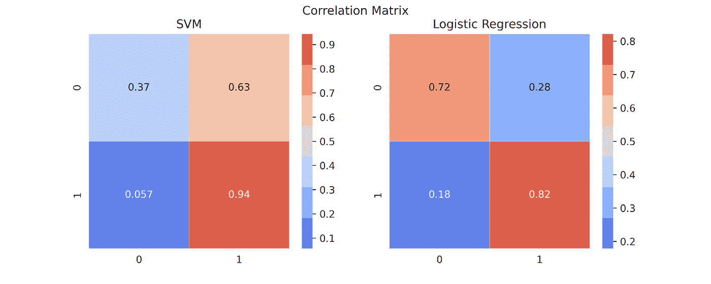

# 电信领域的客户流失

> 原文：<https://towardsdatascience.com/customer-churn-in-telecom-segment-5e49356f39e5?source=collection_archive---------7----------------------->

快门架

## 开发用于流失预测的机器学习模型

公司通常更关注客户的获取，而把留住客户放在第二位。然而，吸引一个新客户的成本是留住一个现有客户的五倍。根据贝恩公司的研究，T2 的客户保持率提高 5%，T4 的利润会增加 25%到 95%。

客户流失是一项指标，显示**客户停止与某家公司或某项服务进行**交易，也称为客户流失。通过遵循这一指标，大多数企业可以做的是试图了解流失数字背后的原因，并通过**反应行动计划解决这些因素。**

但是，如果你能提前知道某个特定的客户**可能会离开你的企业**，并有机会**及时采取适当的行动**以防止其发生，那该怎么办？

导致客户做出**取消决定**的原因可能很多，包括服务质量差、客户支持延迟、价格、新的竞争对手进入市场等等。通常，没有单一的原因，而是一系列事件的组合，最终导致顾客的不满。

如果你的公司不能**识别这些信号**并在点击取消按钮之前采取行动，就没有回头路了，你的客户已经走了。但是你还有一些有价值的东西:**数据**。你的顾客留下了很好的线索，让你知道你的需求在哪里。它可以成为有意义的见解的宝贵来源，并培训客户流失模型。从过去学习，并且**手头有战略信息**到**改善未来经验**，这都是关于**机器学习的。**

说到电信领域，这里有巨大的机会空间。运营商收集的**财富**和**数量的客户数据**可以为从**被动**转变为**主动**做出很大贡献。复杂的人工智能和数据分析技术的出现进一步帮助**利用这些丰富的数据**以更加有效的方式解决客户流失问题**。**

在本文中，我将使用一个匿名运营商的客户群数据集，由平台 IBM 开发者提供。该数据集总共包含 7，043 个客户和 21 个属性，来自个人特征、服务签名和合同细节。在这些条目中，5，174 个是活跃客户，1，869 个是不稳定客户，这表明数据集非常不平衡。该评估的目标变量将是特性`Churn`。

主要目标是开发一个机器学习模型，能够根据客户的可用数据预测客户流失。对于这个实现，我将主要使用 Python、 [Pandas](https://pandas.pydata.org/) 和 [Scikit-Learn](https://scikit-learn.org/stable/) 库。完整的代码你可以在我的 [GitHub](https://github.com/mmcuri/ds_handson) 上找到。

为此，我将完成以下步骤:

*   探索性分析
*   数据准备
*   训练、调整和评估机器学习模型

# 探索性分析

由于本实验的目的是**识别可能导致客户流失的模式**，我将主要关注数据集的流失部分，以进行探索性分析。

客户生命周期(以月为单位)由特征`Tenure`表示，客户流失率由特征`Churn`表示，这是本实验的目标变量**。下面的柱状图可以很好地揭示客户流失在客户生命周期中的分布情况。**

我们可以看到，**最大的大多数客户**在第一个月取消或不续订，总计 20.3%的客户退出。这种高费率的原因可能是糟糕的首次体验、试用期或预付费帐户，如果在预定义的期限内没有充值，这些帐户将自动过期。

继续分析数据集的变动部分，我现在将重点关注分类特征和**它如何将**与目标特征`Churn`关联起来。为此，我将特性分为三组:个人属性、订阅的服务和合同属性。

## 个人属性

数据集上可用的个人属性有:`Gender, SeniorCitizen, Partner, Dependents`。下图可以提供一些有意义的见解，例如:

*   没有家眷的客户流失的可能性是普通客户的四倍
*   老年人流失的可能性降低了三倍
*   伴侣离开的可能性几乎减少了两倍

流失客户的个人属性

## 服务属性

这组功能表明客户订购了哪种服务，或者是否不适用。这个群体聚集的特征列表`PhoneService, MultipleLines, InternetService, OnlineSecurity, OnlineBackup, DeviceProtection, TechSupport, StreamingTV and StreamingMovie`。

下图显示了可以注意到的类别之间**高差异**的特征。它提供了关于客户更有可能使用哪种运营商服务的见解:

*   取消订购的大多数客户都启用了电话服务
*   使用光纤*网络服务的客户比使用 DSL*的客户更有可能取消**
*   没有启用在线安全、设备保护、在线备份和技术支持服务的客户更有可能离开

流失客户的服务属性

## 合同属性

这组特征表明了合同方面并收集了属性`Contract, PaperlessBilling`和`PaymentMethod.`下面的图表提供了关于可能使订户更容易流失的合同方面的见解:

*   大多数取消订阅的客户都启用了*逐月*合同类型和无纸化计费
*   使用电子支票付款方式的顾客更有可能离开

流失客户的合同属性

# 数据准备

## 不平衡数据

将用于 ML 模型训练的目标变量将是`Churn`。我们需要确保两个`Churn`类(‘Yes’和‘No’)具有相等的分布，否则，它会在模型中引入偏差。

流失率

从左侧的图表中，我们可以看到数据集非常不平衡，包含 73.5%的“否”条目(表示活跃账户)，而 26.5%的“是”条目(表示失败账户)。

有不同的[技术来处理不平衡数据](/methods-for-dealing-with-imbalanced-data-5b761be45a18)。在这个特殊的例子中，我使用了**欠采样**，简单地说，这意味着移除大多数类的一些观察值。之后，条目的数量平均分布在训练数据集的每个类中的 1，406 次出现中。

## 特征编码

机器学习算法只能读取**数值**。因此，数据准备的一个重要部分是将分类特征编码成数值，这个过程称为特征编码。

对于只有两个类(二进制)的分类特征，比如`gender`、`SeniorCitizen`、`Partner`、`Dependents`、`PhoneService`和`PaperlessBilling`，我使用了 Scikit-Learn 的 [LabelEncoder](https://scikit-learn.org/stable/modules/generated/sklearn.preprocessing.LabelEncoder.html) ，这是一个实用程序类，用于帮助标准化标签，使它们只包含 0 和 n_classes-1 之间的值。

当涉及到具有两个以上类别的分类特征时，例如`MultipleLines`、`InternetService`、`OnlineSecurity`、`OnlineBackup`、`DeviceProtection`、`TechSupport`、`StreamingTV`、`StreamingMovies`、`Contract`和`PaymentMethod`，我使用了方法[从 Pandas Dataframe 中获取 _dummies](https://pandas.pydata.org/pandas-docs/stable/reference/api/pandas.get_dummies.html) ，该方法将分类变量转换为哑变量/指示变量。

## 分割训练和测试数据

订户的数据集被分成 75%用于训练，25%用于测试。当**暴露于新数据时，训练集将用于生成所选算法将使用的模型。**测试集是我将接触的最终数据集，用于根据一些指标测量**模型性能**。

# 训练、调整和评估机器学习模型

## 韵律学

对于客户流失问题，理想的衡量标准是[召回](https://developers.google.com/machine-learning/crash-course/classification/precision-and-recall)。Recall 回答以下问题:正确识别出**实际阳性**的比例是多少？在这种情况下，召回衡量的是在所有搅动中被正确分类的**搅动**的百分比，这也是我们在分析 ML 分类器的性能时所要寻找的。

例如，考虑一个免费赠送 1 GB 数据使用量的再参与活动。您可能希望确保这份额外礼物的精确度很高。换句话说，你会想尽可能减少将获得奖金的快乐用户的数量，而不是让这种奖金几乎只击中处于危险中的用户。

## 模型

在这个实验中，我应用了四种不同的 ML 算法来分析和比较它们各自获得的召回分数。下面列出了这些:

*   [决策树分类器](https://scikit-learn.org/stable/modules/generated/sklearn.tree.DecisionTreeClassifier.html?highlight=decision%20tree#sklearn.tree.DecisionTreeClassifier)
*   [支持向量机](https://scikit-learn.org/stable/modules/svm.html)
*   [逻辑回归](https://scikit-learn.org/stable/modules/generated/sklearn.linear_model.LogisticRegression.html)
*   [XGBoost](https://xgboost.readthedocs.io/en/latest/)

为了比较它们的性能，作为第一步，我应用了[交叉验证](https://scikit-learn.org/stable/modules/cross_validation.html)方法，这是一种将数据划分为子集的技术，在一个子集上训练数据，并使用另一个子集来评估模型的性能。表现最好的是 SVM (0.78 回忆分数)和物流回归(0.79 回忆分数)。但仍有优化的空间。

## 通过超参数调谐

为了提高整体性能，在谈到[召回](https://developers.google.com/machine-learning/crash-course/classification/precision-and-recall)指标时，我使用[网格搜索](https://scikit-learn.org/stable/modules/generated/sklearn.model_selection.GridSearchCV.html?highlight=grid%20search#sklearn.model_selection.GridSearchCV)为 [SVM](https://scikit-learn.org/stable/modules/svm.html) 和[逻辑回归](https://scikit-learn.org/stable/modules/generated/sklearn.linear_model.LogisticRegression.html)调整了分类器超参数。

最有表现力的**改进来自 [SVM](https://scikit-learn.org/stable/modules/svm.html) 车型，从 0.78 变为 0.93。这意味着基于 SVM **实施的 ML 模型在预测客户流失时提供了 94%的精确度。**另一方面，它的**误报率很高**，这意味着 63%的满意客户可能被错误地预测为流失。这些结果可以在下面的相关矩阵中看到，其中 1 表示流失，0 表示不流失。**

SVM 和逻辑回归分类器的相关矩阵

[逻辑回归](https://scikit-learn.org/stable/modules/generated/sklearn.linear_model.LogisticRegression.html)模型经过调整后略有改善，召回分数从 0.79 提高到 0.82。尽管如此，它的误报率更低。**实际上，这意味着你**将能够吸引 82%的客户，而这些客户将会流失**，但你将会错过另外的 18%。此外，你可能有 28%的人被错误地预测为搅动。**

**根据重新参与活动的情况，锁定有流失风险的**尽可能多的**客户，同时无意中接触到一些满意的客户，这可能是一个**良好的权衡**，而不是在没有采取适当行动的情况下让大量客户取消。**

# **结论**

**没有哪种算法能 100%准确地预测客户流失。在精确度和召回率之间总会有一个权衡。这就是为什么测试和理解每个分类器的优点和缺点并充分利用它们是很重要的。**

**如果目标是吸引和接触客户以防止他们搅动，与那些被错误标记为“没有搅动”的人接触是可以接受的，因为这不会造成任何**负面影响**。这可能会让他们对这项服务更加满意。如果对其产生的有意义的信息采取适当的行动，这是一种可以从第一天起**增加价值**的模型。**

# **感谢您的宝贵时间！**

**我希望这个项目能有助于你的目标。如果你有任何问题或任何类型的反馈，请随时在 [LinkedIn](https://www.linkedin.com/in/mmcuri/) 上联系我，并在 [GitHub](https://github.com/mmcuri/ds_handson) 上查看我的其他项目。**