# 使用 PySpark 预测音乐流中的客户流失

> 原文：<https://towardsdatascience.com/customer-churn-prediction-within-music-streaming-using-pyspark-a96edd4beae8?source=collection_archive---------45----------------------->


[Unsplash](https://medium.com/u/2053395ac335?source=post_page-----a96edd4beae8--------------------------------) 照片由 [Cezar Sampaio](https://unsplash.com/photos/IJthre6PHHQ) 拍摄

音乐流媒体业务**的关键是识别可能流失的用户，即有可能从付费和免费订阅降级到取消服务的用户。**如果一家音乐流媒体公司提前准确地识别出这些用户，他们可以向他们提供折扣或其他类似的激励措施，从而节省数百万美元的收入。众所周知，获得一个新客户比留住一个现有客户的成本更高。这是因为回头客可能会在你公司的产品和服务上多花 67%的钱。

# 1.1 项目概述

我们希望 ***确定可能会取消其帐户并离开服务*** 的用户。我们在这个项目中的目标是帮助一个虚构的企业(类似于 Spotify 和 Pandora)，方法是建立和训练一个二进制分类器，该分类器能够根据从用户过去的活动和与该服务的交互中获得的模式，准确识别取消音乐流媒体服务的用户。

*   定义流失变量: **1** —在观察期内取消订阅的用户，以及 **0** —始终保持服务的用户

由于数据集的规模，该项目是通过利用 Apache Spark 分布式集群计算框架功能，使用 Python API for Spark，PySpark 来实施的。

# 1.2 加载数据

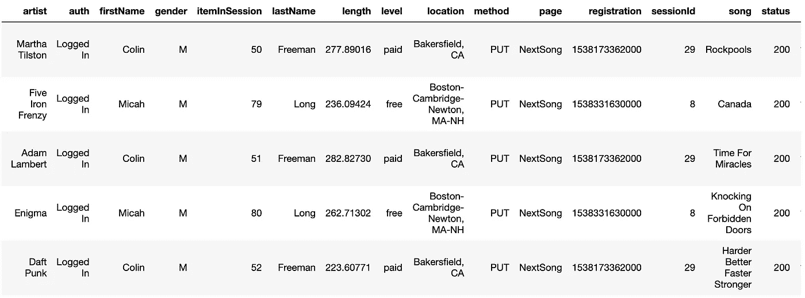

```
**# import libraries**from pyspark import SparkContext, SparkConf
from pyspark.sql import SparkSession
from pyspark.sql import Window
from pyspark.sql.functions import udf, col, concat, count, lit, avg, lag, first, last, when
from pyspark.sql.functions import min as Fmin, max as Fmax, sum as Fsum, round as Fround
from pyspark.sql.types import IntegerType, DateType, TimestampTypefrom pyspark.ml import Pipeline
from pyspark.ml.feature import VectorAssembler, Normalizer, StandardScaler
from pyspark.ml.regression import LinearRegression
from pyspark.ml.classification import LogisticRegression, RandomForestClassifier, GBTClassifier
from pyspark.ml.clustering import KMeans
from pyspark.ml.tuning import CrossValidator, ParamGridBuilder
from pyspark.ml.evaluation import BinaryClassificationEvaluator,**# create a Spark session**
spark = SparkSession \
.builder \
.appName(‘CustomerChurn’) \
.getOrCreate()**# Check Spark configuration**
spark.sparkContext.getConf().getAll()path = "mini_sparkify_event_data.json"
df = spark.read.json(path)
```

# 2.数据理解

该数据集包含 2018 年 10 月 1 日至 2018 年 12 月 1 日期间记录的用户活动日志。完整数据集包含大约 2600 万行/日志，而子集包含 286 500 行。完整的数据集收集了 22，277 个不同用户的日志，而子集仅涵盖 225 个用户的活动。子集数据集包含 58 300 个免费用户和 228 000 个付费用户。两个数据集都有 18 列，如下所示。

```
root
 |-- artist: string (nullable = true)
 |-- auth: string (nullable = true)
 |-- firstName: string (nullable = true)
 |-- gender: string (nullable = true)
 |-- itemInSession: long (nullable = true)
 |-- lastName: string (nullable = true)
 |-- length: double (nullable = true)
 |-- level: string (nullable = true)
 |-- location: string (nullable = true)
 |-- method: string (nullable = true)
 |-- page: string (nullable = true)
 |-- registration: long (nullable = true)
 |-- sessionId: long (nullable = true)
 |-- song: string (nullable = true)
 |-- status: long (nullable = true)
 |-- ts: long (nullable = true)
 |-- userAgent: string (nullable = true)
 |-- userId: string (nullable = true)
```

每个活动日志都属于一个特定的用户。数据集中的七列代表静态的**用户级信息**(对于属于特定用户的所有日志是固定的):

**艺术家:**用户正在听的艺术家
**userId** :用户标识；
**sessionId:** 标识服务的用户的单个连续使用时段的唯一 Id。多个用户可以使用相同的 sessionId
**名**:用户的名
**姓**:用户的姓
**性别**:用户的性别；2 类( *M* 和 *F* )
**位置**:用户位置
**userAgent** :用户访问流媒体服务使用的代理；57 不同类别
**注册**:用户的注册时间戳
**级别**(非静态):订阅级别；2 类(*免费*和*付费* )
**页面:**该事件生成时用户正在访问哪个页面。不同类型的页面将在下一节中详细介绍

**页面**列包含用户在应用程序中访问过的所有页面的日志。

```
>>> df.select('page').distinct().show(10)
+--------------------+
|                page|
+--------------------+
|              Cancel|
|    Submit Downgrade|
|         Thumbs Down|
|                Home|
|           Downgrade|
|         Roll Advert|
|              Logout|
|       Save Settings|
|Cancellation Conf...|
|               About|
+--------------------
```

根据执行的分析，仍然属于同一个会话的两个连续日志之间的最大时间似乎是一个小时。

```
# Explore the auth column
df.groupby('auth').count().show()+----------+------+
|      auth| count|
+----------+------+
|Logged Out|  8249|
| Cancelled|    52|
|     Guest|    97|
| Logged In|278102|
+----------+------+
```

我们还可以看到用户相当活跃，其中一个顶级用户总共列出了大约 8000 首歌曲。下面的图表表明，被搅动的用户通常来自加州和新泽西州，大多数付费用户正在离开音乐应用程序，而更多的男性比女性倾向于取消他们的订阅。加利福尼亚州和纽约州的人口往往更密集，因此可以预期更高的流失率和更高的整体参与度。从下图中很容易看出，所提供的 Sparkify 数据集是一个**不平衡数据集**的例子，因为与 174 相比，被搅动用户的份额仅略高于 20% (52)。

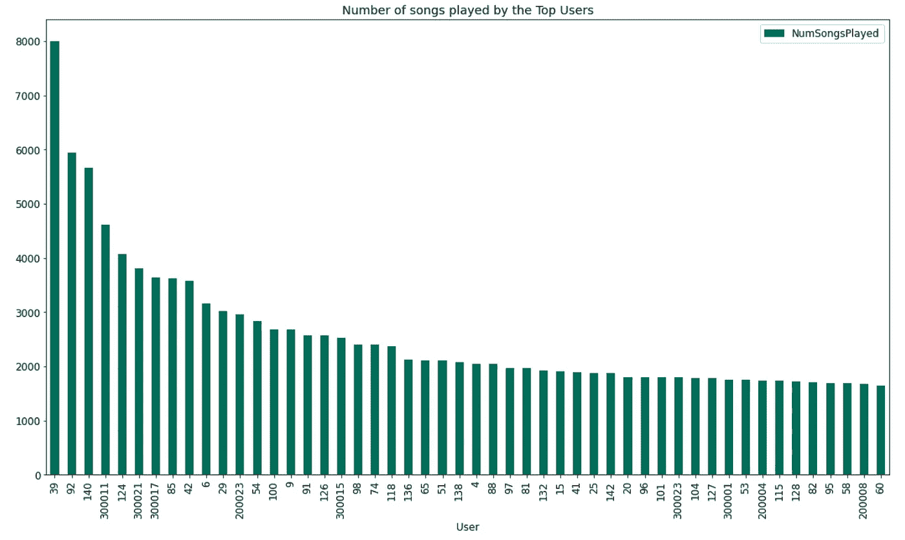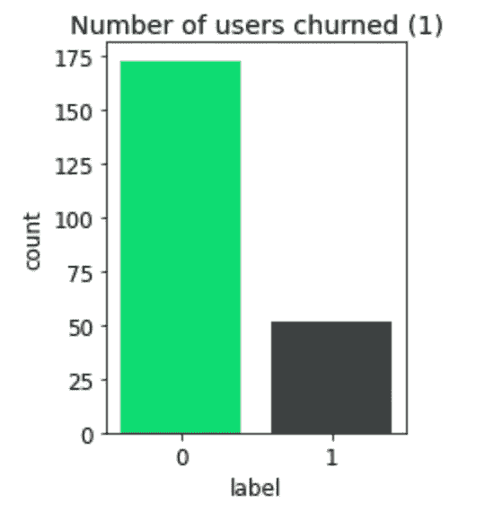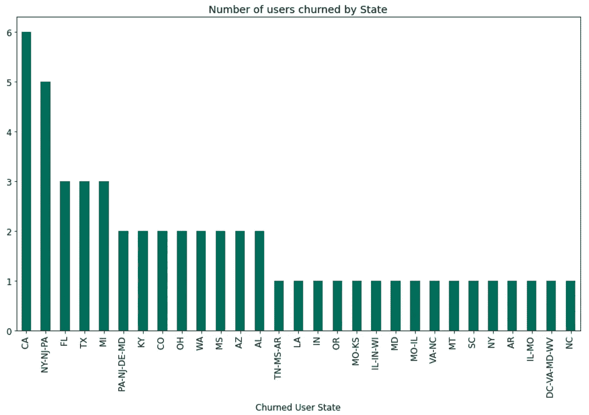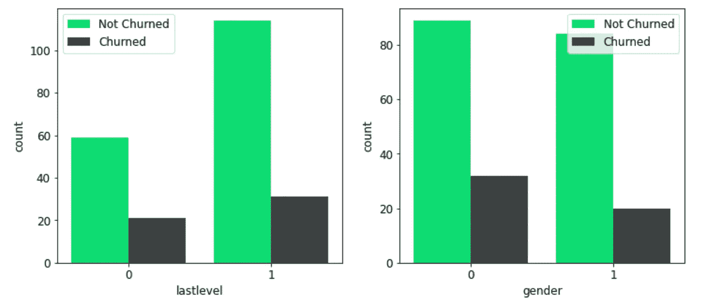

分类特征(last level 0-免费，1-付费；性别 0-男性，1-女性)

# 3.特征工程

首先，我们必须将原始数据集(每个日志一行)转换成具有用户级信息或统计数据的数据集(每个用户一行)。我们通过执行几个映射实现了这一点(例如，获取用户的性别、观察期的长度等。)和聚合步骤。

# 3.1 转换

对于 10 月 1 日之后注册的少数用户，注册时间与实际日志时间戳和活动类型不一致。因此，我们必须通过在*页面*列中查找*提交注册*日志来识别延迟注册。这一步并不简单，因为此类日志事件没有映射到任何*用户 Id* ，所以必须从*会话 Id* 信息中提取这些事件。

对于少数注册较晚的用户，观察开始时间被设置为他们第一次日志的时间戳，而对于所有其他用户，则使用默认的 10 月 1 日。

```
# Lag the page column
windowsession = Window.partitionBy('sessionId').orderBy('ts')
df = df.withColumn("lagged_page", lag(df.page).over(windowsession))windowuser = Window.partitionBy('userId').orderBy('ts').rangeBetween(Window.unboundedPreceding, Window.unboundedFollowing)# Identify users that registered after the start of observation, and infer the start date accordingly
df = df.withColumn("beforefirstlog", first(col('lagged_page')).over(windowuser))
df = df.withColumn("firstlogtime", first(col('ts')).over(windowuser))
df = df.withColumn("obsstart", 
                   when(df.beforefirstlog == "Submit Registration", df.firstlogtime).otherwise(obs_start_default))# For each log compute the time from the beginning of observation...
df = df.withColumn("timefromstart", col('ts')-col("obsstart"))
# ...and time before the end of observation
df = df.withColumn("timebeforeend", col('obsend')-col('ts'))
```

与上面类似的还有在默认观察期结束前取消服务的*用户，即所谓的被搅动用户。对于每个这样的用户，相应观察期的结束已经被设置为他/她的最后日志条目的时间戳，而对于所有其他用户，默认为 12 月 1 日。*

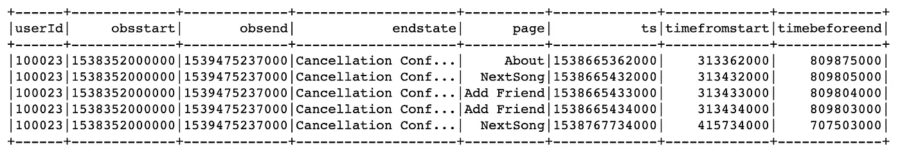

# 3.2 特征工程—汇总统计数据

新创建的**用户级数据集**包括以下栏目:

**lastlevel** :用户最后的订阅级别，转换为二进制格式(1 —付费层，0 —免费层)
**性别** : 性别，转换为二进制格式(1 —女性，
**obsstart，obsend** :用户特定观察期的开始和结束

**endstate** :用户在观察期内的最后一次交互
**nact** :用户在观察期内的总交互次数
**nsongs、ntbup、ntbdown、nfriend、nplaylist、ndgrade、nupgrade、nhome、nadvert、nhelp、nsettings、nerror** :播放的歌曲数、竖起大拇指、竖起大拇指向下拇指、添加的朋友、添加到播放列表的歌曲、降级、升级、主页访问

**nact_recent，nact_oldest:** 用户在观察窗最后一天和第一天 *k* 的活动，*分别为* **nsongs_recent，nsongs_oldest** :观察窗最后一天和第一天 *k* 播放的歌曲，*分别为*

```
# Aggregation by userId
df_user = df.groupby(‘userId’)\
.agg(
 # User-level features
 first(when(col(‘lastlevel’) == ‘paid’, 1).otherwise(0)).
alias(‘lastlevel’),
 first(when(col(‘gender’) == “F”, 1).otherwise(0)).alias(‘gender’),
 first(col(‘obsstart’)).alias(‘obsstart’),
 first(col(‘obsend’)).alias(‘obsend’),
 first(col(‘endstate’)).alias(‘endstate’),

 # Aggregated activity statistics
 count(col(‘page’)).alias(‘nact’),
Fsum(when(col(‘page’) == “NextSong”, 1).otherwise(0)).alias(“nsongs”),
 Fsum(when(col(‘page’) == “Thumbs Up”, 1).otherwise(0)).alias(“ntbup”),
 Fsum(when(col(‘page’) == “Thumbs Down”, 1).otherwise(0)).alias(“ntbdown”),
 Fsum(when(col(‘page’) == “Add Friend”, 1).otherwise(0)).alias(“nfriend”),
 Fsum(when(col(‘page’) == “Add to Playlist”, 1).otherwise(0)).alias(“nplaylist”), 
 Fsum(when(col(‘page’) == “Submit Downgrade”, 1).otherwise(0)).alias(“ndgrade”),
 Fsum(when(col(‘page’) == “Submit Upgrade”, 1).otherwise(0)).alias(“nugrade”),
 Fsum(when(col(‘page’) == “Home”, 1).otherwise(0)).alias(“nhome”),
 Fsum(when(col(‘page’) == “Roll Advert”, 1).otherwise(0)).alias(“nadvert”),
 Fsum(when(col(‘page’) == “Help”, 1).otherwise(0)).alias(“nhelp”),
 Fsum(when(col(‘page’) == “Settings”, 1).otherwise(0)).alias(“nsettings”),
 Fsum(when(col(‘page’) == “Error”, 1).otherwise(0)).alias(“nerror”),

 # Aggregated activity statistics in different periods 
 Fsum(when(col(‘timebeforeend’) < trend_est, 1).otherwise(0)).alias(“nact_recent”),
 Fsum(when(col(‘timefromstart’) < trend_est, 1).otherwise(0)).alias(“nact_oldest”),
 Fsum(when((col(‘page’) == “NextSong”) & (col(‘timebeforeend’) < trend_est), 1).otherwise(0)).alias(“nsongs_recent”),
 Fsum(when((col(‘page’) == “NextSong”) & (col(‘timefromstart’) < trend_est), 1).otherwise(0)).alias(“nsongs_oldest”) )
```

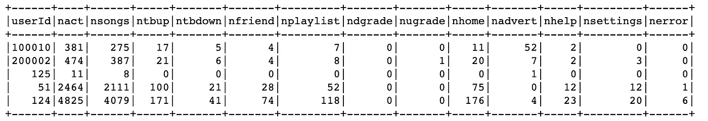

## **汇总活动统计**

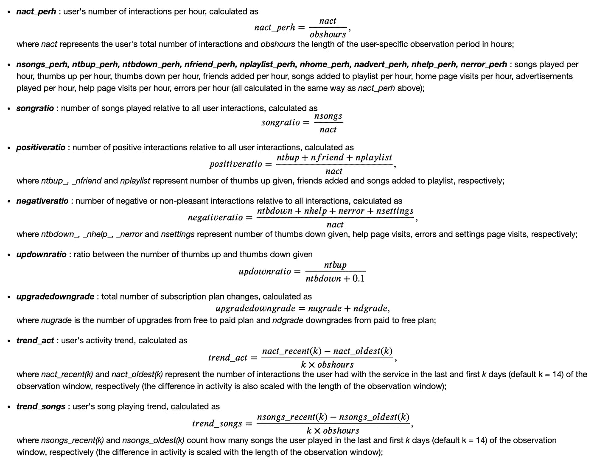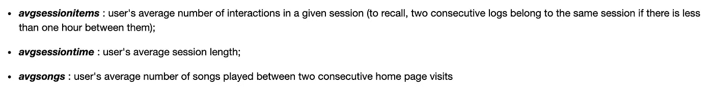

# 4.探索性数据分析

完成特征工程步骤后，我们分析了构建特征之间的相关性。

```
# For visualization purposes we switch to pandas dataframes
df_user_pd = df_user.toPandas()# Calculate correlations between numerical features
cormat = df_user_pd[['nact_perh','nsongs_perh', 'nhome_perh', 'ntbup_perh','ntbdown_perh', 'nfriend_perh','nplaylist_perh', 
'nadvert_perh', 'nerror_perh', 'upgradedowngrade', 'songratio', 'positiveratio','negativeratio', 
'updownratio', 'trend_act', 'trend_songs', 'avgsessionitems',  'avgsessionlength','avgsongs']].corr()# Plot correlations
plt.rcParams['figure.figsize'] = (10,10)
plt.subplots_adjust(left=0.20, right=0.9, top=0.95, bottom=0.15)
sns.heatmap(cormat, cmap = "YlGnBu", square = True, vmin = -1, vmax = 1);
plt.title('Feature correlations');
plt.savefig('correlations.png')
```

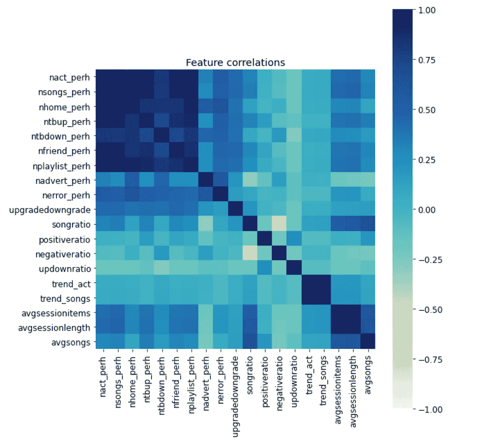

上面的热图描述了变量 **nact_perh** 和 **nsongs_perh 之间的高度相关性。**这是意料之中的，因为听歌显然是最常见的用户活动。出于同样的原因，在 **trend_act** 和 **trend_songs** 之间有很高的相关性。在这两种情况下，我们决定简单地从所有进一步的分析中删除，只保留衡量最重要的交互的变量——播放歌曲。

为了进一步减少数据中的多重共线性，我们还决定在模型中不使用 **nhome_perh** 和 **nplaylist_perh** 。此外， **avgsessionlength** 与每个会话中的平均项目高度相关，因此也可以忽略。

# 4.1 与搅动变量的关系

从下面呈现的可视化中，可以得出以下观察结果:

*   平均而言，喝醉的用户每小时会播放更多的歌曲；
*   受刺激的用户每小时明显会拒绝更多的广告，平均不得不看更多的广告；
*   对于喝醉的用户，歌曲和积极互动相对于总活动的比率通常较低
*   被搅动的用户平均每次对话互动较少
*   免费订阅计划的用户流失率更高
*   男性用户的流失率略高

根据此分析，没有删除任何功能。

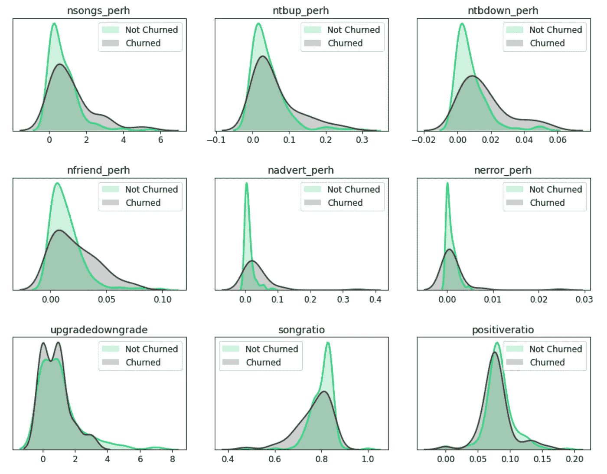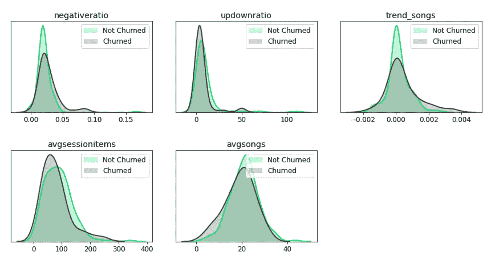

# 4.建模和评估

我们首先通过交叉验证执行网格搜索来测试几个参数组合的性能，所有这些都是基于从较小的 Sparkify 用户活动数据集获得的用户级数据。基于在交叉验证中获得的性能结果(通过 AUC 和 F1 分数衡量)，我们确定了性能最好的模型实例，并在整个训练集上对它们进行了重新训练。

# 4.1 网格搜索方法

## 逻辑回归

*   ***maxIter*** (最大迭代次数，默认= 100):**【10，30】**
*   ***regParam*** (正则化参数，默认= 0.0):**【0.0，0.1】**
*   ***elasticNetParam***(混合参数—L2 罚 0，L1 罚 1，默认= 0.0):**【0.0，0.5】**

## **随机森林分类器**

*   *(最大树深，默认= 5):**【4，5，6，7】***
*   **(树的数量，默认= 20):**【20，40】****

## ****梯度增强树分类器****

*   *****max depth****(最大树深，默认= 5):**【4，5】*****
*   ****(最大迭代次数，默认= 20):**【20，100】******

***在定义的网格搜索对象中，每个参数组合的性能默认通过在**四重交叉验证**中获得的平均 **AUC** 分数(ROC 下的面积)来衡量。下文第 4.4 节简要解释了 AUC。***

```
***numeric_columns = [‘nsongs_perh’, ‘ntbup_perh’,’ntbdown_perh’, ‘nfriend_perh’, 
‘nadvert_perh’, ‘nerror_perh’, ‘upgradedowngrade’, ‘songratio’, ‘positiveratio’,’negativeratio’, 
‘updownratio’, ‘trend_songs’, ‘avgsessionitems’,’avgsongs’]# Combining multiple numerical features using VectorAssembler
numeric_assembler = VectorAssembler(inputCols = numeric_columns, outputCol = “numericvectorized”)# Standardizing numerical features
scaler = StandardScaler(inputCol = “numericvectorized”, outputCol = “numericscaled”, withStd = True, withMean = True)# Adding the two binary features
binary_columns = [‘lastlevel’, ‘gender’]
total_assembler = VectorAssembler(inputCols = binary_columns + [“numericscaled”], outputCol = “features”)# Defining three different pipelines with three different classifiers, all with default parameters
# Logistic regression 
lr = LogisticRegression()
pipeline_lr = Pipeline(stages = [numeric_assembler, scaler, total_assembler, lr])# Random forest classifier
rf = RandomForestClassifier()
pipeline_rf = Pipeline(stages = [numeric_assembler, scaler, total_assembler, rf])# Gradient-boosted tree classifier
gb = GBTClassifier()
pipeline_gb = Pipeline(stages = [numeric_assembler, scaler, total_assembler, gb])***
```

# ***4.2 绩效指标***

*****F1 分数**是这个问题的首选性能指标。输入的用户级数据集不平衡。音乐流媒体服务旨在识别大部分可能流失的用户(**目标是高召回**，但同时不希望无缘无故给予太多折扣(**目标是高精度**)，即给予实际上对服务满意的用户(误报)——这可以帮助音乐流媒体业务防止财务损失。***

```
***class F1score(Evaluator):
def __init__(self, predictionCol = “prediction”, labelCol=”label”):
 self.predictionCol = predictionCol
 self.labelCol = labelColdef _evaluate(self, dataset):

 # Calculate F1 score 
 tp = dataset.where((dataset.label == 1) & (dataset.prediction == 1)).count()
 fp = dataset.where((dataset.label == 0) & (dataset.prediction == 1)).count()
 tn = dataset.where((dataset.label == 0) & (dataset.prediction == 0)).count()
 fn = dataset.where((dataset.label == 1) & (dataset.prediction == 0)).count()

 # Add epsilon to prevent division by zero
 precision = tp / (tp + fp + 0.00001)
 recall = tp / (tp + fn + 0.00001)

 f1 = 2 * precision * recall / (precision + recall + 0.00001)

 return f1def isLargerBetter(self):
 return True***
```

*********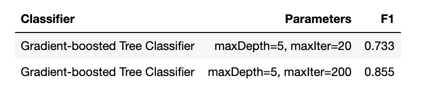***

***在完整数据集上测试***

***表现最好的模型的 AUC 值为 0.981，F1 值为 0.855。***

***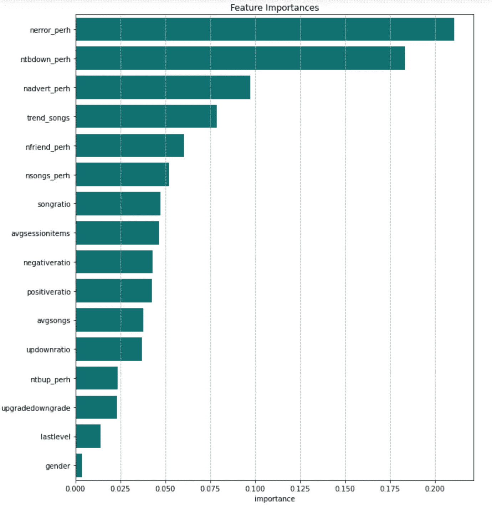***

***如上图所示，识别混乱用户最重要的特性是 **nerror_perh** ，它测量每小时向用户显示多少个错误页面。用户经历的错误越多，他/她对服务不满意的可能性就越大。***

***第二个和第三个最重要的特征也是如此， **ntbdown_perh** 和 **nadvert_perh** 分别测量每小时给出的拇指向下数和每小时看到的广告数。***

***最有趣的功能是 **trend_songs** 变量，它测量用户的歌曲收听活动趋势，这是第四个最重要的功能。***

# ***5.结论和改进***

***梯度增强的树分类器的 F1 值(精度和召回率)为 0.855，可以根据过去的用户活动和与音乐流媒体服务的交互来识别被搅动的用户，这可以帮助企业防止严重的财务损失。***

***一些改进是在完整的 Sparkify 数据集上对模型执行**全面的网格搜索**。**利用到目前为止已经被忽略的歌曲级特征**，例如，根据在指定的观察期内收听的不同歌曲/艺术家来计算用户的收听多样性等。**建立新特征**，例如歌曲收听会话的平均长度、跳过或部分收听歌曲的比率等。***

***关于这个项目的更多细节，请点击这里查看我的 Github 链接。***