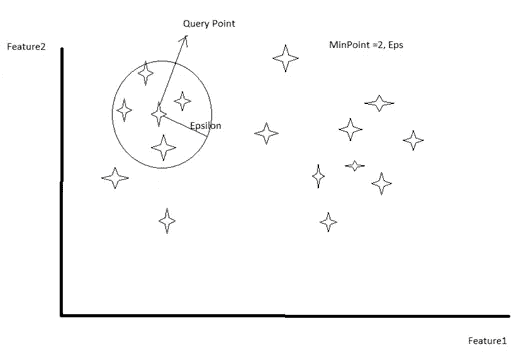
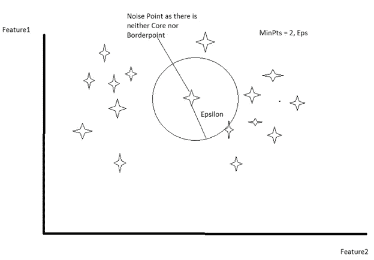
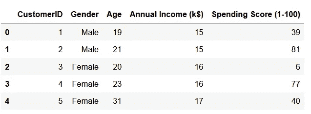
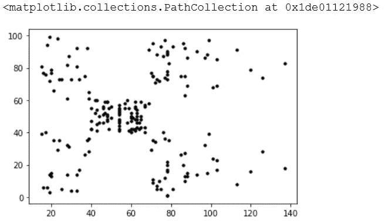
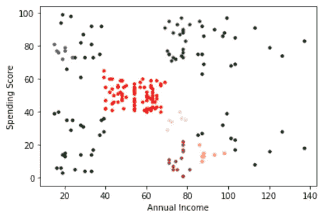

# 使用 DBSCAN 进行客户聚类

> 原文：<https://towardsdatascience.com/customer-clustering-using-dbscan-4672f51fe5aa?source=collection_archive---------22----------------------->


Rajendra Biswal 在 [Unsplash](https://unsplash.com?utm_source=medium&utm_medium=referral) 上的照片

在这篇博客中，我们将学习我最喜欢的聚类算法之一，那就是 DBSCAN 算法。我们将首先理解理论，然后我将借助一个非常简单的例子演示 DBSCAN 的工作原理。

DBSCAN 代表对有噪声的应用进行基于密度的空间聚类。

它在 1996 年左右被引入，并且由于其识别不同类型的聚类形状的有效聚类能力以及即使在存在噪声的情况下也能正确识别聚类的能力，在社区中获得了显著的普及。

让我们跳到一些有助于理解算法基本工作原理的关键术语。

有两个参数在算法中起着至关重要的作用。1)最小点数和 2)ε。

该算法通过单独处理每个数据点来工作，特别是对于每个点。它会构建一个以点为中心，半径等于ε的圆。

## **敏点:**

最小点是距离该点ɛ距离内必须存在的点数。

## **Epsilon(ɛ) :**

它是每个物体周围的距离或半径。

## **核心点:**

考虑下图，画一个以查询点为圆心，以ɛ.为半径的圆如果圆内的点数大于 MinPoints(本例中为*min points = 2*)，查询点将成为核心点。所以查询点有资格成为核心点。



(图片由作者提供)核心点演示:1。圆的半径= **ɛ，** 2。中心是考虑中的点

## **边界点:**

如果查询点在ɛ内小于最小点，但在ɛ距离内具有核心点，则它是边界点。

## **噪声点:**

既不是核心点也不是边界点的点称为噪声点。见下图。



(图片由作者提供)噪点演示

DBSCAN 将以这种方式处理每一个对象/点，并且最终它将获得所有点的分类，作为核心、边界或噪声点。

一旦获得了点的分类，下一步就是使用它们来构建聚类。DBSCAN 选取一个核心点，然后查看其ε半径圆内的点，并为这些点分配一个聚类标签。

所以关键的思想是给一个核心点的圆内的所有点以相同的标号。

将为不同的核心点运行多次迭代以分配聚类标签，请注意算法不会为那些在早期迭代中已经考虑的点分配新的聚类标签。

## **现在让我们看一下 DBSCAN 在客户数据上的工作示例。**

**问题陈述:**
你拥有商场，想根据顾客过去的购买数据了解他们。这种分析将有助于营销团队采取一些策略来锁定目标客户。

## **数据:**

您的数据由客户 ID、年龄、性别、年收入和支出分数等列组成。支出分数是您根据您定义的参数(如客户行为和购买数据)分配给客户的分数。

你可以从 Kaggle.com 得到这个数据集。

[https://www . ka ggle . com/vjchoudhary 7/customer-segmentation-tutorial-in-python](https://www.kaggle.com/vjchoudhary7/customer-segmentation-tutorial-in-python)

## **Python 代码:**

```
# DBSCAN Clustering
# Importing the libraries
import numpy as np
import matplotlib.pyplot as plt
import pandas as pd# Importing the dataset
dataset = pd.read_csv(Mall_customers.csv')
data = dataset.iloc[:, [3, 4]].values
dataset.head()
```



该数据集中有 200 行

```
# visualizing the dataset
plt.scatter(data[:, 0], data[:, 1], s = 10, c = 'black')
```



(图片由作者提供)年收入和支出分数散点图

```
# Fitting DBSCAN to the dataset and predict the Cluster label
from sklearn.cluster import DBSCANdbscan = DBSCAN(eps=5.5, min_samples=4)
labels = dbscan.fit_predict(data) 
np.unique(labels)
```


聚类标签。注意 Cluster = -1 表示噪声点

```
# Visualising the clusters
plt.scatter(data[labels == -1, 0], data[labels == -1, 1], s = 10, c = 'black')plt.scatter(data[labels == 0, 0], data[labels == 0, 1], s = 10, c = 'blue')
plt.scatter(data[labels == 1, 0], data[labels == 1, 1], s = 10, c = 'red')
plt.scatter(data[labels == 2, 0], data[labels == 2, 1], s = 10, c = 'green')
plt.scatter(data[labels == 3, 0], data[labels == 3, 1], s = 10, c = 'brown')
plt.scatter(data[labels == 4, 0], data[labels == 4, 1], s = 10, c = 'pink')
plt.scatter(data[labels == 5, 0], data[labels == 5, 1], s = 10, c = 'yellow')      
plt.scatter(data[labels == 6, 0], data[labels == 6, 1], s = 10, c = 'silver')plt.xlabel('Annual Income')
plt.ylabel('Spending Score')
plt.show()
```



(图片由作者提供)黑点是噪点。

祝贺您，您的第一次客户聚类迭代已经完成。

## 结论:

由于聚类是无监督的学习，您需要分析每个聚类并有一个关于业务数据的定义，因为聚类总是受一些业务规则的指导。一旦您的集群接近业务规则，您的模型就有意义了。

我们还可以更改 eps 和 Min_sample 的值来调整模型，使聚类的形状更好。

感谢您的阅读。

参考:[https://www . ka ggle . com/vjchoudhary 7/customer-segmentation-tutorial-in-python](https://www.kaggle.com/vjchoudhary7/customer-segmentation-tutorial-in-python)