# 竞争激烈的商业环境中的客户参与

> 原文：<https://towardsdatascience.com/customer-engagement-in-a-highly-competitive-business-environment-942b855efdf5?source=collection_archive---------65----------------------->

## 赢得客户的忠诚度并降低流失率

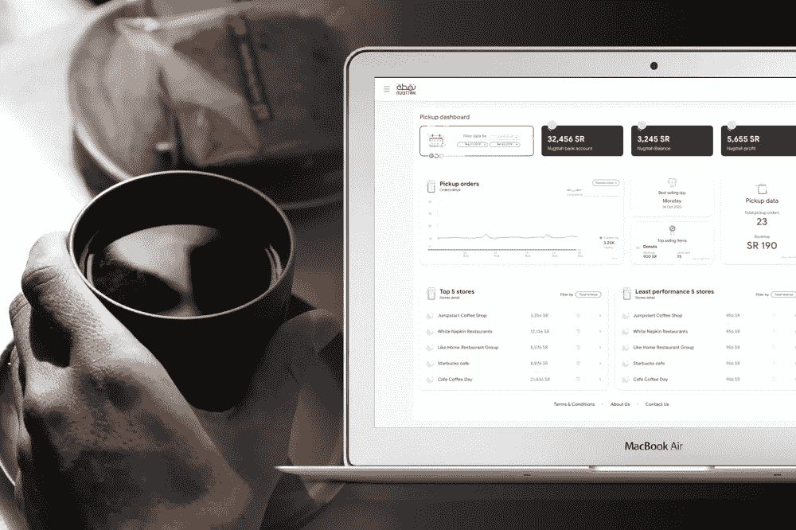

了解你的客户——作者图片

这篇文章强调了中小型企业如何使用预测方法来预测客户行为。企业必须赢得客户的忠诚度，降低流失率。

目的是帮助线下商家(特别是中小企业)更好地了解他们的客户，降低他们的流失率，增加客户对品牌的忠诚度。通过忠诚度和接送选项等多种产品选项，商家可以识别他们的最佳客户，并知道如何最好地吸引他们。

这篇文章需要结合机器学习、数据分析和编程。将审查关于客户及其订单的信息，并确定任何不同的细分市场或趋势。

# **概述**

客户忠诚度和保留率对任何业务的发展都至关重要。线下商家(特别是中小商店)努力为他们的顾客提供个性化服务。同样，顾客希望得到与网飞、亚马逊等主要品牌相同的参与度。有无数的选择供客户选择，这些企业必须发展，否则就有被甩在后面的风险。

***小型企业面临的个性化挑战是什么？***

中小型商家没有足够的资源来收集和解释客户数据。他们面临的一些挑战包括:

*   数据不足
*   无法获得可靠的数据
*   无法解释数据

***客户为什么会离开(客户流失)？***

客户流失是指客户不再光顾某个品牌或企业的趋势。各种原因可能会影响客户的决定，如果在同一时期有太多的客户放弃某个品牌，该业务就有彻底关闭的风险。以下是客户流失的常见原因；

*   企业主无法与大客户建立关系
*   企业主不能向客户提供任何形式的个性化服务/互动
*   企业主缺乏与大企业竞争的资源

为了实现这一点，店主了解顾客行为并根据购买行为和人口统计数据对顾客进行分类至关重要。这将有助于建立一种能带来客户忠诚度的关系。

## **案例分析**

**星巴克**是一个利用顾客数据的优秀品牌范例。他们在一周的特定时间向特定的客户发送特定的报价。

*   他们向最有可能改变购买习惯的顾客提供最好的交易
*   他们只为客户提供投资回报率最高的交易
*   他们试图把不常光顾的顾客变成常客

# **假设和假设**

我们应该思考“应该问什么类型的问题？数据应该怎么审核？”

我们的假设是:

*   忠诚的顾客可能会比新顾客花费更多
*   获得新客户的成本可能高于留住客户的成本
*   上午的交易量高于晚上
*   甜点和其他产品受到的影响更大
*   如果能提供个性化的体验，顾客更有可能做生意
*   奖励会让顾客再次光顾

我们将使用 Nugttah 数据集(忠诚度应用程序)的子集来测试我们的假设

# **风险和限制**

这些是本项目中可能预期的潜在限制。但是，在数据分析过程中会适当考虑这些因素:

*   缺乏足够和准确的数据是这个项目的最大限制。分析的结果只会和用来执行分析的数据一样好。
*   另一个限制是商店不会记录他们交易的每一个方面。因此，根据分析需要，可能必须做出一些假设。
*   还存在用错误的模型分析数据的风险。
*   由于广泛的新冠肺炎疫情引起的顾客行为的改变可能导致错误的销售预测。

# **进场和流程**

机器学习和数据科学项目的一个优秀方法如下:

*   加载和预处理数据
*   干净的数据
*   对数据进行数据可视化和探索性数据分析(EDA)
*   最后，分析所有模型，找出最有效的模型。

## ***加载&数据的预处理***

在此步骤中，我们将导入数据集并将其签出

在这里，数据集将被导入和检查。 ***read_csv*** 功能将用于读取工作表

***% matplotlib inline***将用于在笔记本中生成内联图。 ***sns.set()*** 将被添加到代码中，以将可视化样式修改为基本 Seaborn 样式:

```
import pandas as pd # data processing, CSV file I/O (e.g. pd.read_csv)
import numpy as np  # linear algebra
import seaborn as sns  # data visualization library  
import matplotlib.pyplot as plt
import seaborn as sns
import datetime
import datetime as dt
from matplotlib.ticker import FuncFormatter
import matplotlib.ticker as ticker
import json# Figures inline and set visualization style
%matplotlib inline
sns.set()plt.rcParams[‘figure.dpi’] = 150
np.set_printoptions(suppress=True)
np.set_printoptions(precision=3)orders_df = pd.read_csv('data/orders.csv')
```

我们将使用 ***head()*** 函数来显示数据集的前 5 个观察值，并使用 ***shape*** 特性来找出数据帧中有多少列和多少行。

```
orders_df.head()
```

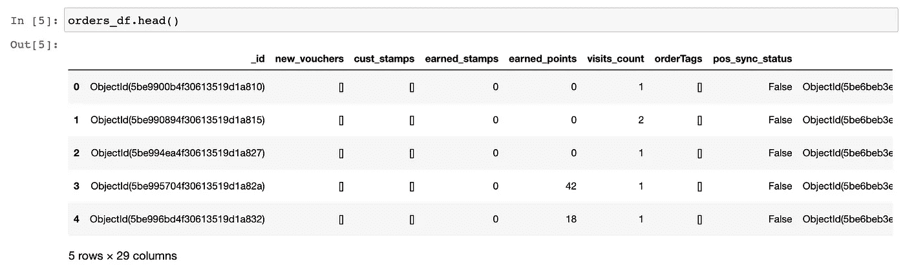

orders_df.head()

使用**形状**的数据集中的行和列的总数

```
orders_df.shape
```

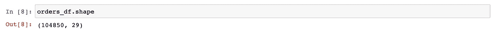

orders_df.shape

数据由 104850 个观察值和 29 个特征组成。

此时，可以使用 **describe()** 返回平均值、计数、最小值和最大值、标准偏差和数据质量来确定汇总统计数据。

```
orders_df.describe()
```

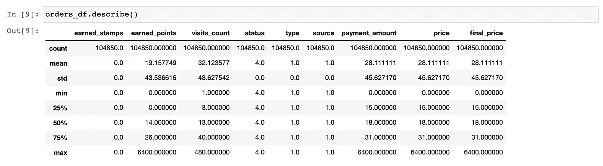

orders_df.describe() —作者照片

## **清除数据**

数据在被分析之前必须经过清理过程。一些数据清理过程包括:

*   缺少值
*   空值
*   重复值
*   噪声值
*   格式化数据
*   极端值
*   将数据分成单列和多列
*   转换数据类型
*   其他数据完整性问题

已加载下列数据文件:

*   订单数据
*   客户数据
*   商业数据
*   产品数据
*   奖励数据
*   最终 _ 单项 _ 订单

注意:原始数据最初在各种数据表中被打乱。必须使用 ***pd.merge*** 来收集和合并数据帧。

***删除有重复数据的数据字段***

```
# Redundant data exist in the dataset so we need to delete columns that are all same to reduce complexity
def is_unique(s):
    a = s.to_numpy()
    return (a[0] == a[1:]).all()for col in orders_df:
    if is_unique(orders_df[col]):
        del orders_df[col]
        print("{} is deleted because it's redundant".format(col))
```

***使每一笔采购成为一个单行***

数据是从 MongoDB 中提取的，有些列是 JSON 数据格式，整个数据类型将显示为字符串。为了改变这一点，使用 **json.loads** 将其转换为 json，作为字典数据结构进行访问。

```
new_df = pd.DataFrame(columns=['_id', 'earned_points', 'visits_count', 
                               'business', 'brand', 'branch',
       'customer', 'cashier', 'reference', 'products', 'payment_amount',
       'price', 'final_price', 'transaction_type', 'purchased_at',
       'created_at', 'updated_at'])
new_list = []
def get_product(row):
    prod_js = json.loads(row['products'])
    for p in prod_js:
        row['products'] = p
        vals = list(row.to_numpy())
        new_list.append(vals)
_ = orders_df.apply(lambda row: get_product(row), axis=1)keys = ['_id', 'earned_points', 'visits_count', 'business', 'brand', 'branch',
       'customer', 'cashier', 'reference', 'products', 'payment_amount',
       'price', 'final_price', 'transaction_type', 'purchased_at',
       'created_at', 'updated_at']  
new_df = pd.DataFrame(new_list, columns=keys)prod_id = new_df.apply(lambda row: row['products']['product']["$oid"], axis=1)
quantity = new_df.apply(lambda row: row['products']['quantity'], axis=1)
original_price = new_df.apply(lambda row: row['products']['original_price'], axis=1)
final_price = new_df.apply(lambda row: row['products']['final_price'], axis=1)# insert these product information to dataset
new_df.insert(1, 'prod_final_price', final_price)
new_df.insert(1, 'prod_original_price', original_price)
new_df.insert(1, 'prod_quantity', quantity)
new_df.insert(1, 'prod_id', prod_id)
del new_df['products']
del new_df['payment_amount']
del new_df['price']
```

***检查空值***

```
final_df = pd.read_csv('data/final_with_new_unified_names.csv')pd.isna(final_df).any()
```

如果有空值，要么删除它，要么替换它

```
final_df[‘city_text’] = final_df[‘city_text’].fillna(‘unknown’)
cities = [city.strip() for city in list(final_df[‘city_text’])]
final_df[‘city_text’] = cities
#final_df.to_csv(‘data/final_merged_single_item_orders.csv’,index=False)
# final_df.head()# fill business - brand - cashier with 'unknown'
final_df[['brand', 'business', 'cashier']] = final_df[['brand', 'business', 'cashier']].fillna(value="unknown")final_df.columns
```

更改任何没有意义的值

**删除异常值的功能**

```
# def drop_outliers(df, field_name):
#     distance = 6.0 * (np.percentile(df[field_name], 75) - np.percentile(df[field_name], 25))
#     df.drop(df[df[field_name] > distance + np.percentile(df[field_name], 75)].index, inplace=True)
#     df.drop(df[df[field_name] < np.percentile(df[field_name], 25) - distance].index, inplace=True)def drop_outliers(df, field_name):
    df_copy = df.copy()
    Q1 = np.percentile(df[field_name].values,25)
    Q2 = np.percentile(df[field_name].values,50)
    Q3 = np.percentile(df[field_name].values,75)
    IQR = Q3 - Q1    
    lower_fence = Q1 - 1.5 * (IQR)
    upper_fence = Q3 + 1.5 * (IQR)print("lower_fence: ",lower_fence)
    print("upper_fence: ",upper_fence)

    df_copy = df_copy[~((df_copy[field_name] < lower_fence)|(df_copy[field_name]  > upper_fence))]return df_copy
```

现在，商店数据、忠诚度数据、客户数据和其他可用数据集都有了很好的描述。

## **EDA &数据可视化**

数据清理过程完成后，将对数据进行数据可视化和统计分析。通过单独的数据集来可视化分类数据是一个很好的做法。

现在将从分析的数据中得出模式和见解。

***客户分析|*** *性别分布*

```
customers_data = final_df.drop_duplicates(['customer'])# See the distribution of gender to recognize different distributions
print(customers_data.groupby('gender')['gender'].count())
chart = sns.countplot(x='gender', data=customers_data)
chart.set_xlabel("Gender")
chart.set_ylabel("Counts (Number of Orders)")
plt.title('Distribution of Gender')
```

这表明我们的数据集中有 1711 名女性和 5094 名男性

直方图是发现每个属性分布的好方法。

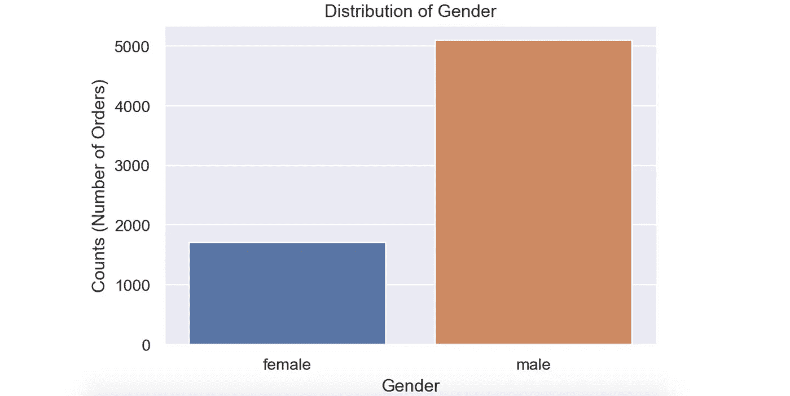

图表 1 —作者提供的照片

图表显示，男性顾客的比例略高于女性顾客。

为了获得更多信息，我们将根据注册年份对他们进行划分

```
plt.figure(figsize=(9, 5))
chart = sns.countplot(data = customers_data, x = 'year', hue = 'gender')
chart.set_title('Membership Since Year Distibution By Gender', fontsize = 15, y = 1.02)
chart.set_ylabel("Counts (Number of Orders)")
chart.set_xlabel("Year")
```

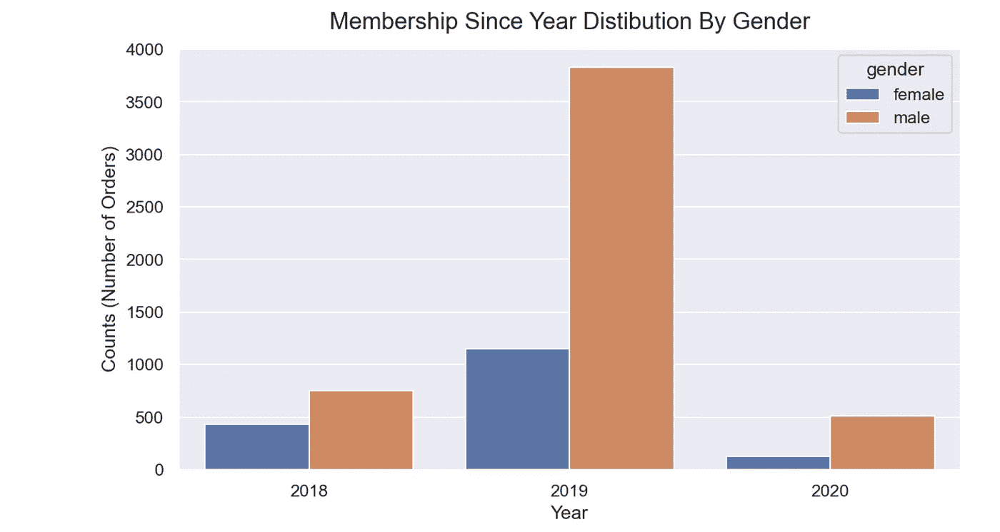

图表 2 —作者照片

***客户分析|*** 年龄分析

在年龄分析中，我们首先检查的是异常值**和**，并发现了一些异常值，因此任何发现的异常值都从数据集中删除。

```
chart = sns.boxplot(x=final_df[‘cust_age’])
chart.set_xlabel(“Customer Age”)
```

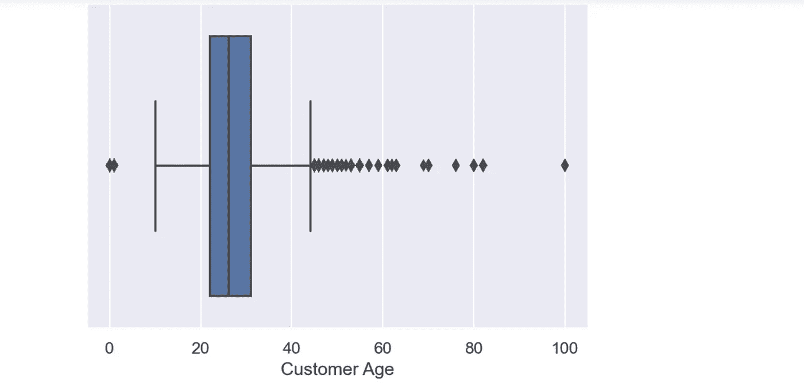

图表 3 —作者照片

```
# drop outliers
final_df_without_outliers = drop_outliers(final_df, 'cust_age')chart = sns.boxplot(x=final_df_without_outliers.cust_age)
chart.set_xlabel("Customer Age")
```

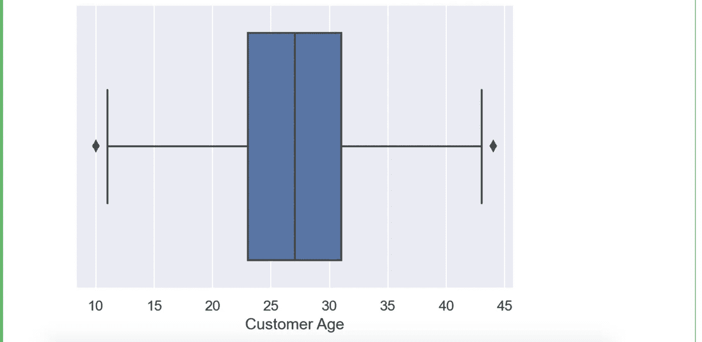

图表 4 —作者照片

如下图所示，年龄范围在 20 到 40 岁之间。突出显示 **describe()** 调用结果的有效性。

```
feature = final_df_without_outliers['cust_age']
sns.distplot(feature)
plt.title('Normal Distribution of Customer Age', fontsize=15);
plt.xlabel('Customer Age',fontsize=15)
plt.show()
```

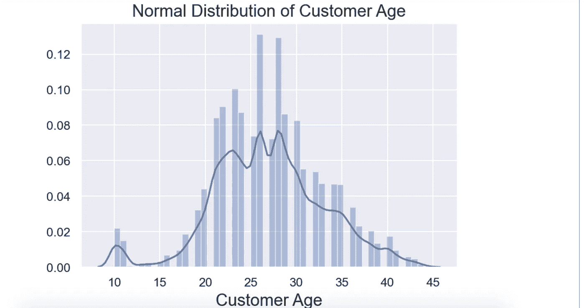

图表 5 —作者照片

平均年龄为 26 岁。这表明，与其他群体相比，年轻人更喜欢咖啡。较长的右尾表明这种分布是右偏的。

***统计与客户年龄相关的客户***

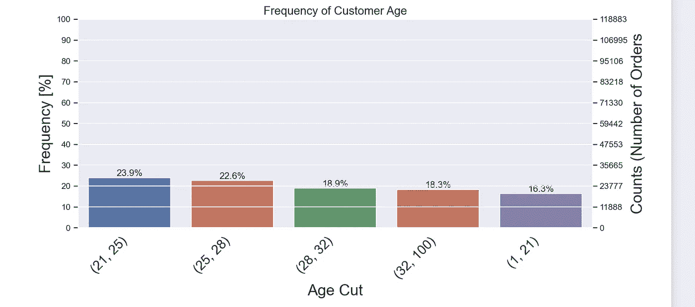

图表 6 —作者照片

***消费习惯***

该图描述了女性比男性花费更多，尽管我们的女性用户较少。


图表 7

***【引用分析】|*** 按用户居住地排名前 20 的城市

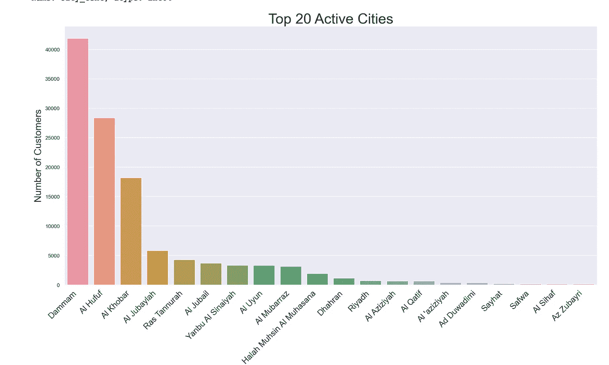

图表 8 —作者照片

**达曼**的人咖啡消费量最高。

***引用分析|*** *前 20 名活跃客户所在城市(最频繁最大订单数)*

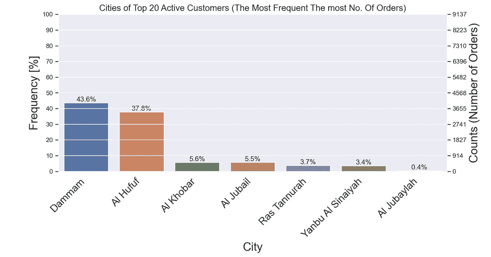

图表 9 —作者照片

***可视化成对关系***

*活跃客户重要变量之间的相关矩阵图*

相关性描述了两个变量之间的相似变化。当这种变化发生在同一个方向时，就被认为是正相关。如果变化发生在不同的方向，它被认为是负相关。

简单来说，相关矩阵就是每一对属性之间的相关性。它可以绘制在图表上，以辨别几个变量之间的相关程度。

了解这种计算是很有用的，因为如果数据中存在高度相关的输入变量，一些机器学习算法(如线性和逻辑回归)的性能可能会很差

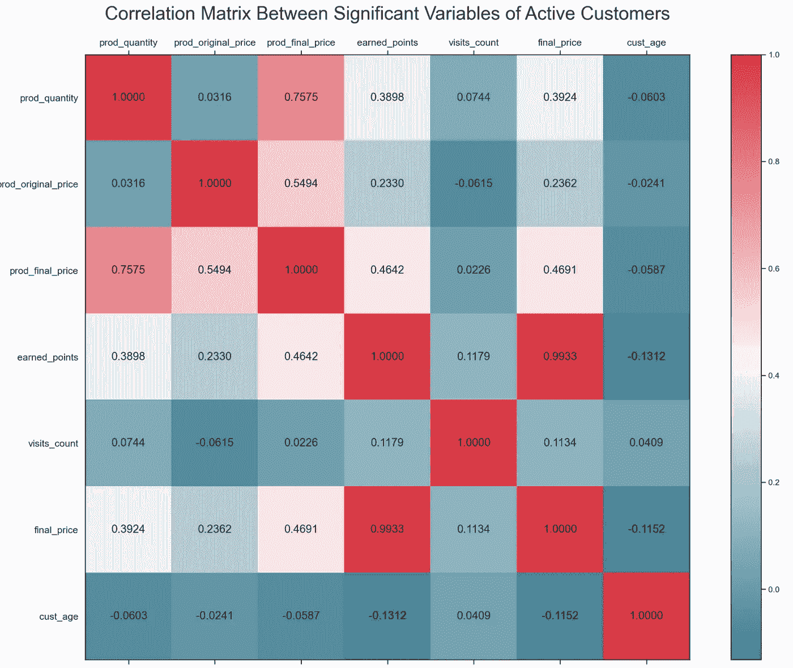

相关矩阵

上面，矩阵可以被看作是对称的，即矩阵的左下和右上是相同的。此外，它在一个图中显示相同数据的 6 个不同视图。还可以推断出，最强的相关变量在最终价格(总支出)和积分之间。这是一种正相关关系，客户在该数据集中获得的最终价格越高，他们的盈利点就越高。然而，其他变量没有这种相同的相关性。然而，它们提供了有用的信息，并且基于相同的基本原理工作。

***业务和产品分析***

当审查平均价格的偏斜度时，可以推断出有少数昂贵的项目，但一般来说，价格属于一组。此外，负偏度意味着中位数低于平均值——这通常是由低价产品引起的。

**十大热门类别**

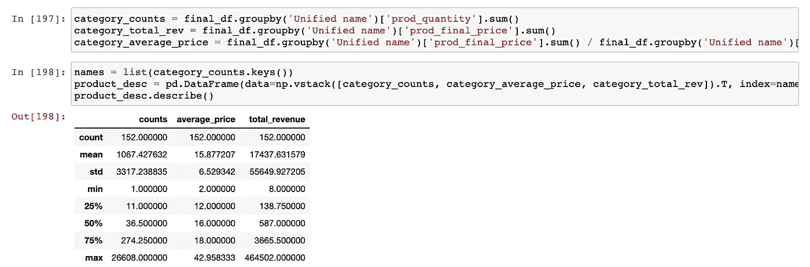

产品描述—作者照片

```
p_desc = product_desc.loc[product_desc['total_revenue'] >= sorted(product_desc.total_revenue, reverse=True)[10]]
sns.set_style('whitegrid')
plt.rcParams['figure.dpi'] = 250
chart = sns.scatterplot('counts', # Horizontal axis
           'average_price', # Vertical axis
           data=p_desc, # Data source
           size = 10,
           legend=False)chart.set_xlabel("Counts (Number of Orders)")
chart.set_ylabel("Avg. Price")
plt.title("Most Revenue Production 10 items")for line in range(0, p_desc.shape[0]):
    chart.text(p_desc.counts[line]+300, p_desc.average_price[line], 
             p_desc.index[line], verticalalignment='top', horizontalalignment='left', 
             size=5, color='black', weight='normal')
```

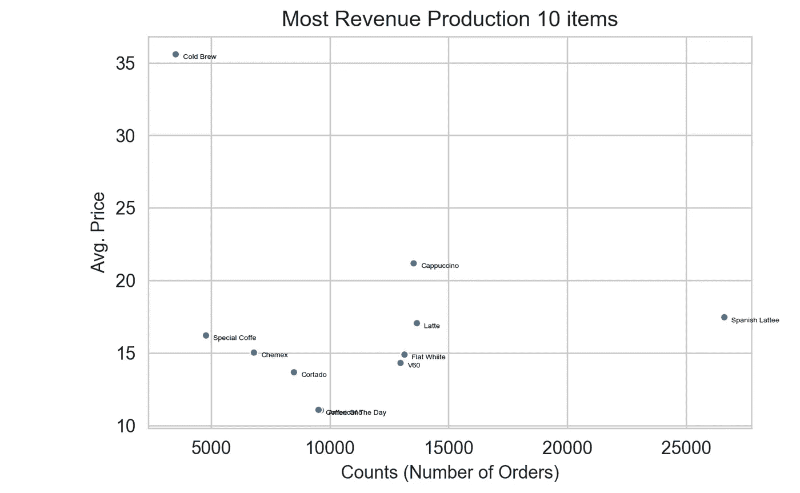

十大产品—作者照片

***订单分析***

```
total_data = final_df.drop_duplicates(['_id'])import calendar
calendar.setfirstweekday(calendar.SATURDAY)
months_names = {i:calendar.month_name[i] for i in range(1,13)}
total_data['month'] = total_data['month'].map(months_names)
total_data.groupby(['month', 'year'])['customer'].count()
```

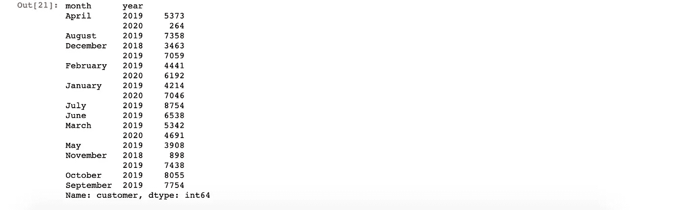

每月分析-作者照片

如图所示，2020 年 4 月记录了 264 笔销售，可以归类为 2018 年数据中的单一异常值。

***订单分析|年度***

```
plt.figure(figsize=(13,8))
chart = sns.countplot(x='year', hue='month', data=total_data)
chart.set_xlabel("Year")
chart.set_ylabel("Counts (Number of Orders)")
plt.title('Distribution of Orders over Years with Months')
```

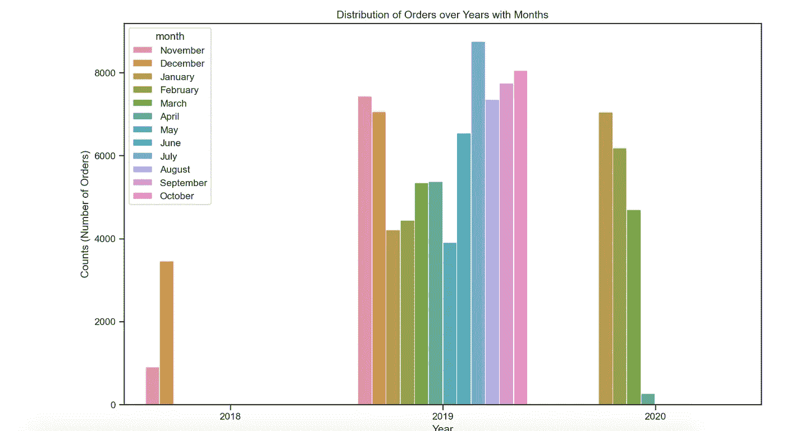

图表 11 —作者照片

还有，2019 年 5 月销量大幅下滑。这种由疫情引起的下降从 2020 年初开始，到 2020 年 4 月急剧下降。

***订单分析|月度***

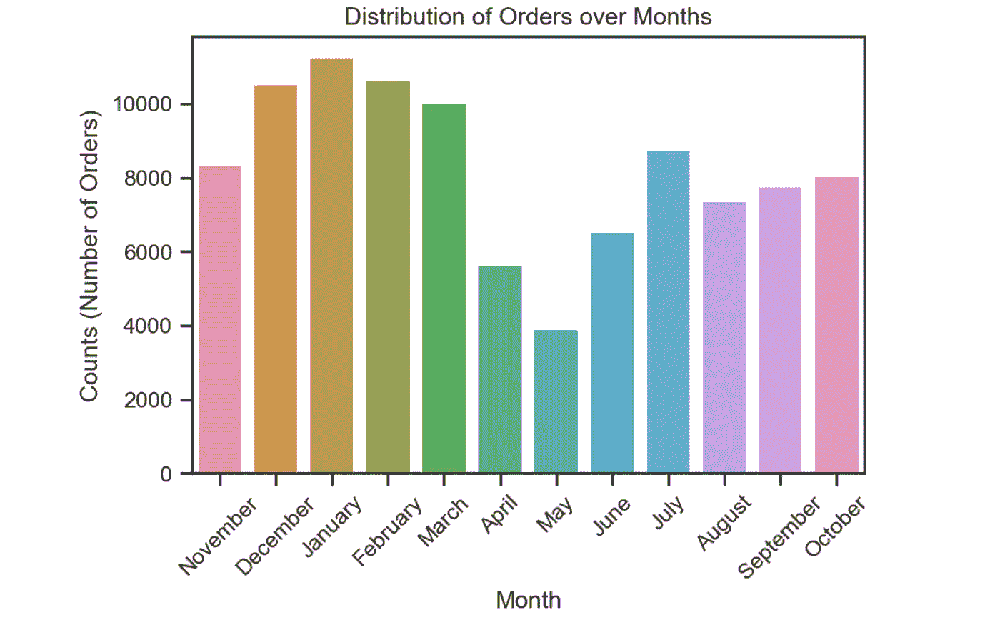

订单 _ 月刊—作者照片

***订单分析|每周***

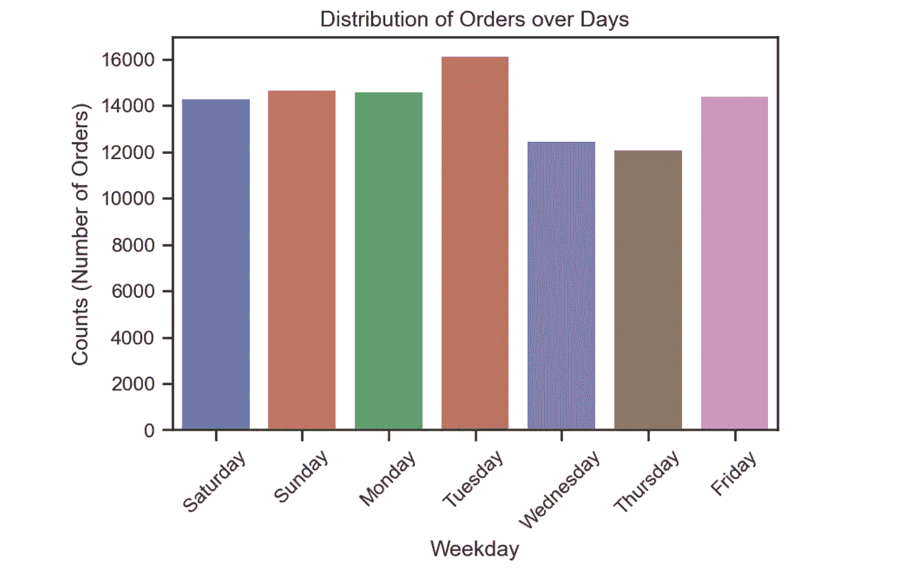

订单 _ 周刊—作者照片

在沙特阿拉伯，周四和周五被视为周末。然而，星期五比星期四低得多。

*新冠肺炎·疫情对顾客行为(POS)的改变:*

在分析了过去 3 个月沙特阿拉伯所有食品和饮料的统计数据并将其与我们的数据集输出进行比较后，我们发现了以下结果

```
last_3_months_orders = total_data[(total_data['month'].isin(['January','February','March'])) & \
                                  (total_data['year'].isin(['2020']))]last_3_months_orders_month_group = last_3_months_orders.groupby(['month', 'year']).agg({
                    '_id': ['count'],
                    'final_price':['sum']})last_3_months_orders_month_group.columns = ['number_of_transactions', 'total_sales']
last_3_months_orders_month_group = last_3_months_orders_month_group.reset_index()
last_3_months_orders_month_group.head()
```

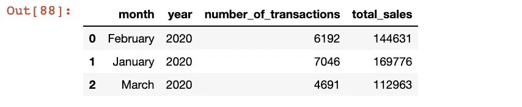

过去 3 个月订单输出-作者提供的照片

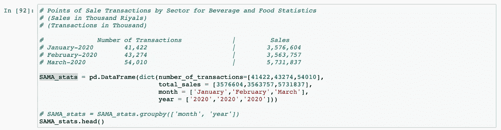

SAMA 统计—作者照片

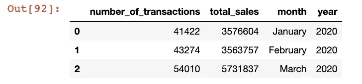

stats _ 统计 _ 输出—作者提供的照片

***RFM 分析***

在这里，我们将执行以下操作:

*   对于最近，计算当前日期和每个客户的最后订单日期之间的天数。
*   对于频率，计算每个客户的订单数量。
*   对于货币，计算每个客户的购买价格的总和。

```
# Filter on Dammam city (the most active city)
Dammam_orders_df = final_df[final_df['city_text']=='Dammam']# present date
PRESENT = dt.datetime.utcnow()
# print(PRESENT)
# print(Dammam_orders_df['created_at'].iloc[0])Dammam_orders_df['created_at'] = pd.DatetimeIndex(Dammam_orders_df['created_at']).tz_convert(None)# drop duplicates
Dammam_orders_df = Dammam_orders_df.drop_duplicates()# Transform to proper datetime
Dammam_orders_df['created_at'] = pd.to_datetime(Dammam_orders_df['created_at'])# Remove records with no CustomerID
Dammam_orders_df = Dammam_orders_df[~Dammam_orders_df['customer'].isna()]# Remove negative/0 prices
Dammam_orders_df = Dammam_orders_df[Dammam_orders_df['final_price'] > 0]Dammam_rfm = Dammam_orders_df.groupby('customer').agg({
                    'created_at': lambda date: (PRESENT - date.max()).days,
                    '_id': lambda num: len(num),
                    'final_price': lambda price: price.sum()})Dammam_rfm.columns = ['Recency (days)','Frequency (times)','Monetary (CLV)']
Dammam_rfm['Recency (days)'] = Dammam_rfm['Recency (days)'].astype(int)Dammam_rfm.head()
```

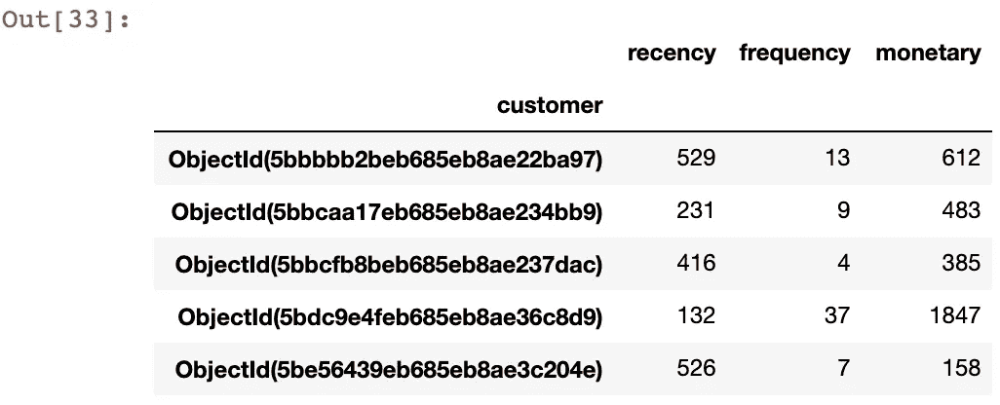

RFM _ 输出—作者提供的照片

***RFM 分析|*** 计算 RFM 值的分位数

新近发生率、频率和金额最低的客户被视为顶级客户。

**qcut()** 是基于分位数的离散化函数。qcut 根据样本分位数对数据进行分类。例如，4 个分位数的 1000 个值将产生一个分类对象，指示每个客户的分位数成员资格。

```
Dammam_rfm['r_quartile'] = Dammam_rfm['Recency (days)'].apply(lambda x: r_score(x))
Dammam_rfm['f_quartile'] = Dammam_rfm['Frequency (times)'].apply(lambda x: fm_score(x, 'Frequency (times)'))
Dammam_rfm['m_quartile'] = Dammam_rfm['Monetary (CLV)'].apply(lambda x: fm_score(x, 'Monetary (CLV)'))Dammam_rfm.head()
```

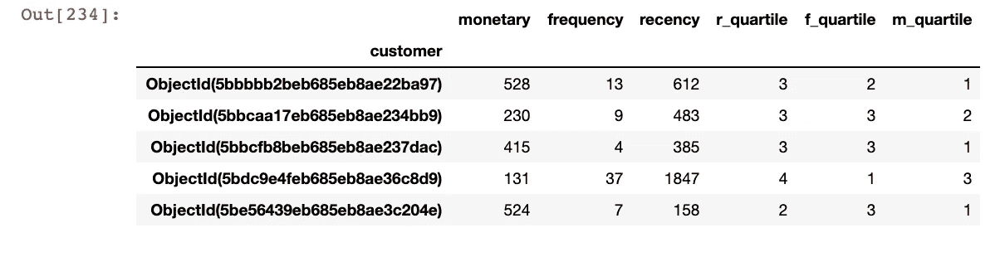

qcut_output —作者提供的照片

***RFM 分析|*** RFM 结果解释
将所有三个四分位数(r_quartile，f_quartile，m_quartile)组合在一列中，此排名将帮助您对客户进行细分。

```
Dammam_rfm['RFM_Score'] = Dammam_rfm.r_quartile.map(str) + Dammam_rfm.f_quartile.map(str) + Dammam_rfm.m_quartile.map(str)Dammam_rfm.head()
```

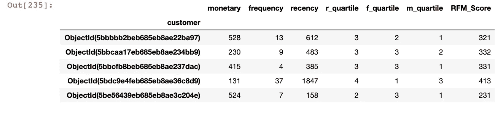

combine _ output 作者提供的照片

***【RFM 分析】|*** 筛选出顶级/最佳客户

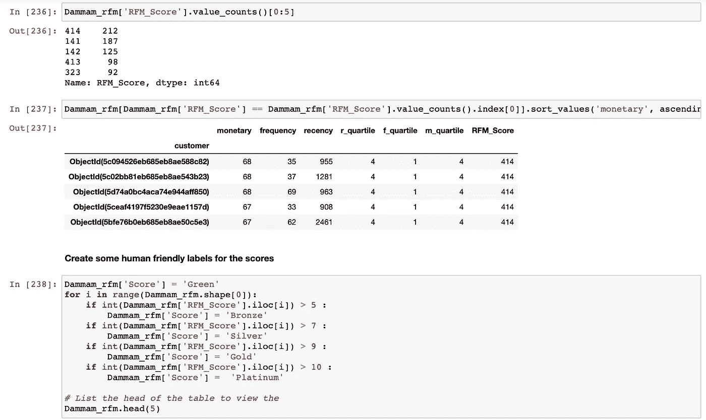

top5 —作者照片

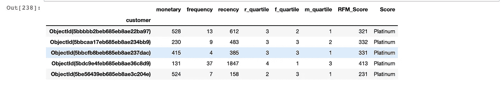

top5_output —作者提供的照片

***装置类型***

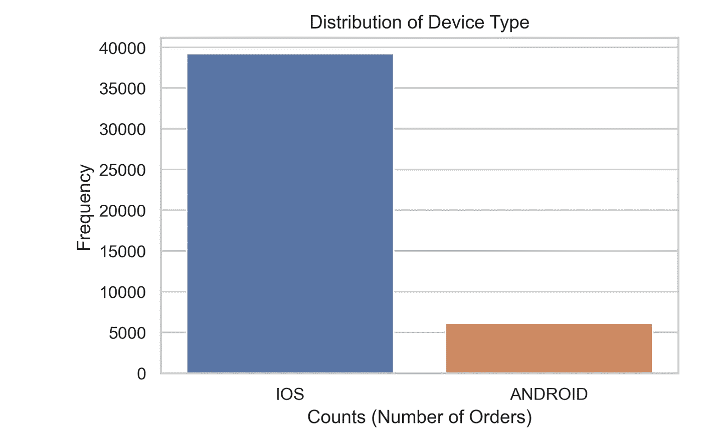

图表 13 —作者照片

Nuggtah 似乎更受 IOS 用户的欢迎，尽管它分布在沙特阿拉伯

## **解决方案**

机器学习主要建立在进行预测和分类的概念上。然而，要理解的最重要的事情是，它不是关于一个方法有多奇特，而是它与测试数据的兼容性。

预测时，只选择预测结果所需的最重要的属性是至关重要的。此外，必须选择适当的 ML 方法。关于客户讨论，建议以下建议:

**推荐**和**客户细分** of 忠诚度活动，如奖金奖励、积分充值、免费等级升级，以及专门优化的奖励计划，以提高收入和投资回报率。因此，对客户进行了细分，以发现最佳群体。

**细分**对于大规模个性化至关重要。此外，该系统应该分析与其他用户没有直接关联但在搜索和购买模式中共享相同标准的**志同道合的**用户的数据(借助于 ML 算法来提供更多细节并显示用户简档之间的相似性)。

**销售预测**可以用来预测未来的销售量。通过进一步分析，可以推导出单店销售额、品类销售额、产品销售额等数据。

**终身价值预测**可用于根据细分客户和行为模式识别最合适的客户。

**流失预测**可用于确定特定时期内的流失量。

***最后一步:设计预测模型***

*   估计系数
*   设计模型
*   进行预测并存储结果。
*   分析模型
*   *初始化随机数发生器*

继续将随机数发生器初始化为固定值(7)。

这一步对于保证这个模型的结果可以再次被复制是至关重要的。它还确保训练神经网络模型的随机过程可以被复制。

# **结论**

有了正确的数据，个性化是可以实现的。今天，中小型企业不需要一个大型的分析师或营销人员团队来预测客户行为和趋势。

细分可以帮助企业识别正确的客户，并在正确的时间向他们发送正确的信息。

# **资源**

***名称:作为商业模式的推荐系统***

*   角色:进行订单/交易的用户。
*   描述:提供建议并捕捉用户之间的关系。
*   利用显性和隐性特征/模式以及用户之间的关系来构建一个好的推荐系统的最佳方法之一是[多方面的协作过滤模型](https://drive.google.com/file/d/1nmYa2ZY9wcFcw6IUMs4X56-8SJC5MAaw/view?usp=sharing)，本演示对此进行了清晰的描述。
*   演示文稿包含所有需要的信息(问题、愿景、技术、使用的[数据集](https://www.kaggle.com/netflix-inc/netflix-prize-data)和评估)。

***名称:采购预测模型***

*   角色:店主。
*   描述:预测用户下一个订单中的下一个购买产品
*   数据集:关于“[如何赢得数据科学竞赛](https://www.kaggle.com/c/instacart-market-basket-analysis/)”的 Kaggle 期末项目

***名称:未来销售预测模型***

*   角色:店主。
*   描述:预测特定商店的未来销售额。
*   数据集:一个叫做( [Instacart 市场篮子分析](https://www.kaggle.com/c/competitive-data-science-predict-future-sales))的 Kaggle 竞赛

***走向数据科学篇***

*   [客户细分的聚类算法](/clustering-algorithms-for-customer-segmentation-af637c6830ac)
*   [利用 Python 中的客户细分找到您的最佳客户](/find-your-best-customers-with-customer-segmentation-in-python-61d602f9eee6)
*   [使用 Python 进行客户细分分析](/customer-segmentation-analysis-with-python-6afa16a38d9e)
*   [客户细分](/data-driven-growth-with-python-part-2-customer-segmentation-5c019d150444)