# 离散时间契约环境下的顾客终身价值

> 原文：<https://towardsdatascience.com/customer-lifetime-value-in-a-discrete-time-contractual-setting-math-and-python-implementation-af3ef606cefe?source=collection_archive---------24----------------------->

## 数学和 Python 实现

# 激励性问题

在按月/按年(即离散时间)订阅业务环境(即合同)中，根据我们当前客户的特征，新客户的预期价值是什么？

*   请注意，我们的设置是离散时间合同设置。如果你的商业模式不是基于订阅的(即非合同的)，请查看 Python 中的[生命周期](https://lifetimes.readthedocs.io/en/latest/?badge=latest)包。

# 假设

*   这里我们只关注收入，而忽略了客户获取成本，以及其他成本。

# 等式

(法德尔、彼得和布鲁斯(2007 年 a))

客户生命周期价值期望值的等式非常简单:

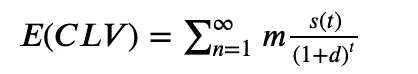

*   m:订阅率
*   s(t):t 时刻的生存函数
*   d:反映货币时间价值的贴现率

# 例子

这里有一个来自论文推子，彼得和布鲁斯(2007 年 b)的例子。假设我们有 1000 个客户，在第 1 年(t0)，我们有所有 1000 个客户。在第 2 年(t1)，只有 631 个客户是活跃的。到了第 5 年，只有 326 个客户仍然活跃。假设我们的订阅费率为 100 美元/年，折扣率为 10%。

*   m = 100 美元/年
*   d = 10%

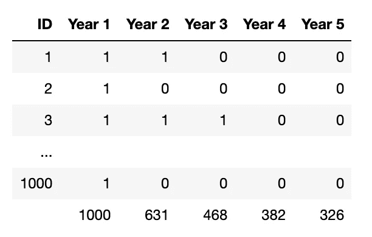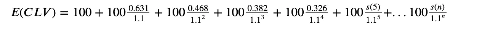

*   基于 CLV 方程，我们可以填入数据并改写方程，如上所示。
*   问题:唯一的问题是我们不知道未来的存活率。因此，我们可以使用几何贝塔模型来模拟我们的数据和预测生存函数。

# 几何贝塔模型

(法德尔、彼得和布鲁斯(2007 年 a))

## 客户持续时间~ geometric(𝜃)

我们假设客户持续时间/生命周期遵循几何分布，因为客户只能流失一次。

*   流失概率:𝜃
*   留任概率:1−𝜃
*   时间 t 时客户流失的概率:

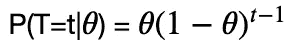

*   时间 t 时的存活率:

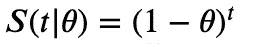

*   时间 t 时的保留率:

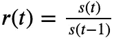

## 𝜃∼𝑏𝑒𝑡𝑎(𝛼,𝛽)

我们将𝜃的异质性建模为贝塔分布。我们使用贝塔分布，因为它以区间[0，1]为界，并且它有各种可能的形状。

*   定义在区间[0，1]上

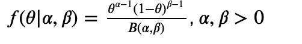

## 几何贝塔分布

然后我们可以结合几何分布和贝塔分布，计算联合分布。并且通过一些贝塔函数和伽玛函数的计算，我们可以计算出客户在任意时刻 t 的流失概率，以及任意时刻 t 的留存率。

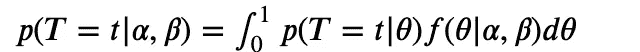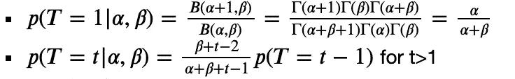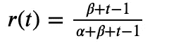

*   可能性函数:在 t1 失去𝑛1n1 客户的概率，在 t2 失去𝑛2 客户的概率，以及在观察期结束时保留𝑛−∑𝑛_t 客户的概率。

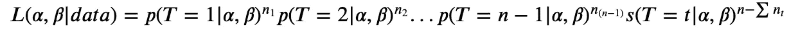

对数似然函数:𝐿𝐿(𝛼,𝛽|𝑑𝑎𝑡𝑎)=𝑙𝑛(𝐿(𝛼,𝛽|𝑑𝑎𝑡𝑎))

## 找出𝛼和𝛽的最大似然估计量

*   为了找到参数的最大似然估计量，我们将对数似然函数最大化或负对数似然函数最小化。通过最优化过程，我们得到了𝛼和𝛽.的最大似然估计值

# 计算 CLV

## 给定𝛼和𝛽，计算每个时间点的存活率

*   𝑟(𝑡)=(𝛽+𝑡−1)/(α+β+t−1)
*   t = 0 时的𝑠(𝑡)=1
*   𝑠(𝑡)=𝑟(𝑡)𝑠(𝑡−1)当 t>0 时

## 计算 CLV

为 k 选择一个合理的大数

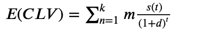

# Python 实现

# 最大似然估计

这是我的 Python 实现，用于计算对数似然函数，并优化负对数似然函数。注意，我们需要给参数一个初始值，作为优化的起点。在我们的例子中，𝛼和𝛽的初始值都是 1。

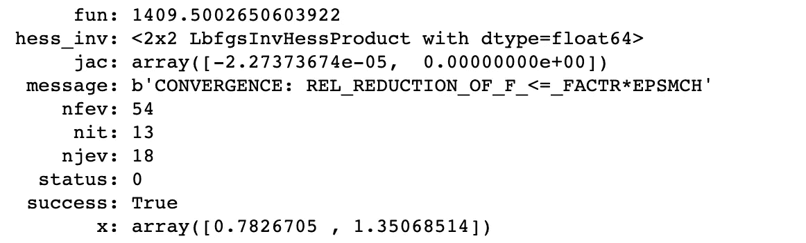

通过优化，优化后的负对数似然为 1409.5，𝛼和𝛽的最大似然分别为 0.78 和 1.35。

# 模型拟合

这是我访问模型拟合的函数。这里我只是比较观察到的和计算出的存活率。你可以改变这个函数来比较似然函数和保持率。

这里的第一个图使用了初始参数(1，1)作为模型参数，我们可以看到模型计算出的存活率不是很理想。第二个图使用参数的最大似然值，模型计算的存活率非常接近观察到的存活率。

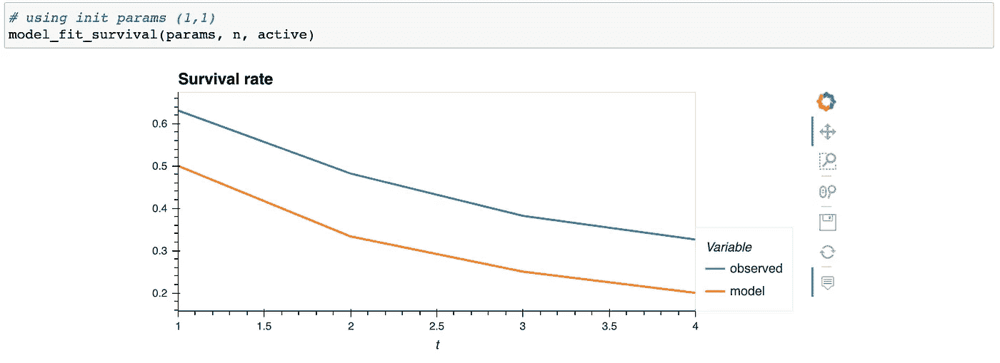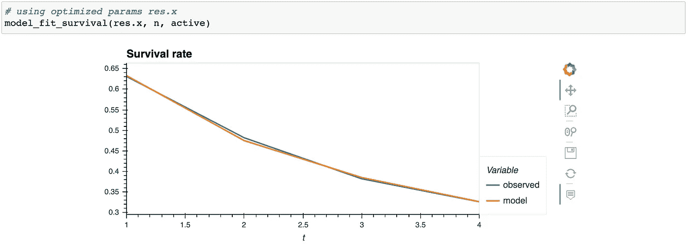

# 计算 CLV

现在，我们可以使用 MLE 参数来计算客户终身价值的期望值。我们可以看到，一个新客户的期望值是 362 美元。

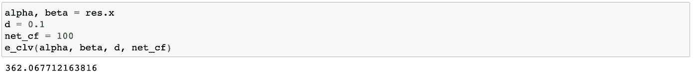

参考资料:
Fader，Peter S .和 Bruce G.S. Hardie (2014)，“一个懂电子表格的非统计学家的贝塔几何模型指南。”[http://brucehardie.com/notes/032/](http://brucehardie.com/notes/032/)
Fader，Peter S .和 Bruce G.S. Hardie (2017)，“探索客户终身价值的分布(在合同环境中)。”[http://brucehardie.com/notes/035/](http://brucehardie.com/notes/035/)