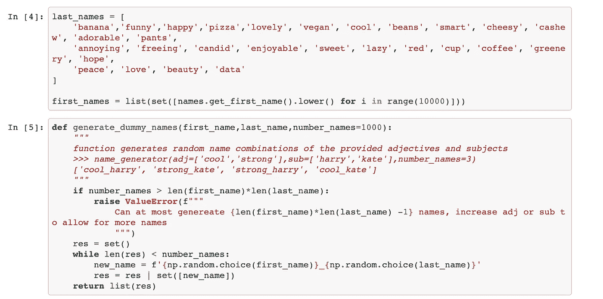
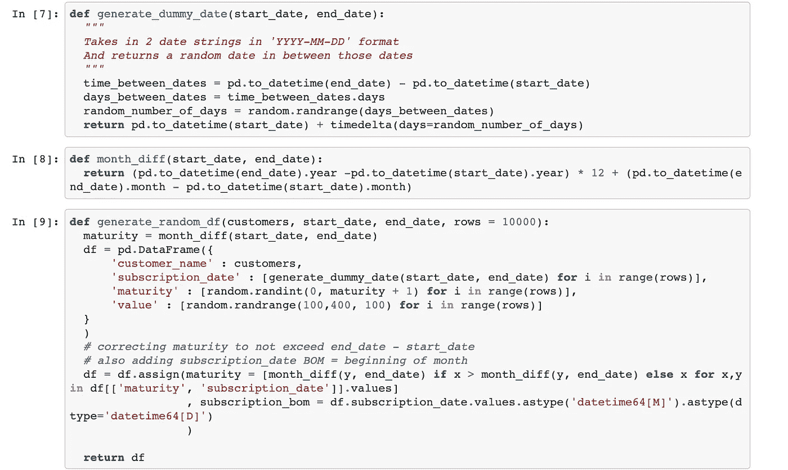
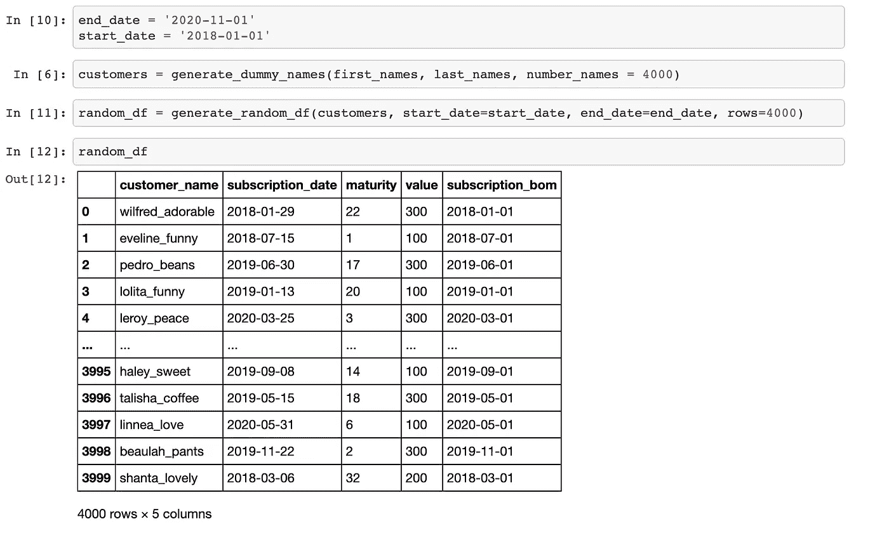
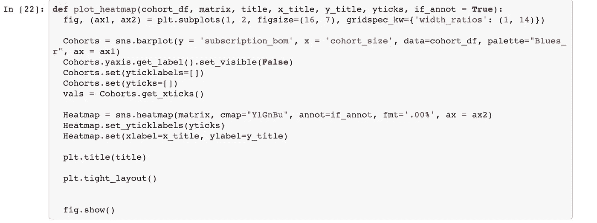
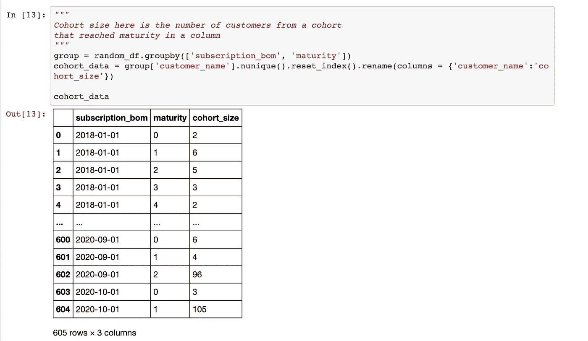
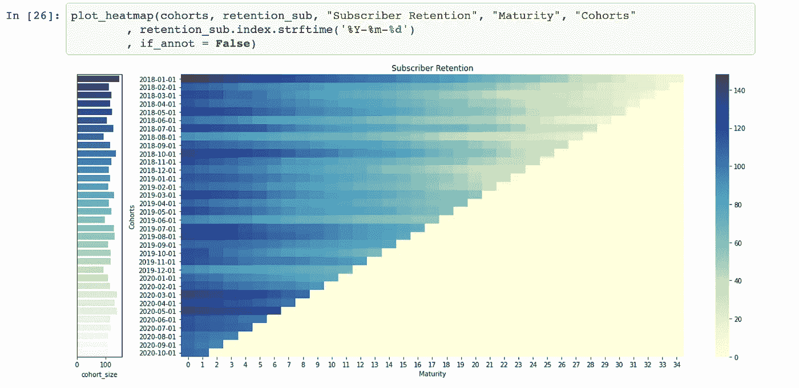
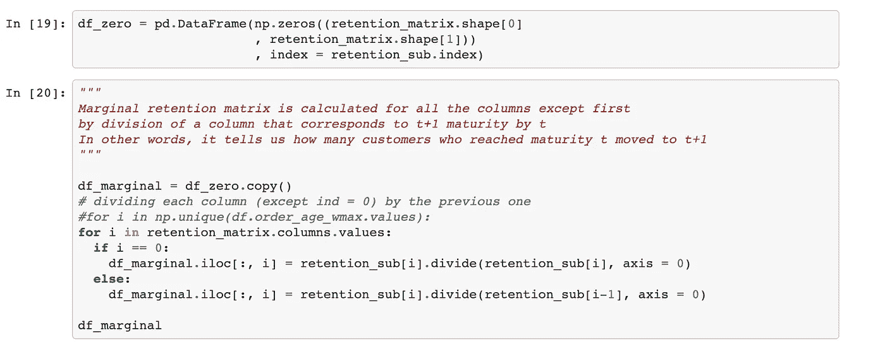
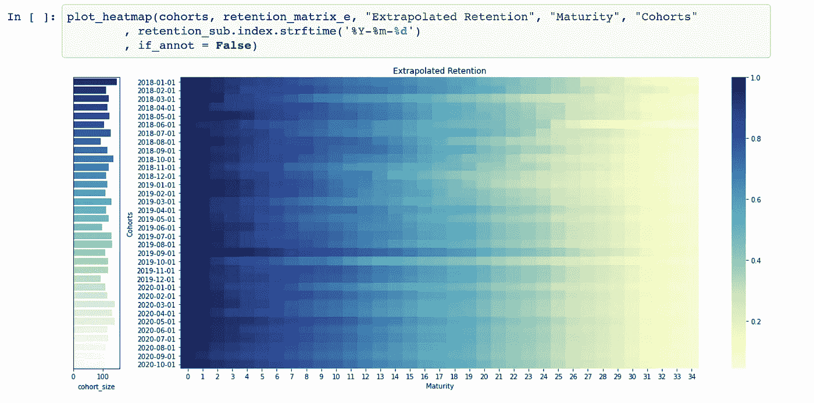
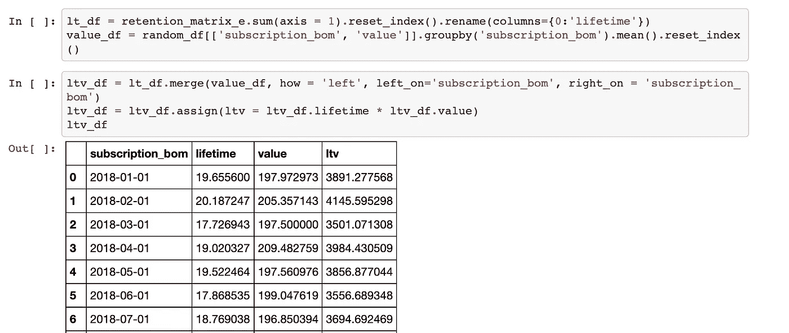

# 通过保留实现客户终身价值——在 Python 中，使用 Pandas 和 Numpy

> 原文：<https://towardsdatascience.com/customer-lifetime-value-via-retention-in-python-with-pandas-and-numpy-143171cc98bc?source=collection_archive---------9----------------------->

埃菲社在 [Unsplash](https://unsplash.com/@efekurnaz?utm_source=unsplash&utm_medium=referral&utm_content=creditCopyText) 上拍摄的照片

## 在基于订阅的例子中

将这些视为客户终身价值的入门书:这三个部分非常容易理解，会给你一个很好的介绍 LTV 的机会。在[第一部](https://medium.com/swlh/estimating-customer-lifetime-value-via-cohort-retention-de960e2ee5b1)中，我浏览了逻辑部分，所以如果你感兴趣，去看看吧！在第二部分中，我展示了一个例子，展示了群组保留如何增加客户的平均加权寿命。在第 3 部分中，我添加了一个 Python 蓝图代码，您可以使用并改进它来推断您的客户 LTV。

## 零件和内容

第一部分:[通过群组保持率估算客户终身价值， *CLV 或 LTV 称之为*](https://medium.com/swlh/estimating-customer-lifetime-value-via-cohort-retention-de960e2ee5b1)

第二部分:[加权队列寿命，*作为队列保持的总和，不是证明而是实验*](https://medium.com/@anastasia.reusova/weighted-cohort-lifetime-5e2d195e2af5)

第 3 部分:*通过保留实现客户终身价值——在 Python 中，使用 Pandas 和 Numpy*

在我开始之前，我想重申一下，LTV 不是一个财务指标，仅仅是一个估计，然而，它允许比直接猜测更好的近似。LTV 最重要的用途之一是客户获取成本的基准，因为它允许设定合理的支出上限。

## **目的**

本系列的目的是阐述一种简单的技术，通过历史趋势的推断，为您提供客户终身价值的估计。在 Python 中，你可以用 Pandas 和 NumPy 做到这一点——这再简单不过了。因此，在这篇文章中，我们不会深究更高级的涉及个体 LTV 预测的技术。我正在考虑写一篇关于此事的独立博文。最后，您可能需要考虑底部列出的一些附加改进。

## **数据集和假设**

> 在这篇文章中，我们将生成虚拟的月度订阅数据。我们需要 ***客户 id******认购日期******到期日*** 直到认购被取消，否则直到当前日期，以及平均 ***认购金额*** 。

对于这篇文章，我将生成 34 个月的数据。如果你没有这么多的数据，你将不得不对群体行为和寿命做出更多的假设。绘制保留曲线和研究衰变率可能有助于实现这一目的。

## **Python 实现**

## **虚拟数据**

总的来说，我们将遵循本系列第一部分中的逻辑:1)获得群组矩阵；2)获得边际留存；3)外推边缘保持力；4)使用(3)外推(1)。按群组估计的寿命将是第(4)点按行的总和。

首先，我们需要一个订阅数据集。我从 Python 博客文章的 [*队列分析中获得了一些技术，这些技术对队列的虚拟数据生成和可视化有很好的想法。*](https://medium.com/better-programming/cohort-analysis-with-python-e81d9d740a9b)

下面是我们将用来生成的几个帮助函数:a)客户列表 b)订阅日期、到期日和订阅价值 c)将 a 和 b 放在一个数据框架中。

*Helper 函数为客户命名，礼貌地向*[*Fabian Bosler*](https://medium.com/@fabianbosler)*和他的博客帖子*

用于随机订阅日期和结果数据框架的辅助函数

当所有这些加在一起时，我们有 4000 行的随机数据帧看起来有点像这样。最后一列是订阅日期的月初，相当于分组。

## **队列保持率**

> 群组保持率是已获得的客户中达到到期时间 t 的比例。在这种情况下，到期时间是取消订阅之前的时间，或者，如果订阅在当前日期之前有效，则是订阅开始日期和今天之间的时间。

一个有用的功能是绘制保留热图。

从我们的数据中获取数据的方法之一是两步:1)旋转上面的数据框架，以获得到期的群组客户的计数 2)将从 T+1 到 T 的所有客户相加，因为在 T+1 活跃的所有客户都在 T 活跃。

枢纽队列数据

回滚订阅者的数量

将月活跃用户数除以群组规模，最终得到三角形保留矩阵，其中每个值都在[0，1]之间。根据下面的留存矩阵，您已经可以对平均寿命和寿命价值做出假设，这对于在营销活动中选择客户群非常有用。

应用我们上面创建的热图绘图功能，我们可以看看队列如何保持超过 34 个月。

群组保持原样，您可以看到下面的外推版本并进行比较

## **边际保留率**

边际保留略有不同:它取每一列 T+1，其中 T ≠ 1，然后除以 T。结果，我们得到了上个月的订阅者中在下个月重新订阅的一部分。

取前 N 行的平均值来外推矩阵:

你可以看到边际保留率是如何在矩阵中平均和外推的。如果你期望边际保留率发生变化，这是调整的好时机。

外推的边缘队列保持率

## **把所有的东西放在一起**

在外推的边缘保留和队列保留矩阵准备好之后，我们可以外推队列的保留矩阵。

你可以在热图上看到群体保持率是如何推断出来的:

外推队列保持率

## **寿命与价值**

群组中平均客户的生命周期，或平均群组生命周期，是整个到期期间保留百分比的总和。

**进一步改进**

显然，这种方法给出了一个队列的平均寿命和价值，因此您可以将其与这个采集时间所花费的 CAC 进行比较。如果你想把 LTV 定为“高于平均水平”的目标，并根据收购时间进行调整，这也会有所帮助。但是，在某些情况下，您可能希望预测某个特定的*个人客户的 LTV。为此，您可以使用*预测建模*，我将在后面介绍。*

另一个容易实现的改进是将*运营利润*添加到订阅价值中。这将为您提供一个更好的客户获取成本对比基础。差价会告诉你，一旦客户被吸引过来，第一笔订单送达，这笔生意还剩多少。

对于我们这些熟悉金融中*贴现*概念的人来说。来自 [*Investopedia*](https://www.investopedia.com/terms/d/discounting.asp) :确定未来将收到的一笔或一系列付款的现值的过程。)—可以纳入你的估算。

你可以考虑的另一个改进是你的业务的季节性，并在你正在做的推断中考虑它。当你查看热图时，可以发现季节性:模式将非常明显，并可能形成一条对角线。

与季节性相似，可能会有一个针对群组的调整*或边际保留*,您可能希望基于基本知识引入。例如，如果您开展一项活动来影响保留率或提高参与度，则有可能在计算中包含一个变化率。你可以从 [*计算订阅终身价值的电子表格*](https://medium.com/the-inflection-points/a-spreadsheet-for-calculating-subscription-lifetime-value-402d1a3ae7fd) 中获得一些灵感，这是一篇非常整洁的博客文章——带有电子表格。

说到留存率的计算，您可能已经注意到了，如果有 N 个值可用，那么代码采用窗口为 N 的简单滚动平均。群组规模权重可用于*加权平均值*。

最后，因为在我的代码中，一半的群组和边缘矩阵是按元素填充的，*计算可能在较大的矩阵*上运行缓慢，所以那里肯定有改进的空间。

最后，我把我的 Colab 笔记本分享给有兴趣复印的朋友:[https://Colab . research . Google . com/drive/1 viht 58-NSW-idjbp 1 ks brx 7 _ q 4 DSN 5h 3？usp =共享](https://colab.research.google.com/drive/1a5NKJuAyrV2dYaCR6IOsILkdY24y7knp?usp=sharing)

如果你想和我联系，你可以在 LinkedIn 和 Twitter 上找到我

[https://www.linkedin.com/in/areusova/](https://www.linkedin.com/in/areusova/)T14[https://twitter.com/khunreus](https://twitter.com/khunreus)

好好呆着！