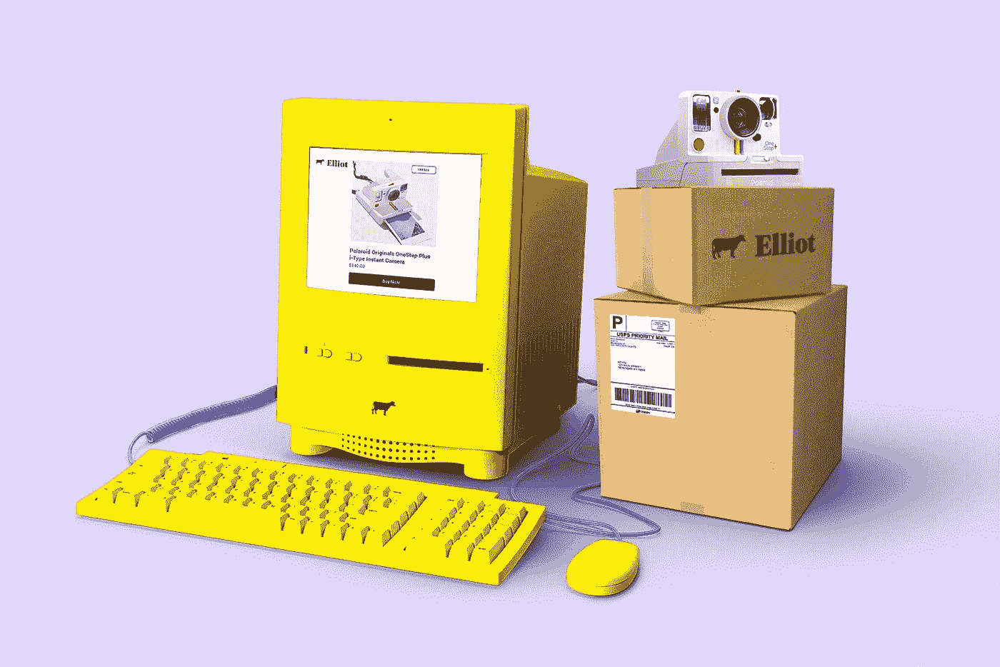
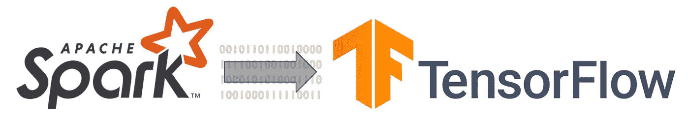
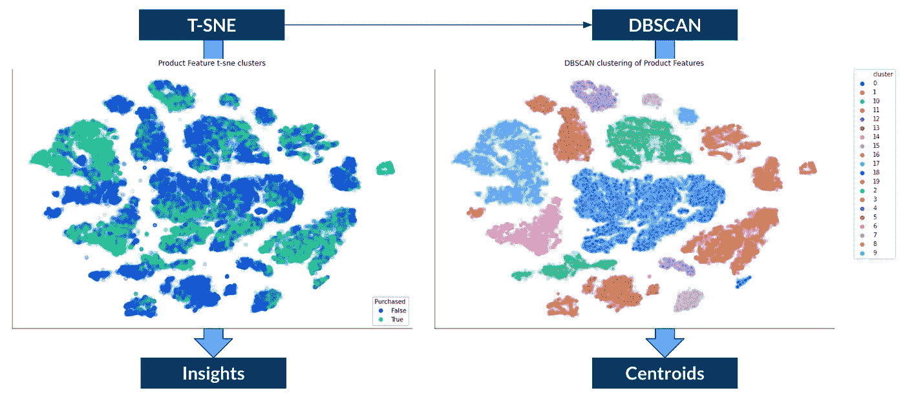

# 人工智能助力平台商业时代的顾客偏好

> 原文：<https://towardsdatascience.com/customer-preferences-in-the-age-of-the-platform-business-with-the-help-of-ai-98b0eabf42d9?source=collection_archive---------25----------------------->



照片由[晨酿](https://unsplash.com/@morningbrew?utm_source=unsplash&utm_medium=referral&utm_content=creditCopyText)在 [Unsplash](https://unsplash.com/s/photos/ecommerce?utm_source=unsplash&utm_medium=referral&utm_content=creditCopyText) 拍摄

## 在经营平台业务时，如何利用深度学习发现客户的喜好，了解产品库存

M 营销和产品团队的任务是了解客户。为此，他们关注**客户偏好**——动机、期望和倾向——这些与**客户需求**相结合，驱动他们的**购买决策**。

作为一名数据科学家，我了解到客户——他们的偏好和需求——很少(或者从来没有？)落入我们用来理解它们的简单的客观桶或分段中。相反，客户的偏好和需求是复杂的，相互交织的，并且不断变化。

虽然理解客户已经够有挑战性了，但许多现代数字企业也不太了解他们的产品。他们运营数字平台来促进生产者和消费者之间的交流。**数字平台商业模式**创造了具有网络效应的市场和社区，允许其用户进行互动和交易。平台企业不像线性企业那样通过供应链控制库存。


图片由来自 Pixabay 的[穆罕默德·哈桑](https://pixabay.com/users/mohamed_hassan-5229782)拍摄

描述平台业务的一个很好的方式是，他们不拥有生产手段，而是**创造连接手段**。平台业务的例子有**亚马逊**，**脸书**， **YouTube** ， **Twitter** ， **Ebay** ， **AirBnB** ，像 **Zillo** 这样的房地产门户网站，以及像旅游预订网站这样的聚合业务。在过去的几十年里，平台业务开始主导经济。

在平台业务时代，我们如何利用人工智能来理解我们的客户和产品？

这篇博文是我之前关于营销中行为数据新黄金标准的讨论的延续:

[](/data-science-powered-segmentation-models-ae89f9bd405f) [## 人工智能符合营销细分模型

### 新的黄金标准:使用机器学习从行为数据中获得用户和产品分类，为一个…

towardsdatascience.com](/data-science-powered-segmentation-models-ae89f9bd405f) 

在这篇博文中，我们使用了一种更先进的深度神经网络来为客户和产品建模。

# 神经网络体系结构


与 CCBY、 [ProSymbols](https://thenounproject.com/prosymbols) 、 [lastspark](https://thenounproject.com/lastspark) 、 [Juan Pablo Bravo](https://thenounproject.com/bravo)

我们使用具有以下元素的深度神经网络:

1.  **编码器**:获取描述产品或客户的输入数据，并将其映射到**特征嵌入中。**(嵌入被定义为将一些输入投影到另一个更方便的表示空间)
2.  **比较器**:将客户和产品特征嵌入组合成一个**偏好张量**。
3.  **预测器**:将偏好转化为**预测购买倾向**

我们使用神经网络来预测产品购买，因为我们知道购买决策是由客户的偏好和需求驱动的。因此，我们教导编码器从客户行为数据、客户和产品属性中提取此类偏好和需求。

我们可以分析和聚类学习到的客户和产品特征，以得出数据驱动的细分。稍后将详细介绍。


[晨酿](https://unsplash.com/@morningbrew?utm_source=unsplash&utm_medium=referral&utm_content=creditCopyText)在 [Unsplash](https://unsplash.com/s/photos/ecommerce?utm_source=unsplash&utm_medium=referral&utm_content=creditCopyText) 拍摄的照片

# TensorFlow 实现

以下代码使用 TensorFlow 2 和 Keras 来实现我们的神经网络架构:

代码创建 TensorFlow 特征列，可以使用**数字**以及**分类特征**。我们正在使用 **Keras** 功能 API 来定义我们的客户偏好神经网络，该网络可以使用**二进制交叉熵**作为损失函数，通过 Adam 优化器进行编译。

# 使用 Spark 训练数据

我们需要客户偏好模型的训练数据。作为一个平台企业，你的原始数据将属于**大数据**类别。为了从点击流、产品搜索和交易中准备 TB 的原始数据，我们使用 Spark。面临的挑战是将这两种技术结合起来，并将来自 Spark 的训练数据输入 TensorFlow。



[OC]

大量 TensorFlow 训练数据的最佳格式是将其存储为 **TFRecord 文件格式**，这是 TensorFlow 自己基于协议缓冲区的二进制存储格式。二进制格式**极大地提高了加载数据并将其输入模型训练的性能**。例如，如果您使用 csv 文件，您将花费大量计算资源来加载和解析数据，而不是训练您的神经网络。TFRecord 文件格式确保您的数据管道不会成为神经网络训练的瓶颈。

**Spark-TensorFlow 连接器**允许我们用 Spark 保存 TFRecords。只需将它作为 JAR 添加到新的 Spark 会话中，如下所示:

```
spark = (
  SparkSession.builder
  .master("yarn")
  .appName(app_name)
  .config("spark.submit.deployMode", "cluster")
  **.config("spark.jars.packages","org.tensorflow:spark-tensorflow-connector_2.11:1.15.0")**
  .getOrCreate()
)
```

并将火花数据帧写入 TFRecords，如下所示:

```
(
  training_feature_df
  .write.mode("overwrite")
  **.format("tfrecords")**
  **.option("recordType", "Example")
  .option("codec", "org.apache.hadoop.io.compress.GzipCodec")**
  .save(path)
)
```

要使用 TensorFlow 加载 TFRecords，需要定义记录的模式，并使用 TensorFlow 数据集 API 将数据集解析到 python 字典的迭代器中:

```
SCHEMA = {
  "col_name1": tf.io.FixedLenFeature([], tf.string, default_value="Null"),
  "col_name2: tf.io.FixedLenFeature([], tf.float32, default_value=0.0),
}data = (
  **tf.data.TFRecordDataset**(list_of_file_paths, compression_type="GZIP")
  .map(
    lambda record: **tf.io.parse_single_example**(record, SCHEMA),
    num_parallel_calls=num_of_workers
  )
  .batch(num_of_records)
  .prefetch(num_of_batches)
)
```

# 使用 Spark 和 PandasUDFs 进行批量评分

在训练我们的神经网络之后，有明显的实时评分应用，例如，在产品搜索中对搜索结果进行评分，以解决拥有成千上万产品的平台上的选择瘫痪问题。

但是有一个**高级分析**用例来查看产品/用户特性和偏好**洞察**，并创建**数据驱动细分**来帮助产品开发等。为此，我们对我们的整个客户群和产品目录进行评分，以获取我们模型的编码器和比较器的输出，用于**聚类**。

为了捕获中间神经网络层的输出，我们可以如下重塑我们训练的张量流:

```
trained_customer_preference_model = tf.keras.models.load_model(path)
customer_feature_model = tf.keras.Model(
  inputs=trained_customer_preference_model.input,
  outputs=trained_customer_preference_model.get_layer(
    "customer_features").output
)
```

出于性能原因，我们使用 **PandasUDF** 对 Spark 的用户进行评分，一次对一批用户进行评分:

```
from pyspark.sql import functions as F
import numpy as np
import pandas as pdspark = SparkSession.builder.getOrCreate()
customerFeatureModelWrapper = CustomerFeatureModelWrapper(path)
CUSTOMER_FEATURE_MODEL = spark.sparkContext.broadcast(customerFeatureModelWrapper)[**@F**](http://twitter.com/F)**.pandas_udf("array<float>", F.PandasUDFType.SCALAR)
def customer_features_udf(*cols):**
  model_input = dict(zip(FEATURE_COL_NAMES, cols))
  model_output = CUSTOMER_FEATURE_MODEL.value([model_input])
  return pd.Series([np.array(v) for v in model_output.tolist()])(
  customer_df
  .withColumn(
    "customer_features",
    **customer_features_udf(*model_input_cols)**
  )
)
```

我们必须将 TensorFlow 模型包装到一个包装器类中，以允许序列化、在 Spark 集群中广播以及在所有工作器上对模型进行反序列化。我使用 MLflow 来跟踪模型工件，但是您可以简单地将它们存储在任何没有 MLflow 的云存储上。实现一个下载功能，从 S3 或者任何存储模型的地方获取模型工件。

```
class CustomerFeatureModelWrapper(object):
  def __init__(self, model_path):
    self.model_path = model_path
    self.model = self._build(model_path)
  **def __getstate__(self):**
    return self.model_path
  **def __setstate__(self, model_path):**
    self.model_path = model_path
    self.model = self._build(model_path)
  **def _build(self, model_path):**
    local_path = download(model_path)
    return tf.keras.models.load_model(local_path)
```

你可以在我之前的文章中了解更多关于 **MLflow** 如何帮助你完成数据科学项目的信息:

[](/complete-data-science-project-template-with-mlflow-for-non-dummies-d082165559eb) [## 用 Mlflow 为非傻瓜完成数据科学项目模板。

### 数据科学项目最佳实践，适用于在本地或云中工作的每个人，从刚起步的忍者到大…

towardsdatascience.com](/complete-data-science-project-template-with-mlflow-for-non-dummies-d082165559eb) 

# 聚类和分割

使用 Spark 对我们的客户群和产品库存进行评分后，我们有了一个包含以下特征和偏好向量的数据框架:

```
+-----------+---------------------------------------------------+
|product_id |product_features                                   |
+-----------+---------------------------------------------------+
|product_1  |[-0.28878614, 2.026503, 2.352102, -2.010809, ...   |
|product_2  |[0.39889023, -0.06328985, 1.634547, 3.3479023, ... |
+-----------+---------------------------------------------------+
```


( [Pixabay](https://pixabay.com/illustrations/target-target-group-personal-3845096/) )

作为第一步，我们必须创建一个**有代表性的**但小得多的客户和产品样本，用于聚类。重要的是，你要**对你的样本进行**分层，每层的**客户和产品数量相等**。通常，我们有许多匿名客户，他们没有什么客户属性，比如人口统计等。为了分层。在这种情况下，我们可以根据客户与之交互的产品的产品属性对客户进行分层。这符合我们的一般假设，即他们的偏好和需求决定了他们的购买决策。在 Spark 中，您使用**地层键**创建一个新列。按层次获取客户和产品的总数，并计算每个层次对**样本的份额，大约等于按层次**的计数。你可以用 Spark 的

```
DataFrameStatFunctions.sampleBy(col_with_strata_keys, dict_of_sample_fractions, seed)
```

创建**分层样本**。

为了创建我们的**分割**，我们使用 **T-SNE** 来可视化我们的分层数据样本的高维特征向量。T-SNE 是一种随机 ML 算法，以可视化的方式降低维度，将相似的客户和产品聚集在一起。这也被称为**邻居嵌入**。我们可以使用额外的产品属性为 t-sne 结果着色，以解释我们的聚类，作为我们分析的一部分，从而产生洞察力。在我们从 T-SNE 获得结果之后，我们在 T-SNE 邻居嵌入上运行 **DBSCAN** 来找到我们的**聚类**。



[OC]

利用来自 DBSCAN 输出的集群标签，我们可以计算**集群质心**:

```
centroids = products[["product_features", "cluster"]].groupby(
    ["cluster"])["product_features"].apply(
    lambda x: np.mean(np.vstack(x), axis=0)
)cluster
0     [0.5143338, 0.56946456, -0.26320028, 0.4439753...
1     [0.42414477, 0.012167327, -0.662183, 1.2258132...
2     [-0.0057945233, 1.2221531, -0.22178105, 1.2349...
...
Name: product_embeddings, dtype: object
```

在我们获得**聚类质心**后，我们将所有的客户群和产品目录分配给它们的代表聚类。因为到目前为止，我们只对大约 50，000 个客户和产品进行了分层抽样。

我们再次使用 Spark 将我们所有的客户和产品分配到他们最近的集群质心。我们使用 **L1 规范**(或出租车距离)来计算客户/产品到群集质心的距离，以**强调每个特征对齐**。

```
**distance_udf = F.udf(lambda x, y, i: float(np.linalg.norm(np.array(x) - np.array(y), axis=0, ord=i)), FloatType())**customer_centroids = spark.read.parquet(path)
customer_clusters = (
    customer_dataframe
    .**crossJoin**(
        F.broadcast(customer_centroids)
    )
    .withColumn("distance", **distance_udf**("customer_centroid", "customer_features", F.lit(1)))
    .withColumn("distance_order", F.row_number().over(Window.partitionBy("customer_id").orderBy("distance")))
    .filter("distance_order = 1")
    .select("customer_id", "cluster", "distance")
)+-----------+-------+---------+
|customer_id|cluster| distance|
+-----------+-------+---------+
| customer_1|      4|13.234212|
| customer_2|      4| 8.194665|
| customer_3|      1|  8.00042|
| customer_4|      3|14.705576|
```

然后，我们可以总结我们的客户群，得出**集群突出度**:

```
total_customers = customer_clusters.count()
(
    customer_clusters
    .groupBy("cluster")
    .agg(
        F.count("customer_id").alias("customers"),
        F.avg("distance").alias("avg_distance")
    )
    .withColumn("pct", F.col("customers") / F.lit(total_customers))
)+-------+---------+------------------+-----+
|cluster|customers|      avg_distance|  pct|
+-------+---------+------------------+-----+
|      0|     xxxx|12.882028355869513| xxxx|
|      5|     xxxx|10.084179072882444| xxxx|
|      1|     xxxx|13.966814632296622| xxxx|
```

这完成了从我们的神经网络嵌入中导出数据驱动分段所需的所有步骤:


[OC]

在我的上一篇文章中阅读更多关于细分和从我们的模型中提取洞察力的方法:

[](/data-science-powered-segmentation-models-ae89f9bd405f) [## 人工智能符合营销细分模型

### 新的黄金标准:使用机器学习从行为数据中获得用户和产品分类，为一个…

towardsdatascience.com](/data-science-powered-segmentation-models-ae89f9bd405f) 

# 实时评分

要了解关于如何部署实时评分模型的更多信息，我推荐我以前的一篇文章:

[](/how-to-embed-a-spark-ml-model-as-a-kafka-real-time-streaming-application-for-production-deployment-933aecb79f3f) [## 如何将 Spark ML 模型作为 Kafka 实时流应用程序嵌入到生产部署中

### 用于生产评分的 2 种模型部署

towardsdatascience.com](/how-to-embed-a-spark-ml-model-as-a-kafka-real-time-streaming-application-for-production-deployment-933aecb79f3f) 

# 一般注意事项和建议

*   与链接文章中的协同过滤方法相比，神经网络学会了**一般化**，经过训练的模型可以用于新客户和新产品。神经网络有**没有冷启动**的问题。
*   如果除了历史购买和其他客户档案数据之外，您至少使用一些**行为数据**作为您客户的输入，那么您训练的模型甚至可以对没有任何交易或客户档案数据的新客户做出购买倾向预测。
*   学习到的产品特征嵌入将会比你的客户特征嵌入聚类成更大数量的不同聚类。大多数顾客都归入一个大群体并不罕见。这并不意味着 90%的顾客都是一样的。如简介中所述，您的大多数客户都有复杂、交织且不断变化的偏好和需求。这意味着它们不能被分成不同的组。**不代表他们是同一个**。集群的简化无法捕捉到这一点，这只是**重申了机器学习**对客户意义的需求。
*   虽然许多利益相关者会喜欢该模型产生的洞察力和细分，但该模型的真正价值在于其预测购买倾向的能力。


Jan 是公司数据转型方面的成功思想领袖和顾问，拥有将数据科学大规模应用于商业生产的记录。他最近被 dataIQ 评为英国 100 位最具影响力的数据和分析从业者之一。

**在 LinkedIn 上连接:**[**https://www.linkedin.com/in/janteichmann/**](https://www.linkedin.com/in/janteichmann/)

**阅读其他文章:**[**https://medium.com/@jan.teichmann**](https://medium.com/@jan.teichmann)