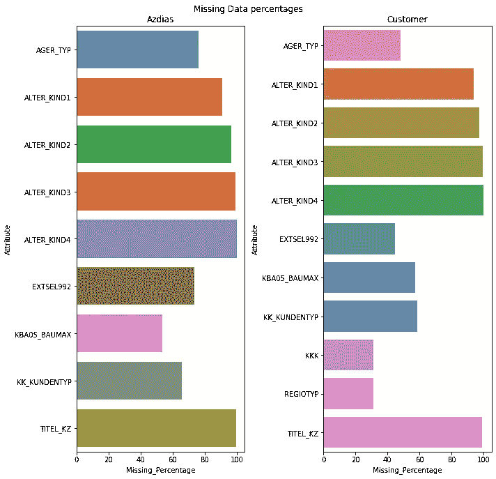
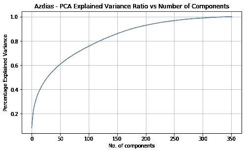
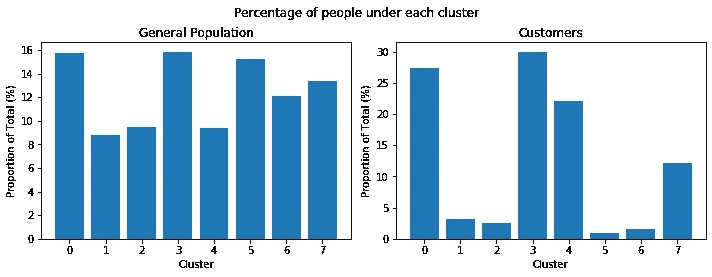
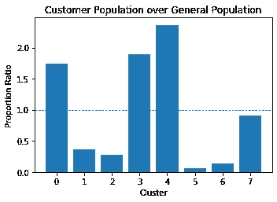

# 使用机器学习进行客户细分和获取

> 原文：<https://towardsdatascience.com/customer-segmentation-and-acquisition-using-machine-learning-a219ce0ec139?source=collection_archive---------8----------------------->

斯特凡诺·阿莱马尼在 [Unsplash](https://unsplash.com?utm_source=medium&utm_medium=referral) 上拍摄的照片

## 使用无监督学习根据人口统计数据将客户聚类成细分市场，并使用监督学习来预测潜在客户

# 介绍

这篇博文是关于我在 Udacity 的机器学习工程师纳米学位项目中做的最后一个项目。该项目基于 Arvato Financial Solutions 提供的真实数据。任务是了解销售有机产品的邮购公司的客户群，并将这些客户群与总体数据进行比较，以预测未来可能的客户。

这个项目尽可能接近真实世界的数据科学项目。这很有挑战性，也很有趣，我在这方面学到了很多。我决定写这篇关于我的学习的文章。

本文的结构:

*   什么是客户细分
*   项目介绍
*   数据描述和分析
*   使用无监督学习的客户细分
*   使用监督学习预测未来客户

# 客户细分

将客户分成具有共同特征的个体的过程称为客户细分。这种细分使营销人员能够为特定的客户群创建有针对性的营销信息，从而增加人们购买产品的机会。它允许他们创建和使用特定的沟通渠道来与不同的细分市场进行沟通，以吸引他们。一个简单的例子是，公司试图通过社交媒体帖子吸引年轻一代，通过广播广告吸引老一代。这有助于公司建立更好的客户关系，并提高公司的整体绩效。

## 三种最常见的客户细分类型

尽管有三种以上的客户细分类型，我们还是要看看三种最常见的客户细分策略。

## 1.人口细分

年龄、性别、教育程度、收入、财务状况等参数。从人口统计学的角度来看。这种细分是最常见的客户细分方法，因为这种数据易于获取和分析。此外，人口统计与一个人最重要的特征相对应，这将有助于营销人员做出明智的决策。例如，一家航空公司可以发送电子邮件，向低收入群体提供经济舱机票，向高收入群体提供头等舱机票。

## 2.地理分割

顾名思义，这种客户细分是基于一个人的物理位置来完成的。在这种情况下，一个制造空调系统的公司就是一个例子。它不能向印度和冰岛的人们提供同样的产品。

## 3.行为细分

这种客户细分是基于客户的行为数据。基于购买习惯、消费习惯、品牌互动、浏览历史或对应于行为或人的任何其他数据来进行分组。我们今天在网上看到的所有定向广告都使用某种行为细分来决定哪个广告针对哪个客户。

## 项目介绍

Arvato 在该项目中提供的数据是其客户的人口统计数据和德国一般人口的人口统计数据。因此，任务是根据人口统计数据进行客户细分。该数据包括对应于每个人的 366 个特征，这些特征指示年龄、性别、生活阶段、经济状况、家庭状况、家庭状况、房屋位置、邻居信息。这些特征只是数据中 366 个特征中的几个。

## 问题陈述

问题陈述表述为“给定一个人的人口统计数据，邮购公司如何高效地获取新客户”。

根据这一陈述，我们可以得出结论，我们必须以某种方式比较现有的客户数据和总体数据，以推断它们之间的关系。手动方式是比较客户和普通人群之间的统计数据。例如，可以比较年龄的平均值和标准偏差，以确定哪个年龄组更有可能成为客户，或者可以比较工资，以查看哪一组人成为客户，等等。

但是这种分析会给出许多结果，必须再次对这些结果进行分析，以得出最终的策略。这个过程将需要大量的时间，到这个分析完成时，市场上的竞争对手将占领大部分人口，公司将倒闭。今天，随着机器学习(ML)技术在每个领域的出现，这个问题也可以在 ML 算法的帮助下得到解决。

## 数据描述和分析

如前所述，Arvato 提供的数据包含现有客户的人口统计数据和一般人口数据。此外，还为监督学习部分提供了两个额外的文件，一个用于培训，一个用于测试。最后，测试集上的预测将提交给 Kaggle competition。此外，还提供了两个附加文件，其中包含有关特征值及其描述的信息。这两个文件是有益的，因为所有的功能名称都是德语和简短的形式。让我们看看关于数据集的信息。

普通人群-包含德国普通人群的人口统计数据，相当于 891，211 人，每个人有 366 个特征。(891211x366)

客户数据-包含邮购公司现有客户的人口统计数据，对应于 191，652 人，每个人有 369 个特征。这三个额外的特性是特定于公司的，涉及如何下订单以及订单的数量。(191652x366)

训练数据-由 42，982 人的人口统计数据组成，并带有一个除 366 之外的附加列，指示一个人是否是客户，用于训练监督学习模型。

测试数据-由 42，833 人的人口统计数据组成，具有相同的 366 个特征，但没有目标。

包含功能信息的两个附加文件

# 数据清理

数据分析从将错误记录的值替换为 NaN 值开始。这些错误记录的值是使用给定的信息文件确定的。例如，根据属性信息文件中给出的描述，列“LP_STATS_FEIN”只需包含“1–5”中的值，但给出的数据包含“0”。这意味着记录的这些值有错误，这些值必须被视为缺失值。属性信息文件还包含关于哪些值对应于某些列中的未知值的信息。这些信息在某种程度上是有帮助的，所有错误的信息都可以转换为缺失值。

图 1:缺失值超过 30%的列

在清理了错误记录的值之后，下一步是处理丢失的值本身。对每列缺失值的百分比进行分析，以确定有多少列有缺失值，以及它们是否包含多少百分比。图 1 显示了缺失值超过 30%的列。在此分析之后，选择阈值 30 来删除列。随后，必须按行对缺失值进行分析，以移除具有缺失特征的观测值。这里，选择每个观测值缺失 50 个特征的阈值来删除行。在此分析之后，得到的形状是:

普通人群— (737288x356)

客户数据— (13426x356)(忽略额外的客户特定功能)

## 特征工程

有一些用数值编码的分类特征(事实上有很多，但为了简单起见，只给出了几个)。这些特征用二进制编码。此外，一些功能包含太多信息，例如，在一个单独的列中包含关于财务状况和年龄的信息。这种类型的特征被识别，或者被重新编码以包含更广泛的信息，或者被分成两列以分别包含两种特征。在属性信息文件的帮助下，任何包含超过 20 个类别的特征要么被丢弃，要么被重新构建成有用的东西。

由于许多要素包含转储到单个列中的分类值，这一步有助于简化后面步骤的数据。这一步产生了 353 个特征。

## 输入缺失值

即使在根据某个阈值删除了列和行之后，我们仍然会得到一些缺少值的数据。这个问题在简单估算器的帮助下得到解决，它用一些我们可以控制的值来填充缺失的数据。数值特征的一般方法是用中值或平均值估算缺失值。但是更常见的分类特征方法是用最常见的值进行估算。由于数据对应于总体，因此用最常见的值来估算缺失值更为敏感。

现在，数据是干净的，可以进行建模了，最后一步是缩放数据，即将所有要素纳入同一范围。这是使用标准的定标器来完成的。

## 使用无监督学习的客户细分

对于聚类分割，需要执行两个步骤。

*   降维
*   使聚集

## 降维

虽然我们有 353 个特征，但并不是所有的特征都有变化，也就是说，有些特征对所有人来说可能是相同的。我们可以浏览这里的所有特性，看看每个特性有多少唯一值，以选择具有所需变化的特性。但是更系统的方法是在删除任何列之前执行某种分析。因此，已经进行了主成分分析来分析主成分分析成分的解释方差。PCA 对数据应用线性变换以形成新的坐标系，使得新坐标系中的分量代表数据的变化。

图 2: PCA 解释的方差图

这种分析将帮助我们确定有多少特征具有足够的方差来解释数据中的变化。解释的方差图用于选择分量的数量，即缩减坐标空间中的维数。从上面的图中可以看出，在大约 150 个组件的帮助下，几乎 90%的差异都可以得到解释。现在，在 PCA 变换之后，我们剩下 150 个 PCA 分量，每个分量由主要特征之间的线性组合组成。

# 使聚集

降维之后，下一步就是把普通人群和客户人群划分成不同的细分。K-Means 聚类算法已被选为这项任务。因为它测量两个观察值之间的距离来分配一个聚类，所以它是简单的并且适合于这个任务。该算法将帮助我们在简化特征的帮助下将一般人群分成指定数量的聚类，并使用该聚类信息来了解一般人群和客户数据中的相似性。借助于肘形图，群集的数量被选择为“8”。

# 聚类分析

图 3:集群比例

普通人群和客户人群已经被分成了几个部分。图 3 显示了进入每个集群的人口比例。一般群体的聚类分布是均匀的，这意味着一般群体已被均匀地聚类成 8 个段。但客户群似乎来自“0”、“3”、“4”和“7”这几个类别。如图 4 所示，我们可以通过计算客户群和普通人群群的比例来进一步证实这一点。

图 4:集群比例比率

如图 4 所示，如果比例比大于 1，这意味着该集群在现有人口中拥有更多的客户，并有可能拥有更多的未来客户。如果比率小于 1，这意味着这些集群拥有未来客户的可能性最小。

还执行更详细的聚类分析，解释每个聚类和相应的组件。它记录在用于本项目的 [jupyter 笔记本](https://github.com/pranaymodukuru/Bertelsmann-Arvato-customer-segmentation/blob/master/Arvato%20Project%20Workbook.ipynb)中。我不在这里解释，因为这篇博文已经太长了。

# 使用监督学习获取客户

在分析了一般人群和客户数据之后，了解应该关注哪些细分市场。我们可以进一步扩展这种分析，利用最大似然算法来进行决策。由于我们已经有了客户数据和一般人群数据，我们可以将它们组合起来形成训练数据，并训练 ML 模型来预测是否接近客户。

在这种情况下，使用给定的训练和测试数据进行监督学习。由于该问题是一个高度不平衡的分类，AUROC 分数已被选为评估标准。基线性能是用逻辑回归模型设置的，该模型在基于树的集成模型的帮助下得到进一步改进。AdaboostClassifier 和 XGBoostClassifier 是最终选定的模型，它们的预测被提交给 Kaggle，以便在只有两次提交的情况下(在提交之日)获得前 30%的位置。

图 5: Kaggle 排行榜

# 结论

使用无监督学习算法对普通人群和顾客人群进行了比较和分割。我们能够确定哪些集群有更多的客户，哪些是潜在的集群有可能的客户。我们还使用监督学习算法，根据人口统计数据预测未来可能的客户。

由此产生的分析产生了很好的结果，使我在竞赛领导委员会中名列前 30%。排行榜的最高分是 0.81063，和我达到的分数(0.80027)相差不远。数据准备步骤还有改进的余地。

在[项目报告](https://github.com/pranaymodukuru/Bertelsmann-Arvato-customer-segmentation/blob/master/Report.pdf)中给出了对每个步骤以及算法和指标选择背后的原因的更全面的解释，并且所有步骤都记录在这个[笔记本](https://github.com/pranaymodukuru/Bertelsmann-Arvato-customer-segmentation/blob/master/Arvato%20Project%20Workbook.ipynb)中。

最后，我要感谢 Arvato Financial Solutions 和 Udacity 提供了这个处理真实数据的绝佳机会。这帮助我获得了宝贵的经验，并帮助我使用和提高我的技能。

# 参考

1.  [https://www . business 2 community . com/customer-experience/4-type-of-customer-segmentation-all-markets-should-know-02120397](https://www.business2community.com/customer-experience/4-types-of-customer-segmentation-all-marketers-should-know-02120397)
2.  [https://blog.alexa.com/types-of-market-segmentation/](https://blog.alexa.com/types-of-market-segmentation/)
3.  [https://clever tap . com/blog/customer-segmentation-examples-for-better-mobile-marketing/](https://clevertap.com/blog/customer-segmentation-examples-for-better-mobile-marketing/)
4.  [https://www.shopify.com/encyclopedia/customer-segmentation](https://www.shopify.com/encyclopedia/customer-segmentation)
5.  [https://www.liveagent.com/academy/customer-segmentation/](https://www.liveagent.com/academy/customer-segmentation/)
6.  [https://www . data novia . com/en/lessons/determining-the-optimal-number-of-clusters-3-must-know-methods/](https://www.datanovia.com/en/lessons/determining-the-optimal-number-of-clusters-3-must-know-methods/)
7.  [https://towards data science . com/what-metrics-we-should-use-on-unbalanced-data-set-precision-recall-roc-e2e 79252 aeba](/what-metrics-should-we-use-on-imbalanced-data-set-precision-recall-roc-e2e79252aeba)

*原载于 2020 年 4 月 16 日*[*https://pranaymudukuru . github . io*](https://pranaymodukuru.github.io/post/customer-segmentation/)*。*