# Python 中的客户细分

> 原文：<https://towardsdatascience.com/customer-segmentation-in-python-9c15acf6f945?source=collection_archive---------4----------------------->

## 无监督学习

## 基于 K-均值聚类算法的图像分割。


里卡多·戈麦斯·安吉尔在 [Unsplash](https://unsplash.com/s/photos/difference?utm_source=unsplash&utm_medium=referral&utm_content=creditCopyText) 上的照片

T4:假设我们有一家公司销售该产品，你想知道该产品的销售情况如何。

你有我们可以分析的数据，但是我们能做什么样的分析呢？

嗯，我们可以根据客户在市场上的购买行为对他们进行细分。

请记住，数据非常庞大，我们无法用肉眼来分析。我们将使用机器学习算法和计算能力。

本文将向您展示如何使用 Python 中的 K-Means 算法根据客户的行为对客户进行聚类。

我希望这篇文章能帮助你从准备数据到聚类，一步一步地进行客户细分。

# 行动（或活动、袭击）计划

在我们进入这个过程之前，我会简要地告诉你我们将采取什么样的步骤。

*   **收集数据**
*   **创建最近频率货币(RFM)表**
*   **管理偏斜度并衡量每个变量**
*   **探索数据**
*   **对数据进行聚类**
*   **解读结果**

# 分析

## **数据收集**

在这一步中，我们将首先收集数据。对于这种情况，我们将从 UCI 机器学习中获取名为在线零售数据集的数据。

数据集本身是一个交易数据，包含一家英国在线零售商从 2010 年 12 月 1 日到 2011 年 12 月 9 日的交易。

每一行代表发生的交易。它包括产品名称、数量、价格和其他表示 ID 的列。

您可以从[这里](https://archive.ics.uci.edu/ml/datasets/online+retail)访问数据集。

这是数据集的大小。

```
(541909, 8)
```

在这种情况下，我们不使用所有的行。相反，我们将从数据集中抽取 10000 行作为样本，并假设这是客户进行的全部交易。

代码看起来会像这样，

```
**# Import The Libraries**
# ! pip install xlrd
import pandas as pd
import matplotlib.pyplot as plt
import numpy as np**# Import The Dataset**
df = pd.read_excel('dataset.xlsx')
df = df[df['CustomerID'].notna()]**# Sample the dataset**
df_fix = df.sample(10000, random_state = 42)
```

这是数据集的一瞥，

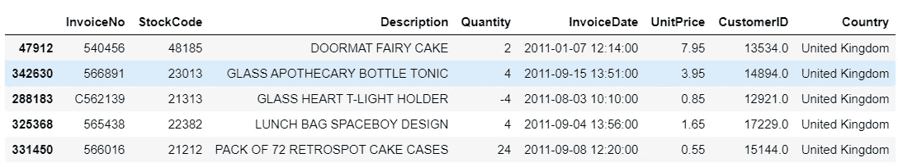

## **创建 RFM 表**

在我们对数据进行采样之后，我们将使数据更容易进行分析。

为了细分客户，我们可以使用一些指标，如客户上次购买产品的时间、客户购买产品的频率以及客户为产品支付的金额。我们将这种分割称为 RFM 分割。

为了制作 RFM 表，我们可以创建这些列，比如 Recency、Frequency 和 MonetaryValue 列。

要获得最近的天数列，我们可以用事务发生的日期减去快照日期。

要创建 frequency 列，我们可以计算每个客户的交易量。

最后，为了创建货币值列，我们可以对每个客户的所有交易进行求和。

代码看起来像这样，

```
**# Convert to show date only** from datetime import datetime
df_fix["InvoiceDate"] = df_fix["InvoiceDate"].dt.date**# Create TotalSum colummn**
df_fix["TotalSum"] = df_fix["Quantity"] * df_fix["UnitPrice"]**# Create date variable that records recency**
import datetime
snapshot_date = max(df_fix.InvoiceDate) + datetime.timedelta(days=1)**# Aggregate data by each customer**
customers = df_fix.groupby(['CustomerID']).agg({
    'InvoiceDate': lambda x: (snapshot_date - x.max()).days,
    'InvoiceNo': 'count',
    'TotalSum': 'sum'})**# Rename columns**
customers.rename(columns = {'InvoiceDate': 'Recency',
                            'InvoiceNo': 'Frequency',
                            'TotalSum': 'MonetaryValue'}, inplace=True)
```

这是数据集的一瞥，

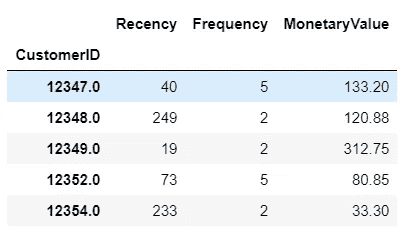

目前，数据集由最近、频率和货币值列组成。但是我们还不能使用数据集，因为我们必须对数据进行更多的预处理。

## **管理偏斜度和缩放比例**

我们必须确保数据符合这些假设，

> 数据应该满足假设，即变量没有偏斜，并且具有相同的均值和方差。

正因为如此，我们必须管理变量的偏斜度。

这是每个变量的可视化，

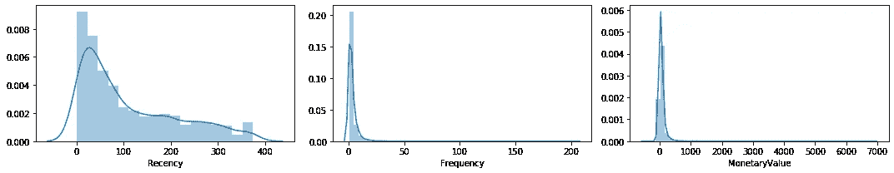

从左到右:最近、频率和货币值列

正如我们从上面看到的，我们必须转换数据，所以它有一个更对称的形式。

我们可以使用一些方法来管理偏度，它们是，

*   **日志转换**
*   **平方根变换**
*   **box-cox 变换**

> 注意:当且仅当变量只有正值时，我们才能使用转换。

下面是每个变量的可视化，有和没有转换。每个变量从左上顺时针方向显示了没有变换、对数变换、平方根变换和 box-cox 变换的图。

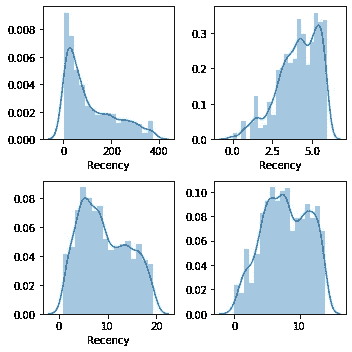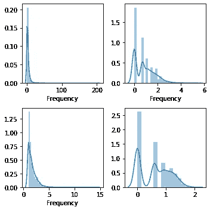

左:最近列，右:频率列

基于这种可视化，它显示了具有 box-cox 变换的变量显示出比其他变换更对称的形式。

为了确保这一点，我们使用 skew 函数计算每个变量。结果看起来像这样，

```
**variable, without, log, sqrt, box-cox transformations
Recency, 14.77, 0.85, 3.67, 0.16
Frequency, 0.93, -0.72, 0.32, -0.1**
```

下面是如何解读偏斜度值。如果该值接近 0，变量往往具有对称形式。然而，如果不是这样，变量就有偏斜。基于这种计算，我们使用使用 box-cox 变换的变量。

基于该计算，我们将利用使用 box-cox 变换的变量。MonetaryValue 变量除外，因为该变量包含负值。为了处理这个变量，我们可以对数据使用立方根变换，所以比较看起来像这样，

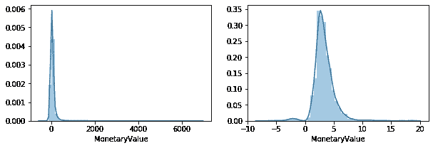

不含和含立方根变换

通过使用这种转换，我们将得到不那么扭曲的数据。偏斜度值从 16.63 下降到 1.16。因此，我们可以用这段代码转换 RFM 表，

```
from scipy import stats
customers_fix = pd.DataFrame()
customers_fix["Recency"] = stats.boxcox(customers['Recency'])[0]
customers_fix["Frequency"] = stats.boxcox(customers['Frequency'])[0]
customers_fix["MonetaryValue"] = pd.Series(np.cbrt(customers['MonetaryValue'])).values
customers_fix.tail()
```

它看起来会像这样，

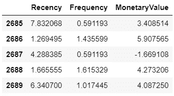

我们现在能使用数据吗？还没有。如果我们再看一下这个图，每个变量都没有相同的均值和方差。我们必须把它正常化。为了规范化，我们可以使用 scikit-learn 库中的 StandardScaler 对象来实现。代码看起来会像这样，

```
**# Import library**
from sklearn.preprocessing import StandardScaler**# Initialize the Object**
scaler = StandardScaler()**# Fit and Transform The Data**
scaler.fit(customers_fix)
customers_normalized = scaler.transform(customers_fix)**# Assert that it has mean 0 and variance 1**
print(customers_normalized.mean(axis = 0).round(2)) **# [0\. -0\. 0.]** print(customers_normalized.std(axis = 0).round(2)) **# [1\. 1\. 1.]**
```

数据会像这样，

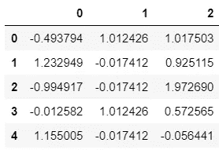

最后，我们可以使用这些数据进行聚类。

## 系统模型化

在我们对数据进行预处理之后，现在我们可以专注于建模了。为了从数据中进行分割，我们可以使用 K-Means 算法来实现。

K-Means 算法是一种无监督学习算法，它使用几何原理来确定哪个聚类属于数据。通过确定每个质心，我们计算到每个质心的距离。如果每个数据与另一个数据的距离最小，则该数据属于一个质心。如此重复，直到下一次总距离没有比之前有显著变化。

用 Python 实现 K-Means 很容易。我们可以使用 scikit 中的 KMeans 函数——学会做这件事。

为了使我们的聚类达到最佳性能，我们必须确定哪个超参数适合数据。为了确定哪个超参数最适合我们的模型和数据，我们可以使用肘方法来决定。代码看起来会像这样，

```
from sklearn.cluster import KMeanssse = {}
for k in range(1, 11):
    kmeans = KMeans(n_clusters=k, random_state=42)
    kmeans.fit(customers_normalized)
    sse[k] = kmeans.inertia_ # SSE to closest cluster centroidplt.title('The Elbow Method')
plt.xlabel('k')
plt.ylabel('SSE')
sns.pointplot(x=list(sse.keys()), y=list(sse.values()))
plt.show()
```

这是结果，

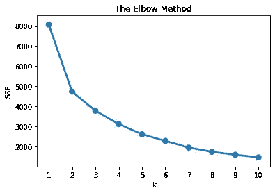

如何解读剧情？x 轴是 k 的值，y 轴是数据的 SSE 值。我们将通过查看 k 值在下一个连续 k 值的线性趋势来选择最佳参数。

根据我们的观察，k 值为 3 是我们模型的最佳超参数，因为下一个 k 值往往具有线性趋势。因此，我们对数据的最佳模型是 **K-Means，聚类数是 3** 。

现在，我们可以用这段代码来拟合这个模型，

```
model = KMeans(n_clusters=3, random_state=42)
model.fit(customers_normalized)
model.labels_.shape
```

通过拟合模型，我们可以得到每个数据所属的聚类。借此，我们可以分析数据。

## 解释该部分

我们可以根据聚类来总结 RFM 表，并计算每个变量的平均值。代码看起来会像这样，

```
customers["Cluster"] = model.labels_
customers.groupby('Cluster').agg({
    'Recency':'mean',
    'Frequency':'mean',
    'MonetaryValue':['mean', 'count']}).round(2)
```

代码的输出如下所示，

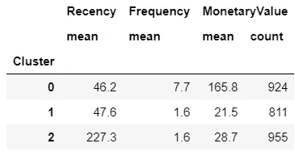

汇总表

除此之外，我们可以使用**蛇情节**来分析片段。它需要标准化数据集和聚类标签。通过使用该图，我们可以很好地从数据中直观地了解集群之间的差异。我们可以通过使用这些代码来绘制图表，

```
**# Create the dataframe**
df_normalized = pd.DataFrame(customers_normalized, columns=['Recency', 'Frequency', 'MonetaryValue'])
df_normalized['ID'] = customers.index
df_normalized['Cluster'] = model.labels_**# Melt The Data**
df_nor_melt = pd.melt(df_normalized.reset_index(),
                      id_vars=['ID', 'Cluster'],
                      value_vars=['Recency','Frequency','MonetaryValue'],
                      var_name='Attribute',
                      value_name='Value')
df_nor_melt.head()**# Visualize it**
sns.lineplot('Attribute', 'Value', hue='Cluster', data=df_nor_melt)
```

这是结果，

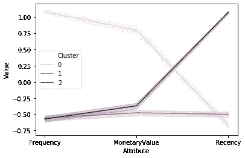

蛇的阴谋

通过使用这个图，我们知道每个部分是如何不同的。它描述的比我们使用的汇总表更多。

我们推断，集群 0 是经常性的，花费更多，他们最近购买产品。因此，这可能是一群**的忠实客户**。

然后，集群 1 的频率较低，花费较少，但他们最近购买了该产品。因此，它可能是**新客户**的集群。

最后，集群 2 的频率更低，花费更少，他们在旧时间购买产品。因此，这可能是一群**被搅动的顾客**。

# 结论

总之，客户细分对于了解每个客户的特征是非常必要的。本文向您展示了如何使用 Python 实现它。希望这篇文章对你有用，可以落实到你的案例上。

如果你想知道代码是如何编写的，你可以查看这个谷歌实验室[这里](https://colab.research.google.com/github/khalidmeister/Customer-Segmentation-using-Python/blob/master/Customer%20Segmentation%20in%20Python.ipynb)。

## 参考

[1] Daqing C .，Sai L.S，和 kung g .*在线零售业的数据挖掘:使用数据挖掘进行基于 RFM 模型的客户细分的案例研究* (2012)，数据库营销和客户战略管理杂志*。*
【2】mill man k . J，Aivazis M. *面向科学家和工程师的 Python*(2011)，科学中的计算&工程*。*
【3】[rade CII](https://towardsdatascience.com/@radecicdario?source=post_page-----1334e0debf45----------------------)[D](https://towardsdatascience.com/@radecicdario?source=post_page-----1334e0debf45----------------------)。 [*处理偏斜数据的 3 大方法*](/top-3-methods-for-handling-skewed-data-1334e0debf45) (2020)，走向数据科学。
【4】[*肘法求 k 中最优值 KMeans*](https://www.geeksforgeeks.org/elbow-method-for-optimal-value-of-k-in-kmeans/) ，极客为极客。

## 感谢您阅读我的文章，您也可以在下面查看我以前的文章:

[](/introduction-to-time-series-analysis-with-r-a2f97650baa3) [## R 时间序列分析导论

### 从探索，到预测。使用印度尼西亚 2002 年 12 月至 2020 年 4 月的消费者价格指数(CPI)数据

towardsdatascience.com](/introduction-to-time-series-analysis-with-r-a2f97650baa3) [](/time-series-forecasting-with-arima-model-in-r-77f4e2ae7abb) [## R 中 ARIMA 模型的时间序列预测

### 从勘探到预测 1970 年至 2015 年的二氧化碳排放数据。

towardsdatascience.com](/time-series-forecasting-with-arima-model-in-r-77f4e2ae7abb) [](/data-engineering-for-entrepreneurs-fa10f9190831) [## 企业家的数据工程

### 这是一家更加数据驱动的公司。

towardsdatascience.com](/data-engineering-for-entrepreneurs-fa10f9190831)