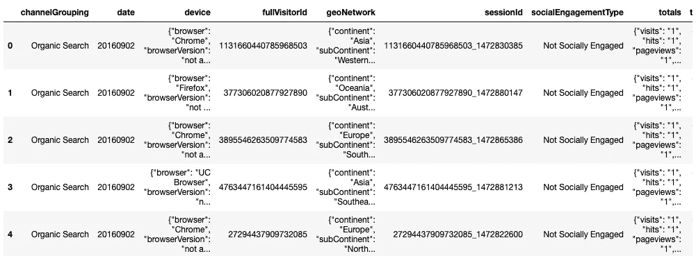
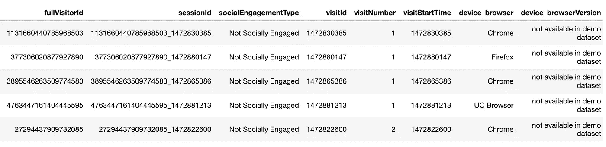
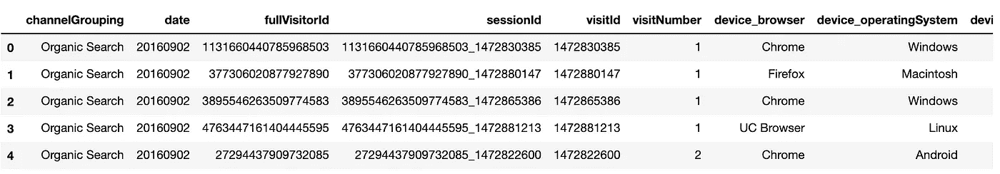
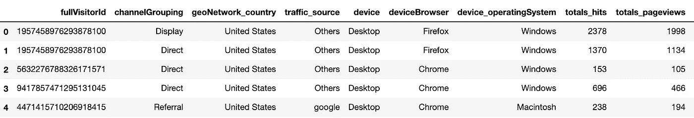
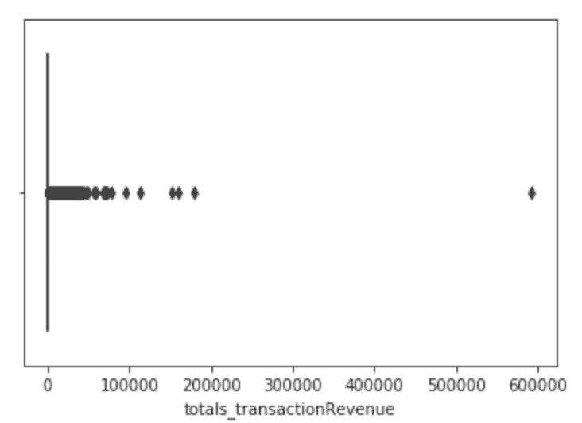
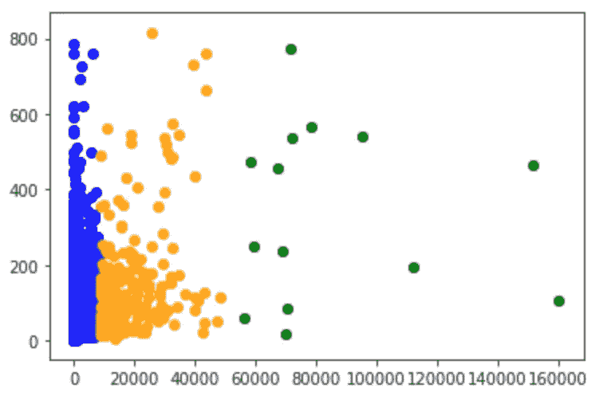
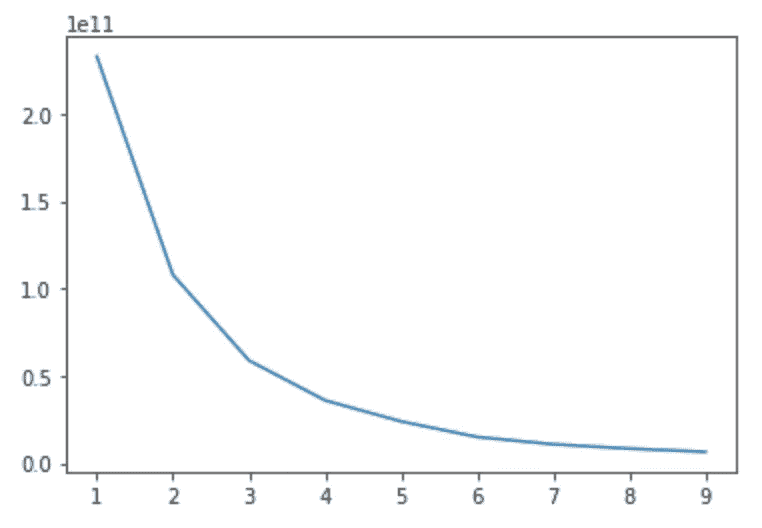
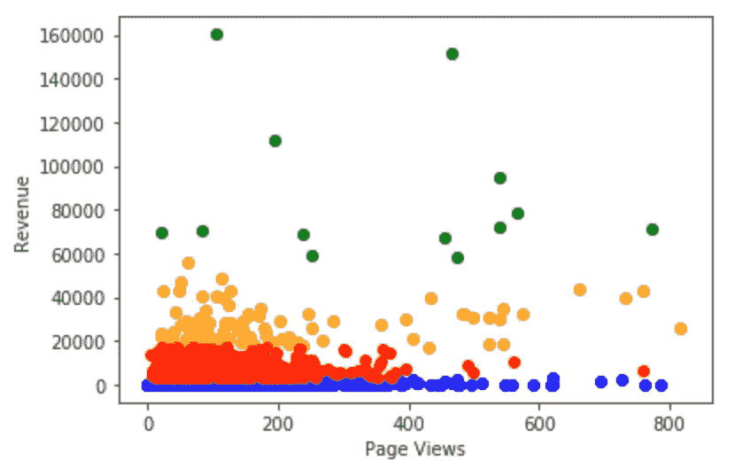
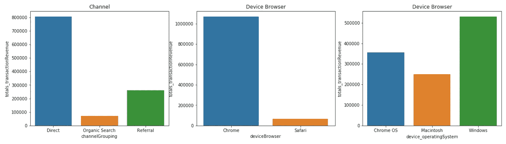
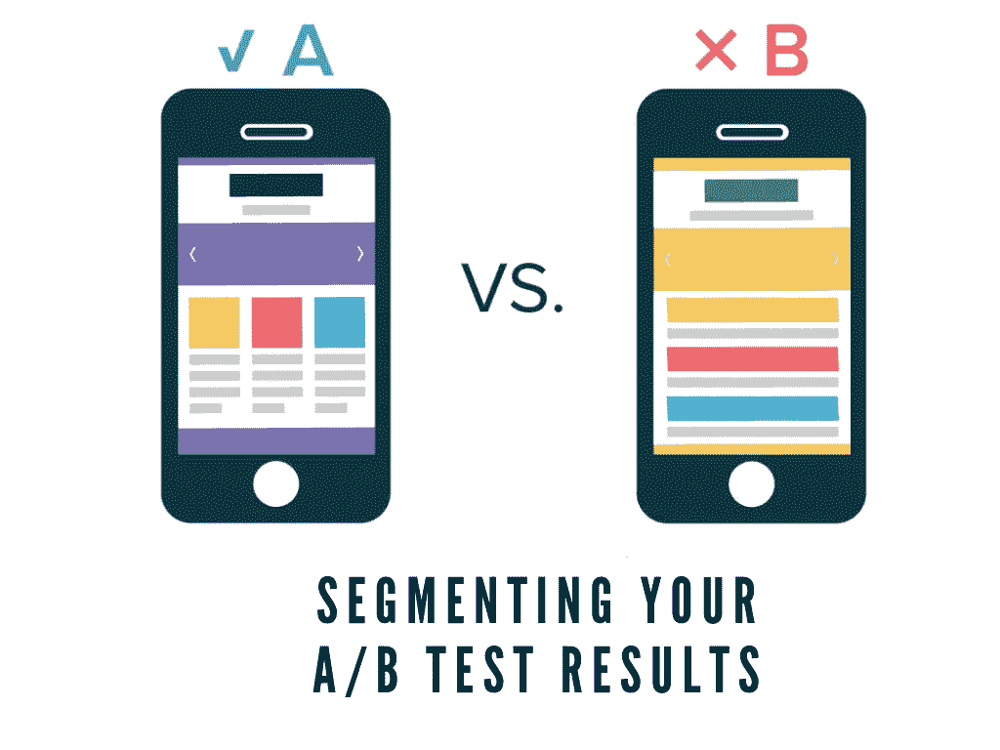

# 客户细分:K 均值聚类和 A/B 检验

> 原文：<https://towardsdatascience.com/customer-segmentation-k-means-clustering-a-b-testing-bd26a94462dd?source=collection_archive---------17----------------------->

## 该项目旨在研究数字平台上的客户行为，在没有任何先验知识的情况下对客户进行分组，并进行 A/B 测试，以帮助提高业务绩效。


照片由 [nrd](https://unsplash.com/@nicotitto?utm_source=medium&utm_medium=referral) 在 [Unsplash](https://unsplash.com?utm_source=medium&utm_medium=referral) 上拍摄

# 语境

我在广告业工作了近 3 年，特别是数字媒体和表演，客户行为分析是我日常工作的核心内容之一。在不同分析平台(例如 Google Analytics、Adobe Analytics)的帮助下，我的生活变得比以前更加轻松，因为这些平台自带了内置的细分功能，可以跨维度和指标分析用户行为。

然而，尽管提供了便利，我还是希望 ***利用机器学习来进行客户细分*** ，这可以 ***扩展并适用于*** 数据科学中的其他优化(例如 A/B 测试)。然后，我偶然发现了 Google Analytics 为 Kaggle 比赛提供的数据集，并决定将它用于这个项目。

如果您感兴趣，请随意查看数据集[这里](https://www.kaggle.com/c/ga-customer-revenue-prediction/data)！注意数据集有几个子数据集， ***每个子数据集都有超过 90 万行*** ！

# A.解释性数据分析(EDA)

*这始终是每个数据科学项目中必不可少的一步，以确保数据集干净并经过适当的预处理以用于建模。*

首先，让我们导入所有必需的库并读取 csv 文件:

```
import pandas as pd
import matplotlib.pyplot as plt
import numpy as np
import seaborn as snsdf_raw = pd.read_csv("google-analytics.csv")
df_raw.head()
```



## 1.展平 JSON 字段

正如您所看到的，上面的原始数据集有点“混乱”，根本不容易理解，因为一些变量被格式化为 JSON 字段，将不同子变量的不同值压缩到一个字段中。例如，对于地理网络变量，我们可以知道有几个子变量，如大陆、次大陆等。组合在一起。

多亏了 Kaggler 的帮助，我能够通过**展平那些 JSON 字段**，将这些变量转换成更容易理解的变量:

```
import os
import json
from pandas import json_normalizedef load_df(csv_path="google-analytics.csv", nrows=None):
    json_columns = ['device', 'geoNetwork', 'totals', 'trafficSource']
    df = pd.read_csv(csv_path, converters={column: json.loads for column in json_columns},dtype={'fullVisitorID':'str'}, nrows=nrows)
    for column in json_columns:
        column_converted = json_normalize(df[column])
        column_converted.columns = [f"{column}_{subcolumn}" for subcolumn in column_converted.columns]
        df = df.drop(column, axis=1).merge(column_converted, right_index=True, left_index=True)
    return df
```



在展平这些 JSON 字段后，我们能够看到一个更加清晰的数据集，尤其是那些被拆分为子变量的 JSON 变量(例如，设备被拆分为 device_browser、device_browserVersion 等。).

## 2.数据重新格式化和分组

对于这个项目，我选择了我认为对用户行为有更好影响或相关性的变量:

```
df = df.loc[:,['channelGrouping', 'date', 'fullVisitorId', 'sessionId', 'visitId', 'visitNumber', 'device_browser', 'device_operatingSystem', 'device_isMobile', 'geoNetwork_country', 'trafficSource_source', 'totals_visits', 'totals_hits', 'totals_pageviews', 'totals_bounces', 'totals_transactionRevenue']]df = df.fillna(value=0)
df.head()
```



接下来，由于新数据集的变量更少，但数据类型不同，我花了一些时间来分析每个变量，以确保数据在建模前“足够干净”。下面是一些要清理的未清理数据的快速示例:

```
**#Format the values**
df.channelGrouping.unique()
df.channelGrouping = df.channelGrouping.replace("(Other)", "Others")**#Convert boolean type to string** 
df.device_isMobile.unique()
df.device_isMobile = df.device_isMobile.astype(str)
df.loc[df.device_isMobile == "False", "device"] = "Desktop"
df.loc[df.device_isMobile == "True", "device"] = "Mobile"**#Categorize similar values**df['traffic_source'] = df.trafficSource_sourcemain_traffic_source = ["google","baidu","bing","yahoo",...., "pinterest","yandex"]df.traffic_source[df.traffic_source.str.contains("google")] = "google"
df.traffic_source[df.traffic_source.str.contains("baidu")] = "baidu"
df.traffic_source[df.traffic_source.str.contains("bing")] = "bing"
df.traffic_source[df.traffic_source.str.contains("yahoo")] = "yahoo"
.....
df.traffic_source[~df.traffic_source.isin(main_traffic_source)] = "Others"
```

重新格式化后，我发现 fullVisitorID 的唯一值少于数据集的总行数，这意味着记录了多个 full visitorid。因此，我继续按 fullVisitorID 对变量进行分组，并按收入进行排序:

```
df_groupby = df.groupby(['fullVisitorId', 'channelGrouping', 'geoNetwork_country', 'traffic_source', 'device', 'deviceBrowser', 'device_operatingSystem'])
               .agg({'totals_hits':'sum', 'totals_pageviews':'sum', 'totals_bounces':'sum','totals_transactionRevenue':'sum'})
               .reset_index()df_groupby = df_groupby.sort_values(by='totals_transactionRevenue', ascending=False).reset_index(drop=True)
```



df.groupby()和 df.sort_values()

## 3.异常值处理

任何 EDA 过程中不可忽视的最后一步是检测和处理数据集的异常值。原因是异常值，尤其是那些边缘极端的异常值，会影响机器学习模型的性能，大多数是负面的。也就是说，我们需要从数据集中移除这些异常值，或者转换它们(通过均值或模式)以使它们适合大多数数据点所在的范围:

```
**#Seaborn Boxplot to see how far outliers lie compared to the rest** sns.boxplot(df_groupby.totals_transactionRevenue)
```



sns.boxplot()

如您所见，大多数收入数据点都低于 200，000 美元，只有一个极端异常值接近 600，000 美元。如果我们不移除这个异常值，模型也会考虑它，从而产生不太客观的反映。

因此，让我们继续下去，并删除它，并请这样做，为其他变量。简单说明一下，有几种处理异常值(比如分位数间)的方法。然而，在我的例子中，只有一个，所以我只是继续定义我认为非常适合的范围:

```
df_groupby = df_groupby.loc[df_groupby.totals_transactionRevenue < 200000]
```

# B.k 均值聚类

什么是 K 均值聚类，它如何帮助客户细分？

聚类是最著名的无监督学习技术，它通过识别相似的组/聚类，特别是借助 K-Means，在未标记的数据中发现结构。

K-Means 试图解决两个问题:(1) K: **我们期望在数据集中找到的聚类**(组)的数量，以及(2) Means: **我们试图最小化的数据到每个聚类中心**(质心)的平均距离。

此外，值得注意的一点是，K-Means 有几种变体，典型的有:

1.  **init = 'random':** 随机选择每个簇的质心
2.  **init = 'k-means++':** 随机选择第一个质心，其他质心尽可能远离第一个质心

在这个项目中，我将使用第二个选项来确保每个集群之间有很好的区分:

```
from sklearn.cluster import KMeansdata = df_groupby.iloc[:, 7:]kmeans = KMeans(n_clusters=3, init="k-means++")
kmeans.fit(data)labels = kmeans.predict(data)
labels = pd.DataFrame(data=labels, index = df_groupby.index, columns=["labels"])
```

在应用该算法之前，我们需要定义“ **n_clusters** ”，这是我们期望从建模中得到的组的数量。这种情况下，我随机放 n_clusters = 3。然后，我继续使用两个变量可视化数据集是如何分组的:收入和浏览量:

```
plt.scatter(df_kmeans.totals_transactionRevenue[df_kmeans.labels == 0],df_kmeans.totals_pageviews[df_kmeans.labels == 0], c='blue')plt.scatter(df_kmeans.totals_transactionRevenue[df_kmeans.labels == 1], df_kmeans.totals_pageviews[df_kmeans.labels == 1], c='green')plt.scatter(df_kmeans.totals_transactionRevenue[df_kmeans.labels == 2], df_kmeans.totals_pageviews[df_kmeans.labels == 2], c='orange')plt.show()
```



如你所见，x 轴代表收入数，而 y 轴代表浏览量。建模后，我们可以看出 3 个集群有一定程度的差异。然而，我不确定 3 是否是集群的“正确”数量。也就是说，我们可以依赖 K-Means 算法的估计量， **inertia_** ，它是每个样本到质心的距离。特别是，在我的例子中，我们将比较范围从 1 到 10 的每个集群的惯性，并查看哪个是最低的以及我们应该走多远:

```
#Find the best number of clustersnum_clusters = [x for x in range(1,10)]
inertia = []for i in num_clusters:
    model = KMeans(n_clusters = i, init="k-means++")
    model.fit(data)
    inertia.append(model.inertia_)

plt.plot(num_clusters, inertia)
plt.show()
```



型号.惯性 _

从上面的图表中，惯性从第 4 个或第 5 个集群开始缓慢下降，这意味着这是我们可以获得的最低惯性，所以我决定使用“ **n_clusters=4** ”:

```
plt.scatter(df_kmeans_n4.totals_pageviews[df_kmeans_n4.labels == 0], df_kmeans_n4.totals_transactionRevenue[df_kmeans_n4.labels == 0], c='blue')plt.scatter(df_kmeans_n4.totals_pageviews[df_kmeans_n4.labels == 1],
df_kmeans_n4.totals_transactionRevenue[df_kmeans_n4.labels == 1], c='green')plt.scatter(df_kmeans_n4.totals_pageviews[df_kmeans_n4.labels == 2],
df_kmeans_n4.totals_transactionRevenue[df_kmeans_n4.labels == 2], c='orange')plt.scatter(df_kmeans_n4.totals_pageviews[df_kmeans_n4.labels == 3],
df_kmeans_n4.totals_transactionRevenue[df_kmeans_n4.labels == 3], c='red')plt.xlabel("Page Views")
plt.ylabel("Revenue")plt.show()
```



将浏览量切换到 x 轴，将收入切换到 y 轴

这些集群现在看起来更容易区分了:

1.  集群 0(蓝色):高浏览量，但几乎没有收入
2.  集群 1(红色):中等浏览量，低收入
3.  集群 2(橙色):中等浏览量，中等收入
4.  集群 4(绿色):浏览量趋势不明朗，收入高

除了第 0 类和第 4 类(不清楚模式)，它们超出了我们的控制，第 1 类和第 2 类可以在这里讲述一个故事，因为它们似乎有一些相似之处。

为了了解可能影响每个集群的因素，我按照通道、设备和操作系统对每个集群进行了划分:


群组 1



群组 2

如上所述，在群组 1 中，推荐渠道贡献的收入最高，其次是直接搜索和有机搜索。相比之下，在第 2 类中做出最大贡献的是 Direct。类似地，虽然 Macintosh 是集群 1 中最主要的设备，但集群 2 中的 Windows 实现了更高的收入。两个集群之间唯一的相似之处是设备浏览器，Chrome 浏览器被广泛使用。

瞧啊。这种进一步的细分有助于我们判断哪个因素(在本例中是渠道、设备浏览器、操作系统)更适合每个集群，因此我们可以更好地评估未来的投资！

# C.通过假设检验进行 A/B 检验

*什么是 A/B 检验，假设检验如何补充这一过程？*

A/B 测试对于从事广告和媒体工作的人来说并不陌生，因为它是帮助以更高的成本效率提高性能的强大技术之一。特别是，A/B 测试将观众分为两组:测试与控制。然后，我们向测试组展示广告/展示不同的设计，只是为了看看两组之间是否有任何显著的差异:暴露组与未暴露组。



图片鸣谢:[https://product Coalition . com/are-you-segmenting-your-a-b-test-results-c 5512 c 6 def 65？gi=7b445e5ef457](https://productcoalition.com/are-you-segmenting-your-a-b-test-results-c5512c6def65?gi=7b445e5ef457)

在广告中，市场上有许多不同的自动化工具，可以轻松地帮助一键完成 A/B 测试。然而，我仍然想在数据科学中尝试一种不同的方法来做同样的事情:**假设检验**。方法基本相同，假设检验比较零假设(H0)和替代假设(H1 ),看看两者之间是否有显著差异！

**假设**我开展了一项推广活动，向测试组展示了一则广告。下面是用假设检验来检验结果时需要遵循的步骤的快速总结:

1.  样本量确定
2.  先决条件:正态性和相关性检验
3.  假设检验

**对于第一步**，我们可以依靠功效分析来确定从人群中抽取的样本量。功效分析需要 3 个参数:(1)效果大小，(2)功效和(3)α。如果你正在寻找关于如何进行功耗分析的细节，请 ***参考我前段时间写的一篇深入的文章***。

下面是每个参数的快速注释，便于您快速理解:

```
#Effect Size: (expected mean - actual mean) / actual_std
effect_size = (280000 - df_group1_ab.revenue.mean())/df_group1_ab.revenue.std() #set expected mean to $350,000
print(effect_size)#Power
power = 0.9 #the probability of rejecting the null hypothesis#Alpha
alpha = 0.05 #the error rate
```

准备好 3 个参数后，我们使用 **TTestPower()** 来确定样本大小:

```
import statsmodels.stats.power as smsn = sms.TTestPower().solve_power(effect_size=effect_size, power=power, alpha=alpha)print(n)
```

结果是 279，这意味着我们需要从每组中抽取 279 个数据点:测试组和对照组。由于我没有真实的数据，我使用 **np.random.normal** 来生成收入数据列表，在本例中，每组的样本量= 279:

```
#Take the samples out of each group: control vs testcontrol_sample = np.random.normal(control_rev.mean(), control_rev.std(), size=279)
test_sample = np.random.normal(test_rev.mean(), test_rev.std(), size=279)
```

**转到第二步**，我们需要确保样本(1)正态分布和(2)独立(不相关)。同样，如果您想更新一下本步骤中使用的测试，请参考我上面的文章。简而言之，我们将使用(1)夏皮罗作为正态性检验和(2)皮尔逊作为相关性检验。

```
#Step 2\. Pre-requisite: Normality, Correlationfrom scipy.stats import shapiro, pearsonrstat1, p1 = shapiro(control_sample)
stat2, p2 = shapiro(test_sample)print(p1, p2)stat3, p3 = pearsonr(control_sample, test_sample)
print(p3)
```

对照组和试验组的 Shapiro p 值分别为 0.129 和 0.539，p 值> 0.05。因此，我们不拒绝零假设，并且能够说 2 组是正态分布的。

皮尔逊的 p 值为 0.98，大于 0.05，意味着 2 组相互独立。

**最后一步到了**！由于有两个变量需要相互测试(测试组与对照组)，我们使用 T-Test 来查看运行 A/B 测试后收入是否有任何显著差异:

```
#Step 3\. Hypothesis Testingfrom scipy.stats import ttest_indtstat, p4 = ttest_ind(control_sample, test_sample)
print(p4)
```

结果是 0.35，大于 0.05。因此，进行的 A/B 测试表明，接触广告的测试组并没有比没有接触广告的对照组表现出任何优势。

瞧啊。这个项目到此结束——客户细分和 A/B 测试！我希望这篇文章对你有用并且容易理解。

在不久的将来，请留意我的**即将到来的数据科学和机器学习项目**！与此同时，您可以在这里查看我的 Github 以获得完整的资源库:

github:【https://github.com/andrewnguyen07T2
LinkedIn:[www.linkedin.com/in/andrewnguyen07](http://www.linkedin.com/in/andrewnguyen07)

谢谢！