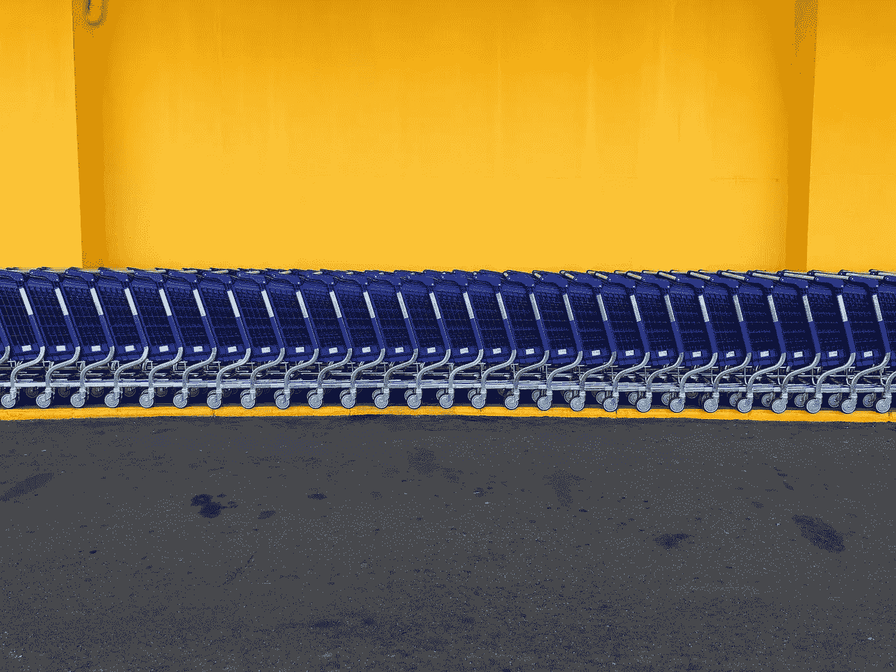
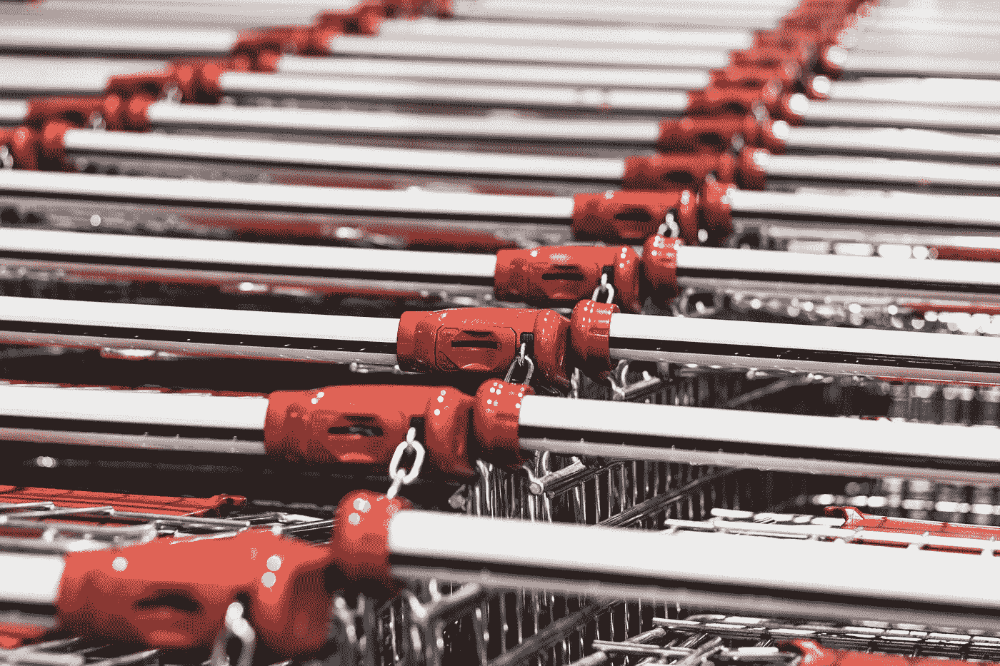
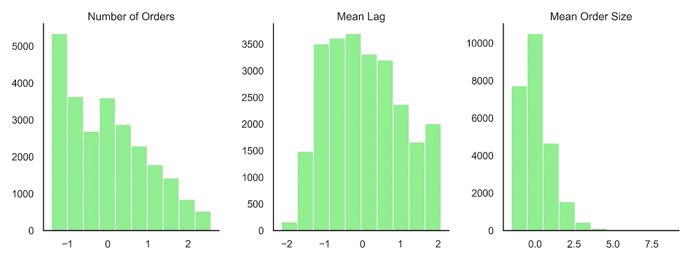
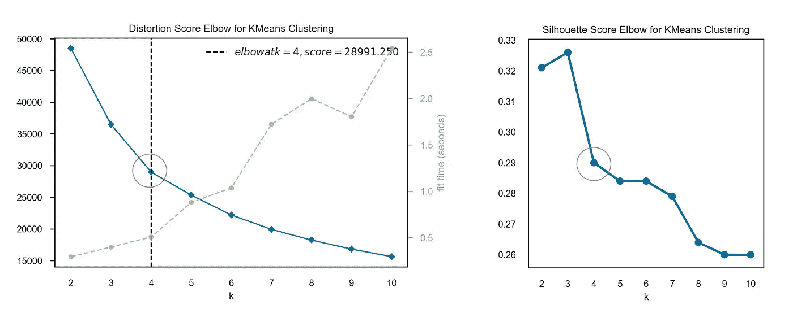
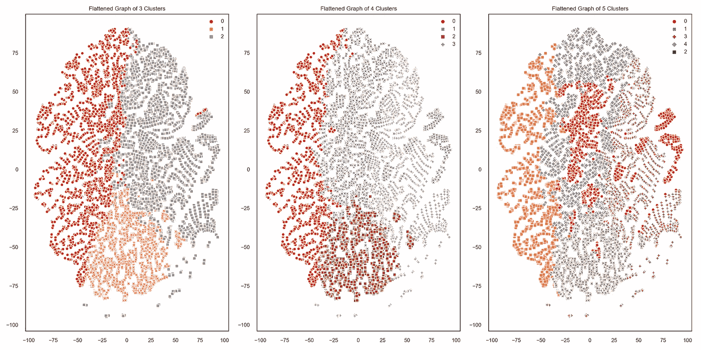
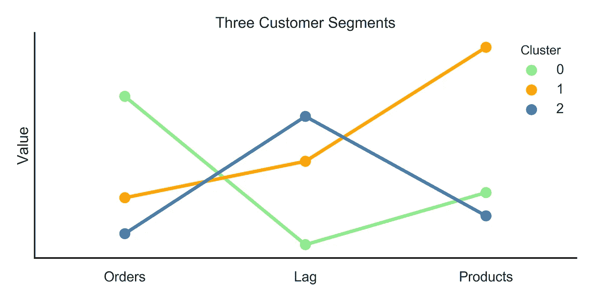

# 使用 Instacart 数据集进行客户细分

> 原文：<https://towardsdatascience.com/customer-segmentation-using-the-instacart-dataset-17e24be9c0fe?source=collection_archive---------17----------------------->

当您想要的数据不存在时发挥创造力

照片由[法比奥·布拉克特](https://unsplash.com/@bracht?utm_source=unsplash&utm_medium=referral&utm_content=creditCopyText)在 [Unsplash](https://unsplash.com/s/photos/shopping-carts?utm_source=unsplash&utm_medium=referral&utm_content=creditCopyText) 上拍摄

我最近有机会使用来自 Instacart (via Kaggle) 的数据集[完成了一个开放式数据分析项目。经过一番探索，我决定尝试客户细分。幸运的是，我找到了 Tern Poh Lim](https://www.kaggle.com/c/instacart-market-basket-analysis/overview) 的一篇文章[，这篇文章为我如何做到这一点提供了灵感*和*生成了一些方便的可视化工具来帮助我交流我的发现。在这篇文章中，我将介绍我是如何在 Instacart 数据集上采用 RFM(近期、频率、货币)分析进行客户细分的。由于数据集实际上不包含时间戳或任何关于收入的信息，我必须有点创意！](/the-most-important-data-science-tool-for-market-and-customer-segmentation-c9709ca0b64a)

# 看看那些购物车

照片由 [Alexandru Tugui](https://unsplash.com/@alexandru_tugui?utm_source=unsplash&utm_medium=referral&utm_content=creditCopyText) 在 [Unsplash](https://unsplash.com/s/photos/shopping-cart?utm_source=unsplash&utm_medium=referral&utm_content=creditCopyText) 上拍摄

如果你不熟悉的话， [Instacart](https://www.instacart.com/) 是一个杂货店购物服务。用户通过应用程序订购食品，就像其他零工经济公司一样，自由职业者“购物者”负责完成用户订单。 [Instacart 市场购物篮分析数据集](https://www.kaggle.com/c/instacart-market-basket-analysis/overview)是为特定应用而设计的:试图预测客户未来会再次订购哪些商品。如果您查看 Kaggle 上的文档，您会看到数据集包含以下类型的信息:

*   每个订单的记录，包括星期几和小时(但没有实际的时间戳)；
*   每个订单中每个产品的记录，以及每个项目添加到给定订单中的顺序，以及该项目先前是否由同一客户订购的指示；和
*   每个产品的名称、通道和部门。

这些数据已经完全匿名化，因此除了用户 ID 和订单历史记录之外，没有关于用户的任何信息—没有位置数据、实际订单日期或订单的货币价值。

这一点很重要，因为这些缺失的信息类型对业务分析非常重要。公司非常想知道用户最近是否活跃，他们在过去一天/一周/一个月/一个季度的活跃程度，以及他们对公司的货币价值。如果我想用这个数据集进行客户细分，我必须找到一个创造性的解决方案。

# 客户细分:基础知识

照片由[德鲁·比默](https://unsplash.com/@drew_beamer?utm_source=unsplash&utm_medium=referral&utm_content=creditCopyText)在 [Unsplash](https://unsplash.com/s/photos/split?utm_source=unsplash&utm_medium=referral&utm_content=creditCopyText) 上拍摄

简单来说，[客户细分](https://www.shopify.com/encyclopedia/customer-segmentation)意味着根据客户的真实或可能行为将他们分类，以便公司能够更有效地与他们合作。例如，一家公司可以向其最忠实的客户提供一种促销或折扣，而向新客户或不经常光顾的客户提供不同的激励。

进行客户细分的典型方法是进行 RFM 分析。(这是对 RFM 分析的一个很好的介绍。)RFM 代表“最近性、频率、金钱”，从公司的角度来看，代表了客户的一些最重要的属性。为了进行这种分析，您需要收集每个客户的相关数据，并根据每个 RFM 变量的相似值将客户分组。这背后的数学可能更复杂或更简单，这取决于您是否希望对 RFM 变量进行不同的加权。

[Tern Poh Lim 的文章](/the-most-important-data-science-tool-for-market-and-customer-segmentation-c9709ca0b64a)概述了如何使用 k-means 对客户进行聚类分析。更好的是，他指出，你可以迭代地使用 k-means 来计算要使用的最佳聚类数，从而消除聚类过程中的大量猜测。正如您将在下面看到的，我改编了他的一些代码，使用不同数量的聚类的剪影分数来生成肘图，并生成蛇图来总结每个聚类的属性。但我已经超越自我了！首先，让我们看看我对 Instacart 客户进行细分的总体方法。

# 走向细分的步骤

我采取了四个基本步骤来细分 Instacart 客户:

*   设计一些功能来取代 RFM，因为我没有这些变量的正确数据；
*   使用肘形图确定要计算的最佳聚类数；
*   创建 TSNE 图并检查聚类的可分性；
*   描述每个集群的关键属性。

# 步骤 1:特征工程

在缺乏适当的数据进行 RFM 分析的情况下，我不得不创建一些功能来捕捉用户行为的类似方面。经过一些实验，我发现了三个与 RFM 非常相似的特性:

*   每个客户的订单总数；
*   每个客户的订单之间的平均延迟(天数)；和
*   每位客户的订单(产品)平均规模。

总订单和每个客户的平均延迟类似于近期和频率；他们捕获了客户使用 Instacart 的次数(尽管在这种情况下，使用分布在一个不确定的时间段内)。每位客户的平均订单规模是货币价值的一种代表。虽然我不确定 Instacart 究竟是如何评估送货和服务费的，但我做了一个大致的假设，即订单的大小可能与其货币价值有关(至少它的大小是我可以实际测量的！).即使我的功能没有完美地映射到 RFM，它们仍然捕捉到了许多关于客户如何使用 Instacart 的重要信息。

所有功能都已标准化，订单数量也已对数转换。

因为我要将这些特征传递给 k-means 算法，所以我需要注意非正态分布和异常值，因为聚类很容易受到这两种情况的影响。当我检查我的三个特性的分布时，每个客户的订单数显示了一个很强的正偏态。我使用了对数转换来解决这个问题。然后我标准化了所有三个特性(使用 sk learn . preprocessing . standard scaler ),以减轻任何剩余异常值的影响。就这样，我为下一步做好了准备！

# 步骤 2:确定最佳 k

K-means 可以把你的客户进行聚类排序，但是你要告诉它你想要多少个聚类。这可能很棘手。两个集群有意义吗？10 点怎么样？通过测试 k 的一组值，我们可以更清楚地了解有多少聚类真正适合我们的数据。

我们可以使用几个指标来评估 *k* 聚类与给定数据集的吻合程度。对于我的项目，我使用了两个指标:**失真分数**和**轮廓分数**。

**失真分数**有点像残差平方和；它测量一个簇内的误差，或者每个数据点与其指定簇的质心之间的距离。较低的失真分数意味着更紧密的聚类，这意味着该聚类中的客户有很多共同点。

**剪影得分**将任何给定数据点与其指定聚类中心之间的距离与该数据点与其他聚类中心之间的距离进行比较。基本上，剪影分数是问，“这个点实际上更接近其他一些集群的中心吗？”同样，我们希望该值较低，这意味着我们的集群在向量空间中更紧密，彼此之间也更远。

我将这两个指标放在肘图中，肘图显示了具有不同数量的聚类的模型的分数。我任意选择了 2 到 10 个集群进行尝试。两个图都显示了在 4 个集群的得分(或肘部)的巨大变化。

从 [Tern Poh Lim 的文章](/the-most-important-data-science-tool-for-market-and-customer-segmentation-c9709ca0b64a)中，我了解到这是一种常见的做法，不仅要用你最好的 *k* ，还要用 *k* — 1 和 *k* + 1。这三个选项中的一个可能会给你最可分离的集群，这就是你想要的。

# 步骤 3:检查聚类的可分性

我在这一步寻找的是尽可能少重叠的集群。任何时候两个集群彼此非常接近，都有可能靠近一个集群边缘的任何一个客户更适合相邻的集群。你知道，我们不想向 30 岁以下的顾客发送关于老年人折扣的电子邮件！越容易画一条直线来分隔我们的聚类，我们的聚类分配就越可能准确。TSNE 图获取了我们所知道的关于每个客户的一切信息，并将其缩减为二维，这样我们就可以很容易地看到各个集群之间的关系。看看这个:

当只有 3 个集群时，它们看起来很容易分开(而且相当均衡——没有一个集群比其他集群大很多)。4 个集群中的两个比我希望的要重叠一些，5 个集群到处都是。看起来 3 个集群是该客户群和这些功能的最佳选择。

# 步骤 4:描述每个集群

使用 *k* = 3，我使用 k-means 将每个客户分配到一个集群。现在怎么办？嗯，你可以总结每个集群的每个特性的价值，从而了解该集群的购买习惯。再次遵循 [Tern Poh Lim 的文章](/the-most-important-data-science-tool-for-market-and-customer-segmentation-c9709ca0b64a)，我使用了一个“蛇图”(一个 [Seaborn 点图](https://seaborn.pydata.org/generated/seaborn.pointplot.html))来可视化每个集群的三个特征的平均值。情节是这样:

我们可以用这些信息做什么？以下是我根据这个情节给营销团队的建议:

*   集群 0:这些是我们最喜欢的客户！他们大量使用 Instacart，做中型订单。针对这些客户的营销可以侧重于保持他们的忠诚度，同时鼓励他们下订单，为公司带来更多收入(无论这意味着更多的商品、更贵的商品等。).
*   集群 1:这些客户不经常使用 Instacart，但当他们使用时，他们会下大订单。当然，我们可以专注于将他们转化为更频繁的用户，根据 Instacart 从订单中产生收入的确切方式，我们可能会促使他们做出更频繁、更小的订单，或者继续做出那些大订单。
*   第 2 组:这是我们最有改进空间的部分。他们尝试过 Instacart，但不经常使用，购买的物品也不多。针对这些人的营销策略可以侧重于增加订单频率和/或数量。

我希望我已经说服你，即使没有通常用于客户细分的数据，你也可以获得一些关于客户的非常有用的见解。你可以在我的 GitHub 上查看这个项目的所有[代码。对](https://github.com/jrkreiger) [Tern Poh Lim](/the-most-important-data-science-tool-for-market-and-customer-segmentation-c9709ca0b64a) 为这个项目的灵感(和许多有用的代码)最后一次大喊！