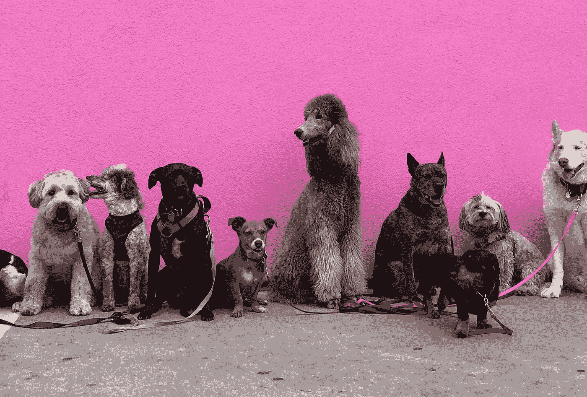
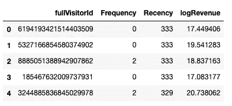
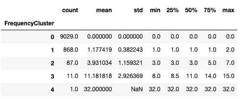
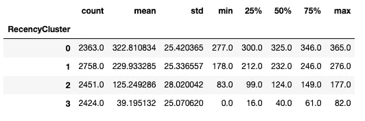
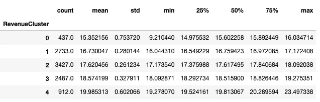
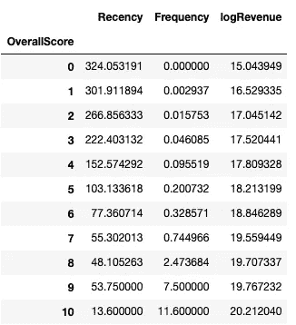
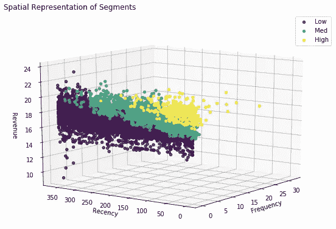

# 基于 K 均值聚类的客户细分

> 原文：<https://towardsdatascience.com/customer-segmentation-with-kmeans-e499f4ebbd3d?source=collection_archive---------16----------------------->

## 营销活动不再采用一刀切的方式



照片由[汉娜·林](https://unsplash.com/@hannah15198?utm_source=unsplash&utm_medium=referral&utm_content=creditCopyText)在 [Unsplash](https://unsplash.com/s/photos/dogs?utm_source=unsplash&utm_medium=referral&utm_content=creditCopyText) 上拍摄

> 并非所有的顾客都是平等的。—我(还有许多其他人)

你永远不会像对你的伴侣那样对你的父母说话，也不会像对你的经理那样对你的孩子说话。那么，为什么你的营销团队在你的营销材料中使用一刀切的语言呢？

利用机器学习和人工智能处理大量的消费者历史、网络流量和产品评论，可以对营销活动产生重大影响。通过利用统计和分析工具的力量，可以根据三个简单的行为特征将客户划分为不同的群体，从而影响多渠道营销活动中使用的语言，并提高点击率和转化率。

## 你越了解你的顾客，你就越富裕。

作为客户，你不希望被视为达到目的的手段。你想成为社区的一员。作为一名零售商，你的工作是了解你的顾客，并告诉他们你对他们的了解。不要被动，了解他们的痛点，了解他们的购买习惯，建立信任。收入也会随之而来。

## 市场细分和 RFM 模型

一般来说，有四种方法来划分你的消费群:

*   人口统计—年龄、性别、社会经济地位
*   地理——他们在世界的什么地方？
*   心理分析——寻找结婚戒指，计划买房子
*   **行为——一旦你的客户到达你的网站，他们会做什么？**

谷歌的 BigQuery API 允许你对谷歌分析数据进行类似 SQL 的查询。如果你通过谷歌分析账户进行电子商务跟踪，你就可以获得客户的行为数据。该研究是在 2016 年 8 月至 2017 年 8 月期间对谷歌商品商店的数据进行的。在此期间，超过 740，000 名不同的人访问了 merch 商店，购买了 11，500 件商品，总价值超过 200，000 美元。

为了补充我们从谷歌商品商店获得的网络数据，我们将设计一些功能，以便根据 RFM 模型为每个客户“打分”。该技术采用最近一次购买的最近度(R ),所有购买的频率(F)或计数减 1，以及由平均订单金额定义的货币值(M)。

## RFM 特色工程

为了对数据进行分段，您需要从三列开始:唯一的客户 id、交易日期和交易金额。我用这个函数将谷歌商店的数据处理成一种我们可以用来建模的格式

一旦我们通过这个函数运行我们的数据框架，我们就剩下以下信息:



值得注意的是，你的网站可能也有不购物的访问者，但是这种细分方法是针对已经转化的客户的。另一项研究可以——也应该——对那些不购买的人的行为进行研究，这样你就可以提高网站的转化能力。

## 基于 Kmeans 的无监督机器学习

既然我们的数据已准备好进行聚类，我们将测试几个聚类级别并比较肘形图中的误差平方和，以确定对每个要素单独进行聚类的最佳级别。

看起来，频率开始在五个集群水平，最近在四或五，收入在四或五。根据您的业务模型，您可能有理由选择较低或较高数量的集群。经过几次反复，我决定了五个频率、四个最近和五个收入。

从这里开始，我们将需要一些辅助函数来从最差到最好对集群进行排序，并为每个数据点分配相应的集群。

结果如下:



*   频率——绝大多数客户属于较低的类别，在 3 到 4 之间有一个巨大的跳跃，只有一个客户购买超过 15 次
*   最近——大多数客户都很不活跃(你真正需要多少件谷歌 t 恤？)最近的窗口变得越大，聚类分配越好。
*   收入——绝大多数消费者平均在谷歌商品商店购买了价值 17 到 19 美元的商品。这五个收入群分布相当均匀，平均订单支出不超过 23 美元。

我们将通过合计每个聚类的得分来确定总体得分，并由此确定细分分层。

```
rfm_df[‘OverallScore’] = rfm_df[‘RecencyCluster’] + rfm_df[‘FrequencyCluster’] + rfm_df[‘RevenueCluster’]rfm_df.groupby(‘OverallScore’)[‘Recency’,’Frequency’,’logRevenue’].mean()
```



根据你的商业模式，你可能已经有了一定的细分市场。在这里，我把他们分成三组。不活跃、
不频繁、低消费的客户是低价值客户，中值客户高于平均收入，平均收入高于平均收入，最近消费频率高于平均收入，高价值客户属于至少两个特征的上层客户。

```
# Naming and defining segments
rfm_df[‘Segment’] = 0
rfm_df.loc[rfm_df[‘OverallScore’]>4,’Segment’] = 1 
rfm_df.loc[rfm_df[‘OverallScore’]>6,’Segment’] = 2
```

现在来看看每个集群，看看我们做得有多好:



看看那些轮廓优美的集群！

从该图中，我们可以看到，有些客户并没有花很多钱，但是经常访问该网站，并且最近进行了购买，这也属于高价值类别。分数似乎被非常不频繁的购买或很久以前的最后一次购买拉低了。

从这里，你可以将这些信息传递给你的营销团队，或者如果你是营销团队，使用这些信息为针对每个客户特定购买行为的电子邮件营销活动或广告设计语言。您已经播下了种子，现在看看您的收入如何增长吧！