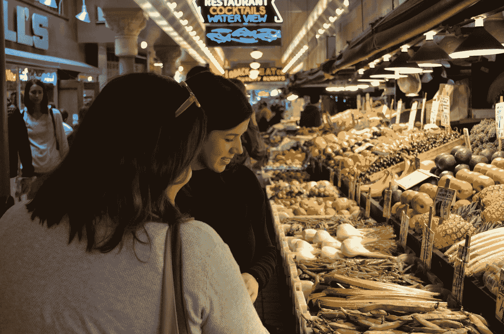
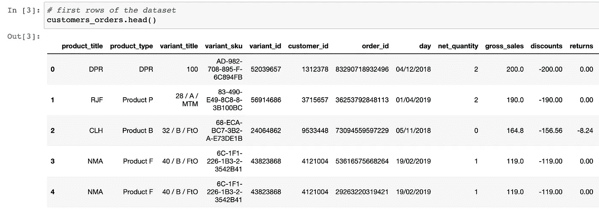
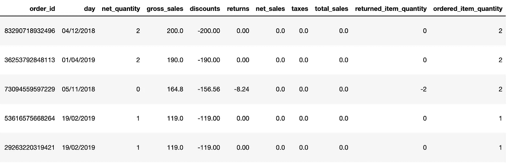
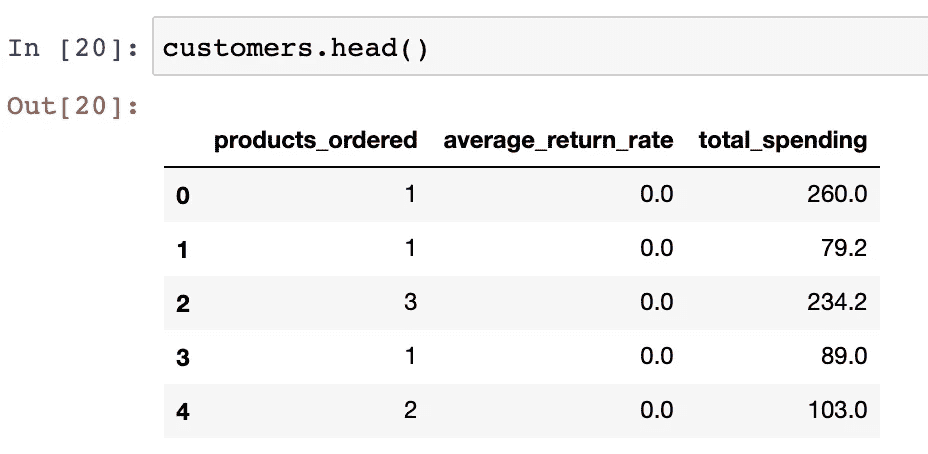
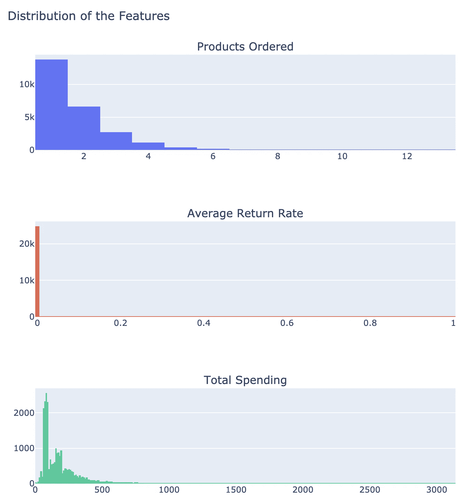
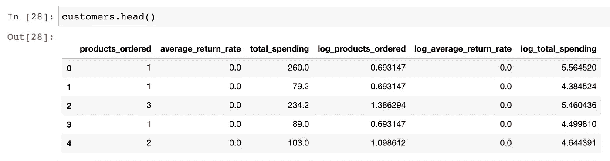
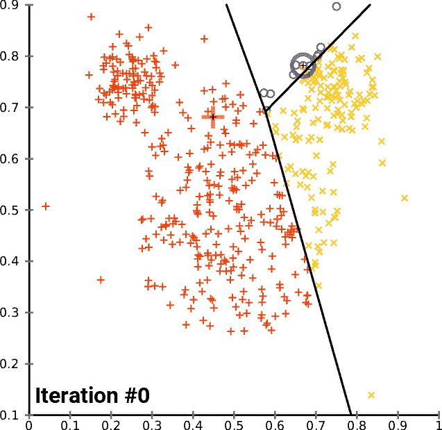
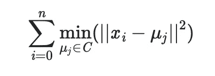
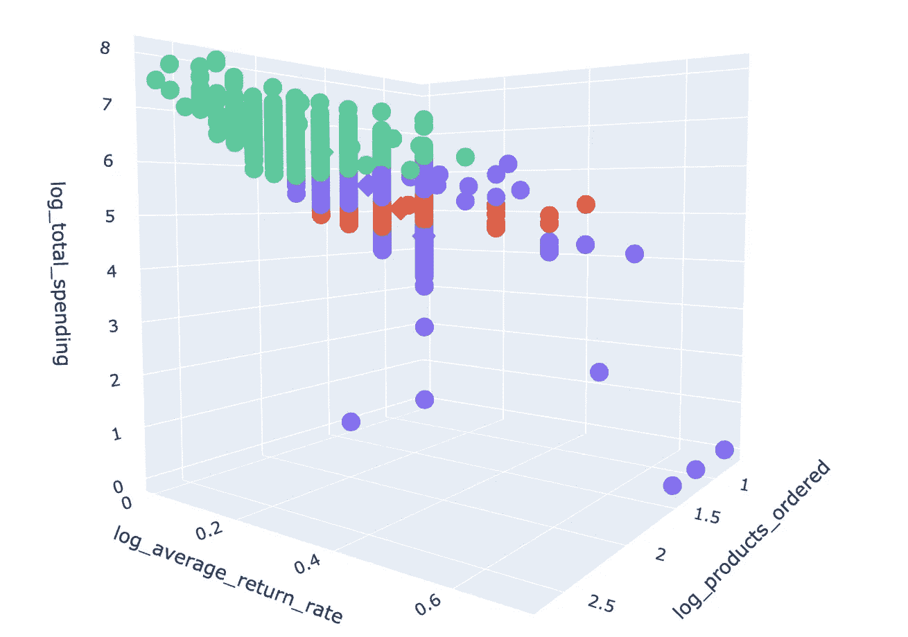
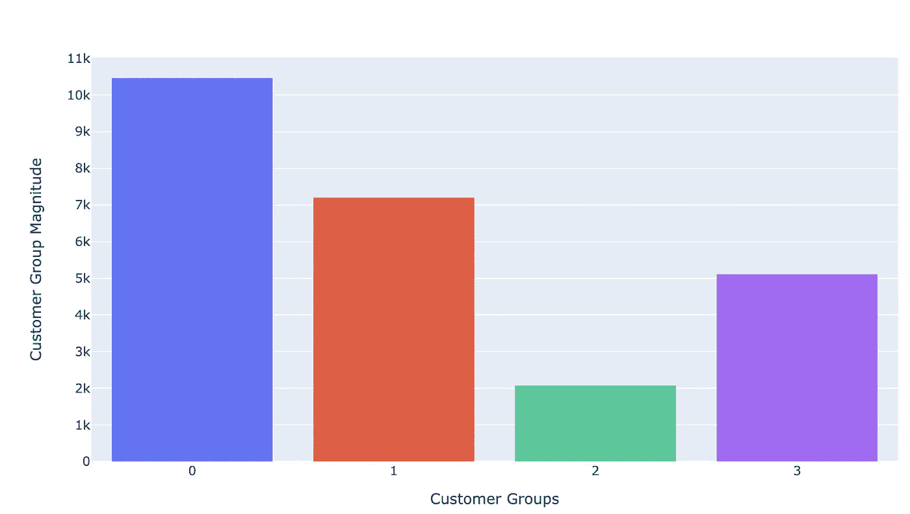

# 基于机器学习的客户细分

> 原文：<https://towardsdatascience.com/customer-segmentation-with-machine-learning-a0ac8c3d4d84?source=collection_archive---------1----------------------->

## [机器学习](https://towardsdatascience.com/machine-learning/home)

## K-means 算法应用于现实世界的电子商务销售数据



由[图怀亚特](https://unsplash.com/@graphwya?utm_source=medium&utm_medium=referral)在 [Unsplash](https://unsplash.com?utm_source=medium&utm_medium=referral) 上拍摄

想象一下，你对待你每天购物的杂货店老板，就像你对待你的另一半一样。开始的时候可能会很有趣，但是也可能会导致灾难性的情况。同样，对一家公司来说，以同样的方式管理与每个客户的关系也是不利的。

> 客户细分使公司能够定制与客户的关系，就像我们在日常生活中所做的那样。

当你进行客户细分时，你会发现每个客户的行为和需求都有相似的特征。然后，将它们归纳成组，以满足不同策略的需求。此外，这些策略可以作为

*   针对特定群体的营销活动
*   推出符合客户需求的功能
*   产品路线图的开发

市场上有不同的产品/解决方案，从套装软件到 CRM 产品。今天我就用 Python 来应用一个[无监督的机器学习算法](https://en.wikipedia.org/wiki/Unsupervised_learning)。

这个从 2018 年 11 月到 2019 年 4 月的数据集是由一家电子商务公司提供的实际销售数据。这是提供给我的一个采访案例研究。

是的，他们有一个令人惊讶的面试过程，但更多的在那之后，在这篇文章的结尾。我也没有得到这个角色，主要是因为远程就业后勤，但这是另一个故事了。

我将通过以下步骤对数据集应用 K 均值聚类。

1.  商业案例
2.  数据准备
3.  基于 K-均值聚类的分割
4.  超参数调谐
5.  结果的可视化和解释

在这个过程中，我将解释 K-means 聚类是如何工作的。最后，我将为形成的细分市场提供具体的策略。

出于保密原因，我对数据进行了匿名处理。

**你可以按照笔记本上的步骤进行:**

[](https://nbviewer.jupyter.org/github/cereniyim/Customer-Segmentation-Unsupervised-ML-Model/blob/0418ed702b0b8f87b472d68971c84a4913fa956e/Customer_Segmentation_Kmeans_Clustering.ipynb) [## nbviewer 笔记本

### 客户细分将使用 scikit-learn 的 K-means 聚类应用于电子商务客户数据库。它…

nbviewer.jupyter.org](https://nbviewer.jupyter.org/github/cereniyim/Customer-Segmentation-Unsupervised-ML-Model/blob/0418ed702b0b8f87b472d68971c84a4913fa956e/Customer_Segmentation_Kmeans_Clustering.ipynb) 

**…并在这里** **找到 GitHub 库** [**。**](https://github.com/cereniyim/Customer-Segmentation-Unsupervised-ML-Model)

# 1.商业案例

在案例研究中，我从不同方面形象化了客户行为和特征。更进一步，我将围绕这个问题形成商业案例:**能否将客户群分组以发展定制关系？**

我将从行为角度(替代方法可以是地理或人口统计学角度)探讨这个问题，以更好地了解顾客的消费和订购习惯，其特征如下:**订购的产品数量、平均退货率和总消费。**

# 2.数据准备

原始数据集中大约有 25000 个不同的客户及其订单信息:



数据集格式良好，没有 NA 值。所以，我们可以从形成特征开始。将根据`customer_id`计算 3 个特征，它们将在后面的步骤中帮助我们进行可视化(使用 [Plotly](https://plot.ly/python/) 库)和算法解释。数据准备将由[熊猫](https://pandas.pydata.org/)和[熊猫](https://numpy.org/)完成。

*   **订购产品数量:**通过以下函数计算客户订购的`product_type`:

*   **平均退货率:**客户所有订单的平均`returned_item_quantity`与`ordered_item_quantity`之比。



*   **总支出:**是****总销售额的总和，是税后和退货后的最终金额。****

****计算后，3 个特征合并到`customers`数据框中:****

********

******我们来看看特性的个体分布:******

********

****所有 3 个分布都是正的[偏斜分布](https://en.wikipedia.org/wiki/Skewness)。订购产品呈幂律分布，99%的顾客平均退货率为 0。****

****3 特性具有不同的范围，在[1，13]、[0，1]和[0，1000]之间变化，这是一个重要的观察结果，表明特性需要缩放！****

## ****缩放:****

****K-means 算法将`customers`数据帧中的每一行解释为三维空间中的一个点。当对它们进行分组时，它使用数据点和组中心之间的[欧几里德距离](https://en.wikipedia.org/wiki/Euclidean_distance)。由于范围变化很大，算法的性能可能很差，无法按预期形成分组。****

****为了使 K-means 有效执行，我们将使用对数变换来缩放数据，对数变换是一种适用于倾斜数据的变换。这将按比例缩小我们的数据分布的 3D 空间，同时保持点之间的邻近性。****

******应用上述函数后，** `customers` **数据帧准备好送入 K-means 聚类:******

********

# ****3.基于 K-均值聚类的分割****

****我们将使用 scikit-learn 中的 [K-means 算法。我们先来了解一下算法会如何形成客户群体:](https://scikit-learn.org/stable/modules/generated/sklearn.cluster.KMeans.html)****

1.  ****随机或智能初始化 *k* = *n 个质心* = *簇数*****
2.  ****基于欧几里德距离将每个数据点分配到最近的质心，从而形成组****
3.  ****将中心移动到聚类中所有点的平均值****

****重复步骤 2 和 3，直到[收敛](https://www.mathsisfun.com/definitions/converge.html)。****

********

****k-表示 n 个质心=3 的作用中。来源:[维基媒体](https://commons.wikimedia.org/wiki/File:K-means_convergence.gif)****

****运行步骤至时，该算法会检查每个聚类的聚类点和中心之间的距离平方和。从数学上来说，它试图最小化—优化每个簇 ***的 ***簇内距离平方和*** 或 ***惯性*** 。*******

****

**聚类内距离平方和或惯性的数学表达式，其中 *X 是聚类中的点，并且是当前质心***

**当 ***惯性*** 值不再最小化时，算法收敛。因此，迭代停止。**

```
from sklearn.cluster import Kmeans
kmeans_model = KMeans(init='k-means++', 
                      max_iter=500, 
                      random_state=42)
```

*   **带有`k-means++`的`init`参数允许算法灵活地放置初始中心，而不是随机的。**
*   **`max_iter`是算法在单次运行中的最大迭代次数，默认值为 300。**
*   **`random_state`保证模型结果的再现性。**

**该算法易于理解，在计算时间方面非常适合大数据集，并且保证了收敛性。然而，当随机初始化质心时，算法可能不会以最佳方式将点分配给组。**

**一个重要的考虑是选择 *k* 。换句话说，应该组成多少个小组？例如，上面应用的 K-means 使用 *k=8* 作为默认值。**

**下一步，我们将选择 K 均值中最重要的超参数 *k* 。**

# **4.超参数调谐**

**在选择 *k、*时，我们将使用[肘方法](https://www.geeksforgeeks.org/elbow-method-for-optimal-value-of-k-in-kmeans/)来决定 K 均值、惯性的优化标准。我们要用 *k* 值 1 到 15 建立不同的 K 均值模型，并保存相应的*惯性*值。**

```
results = make_list_of_K(15, customers.iloc[:,3:])
k_values_distances = pd.DataFrame({"clusters": clusters,
                                   "within cluster sum of squared distances": results})
```

****当我们绘制*惯性*对 *k* 值时:****

****

**对于肘法，我们将选择惯性下降稳定的 *k* 值。**

**当 *k=1* 惯性最大时，意味着数据尚未分组。惯性急剧下降，直到 *k=2。*在 *k=2* 和 *4、*之间，曲线继续快速下降。**

**在 *k=4* 处，下降稳定并继续直线下降，在 *k=4* 处形成一个弯头。这就指出了客户群的最佳数量是 *4* 。**

# **5.结果的可视化和解释**

**让我们将 *k=4* 插入 K-means，想象一下客户群是如何创建的:**

```
# create clustering model with optimal k=4
updated_kmeans_model = KMeans(n_clusters = 4, 
                              init='k-means++', 
                              max_iter=500, 
                              random_state=42)updated_kmeans_model.fit_predict(customers.iloc[:,3:])
```

****

**每个数据点的值可以在[这里](https://nbviewer.jupyter.org/github/cereniyim/Customer-Segmentation-Unsupervised-ML-Model/blob/0418ed702b0b8f87b472d68971c84a4913fa956e/Customer_Segmentation_Kmeans_Clustering.ipynb#Visualize-Customer-Segmentation)交互观察**

**数据点显示在球体中，每组的质心用立方体显示。4 客户群如下:**

****蓝色:**至少订购了一种产品，最高总消费为 100 英镑，平均退货率最高的客户。他们可能是电子商务网站的新来者。**

****红色:**订购 1 至 4 件商品，平均总消费 150，最高退货率 0.5 的客户。**

****紫色:**订购 1 至 4 件商品，平均总消费 300，最高退货率 0.5 的客户。**

****绿色:**订购 1 至 13 件商品，平均总消费 600，平均退货率为 0 的客户。它为公司创造了最有利的客户群。**

****让我们来看看每个组中有多少客户——称为集群数量:****

****

**总体策略是保留最有利的客户群——绿色客户群，同时将蓝色客户群转移到红色和紫色区域。**

**Blue group 占所有客户的 42%,在该客户群中实现的任何改进都将显著增加收入。消除高回报率和提供礼品卡可以将这个客户群体转移到低平均回报率和高总消费领域。如果我们假设他们是新来的，礼品卡可以加速他们的回头客。**

**红紫集团合计占所有客户的 50%。从平均退货率和订购产品的角度来看，它们表现出相同的特征，但与总支出不同。这些群体可以定义为已经知道该品牌并订购多种产品的人。这些客户可以通过一些专门的沟通和折扣来了解最新的品牌信息。**

**绿色客户群占所有客户的 8%,形成对品牌最有利的客户群。他们订购多种产品，并且极有可能保留这些产品。为了保持并可能扩大这个群体，特价和产品发布会可能会有所帮助。此外，它们可以吸引新客户，影响客户群的扩大。**

# **结论**

**我们从行为角度研究了客户细分问题，包括每位客户订购的产品数量、平均退货率和总支出。使用 3 个特性有助于我们理解和可视化模型。**

**总而言之，数据集易于执行无监督的机器学习问题。起初，我们只有带有订单信息的客户数据，不知道他们是否属于任何组。使用 K-means 聚类，可以发现数据中的模式，并进一步扩展到组中。我们为形成的群体制定了策略，从最初是尘云的数据集中获取意义。**

**关于面试；我喜欢参与案例研究，面试过程是我迄今为止最棒的面试经历。这是对我在一个典型的、实际的任务中的技能的一个非常现实的评估，我会经常执行这个任务。这使得整个过程非常简单有趣。我希望这种实用的数据科学面试成为主流，让应聘者和雇主都受益。**

**感谢您的阅读，对于评论或建设性的反馈，您可以通过回复、 [Twitter](https://twitter.com/cereniyim) 或 [Linkedin](https://www.linkedin.com/in/ceren-iyim) 联系我！**