# 使用 purrr 和 ggplot2 可定制 R 中的关联热图

> 原文：<https://towardsdatascience.com/customizable-correlation-plots-in-r-b1d2856a4b05?source=collection_archive---------6----------------------->

## *不用任何相关绘图包制作高质量的相关图*

如果你曾经觉得被`R`中的关联热图包所限制，这篇文章将向你展示如何编写你自己的函数来将众多的关联整理成一个`ggplot2`友好的绘图形式。

最后，您将能够运行一个函数来获得一个整理好的相关性数据框架。然后，您可以在这个数据框上运行`ggplot2`代码来制作您自己的关联热图。


如果你只是想要代码，你可以跳到最后。你也可以在我的网站上阅读我的其他博客文章， [KHstats](http://www.khstats.com/blog) 。

我真的很感激一些允许我使用`R`超快速地制作相关图的包和函数。这里有几个例子:

```
corrplot::corrplot(cor(mtcars))
```

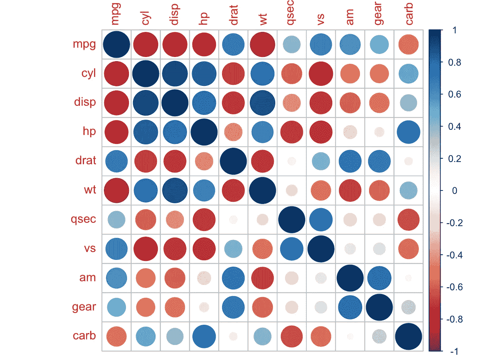

```
corrgram::corrgram(mtcars)
```

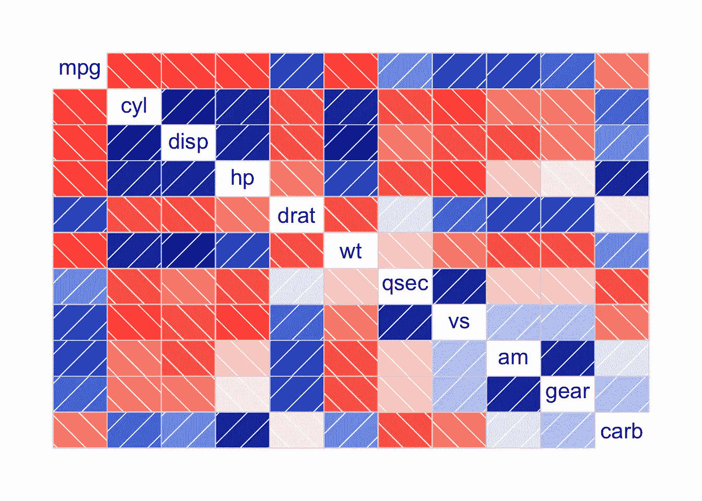

```
ggcorrplot::ggcorrplot(cor(mtcars))
```

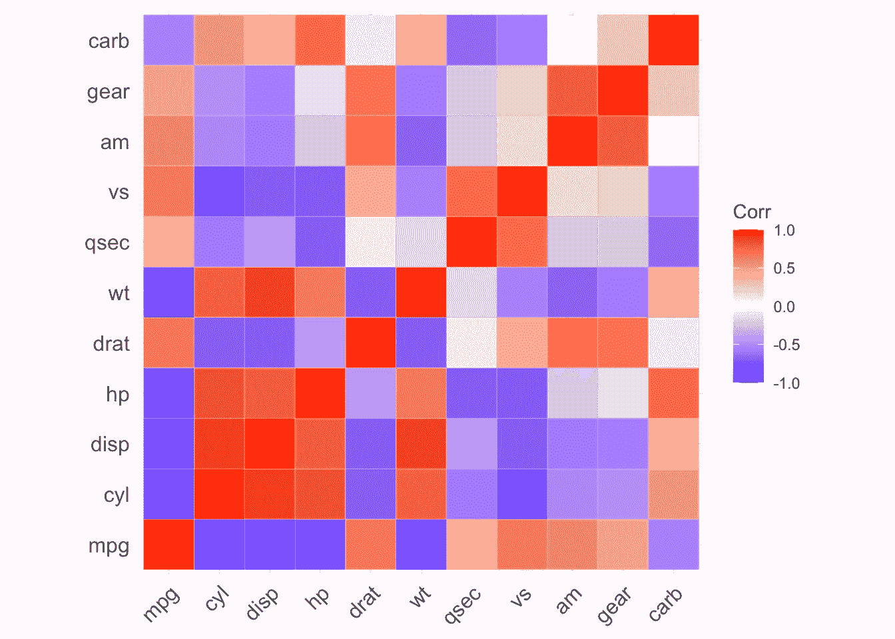

所有这些都很好，但没有一个最终能像我需要的那样可定制。接下来我将展示如何绕过使用其他人的函数约束，以一种`ggplot2`友好的格式在数据中准备相关性。

我们可以使用基本的`R`函数`cor()`来得到我们的相关性，但是我不喜欢缺省的数据。相反，我使用 Frank Harrell 的`Hmisc::rcorr()`函数有两个原因:

1.  默认情况下，它会丢弃丢失的对
2.  它返回 p 值，因此只需要一个函数就可以获得相关系数和匹配的 p 值

让我们加载我们为此需要的库，它们是使用`kable`显示表格的`knitr`和`tidyverse`(我们将具体使用`tidyr`、`dplyr`、`ggplot2`、`tibble`和`purrr`)。

```
library(knitr) library(tidyverse, warn.conflict=F)
```

首先，让我们看看我们将使用的相关函数的输出，`Hmisc::rcorr()`。它要求输入是一个矩阵，并输出三个矩阵的列表。

```
mtcars_cor <- Hmisc::rcorr(as.matrix(mtcars))
```

这三个矩阵包括相关系数(默认为皮尔逊系数)、`r`、p 值、`P`以及用于每个相关的观察值数量`n`。让我们把每个矩阵变成一个`data frame`，用`head`和`kable`来看前六行。

相关系数，`r`:

```
data.frame(mtcars_cor$r) %>% head() %>% kable()
```

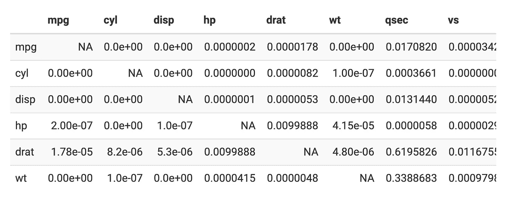

`P`p 值:

```
data.frame(mtcars_cor$P) %>% head() %>% kable()
```

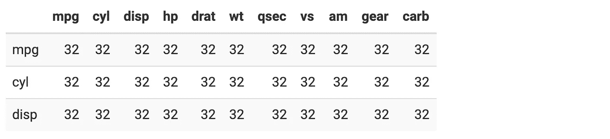

观察次数，`n`。在`mtcars`数据集中没有缺失数据，因此有 32 对用于所有相关。

```
data.frame(mtcars_cor$n) %>% head(n=3) %>% kable()
```

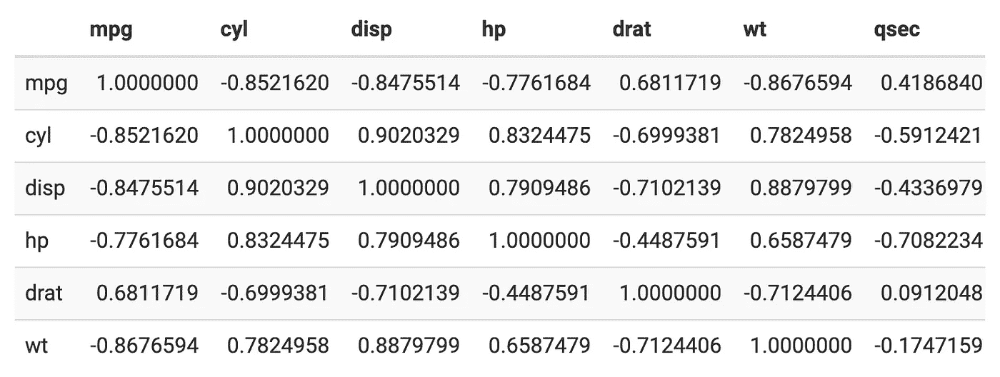

接下来，我们可以编写一个函数，为`Hmisc::rcorr()`正确格式化一个`data frame`，然后依次处理列表中的三个元素(`r`、`n`和`P`)

```
cors <- function(df) { 
   # turn all three matrices (r, n, and P into a data frame)
   M <- Hmisc::rcorr(as.matrix(df))
   # return the three data frames in a list return(Mdf)
   Mdf <- map(M, ~data.frame(.x))
  }
```

在这个函数中没有发生太疯狂的事情。现在我们只有三个数据帧的列表。我们可以使用`first()`查看列表的第一个元素，它显示了所有变量之间的相关性:

```
cors(mtcars) %>% first() %>% head() %>% kable()
```

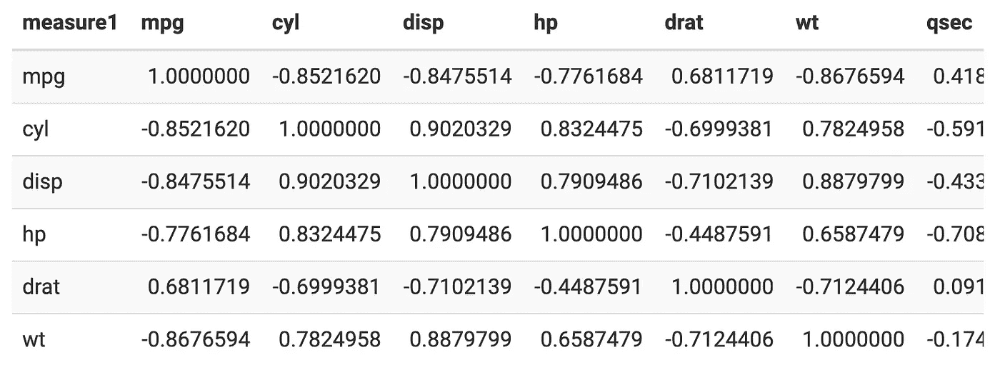

下一步是准备好用`ggplot2`绘图的数据。我们现在可以将数据保存在一个列表中，并使用来自`purrr`的`map()`函数。

首先，我们需要使用`tibble::rownames_to_column()`将行名移动到它们自己的列中。的输出如下所示:

```
cors(mtcars) %>% 
   map(~rownames_to_column(.x, var="measure1")) %>%
   # look at the first element of the list (r)
   first() %>%
   head() %>%
   kable()
```

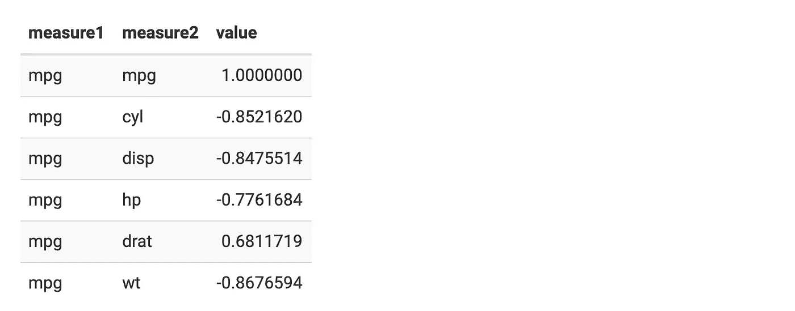

接下来，我们可以使用`tidyr::pivot_longer()`将列移动到名为`measure2`的单个列

```
cors(mtcars) %>%
 map(~rownames_to_column(.x, var="measure1")) %>%
 # format each data set (r,P,n) long
 map(~pivot_longer(.x, -measure1, "measure2")) %>%
 # look at the first element of the list (r)
 first() %>%
 head() %>%
 kable()
```


现在，我们准备使用`bind_rows()`取消数据列表。这将把我们的相关性变成一个很长的数据帧，所有的行从`r`开始，然后是`n`，然后是`P`。

```
cors(mtcars) %>%
 map(~rownames_to_column(.x, var="measure1")) %>%
 # format each data set (r,P,n) long 
 map(~pivot_longer(.x, -measure1, "measure2")) %>%
 # merge our three list elements by binding the rows
 bind_rows(.id = "id") %>%
 head() %>%
 kable()
```

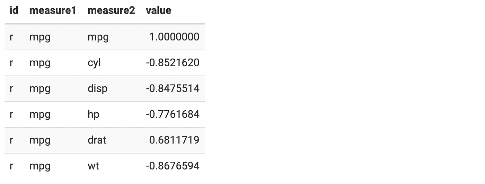

对于`ggplot2`，我们需要将`r`、`n`和`P`作为它们自己的列。我们可以用`pivot_longer()`来做到这一点。

```
cors(mtcars) %>%
 map(~rownames_to_column(.x, var="measure1")) %>%
 # format each data set (r,P,n) long 
 map(~pivot_longer(.x, -measure1, "measure2")) %>%
 # merge our three list elements by binding the rows
 bind_rows(.id = "id") %>%
 pivot_wider(names_from = id, values_from = value) %>%
 head() %>%
 kable()
```

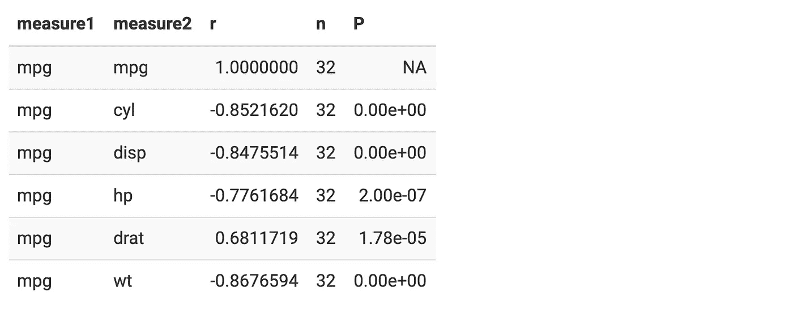

最后，我们可以添加一些列，这些列在以后可能会对我们的相关图提供更多信息非常有用。让我们添加告诉我们 p 值是否小于 0.05 的列，如果是，返回 1)p 值和 2)相关系数，以防我们想要用这些值标记我们的图。

```
cors(mtcars) %>%
 map(~rownames_to_column(.x, var="measure1")) %>%
 # format each data set (r,P,n) long 
 map(~pivot_longer(.x, -measure1, "measure2")) %>%
 # merge our three list elements by binding the rows
 bind_rows(.id = "id") %>%
 pivot_wider(names_from = id, values_from = value) %>%
 mutate(sig_p = ifelse(P < .05, T, F), p_if_sig = ifelse(P <.05, P, NA), r_if_sig = ifelse(r <.05, r, NA)) %>% 
 head() %>%
 kable()
```

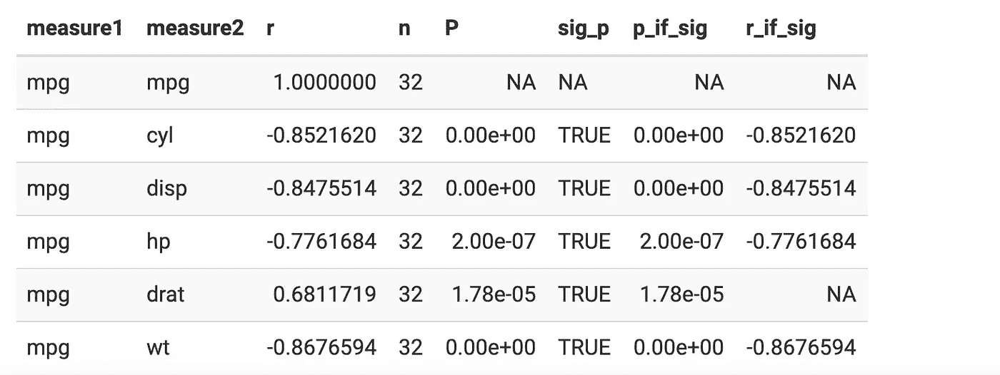

这似乎是我想画的所有东西。当然，你可以添加更多。在这一点上，我将我的格式化相关性转换成一个函数:

```
formatted_cors <- function(df){
 cors(df) %>%
 map(~rownames_to_column(.x, var="measure1")) %>%
 map(~pivot_longer(.x, -measure1, "measure2")) %>% 
 bind_rows(.id = "id") %>%
 pivot_wider(names_from = id, values_from = value) %>%
 mutate(sig_p = ifelse(P < .05, T, F), p_if_sig = ifelse(P <.05, P, NA), r_if_sig = ifelse(P <.05, r, NA)) 
}
```

我们可以测试该功能是否如预期的那样工作:

```
formatted_cors(mtcars) %>% head() %>% kable()
```

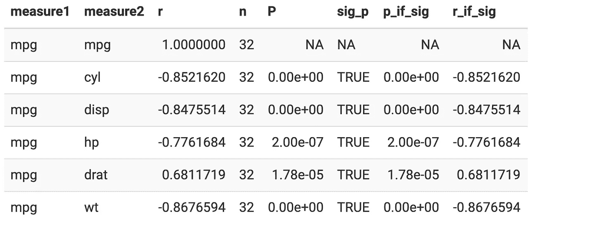

我们终于准备好在`ggplot2`中绘制我们的关联热图了。

该图最简单的形式只需要我们分别在`x`和`y`轴上指定`measure1`和`measure2`。然后，我们可以将相关性`r`映射到`fill` `aes`合成，并添加一个图块作为`geom`合成。

```
formatted_cors(mtcars) %>%
 ggplot(aes(x = measure1, y = measure2, fill = r)) +
 geom_tile()
```

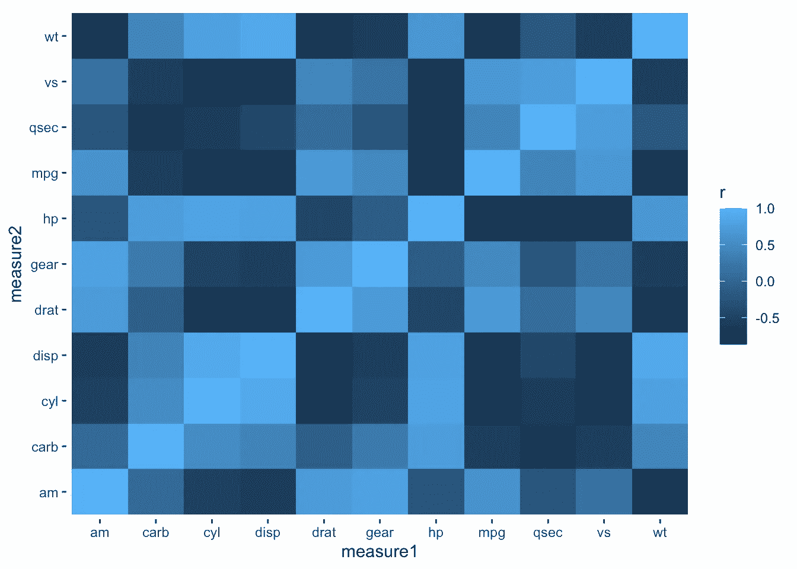

我们可以做一些小的美学上的改变，比如填充颜色比例、标题和字体系列。

```
formatted_cors(mtcars) %>%
 ggplot(aes(x = measure1, y = measure2, fill = r)) +
 geom_tile() +
 labs(x = NULL, y = NULL, fill = "Pearson's\nCorrelation", title="Correlations in Mtcars") +
 # map a red, white and blue color scale to correspond to -1:1 sequential gradient scale_fill_gradient2(mid="#FBFEF9",low="#0C6291",high="#A63446", limits=c(-1,1)) +
 theme_classic() +
 # remove excess space on x and y axes
 scale_x_discrete(expand=c(0,0)) +
 scale_y_discrete(expand=c(0,0)) +
 # change global font to roboto
 theme(text=element_text(family="Roboto"))
```

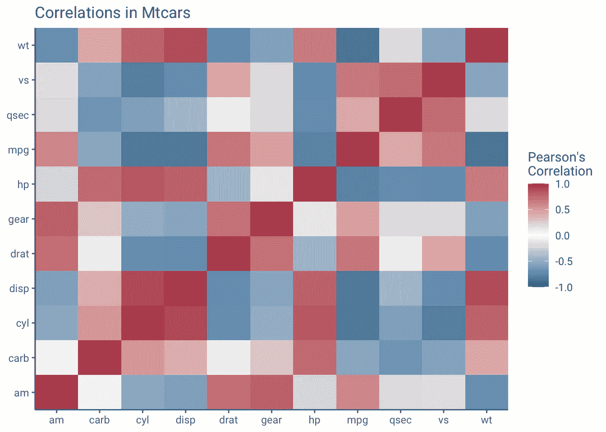

我们可以添加额外信息的相关性。对于这个特殊的图，我只添加了显著的(p 值小于 0.05)相关性，使用从`formatted_cors()`输出的列`r_if_sig`。

```
formatted_cors(mtcars) %>% 
 ggplot(aes(measure1, measure2, fill=r, label=round(r_if_sig,2))) +
 geom_tile() +
 labs(x = NULL, y = NULL, fill = "Pearson's\nCorrelation", title="Correlations in Mtcars", subtitle="Only significant Pearson's correlation coefficients shown") + scale_fill_gradient2(mid="#FBFEF9",low="#0C6291",high="#A63446", limits=c(-1,1)) +
 geom_text() +
 theme_classic() +
 scale_x_discrete(expand=c(0,0)) +
 scale_y_discrete(expand=c(0,0)) +
 theme(text=element_text(family="Roboto"))
```

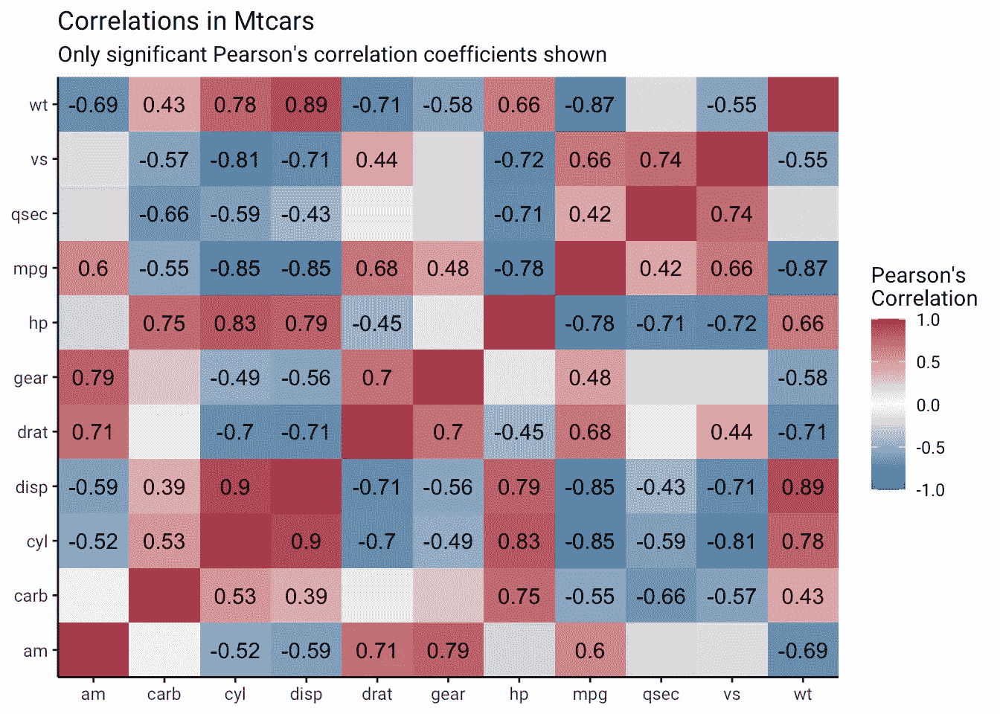

另一个版本可以包括不同大小的正方形，以使用`geom_point`来表示相关性的强度，其中`shape`被设置为来自这些可用的 `[geom_shape](http://www.sthda.com/english/wiki/ggplot2-point-shapes)` [s](http://www.sthda.com/english/wiki/ggplot2-point-shapes) 的[值。一定要取相关的绝对值，这样强的负相关也可以表示得更大。](http://www.sthda.com/english/wiki/ggplot2-point-shapes)

```
formatted_cors(mtcars) %>%
 ggplot(aes(measure1, measure2, col=r)) +
 ## to get the rect filled geom_tile(col="black", fill="white") + geom_point(aes(size = abs(r)), shape=15) + labs(x = NULL, y = NULL, col = "Pearson's\nCorrelation", title="Correlations in Mtcars") + theme_classic() +
 scale_color_gradient2(mid="#FBFEF9",low="#0C6291",high="#A63446", limits=c(-1,1)) +
 scale_x_discrete(expand=c(0,0)) +
 scale_y_discrete(expand=c(0,0)) +
 theme(text=element_text(family="Roboto")) +
 scale_size(range=c(1,11), guide=NULL)
```

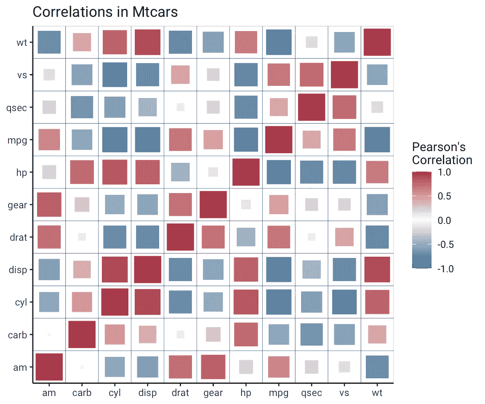

```
cors <- function(df) {
 M <- Hmisc::rcorr(as.matrix(df)) 
 Mdf <- map(M, ~data.frame(.x)) return(Mdf) }formatted_cors <- function(df){
 cors(df) %>%
 map(~rownames_to_column(.x, var="measure1")) %>%
 map(~pivot_longer(.x, -measure1, "measure2")) %>% 
 bind_rows(.id = "id") %>%
 pivot_wider(names_from = id, values_from = value) %>%
 mutate(sig_p = ifelse(P < .05, T, F), p_if_sig = ifelse(P <.05, P, NA), r_if_sig = ifelse(P <.05, r, NA)) }formatted_cors(mtcars) %>% 
 ggplot(aes(measure1, measure2, fill=r, label=round(r_if_sig,2))) +
 geom_tile() + 
 labs(x = NULL, y = NULL, fill = "Pearson's\nCorrelation", title="Correlations in Mtcars", subtitle="Only significant Pearson's correlation coefficients shown") + 
 scale_fill_gradient2(mid="#FBFEF9",low="#0C6291",high="#A63446", limits=c(-1,1)) +
 geom_text() +
 theme_classic() +
 scale_x_discrete(expand=c(0,0)) + 
 scale_y_discrete(expand=c(0,0)) +
 theme(text=element_text(family="Roboto"))
```


*原载于 2020 年 3 月 15 日*[*https://www.khstats.com*](https://www.khstats.com/blog/corr-plots/corr-plots/)*。*