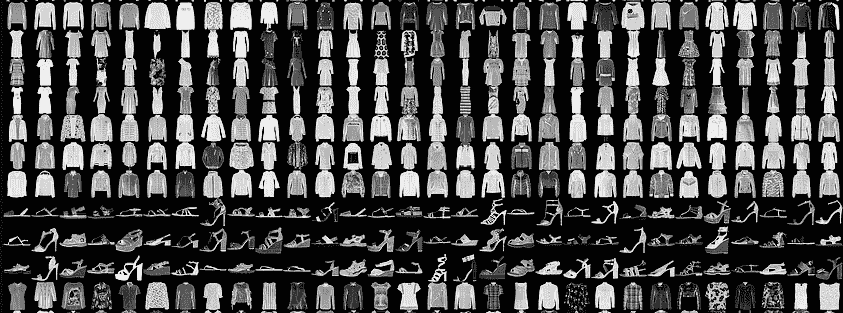
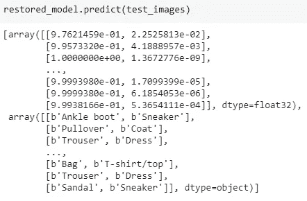

# 自定义分类模型输出层

> 原文：<https://towardsdatascience.com/customize-classification-model-output-layer-46355a905b86?source=collection_archive---------24----------------------->

## 使用 Keras 在自定义层中保存分类标签和最高机密

图像分类是深度学习应用的手册示例。制作分类模型的标准方法包括预处理步骤，在该步骤中，人类可读的类标签(例如:“汽车”、“人”、“猫”)被改变成机器可用的数字(例如:0，1，2)。最常见的方法是将可能的类列表与它们的索引进行映射。当然，这也需要一个后处理步骤，将结果转换成预期的形式。一种常见的方法是存储具有最高分数的类的标签和分数(对此广泛使用的术语是*置信度*)。

在这个故事中，我将展示一个在模型末尾使用自定义图层在模型中存储标签的示例。我的模型的首选输出是前 *k* 标签及其置信度得分的列表。格式化的输出在产品是模型的生产中是有用的，并且标签必须存储在模型中。或者，当标签列表随着模型的每次迭代而改变时。

`Input: image(W,H,C)
Outputs: labels(k) string, confidences(k) float`

照片由[大卫·兰格尔](https://unsplash.com/@rangel?utm_source=unsplash&utm_medium=referral&utm_content=creditCopyText)在 [Unsplash](https://unsplash.com/s/photos/programming?utm_source=unsplash&utm_medium=referral&utm_content=creditCopyText) 上拍摄

# 训练分类模型

对于这个故事，我将使用一个简单的分类模型。[这个 Colab 笔记本](https://colab.research.google.com/github/tensorflow/docs/blob/master/site/en/tutorials/keras/classification.ipynb)展示了一个在时尚 MNIST 数据集上训练的分类器的例子(在 60000 张图片上训练，在 10000 张图片上测试)。该模型预期 28x28x1 灰度图像，并返回 10 类的 *softmax* 概率。类别标签列表包括:

`class_names = ['T-shirt/top', 'Trouser', 'Pullover', 'Dress', 'Coat', 'Sandal', 'Shirt', 'Sneaker', 'Bag', 'Ankle boot']`

处理模型输出的一种简单方法是简单的映射:找到得分最高的索引并使用该索引的标签。

`class_names[np.argmax(predictions[0])]`获取图像的标签 0。

[时尚 MNIST 范例](https://github.com/zalandoresearch/fashion-mnist)(作者 Zalando，麻省理工学院许可)。

# 构建自定义图层

要了解如何在 Keras 中制作自定义图层，建议阅读 Keras 和 [TensorFlow](https://www.tensorflow.org/tutorials/keras/save_and_load) 中的原始文档[。](https://keras.io/layers/writing-your-own-keras-layers/)

我想实现一个自定义层来存储`labels` 和一个`topn`值，这样该层的输出可以是前 *n 个*置信度标签及其分数。为此，我们必须覆盖图层的`__init__`、`call`、`compute_output_shape` 和`get_config` 功能。

带有标签和 Top_k 选择的自定义图层

## 初始化

在 init 函数中，我们将构造函数参数存储为类的字段。不要忘记调用父类的构造函数！`super(LabelLimitLayer, self).__init__(**kwargs)`

## 打电话

call 函数期望前一层的输出作为输入，并计算`top_k` 类及其标签。为此，我使用了张量流函数。

为了从标签列表中创建一个`(?,len(labels))` 形状的张量，我们首先使用列表(我们自定义类的参数)创建一个张量，然后使用前一层输出的形状扩展它(我们从中提取`batch_size` )。这些步骤是:

`tf_labels = tf.constant([self.labels], dtype=”string”)`弦型张量
`tf_labels = tf.tile(tf_labels,[batch_size,1])`展开得到(？1)处理批次的动态形状。

为了选择最高的 k 个分数，我使用了相应的 TensorFlow 函数。我们存储这些指数，这样我们就可以映射这些指数的标签以及置信度值。
`top_k = tf.nn.top_k(x, k=self.topn, sorted=True, name=”top_k”).indices`

为了使用一个张量的索引来获取另一个张量的值，我使用了 tf.gather 函数。
`top_conf = tf.gather(x, top_k, batch_dims=1)
top_labels = tf.gather(tf_labels, top_k, batch_dims=1)`

最后，该层返回最后两个张量。
`return [top_conf, top_labels]`

## 计算输出形状

由于有两个输出张量，Keras 层不能自动计算输出形状。好在可以这样计算:
`top_shape = (batch_size, self.topn)
return [top_shape, top_shape]`

## 获取配置

为了序列化定制层(当保存模型时)，必须用类参数的值更新配置。不要忘记将超类的配置添加到字典中！

# 将输出图层添加到模型

在这个例子中，我在基本分类模型的末尾添加了一个自定义层，带有标签(`class_names`)和 top_k 值(`2`)。

`label_layer = LabelLimitLayer(class_names, 2)(base_model.output)
label_model = Model(base_model.input, label_layer)`

时尚 MNIST 数据集中的预测标签

# 保存和加载模型

最后，为了保存一个模型，我们可以使用 Keras 模型的 save 函数。要加载带有自定义层的模型，必须在`custom_objects` 参数中定义该自定义层。

`label_model.save(‘test.h5’)
restored_model = keras.models.load_model(“test.h5”, custom_objects={“LabelLimitLayer”:LabelLimitLayer})`

# 摘要

这个片段展示了如何使用 Keras 自定义层来创建字符串标签作为模型的输出。这个故事还使用 top_k 只保留相关的类。相应的代码可在[这款 Colab 笔记本](https://colab.research.google.com/drive/1--n60Ss4TY-jnJ2s0IoW-1Y9FRGxG1_i)上找到。