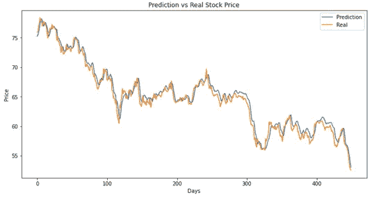

# 定制损失函数，使 LSTM 模型更适用于股票价格预测

> 原文：<https://towardsdatascience.com/customize-loss-function-to-make-lstm-model-more-applicable-in-stock-price-prediction-b1c50e50b16c?source=collection_archive---------10----------------------->

## 损失函数不要只考虑价格差异，方向损失也很重要！！！


尼克·崇在 [Unsplash](https://unsplash.com?utm_source=medium&utm_medium=referral) 上的照片

# **背景**

这里有很多在线教程或文章教你如何建立一个 LSTM 模型来预测股票价格。无论是简单的还是复杂的，我们都可以以某种方式获得一个“想要的”结果，类似于下图(图表 1)。是的，如果我们简单地通过查看均方差(MSE)来判断模型，这是可取的。

但是，在现实世界的交易中，做得好就能帮我们赚大钱吗？很遗憾，答案总是否定的。在本文中，我们将尝试定制损失函数，使我们的 LSTM 模型更适用于现实世界。



附件 1——基于简单 LSTM 模型的汇丰(0005.HK)股票价格预测

# **面临的问题**

我这不是因为教程出了问题或者模型训练得不够好。但是从根本上说，有几个主要的限制很难解决。

1.**所有免费库只提供每日股价数据** — *没有实时数据，我们不可能在当天执行任何订单*

2.**常用的损失函数(MSE)是一个纯粹的统计损失函数***——纯粹的价格差异不代表全貌*

3. **LSTM 模型或任何其他递归神经网络模型始终是一个黑箱***——交易策略只能基于没有任何理由支持的价格运动，并且这些策略很难扩展到投资组合分配*

如果没有更多的资源，限制(1)和(3)很难解决。对于(1)，解决方案可能是连接到实时交易数据提供商，如彭博，然后训练出一个实时 LSTM 模型。下一秒的交易指令可以自动下达。但是很遗憾地说，如果你不在交易大厅工作，很难做到这一点。

对于(3)，如果旨在通过一些解释扩展到投资组合分配，可能其他概念如均值-方差优化、一些稳健的估计量，然后考虑风险价值(VaR)更合适。但那完全是另一回事了。

在本文中，我们将指出第二个限制，并重点关注一种可能的方法— **通过考虑方向损失**来定制损失函数，以使 LSTM 模型在有限的资源下更适用。

# **存在的困难**

L et 回到上图(附表 1)。它看起来很完美，表明该模型的预测能力非常高。诚然，在训练 300 个历元后，其训练损失的 MSE 仅为 0.000529，但**其预测第二天价格运动方向的准确性仅为 0.449889** ，甚至低于抛硬币！！！

MSE 主要关注真实价格和预测价格的差异，而不考虑预测的方向是否正确。如果我们应用基于 LSTM 模型预测的卖出/买入期权这样的交易策略，这一特征会造成巨大的麻烦。从这个角度来看，应该强调方向的正确性。

此外，该模型是基于给定数据可用性的每日价格，并试图预测第二天的收盘价，这并没有捕捉到当天的价格波动。在这种情况下，方向的准确性甚至比价格差异更重要。甚至有些日子你可能会赚得少，但至少不会导致金钱损失。

# **方法论**

N 现在，我们开始自定义损失函数。关于数据预处理的细节以及如何建立简单的 LSTM 模型股票预测，请参考 Github 链接[这里](https://github.com/ngaiyin1760/LSTM-model-stock-price-movement-prediction-)。完整的代码也可以在那里找到。

***步骤 1:从损失函数的输入张量中提取必要的信息***

```
def **custom_loss**(y_true, y_pred):

	*#extract the "next day's price" of tensor*
	y_true_next = y_true[1:]
	y_pred_next = y_pred[1:] *#extract the "today's price" of tensor* 	y_true_tdy = y_true[:-1]
	y_pred_tdy = y_pred[:-1]
```

**永远记住损失函数的输入是两个张量， *y_true*** (真实价格)和 ***y_pred*** (预测价格)**。首先，我们必须创建四个新的张量来存储来自两个输入传感器的“第二天的价格”和“今天的价格”,以备将来使用。**

***第二步:创建新的张量来记录价格运动(涨/跌)***

```
*#substract to get up/down movement of the two tensors*
y_true_diff = tf.subtract(y_true_next, y_true_tdy)
y_pred_diff = tf.subtract(y_pred_next, y_pred_tdy)*#create a standard tensor with zero value for comparison*
standard = tf.zeros_like(y_pred_diff)*#compare with the standard; if true, UP; else DOWN*
y_true_move = tf.greater_equal(y_true_diff, standard)
y_pred_move = tf.greater_equal(y_pred_diff, standard)
```

**TF . subtract**是从 ***y_true_next*** 张量中减去 ***y_true_tdy*** 张量中的元素值。然后，我们将两个差分张量( ***y_true_diff*** 和 ***y_pred_diff*** )与标准零张量进行比较。如果该值大于或等于零，则属于向上运动，否则属于向下运动。 **tf.greater_equal** 将返回一个布尔张量。

***第三步:找出两个张量运动方向不同时的指标***

```
*#find indices where the directions are not the same*
condition = tf.not_equal(y_true_move, y_pred_move)
indices = tf.where(condition)ones = tf.ones_like(indices)
indices = tf.add(indices, ones)
```

(a)**TF . not _ equal**比较两个布尔张量 ***y_true_move*** 和 ***y_pred_move*** ，生成另一个新的布尔张量——**条件**。如果第二天的方向在真实运动和预测运动之间相同，则返回**真**，否则返回**假**。

(b)在**条件**张量中 **tf.where** 返回“真”的位置。

(c)**TF . add**为**索引**张量中的每个元素加 1。如果您足够仔细，您可能会注意到任何处理过的张量的形状都是(49，1)，比原始输入的形状(50，1)短一个单位。加 1 意味着我们在一天后移动索引，这代表了第二天在原始输入张量中的真实位置。

***第四步:创建一个张量来存储方向损耗，并将其放入自定义损耗输出***

```
direction_loss = tf.Variable(tf.ones_like(y_pred), dtype='float32')
updates = K.cast(tf.ones_like(indices), dtype='float32')
alpha = 1000
direction_loss = tf.scatter_nd_update(direction_loss, indices, alpha*updates)custom_loss = K.mean(tf.multiply(K.square(y_true - y_pred), direction_loss), axis=-1)
```

现在，我们正在创建最重要的张量—***direction _ loss****。*由于它应该是一个可训练的张量并被放入最终输出*—****custom _ loss****，*它必须被设置为一个变量张量，使用 ***tf.Variable.***

张量 ***索引*** 存储了真实价格和预测价格之间方向不匹配的位置。通过***TF . scatter _ nd _ update***，我们可以通过指定位置来更新张量***direction _ loss***中的值，并用新值替换。但是请记住，索引和更新的形状必须相同。***direction _ loss***的最终乘积是一个值为 1 或 1000 的张量。

最后，我们用 ***方向损失*** 张量乘以真实价格和预测价格的平方差。**这里的概念是，如果当天的真实价格和预测价格之间的方向匹配，我们将损失保持为平方差。如果不匹配，那么我们用α(1000)乘以差值的平方。**

**最后，定制的损失函数完成。**我们现在已经考虑了预测价格是否与真实价格同向。如果我们应用具有相同设置(批量:50，时期:300，时间步长:60)的 LSTM 模型来预测汇丰银行(0005。HK)，预测价格方向的精度从 0.444343 提高到 0.561158。这是一个很大的进步，但仍远非完美。如果我们想建立一个更好的损失函数，我们将在本文的最后部分讨论一些需要克服的障碍。

# **一些可以帮你节省时间的技巧**

M 大多数时候，我们可能要用和上面完全不同的概念来定制损失函数。以下是一些技巧，可以帮助您节省时间或跟踪过程中的错误。

(a)***get _ shape***—当你不确定张量的形状时，毫不犹豫地用这个函数把它打印出来。几乎所有的处理函数都要求所有输入张量的形状相同。

(b)***keras . back end . cast***—当错误消息称张量中的元素格式与其他元素不匹配时，尝试使用此功能将张量的元素格式更改为特定类型。

(c)***tensor flow . reshape***—当错误消息称形状与原始输入不匹配时，应保持(x，1)的一致形状，尝试使用此函数 ***tf.reshape(tensor，[-1])*** 展平张量。

(d)***custom _ loss***—记住，最终产品必须由两个输入的张量 ***y_true*** 和 ***y_pred*** 组成，并将返回到 LSTM 模型的主体进行编译。

# 需要克服更多障碍…

他的成绩现在已经有了很大的进步，但还远远不够完美。然而，要更进一步，许多障碍在等着我们，下面是其中的一些。

**(a)难以平衡价格差异和方向性损失** —如果 alpha 设置过高，您可能会发现预测价格波动很小。如果我们画出来，它几乎是一条直线。这意味着方向损耗主导了损耗函数。在这种情况下，预测的价格变得毫无意义，但只有它的方向是有意义的。我们只是在打赌第二天的价格是上涨还是下跌。

**(b)难以将分类分类器应用于股票价格预测**—你们中的许多人可能会发现，如果我们只是简单地押注价格运动(上涨/下跌)，那么我们为什么不应用分类分类器来做预测，或者将损失函数变成***TF . binary _ cross entropy****。很抱歉，结果没有任何改善。我试过先把所有的价格数据转换成用 0(跌)或 1(涨)表示的“运动数据”，输入进行训练。但是由于数据的本质是时间序列，与手写识别不同，每个训练批次中的 0 或 1 数组不足以进行第二天价格运动的预测。一些方法，如支持向量机(SVM)和卷积神经网络(CNN)，在分类中表现很好，但很难应用于这种情况。*

**(c) Alpha 对每只股票来说都非常具体**——我曾试图将相同的模型应用于其他 10 只股票的股价预测，但并不是所有股票都有很大的改善。对于每一只股票来说，价差和方向性亏损之间的关系似乎非常独特。所以我们可能要花很多时间来找出每只股票的最佳组合。

# 结论

从最小化均方误差的角度出发，建立一个理想的 LSTM 模型来预测股票价格总是不难的。但是它在现实世界中并不适用。本文介绍了一种可能的方法——**通过考虑方向损耗**来定制损耗函数，并讨论了在此过程中的一些困难并提供了一些建议。我希望它将开启关于如何改进我们的 LSTM 模式的讨论。如前所述，如果我们想更进一步，就必须克服许多障碍，特别是在资源有限的情况下。

这篇文章也是我第一次在媒体上发表。在未来，我将尝试探索更多关于数据科学和机器学习技术在经济和金融领域的应用。感谢支持！！！

# 参考

1.  阿苏托什·纳亚克。(2019).[用 LSTM 预测股票价格](/predicting-stock-price-with-lstm-13af86a74944)。
2.  Dhiraj K. (2019)。[如何在 Keras 中创建自定义损失函数](https://heartbeat.fritz.ai/how-to-create-a-custom-loss-function-in-keras-637bd312e9ab)。
3.  埃亚尔·扎凯。(2019).[高级 Keras——构建复杂的客户损失和指标](/advanced-keras-constructing-complex-custom-losses-and-metrics-c07ca130a618)。

[](https://medium.com/@hudsonko/membership) [## 用我的推荐链接加入媒体-哈德森高

### 如果你对我写的东西感兴趣，不要错过成为 Medium 会员的机会。您将可以完全访问所有…

medium.com](https://medium.com/@hudsonko/membership)