# 在 Matplotlib 中自定义多个子情节

> 原文：<https://towardsdatascience.com/customizing-multiple-subplots-in-matplotlib-a3e1c2e099bc?source=collection_archive---------5----------------------->


在 [Unsplash](https://unsplash.com?utm_source=medium&utm_medium=referral) 上由 [Aron 视觉](https://unsplash.com/@aronvisuals?utm_source=medium&utm_medium=referral)拍摄的照片

## [入门](https://towardsdatascience.com/tagged/getting-started)

## 使用 subplot、add_subplot 和 GridSpec 在 Matplotlib 中创建复杂 subplot 的指南

在某些时候，我们需要将我们的数据可视化成复杂的图形，因为我们应该这样做或者制作一个伟大的图形。例如，您想在绘图中制作一个[缩放效果](/5-powerful-tricks-to-visualize-your-data-with-matplotlib-16bc33747e05)，如图 1 所示。为了呈现它，你需要建立一个复杂的次要情节。图 1 由三个不同的轴构成:轴 1、轴 2 和轴 3。Axes1 在左上角的面板上，用绿色的绘图线显示数据，axes2 在右上角的面板上，用橙色的线显示数据，最大的 axes3 位于底部的面板上。

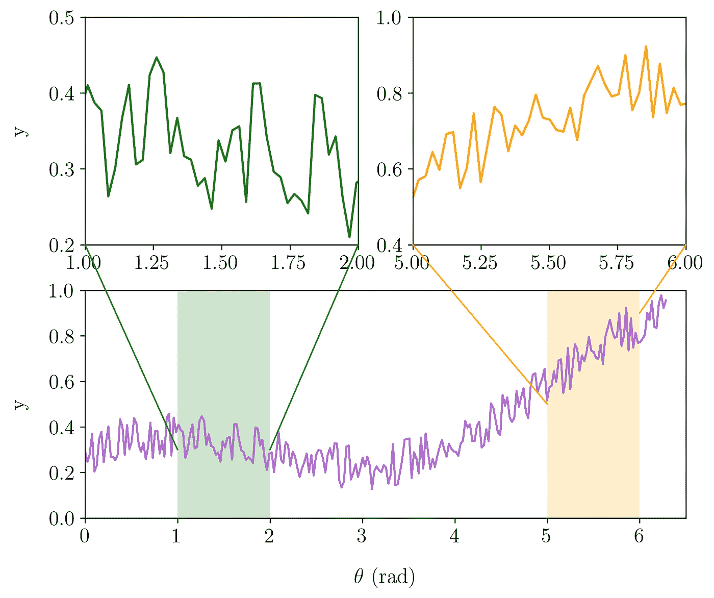

**图一。**Matplotlib 中的缩放效果([图片作者](/5-powerful-tricks-to-visualize-your-data-with-matplotlib-16bc33747e05))。

在创建复杂的图之前，你需要知道 Matplotlib 中的术语**图**和**轴**之间的区别。为此，您可以了解 Matplotlib 中定义的图形的结构，如图 2 所示。

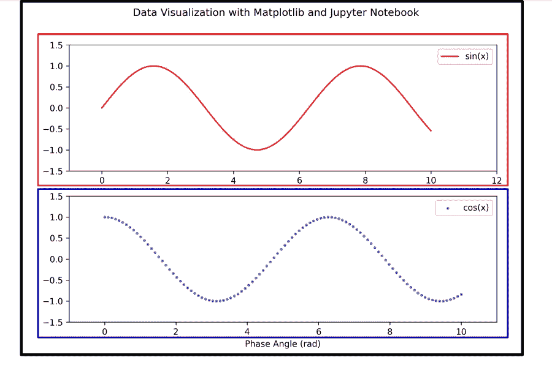

**图二。**Matplotlib 中图形和轴的区别(图片由作者提供)。

**图**被定义为所有元素的主容器，如轴、图例、标题等。一个图形可以包含一些轴(我们将更深入地了解它)。在图 1 中，我们只有一个图形，它包含三个轴。如果您想在 Maptlotlib 中创建缩放效果，请访问此链接。

[](/5-powerful-tricks-to-visualize-your-data-with-matplotlib-16bc33747e05) [## 使用 Matplotlib 可视化数据的 5 个强大技巧

### 如何使用 LaTeX 字体，创建缩放效果，发件箱图例，连续错误，以及调整框填充边距

towardsdatascience.com](/5-powerful-tricks-to-visualize-your-data-with-matplotlib-16bc33747e05) 

## 使用子情节在图形中创建简单的轴

在这一节中，我们将学习 Matplotlib 中子情节的基本原理。我将展示给你的一些例子不是现实的情节，但它将成为理解支线剧情的好例子。

要创建轴，至少可以使用两种不同的方法。第一种可以使用语法 ***支线剧情*** ，第二种是使用 ***gridspec。*** 在开始学习 ***支线剧情*** 的时候，我会给你看一个简单的支线剧情，如图 3。

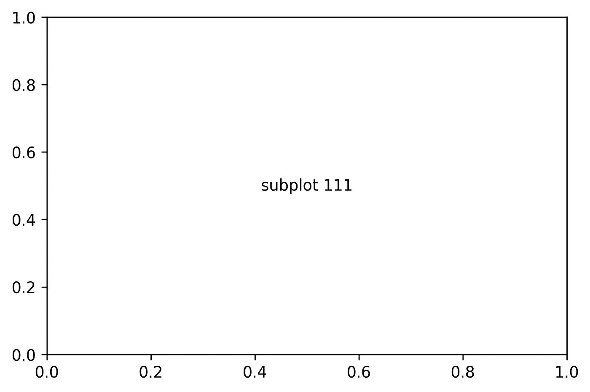

**图 3。**Matplotlib 中的一个简单支线剧情(图片由作者提供)。

您可以使用以下代码生成图 3

```
import matplotlib.pyplot as pltfig = plt.figure()
coord = 111
plt.subplot(coord)
plt.annotate('subplot ' + str(coord), xy = (0.5, 0.5), va = 'center', ha = 'center')
```

理解 Matplotlib 中子绘图的一件重要事情是定义轴的坐标。上面代码中的变量 ***coord*** 是 111。它由代表行数、列数和轴序列的三个数字组成。 ***coord*** 111 的意思是，你生成一个由一行一列组成的图形，你在第一个序列轴中插入子情节。因为你只有一行一列(这意味着你只有一个单元格)，你的轴是主要的图形。您也可以在没有**子图**语法的情况下生成图 3，因为您在一个图形中只生成一个轴。

下一步是在图形中创建两个水平轴，如图 4 所示。您可以使用这段代码来生成它

```
fig = plt.figure(figsize=(12, 4))
coord1 = 121
coord2 = 122plt.subplot(coord1)
plt.annotate('subplot ' + str(coord1), xy = (0.5, 0.5), va = 'center', ha = 'center')plt.subplot(coord2)
plt.annotate('subplot ' + str(coord2), xy = (0.5, 0.5), va = 'center', ha = 'center')
```

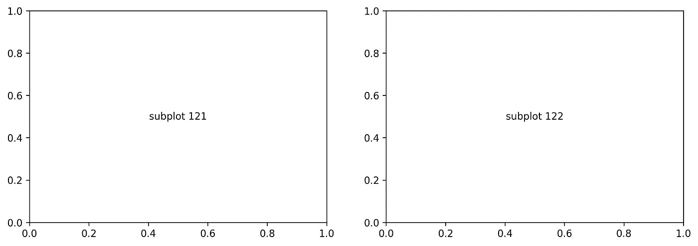

**图 4。**图中两个横轴(图片由作者提供)。

您需要定义图形大小来创建一个漂亮的两个水平轴。如果你不这样做，你会得到一个类似数字 5 的数字。


**图 5。**一个图形中的两个横轴，没有定义图形大小(图片由作者提供)。

如果要创建两个垂直轴，只需更改坐标 1 和坐标 2，如以下代码所示

```
fig = plt.figure(figsize=(6, 7))
coord1 = 211
coord2 = 212plt.subplot(coord1)
plt.annotate('subplot ' + str(coord1), xy = (0.5, 0.5), va = 'center', ha = 'center')plt.subplot(coord2)
plt.annotate('subplot ' + str(coord2), xy = (0.5, 0.5), va = 'center', ha = 'center')
```

现在，我将尝试使用循环在一个图形中创建更多的支线剧情。我将创建 2x4 轴，如图 6 所示。

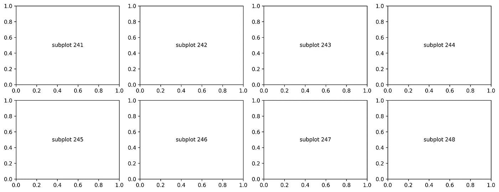

**图 6。**在 Matplotlib 中使用循环创建一个简单的子情节(图片由作者提供)。

您可以使用这段代码重现图 6

```
fig = plt.figure(figsize=(16, 6))coord = []# create coord array from 241, 242, 243, ..., 248 
for i in range(1, 9): # in python, 9 is not included
    row = 2
    column = 4
    coord.append(str(row)+str(column)+str(i))

# create subplot 241, 242, 243, ..., 248
for i in range(len(coord)):
    plt.subplot(coord[i])
    plt.annotate('subplot ' + str(coord[i]), xy = (0.5, 0.5), va = 'center', ha = 'center')
```

因为你要创建 8 个轴(2 行 4 列)，所以你需要做一个从 241 到 248 的数组。之后，使用与前面代码相同的过程创建子情节，但是将它放在循环语法中。

## 用 gridspec 在图形中创建简单轴

正如我之前提到的，除了使用 subplot 在图形中创建一些轴，还可以使用 gridspec。例如，如果您想用 gridspec 创建图 6(两行 4 列),您可以使用下面的代码

```
import matplotlib.pyplot as pltfig = plt.figure(figsize=(16, 6))rows = 2
columns = 4grid = plt.GridSpec(rows, columns, wspace = .25, hspace = .25)for i in range(rows*columns):
    exec (f"plt.subplot(grid{[i]})")
    plt.annotate('subplot 24_grid[' + str(i) + ']', xy = (0.5, 0.5), va = 'center', ha = 'center')
```

要使用 gridspec 创建简单的子情节，首先要定义行数和列数。要将支线剧情嵌入到图中，你只需调用支线剧情的编号。在 gridspec 中，子情节的数量从 0 开始，而不是从 1 开始。所以，如果要使用 gridspec 在一个图中嵌入 8 列，需要从 0 到 7 调用它们，使用***PLT . subplot(grid[0])***直到***PLT . subplot(grid[7])***。在循环中，你会遇到一个问题，因为你想用[]调用网格号。要处理它，可以使用语法***exec(f "…{[I]} "***。

图 7 是使用 gridspec 创建 8 个轴的结果

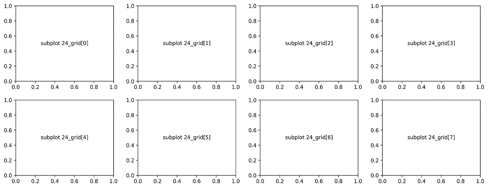

**图 7。**在 Matplotlib 中使用 gridspec + looping 创建一个简单的子情节(图片由作者提供)。

使用 ***gridspec*** 的一个好处是你可以用比只使用支线剧情更简单的方式创造更多支线剧情。例如，如果您想在一个图形中创建 10 个以上的支线剧情，您将定义最后一个坐标。子情节仅由三个数字组成，例如 111、428、439 等。一个支线剧情无法促成第四个。例如，您想在一个图形中创建 18 个轴(3 行 6 列)。如果只使用支线剧情，需要定义 361，362，263，…，3616。当你嵌入一个 3610 的支线剧情时，你将面临错误。要解决它，可以使用 gridspec。图 8 展示了使用 gridspec 创建 18 个轴。

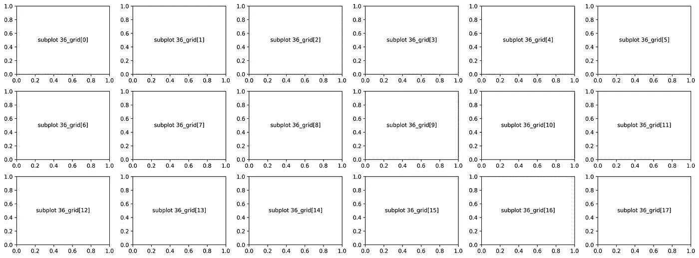

**图 8。**在 Matplotlib 中使用 gridspec + looping 创建简单的 18 个支线剧情(图片由作者提供)。

您可以用这段代码创建图 8

```
fig = plt.figure(figsize=(22, 8))rows = 3
columns = 6grid = plt.GridSpec(rows, columns, wspace = .25, hspace = .25)for i in range(rows*columns):
    exec (f"plt.subplot(grid{[i]})")
    plt.annotate('subplot 36_grid[' + str(i) + ']', xy = (0.5, 0.5), va = 'center', ha = 'center')
```

为了做一个更真实的例子，我将在图 8 中为每个轴插入一个图。所以，我需要为每个轴做 18 个不同的函数。它是由***【sin(x^(i/9】)***的函数编译而成，其中 ***i*** 是从 0 到 17 的网格数。您可以在图 9 中看到该图。

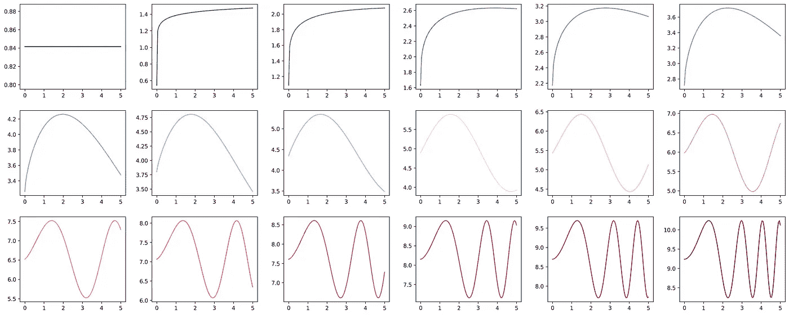

**图九。**Matplotlib 中更现实的支线剧情(图片由作者提供)。

要创建图 9，您可以使用下面的代码

```
fig = plt.figure(figsize=(25, 10))color = ['#00429d', '#2754a6', '#3a67ae', '#487bb7', '#548fc0', 
         '#5ea3c9', '#66b8d3', '#6acedd', '#68e5e9', '#ffe2ca', 
         '#ffc4b4', '#ffa59e', '#f98689', '#ed6976', '#dd4c65', 
         '#ca2f55', '#b11346', '#93003a']rows = 3
columns = 6grid = plt.GridSpec(rows, columns, wspace = .25, hspace = .25)for i in range(rows*columns):
    np.random.seed(100)
    x = np.linspace(0., 5., 100)
    y = np.sin(x**(i / 9)) + np.random.random() * i

    exec (f"plt.subplot(grid{[i]})")

    plt.plot(x, y, color = color[i])
```

要用不同的颜色呈现，还需要定义 18 种不同的颜色。您可以使用这个[链接](https://gka.github.io/palettes/#)来生成它。我已经在下面的链接中解释了如何使用它。

[](/matplotlib-styles-for-scientific-plotting-d023f74515b4) [## 用于科学绘图的 Matplotlib 样式

### 为您的科学数据可视化定制 Matplotlib

towardsdatascience.com](/matplotlib-styles-for-scientific-plotting-d023f74515b4) 

## 用 add_subplot 在图形中创建复杂轴

在本节中，我们将学习如何使用 ***add_subplot*** 和 ***GridSpec*** 定制复杂的轴。我提到的复杂轴如图 10 所示。


**图 10。**Matplotlib 中复杂的轴(图片由作者提供)。

## 示例 1 使用 add_subplot

我们将使用 ***add_subplot*** 语法创建 3 个轴(顶部 2 个，底部 1 个),如图 1 所示。您可以使用这段代码来创建它。

如果你分析代码，你会得到一个与**子情节**语法概念类似的概念。您需要定义三个坐标，例如(2，2，1)或(2，2，(3，4))。 ***sub1*** 轴位于 2 行 2 列图形的第一个轴(1)上。 ***sub2*** 与 ***sub1*** 有类似的方案。其中重要的是轴 3 和轴 4 的组合 ***sub3、*** 。所以 ***sub3*** 的坐标是(2，2，(3，4))。如果您运行上面的代码，您将得到一个结果，如图 11 所示。

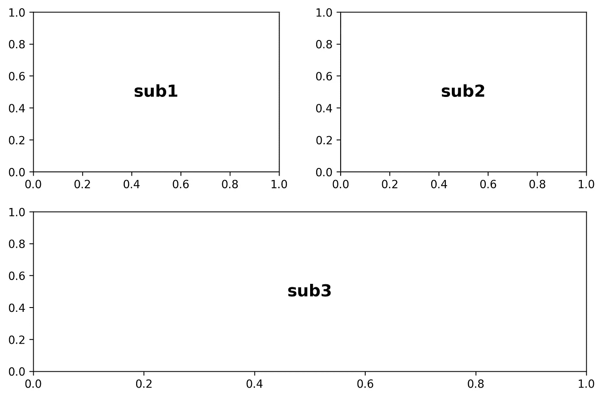

**图 11。**Matplotlib 中第一个使用 add_subplot 的复杂轴的例子(图片由作者提供)。

如果要为每个轴添加绘图，可以在定义 sub1、sub2 和 sub3 之后添加此代码。

```
sub1.plot(x, y)
sub2.plot(x, y)
sub3.plot(x, y)
```

完整的代码在这里。

全部

您将得到一个结果，如图 12 所示。

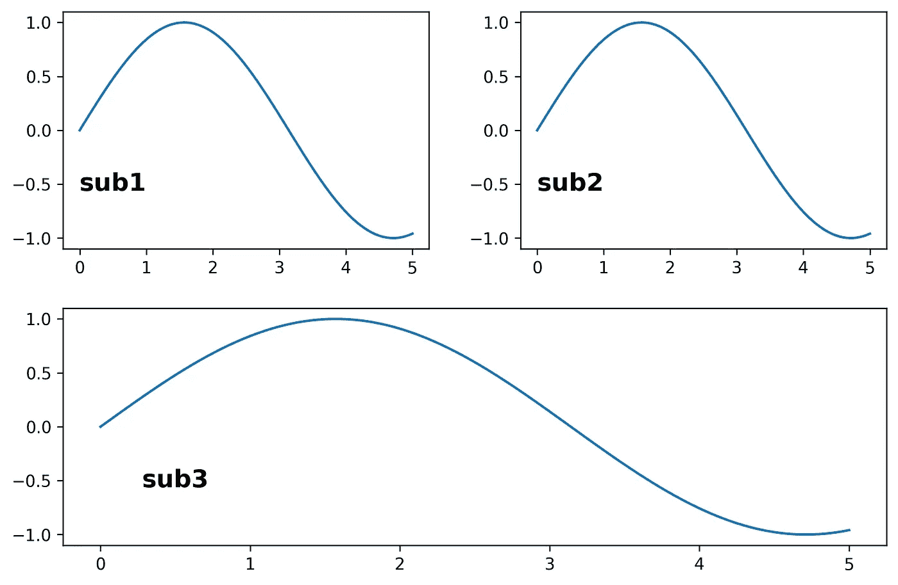

**图 12。**Matplotlib 中第一个使用 gridspec 的复杂轴的例子(图片由作者提供)。

## 示例 1 使用 gridspec

作为替代，您也可以使用 gridspec 语法创建图 12。下面是您可以用来创建它的代码。

该代码创建了 2 行 2 列。 ***sub1*** 和 ***sub2*** 放在第一行第 0 列第 1 列(记住 gridspec 是从 0 索引开始的)。 ***sub3*** 放在第二行，取所有列，用 ***:*** 表示。如果您运行上面的代码，您将得到相同的图，如图 12 所示。

## 示例 2 使用 add_subplot

复杂轴的第二个例子如图 13 所示。

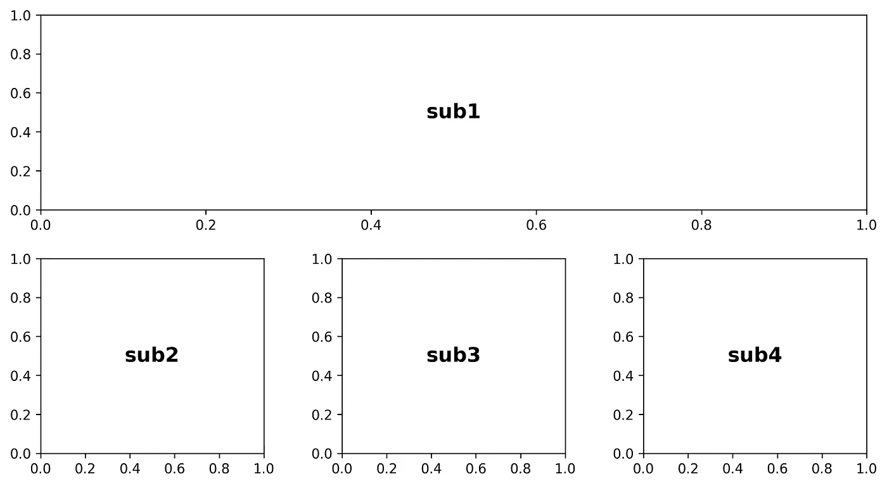

**图十三。**Matplotlib 中使用 gridspec 的复杂轴的第二个例子(图片由作者提供)。

您将在图形中生成 4 个轴:sub1、sub2、sub3 和 sub4，共 2 行 4 列。 ***sub1*** 取第一行的所有列。 ***sub2、sub3 和 sub4*** 放置在第二行的每一列上。要生成图 12，您可以使用以下代码。

## 示例 2 使用 gridspec

要使用 gridspec 创建图 12，可以使用下面的代码。

我觉得上面的代码已经足够清晰易懂了:d .代码会生成一个情节，如图 14 所示。

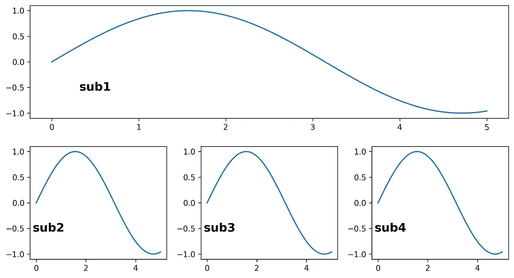

**图 14。**Matplotlib 中使用 gridspec 的复杂轴的第二个例子(图片由作者提供)。

## 示例 3 使用 add_subplot

第三个例子如图 15 所示。

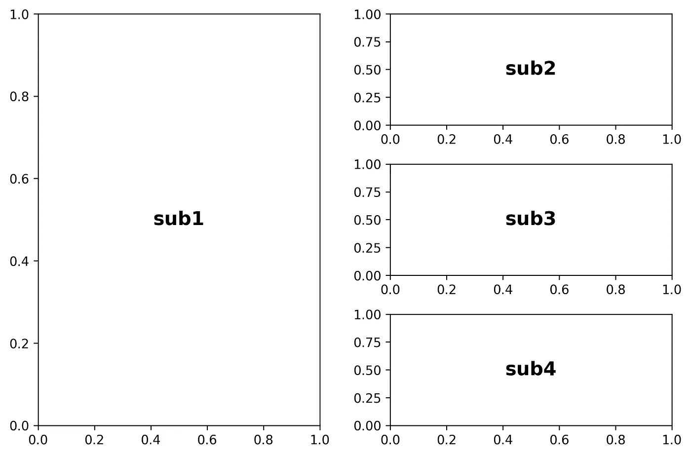

**图 15。**Matplotlib 中复杂轴使用 add_subplot 的第三个例子(图片由作者提供)。

要创建图 15，您可以使用以下代码。

## 示例 3 使用 gridspec

要使用 gridspec 创建图 15，可以使用下面的代码。

结果如图 16 所示。

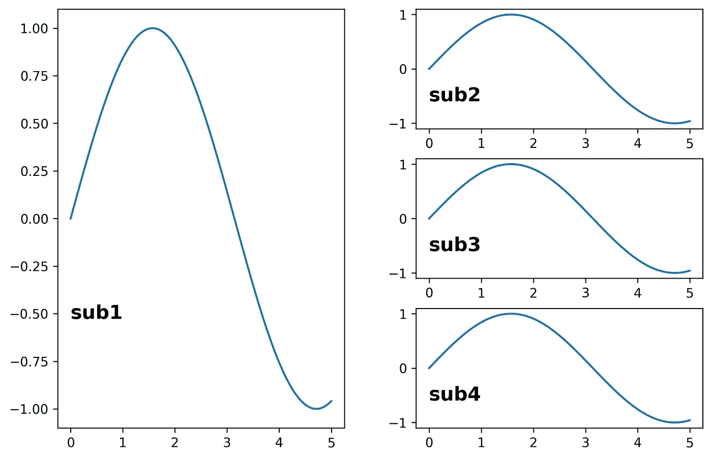

**图 16。**Matplotlib 中使用 gridspec 的复杂轴的第三个例子(图片由作者提供)。

## 示例 4 使用 add_subplot

在最后一个示例中，将指导您在图形中创建 6 个轴，行数为 4，列数为 2。如图 17 所示。

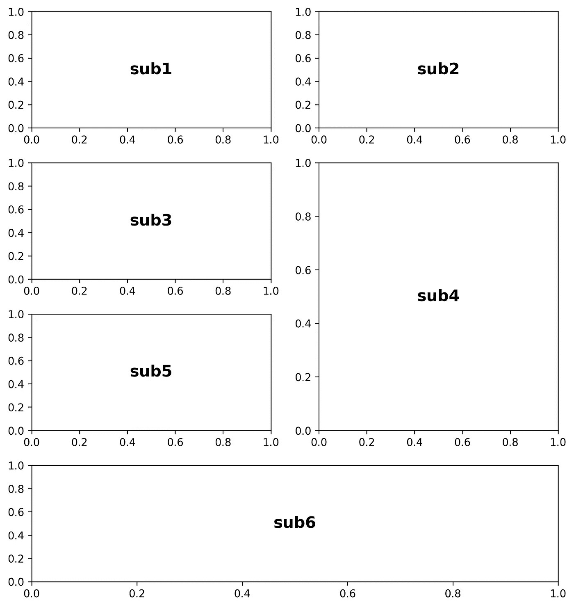

**图 17。**Matplotlib 中复杂轴使用 add_subplot 的第四个例子(图片由作者提供)。

要用 add_subplot 创建它，可以使用下面的代码。

## 示例 4 使用 gridspec

要用 gridspec 创建图 17，可以使用下面的代码。

你需要注意 ***sub4*** ，放在 1:3 行 1 列。行 1:3 意味着 ***sub4*** 将采用行号 1 和 2。请记住，不包括第 3 行。代码将生成一个图，如图 17 所示。

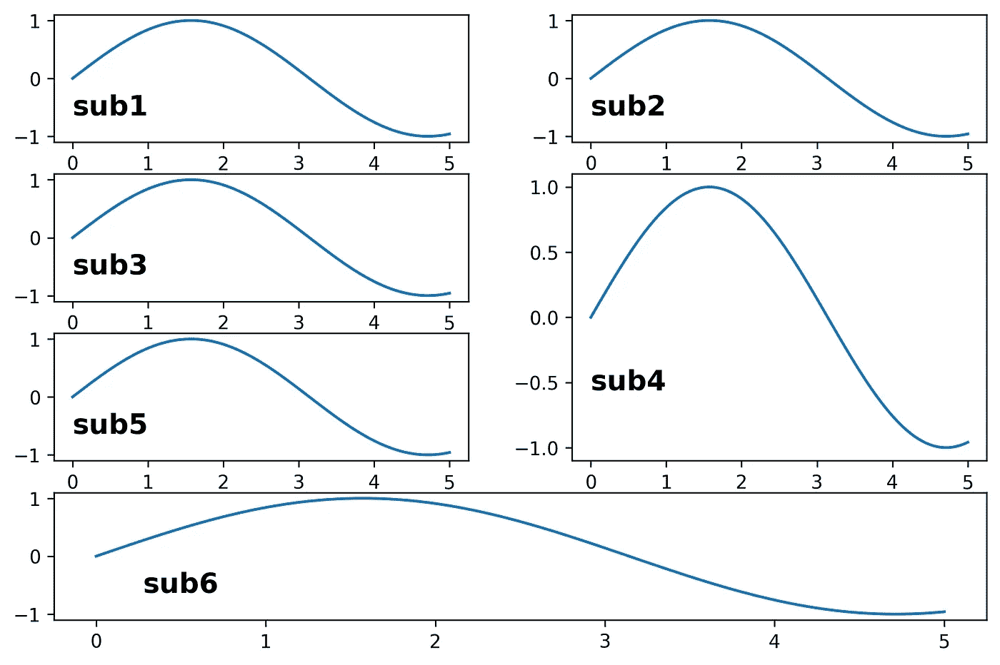

**图 18。**Matplotlib 中使用 gridspec 的复杂轴的第四个例子(图片由作者提供)。

## 结论

处理复杂数据时，需要创建一个复杂的绘图来可视化数据。我希望这个故事可以帮助你从不同的角度来可视化你的数据。如果你需要用 Matplotlib 创建科学发表图，可以访问这个[链接](/create-professional-plots-using-matplotlib-63a6863b7363)。

## 如果你喜欢这篇文章，这里有一些你可能喜欢的其他文章:

[](/5-powerful-tricks-to-visualize-your-data-with-matplotlib-16bc33747e05) [## 使用 Matplotlib 可视化数据的 5 个强大技巧

### 如何使用 LaTeX 字体，创建缩放效果，发件箱图例，连续错误，以及调整框填充边距

towardsdatascience.com](/5-powerful-tricks-to-visualize-your-data-with-matplotlib-16bc33747e05) [](/matplotlib-styles-for-scientific-plotting-d023f74515b4) [## 用于科学绘图的 Matplotlib 样式

### 为您的科学数据可视化定制 Matplotlib

towardsdatascience.com](/matplotlib-styles-for-scientific-plotting-d023f74515b4) [](/creating-colormaps-in-matplotlib-4d4de78a04b8) [## 在 Matplotlib 中创建色彩映射表

### 从颜色列表中创建和定制自己的色彩映射表的指南

towardsdatascience.com](/creating-colormaps-in-matplotlib-4d4de78a04b8) [](/visualizations-with-matplotlib-part-1-c9651008b6b8) [## 使用 Matplotlib 实现 Python 数据可视化—第 1 部分

### 完成了从基础到高级的 Python 绘图的 Matplotlib 教程，包含 90 多个示例

towardsdatascience.com](/visualizations-with-matplotlib-part-1-c9651008b6b8) [](/introduction-to-big-data-a-simple-code-to-read-1-25-billion-rows-c02f3f166ec9) [## Vaex 大数据简介—读取 12.5 亿行的简单代码

### 用 Python 高效读取和可视化 12.5 亿行星系模拟数据

towardsdatascience.com](/introduction-to-big-data-a-simple-code-to-read-1-25-billion-rows-c02f3f166ec9) 

仅此而已。感谢您阅读这个故事。喜欢就评论分享。我还建议您关注我的帐户，以便在我发布新故事时收到通知。