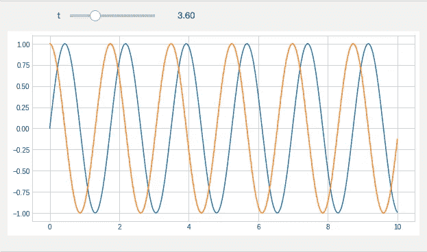
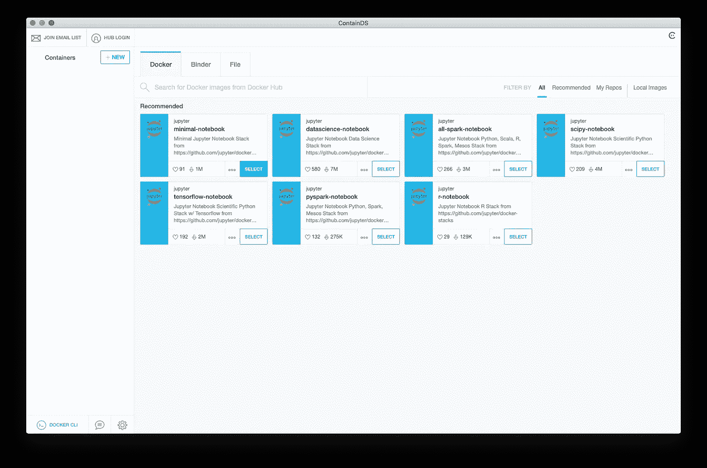
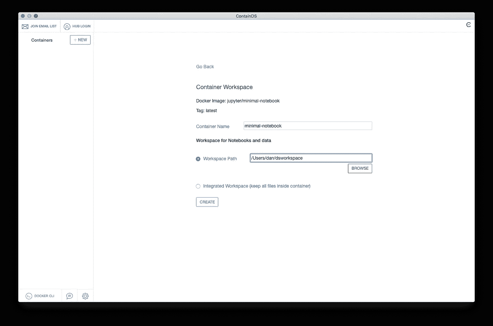
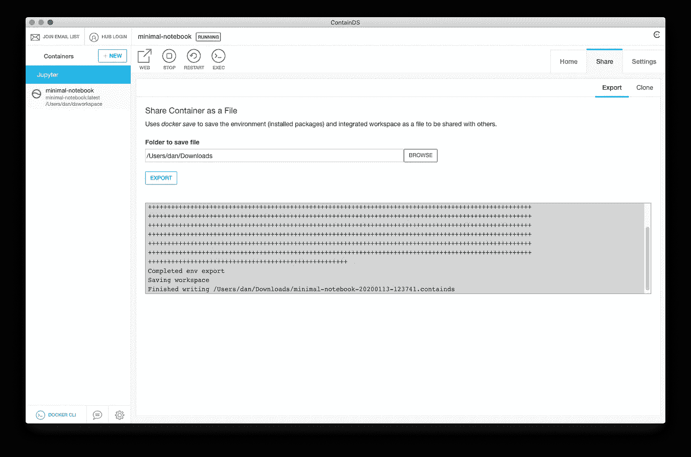
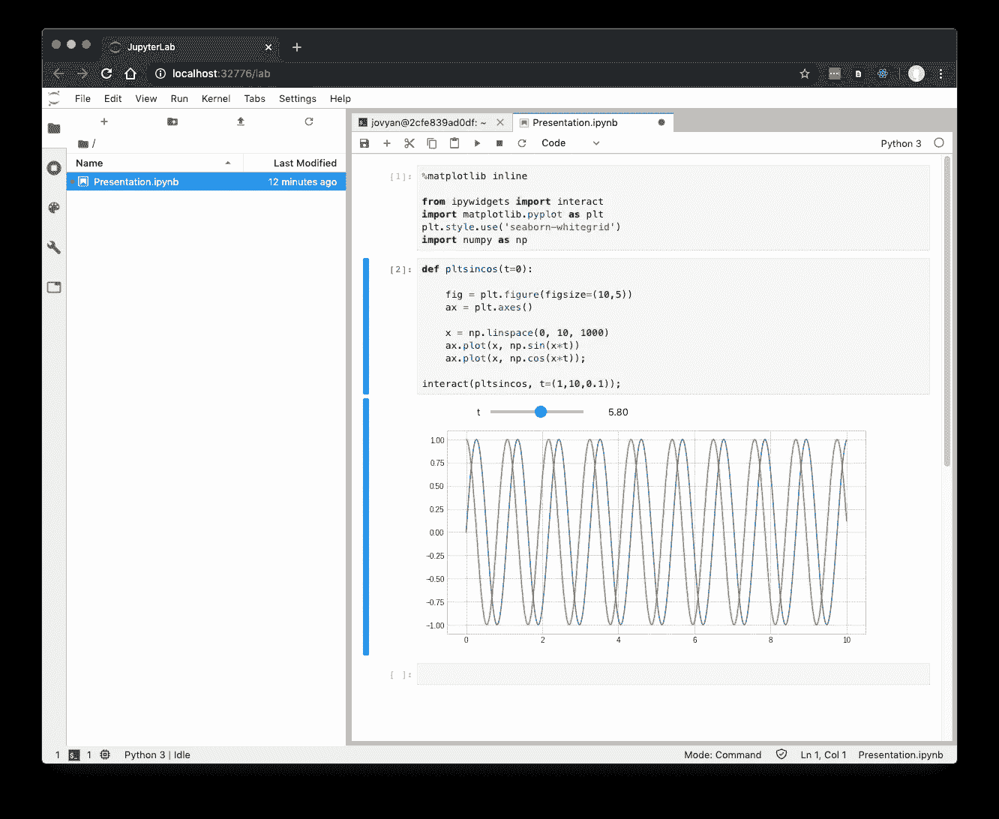

# 在 u 盘上共享交互式 Jupyter 仪表盘

> 原文：<https://towardsdatascience.com/cut-out-the-cloud-share-interactive-jupyter-dashboards-on-a-usb-stick-c196d01df3e4?source=collection_archive---------33----------------------->

## 当你从未想过要开发 web 应用程序时，如何向客户或同事交付交互式笔记本电脑…

许多数据科学可视化实际上是一次性的 web 应用程序，并不打算公开，甚至也不打算为私人用户提供基于云的服务。考虑到它们短暂的生命周期，锁定一个托管服务的基础设施(和安全风险)是不值得的。事实上，所采用的 web 技术实际上只是从云或互联网很重要的不同场景中“借用”来的。我们的可视化最初是用 web 风格的技术构建的，这只是偶然的……那么我们能不能改变我们的思维，让我们的头脑完全脱离云端呢？

您的概念验证数据科学项目的高潮是 Jupyter 笔记本中的美丽可视化。您甚至包括了一些滑块部件，以便您可以更改一些参数，并立即查看这对笔记本中间的绘图有何影响，以及您的模型的预测如何变化。

如果你能让你的客户在他们自己的时间里滑动滑块，你知道他们会完全理解你想要传达的东西——并为项目的其余部分开绿灯。

但是，让他们在自己的机器上访问您的可视化的最佳方式是什么呢？



一个简单的基于小部件的交互式笔记本

有一些很好的方法可以将笔记本发布为基于网络的云应用，包括 mybinder.org，如果你喜欢一切都公开的话。但是，如果您的笔记本使用的数据是机密的，并且您没有权限将其托管在任意基于云的服务上，该怎么办？

要求他们在自己的机器上安装 conda 并运行一系列终端命令来复制您的包环境，这将考验即使是最热衷于技术的客户的耐心。并且这些命令可能需要根据它们的操作系统和现有安装而变化。

# 简单的单个文件

你已经有了一个与客户共享普通文件的系统——也许 SharePoint 或 Dropbox 已经建立了协作，所以也许有一种方法可以利用这一点。

ContainDS Desktop 是用于 Windows 或 Mac 的软件，允许您在本地机器上运行隔离的 Jupyter 环境。现在，您可以将 Jupyter 工作区和软件包环境导出为一个独立的文件，这样就可以直接导入到在其他人的计算机上运行的 ContainDS Desktop 中，并向他们呈现已经在您自己的计算机上运行的确切环境和笔记本文件。

本文展示了如何创建一个交互式 Jupyter 可视化，然后将其导出并作为一个简单的文件与您的客户共享，这样他们就可以轻松地按预期运行它。

要安装 ContainDS Desktop 并启动一个简单的“容器”,为我们安装一些包和编写一些新笔记本做好准备，首先请遵循 [ContainDS Desktop 入门教程](https://containds.com/desktop/tutorials/getting-started/)。这也将指导您安装 Docker，它是由 ContainDS Desktop 在引擎盖下使用的。

## 新容器

如果您仔细阅读了入门教程，您应该已经拥有了一个新的 JupyterLab 环境，它应该在浏览器窗口中打开。如果您愿意或者继续使用现有的容器来创建一个新的容器，您可以使用它。

ContainDS Desktop 中的容器只是一个 Jupyter 包环境(例如，可以安装 numpy 和 pandas 的地方)和一个存放笔记本和其他数据的工作区。

在 ContainDS Desktop 中，单击“+ NEW”按钮查看一些可以用于新容器的起点。单击“最小笔记本”旁边的“选择”。



选择一个图像作为起点

在下一个屏幕上，将询问您希望如何存储工作区。为了确保您的笔记本文件可以轻松地从本地硬盘访问，请选择一个新文件夹—可能在您的个人文件夹中命名为“dsworkspace ”,但实际上这可以是您喜欢的任何位置。



指定存储工作区的文件夹

点击“创建”，然后新的容器将被启动，并在 ContainDS 桌面的左侧列出。如果需要先下载“最小笔记本”起点映像，可能需要一点时间。


容器现在正在运行

准备好后，点击“WEB”按钮启动 JupyterLab。

## 安装软件包

在 JupyterLab 中，单击终端图标打开一个新的命令 shell 选项卡。

要安装我们需要的软件包，请输入以下命令:

```
conda install -c anaconda numpy --yes
conda install -c anaconda ipywidgets --yes 
conda install -c anaconda matplotlib --yes
jupyter labextension install @jupyter-widgets/jupyterlab-manager
```


在 Jupyter 终端标签中安装软件包

安装好所有东西后，重新加载 Jupyter 实验室浏览器窗口，确保新安装的 Javascript 正在运行。

## 写我们的笔记本

单击“+”按钮，这次单击“Python 3”图标打开一个新的笔记本选项卡。

将我们的[样本笔记本中的单元格复制并粘贴到 GitHub 的这里](https://github.com/danlester/binder-sincos/blob/6cce3da1296714fc8545c201891ebea789b916df/Presentation.ipynb)。记住，粘贴代码后，按 shift+enter 键运行每个单元格。


我们完成了 Jupyter 演示

笔记本提供了一个滑块，用户可以选择参数‘t’的不同值。当您改变数值时，`sin(t*x)`和`cos(t*x)`图会根据系数‘t’移动。哇，这真的可以教人一些新的数学！如果你还没有遇到过，[互动部件](/bring-your-jupyter-notebook-to-life-with-interactive-widgets-bc12e03f0916)是 Jupyter 笔记本电脑的一个非常强大的可视化功能，可以真正让用户沉浸在数字中。

将 ipynb 笔记本保存为一个名为 Presentation.ipynb 的文件或任何适合您的文件。

# 导出为普通旧文件

好了，我们已经安装了我们需要的包，并创建了我们的交互式笔记本。现在我们来看这篇文章的要点。我们如何能直接与客户分享它，以便他们能在自己的机器上随心所欲地与之互动？

如果愿意，您可以关闭 JupyterLab 浏览器窗口。

回到 ContainDS 桌面应用程序，我们的容器仍然应该在左侧面板中突出显示。点击“共享”选项卡。“导出”子选项卡应该是可见的，要求一个文件夹位置。应该写入 containds 的文件。


设定共享文件的位置

你的下载文件夹的默认值应该没问题，所以只需点击“导出”。

在提交和导出容器时，您应该会看到一些输出。最后，保存的完整文件名。将显示“containds”文件。



在哪里。containds 文件已保存

# 分享给你的朋友！

最后一步保存的文件会很大(可能 5GB ),所以不能通过电子邮件发送。希望您已经设置了一个协作服务，可以用来共享。containds 的文件。如果你的组织批准，SharePoint，Dropbox，Google Drive 等都是合适的。或者，如果你想避开云服务，u 盘可能是最合适的。

您的收件人还需要安装 ContainDS Desktop。运行后，他们应该在“+新建”屏幕中单击“文件”选项卡。找到。包含您与他们共享的文件，然后单击“开始”。文件处理过程中会显示一些日志。


将 containds 文件导入到同事的机器中

一旦完成，容器将启动，ContainDS 桌面将向您显示新容器的日志屏幕。单击“WEB”在 JupyterLab 中打开笔记本，就像您离开时一样。



交互式 Jupyter 笔记本，就像我们保存它一样

您的同事或客户可以按照您的意愿与滑块进行互动！

# 结论

正如本文开头所讨论的，许多数据可视化首先并不真正适合 web 技术——我们在一次性应用程序中使用它们只是出于偶然和熟悉。

以上教程的重点是再现性——忠实地传输我们在自己的计算机上体验到的精确的计算环境、文件和数据。但是在这个过程中肯定有需要克服的缺点。

最明显的是，最终用户需要在他们自己的机器上安装一些软件:ContainDS Desktop，它也需要 Docker 在后台运行。

然后我们忽略了一个事实。containds 的文件本身是 5GB。

这些问题有潜在的解决方案。为了降低安装要求，值得注意的是 Docker 基于开源软件，可以简化并捆绑到 ContainDS 本身中——因此可能只需要一个安装程序，用户无需担心 Docker 是否在后台运行。

ContainDS Desktop 本身对于技术用户(如典型的数据科学家)来说是一个相对简单的 UI，但它比 Jupyter“web app”的非技术最终用户需要的功能更多。有可能建立一个精简的“容器浏览器”版本的软件，为最终用户简化事情。它还可以使用更友好的前端，如 [Voilà](https://github.com/voila-dashboards/voila) ，这样最终用户就不需要担心代码单元格和通过笔记本按 shift+enter。

数据科学领域普及了这些类型的一次性 web 应用程序，随着学科范围的扩大，数据可视化工具也有了许多令人兴奋的发展。我期待听到您对本文中介绍的方法如何为您服务的想法。什么障碍阻止你与同事和客户轻松分享你的可视化？

关于 ContainDS Desktop 的任何问题或反馈，请通过我们的网站联系[。](https://containds.com/support/)