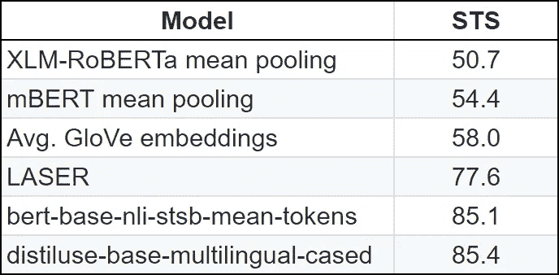
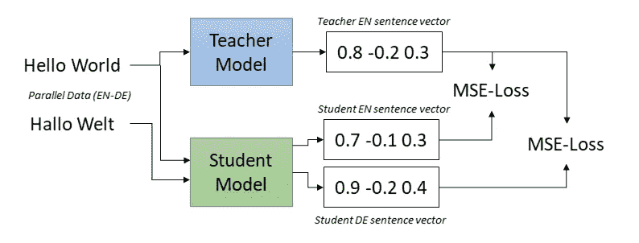
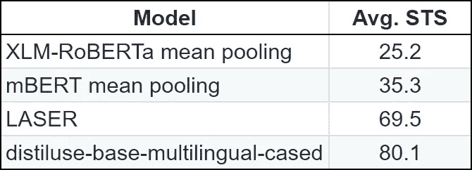

# 伯特模型嵌入没有你想象的那么好

> 原文：<https://towardsdatascience.com/cutting-edge-bert-nlp-model-bb0bfc8b7aec?source=collection_archive---------19----------------------->

## 面向多语言句子嵌入


由 [Gaurav Baya](https://unsplash.com/@gbaya123?utm_source=unsplash&utm_medium=referral&utm_content=creditCopyText) 在 [Unsplash](https://unsplash.com/s/photos/sunglasses?utm_source=unsplash&utm_medium=referral&utm_content=creditCopyText) 上拍摄的原始照片。由 Daulet Nurmanbetov 修改

[我以前写过](/multilingual-sentence-models-in-nlp-476f1f246d2f)关于[脸书的激光](https://github.com/facebookresearch/LASER)嵌入系统，意思相似的句子会有相似的向量嵌入。更重要的是，激光嵌入是多语言的，这意味着不同语言的句子将映射到同一个向量！

具有一个将相同意思的不同语言的句子映射到相同向量的嵌入系统是有利的。拥有这样一个系统将允许我们抽象出输入的语言，转而关注句子的意思。

这意味着，一旦我们将一个句子转换成一个向量，我们就可以建立一个下游模型，它可以在任何输入语言上工作，用于任何下游任务。

想找出有毒的句子？带有下游分类器的多语言嵌入模型将能够识别任何语言中的有毒句子。

在新闻文章中寻找交易信号？带有下游分类器的多语言嵌入模型将能够识别任何语言的交易信号。你明白了…

因此，让我们来看看 LASER 如何与英语句子相似性的其他模型进行比较:



结果在 **English only** [STS](https://ixa2.si.ehu.es/stswiki/index.php/STSbenchmark#STS_benchmark_dataset_and_companion_dataset) 任务上，STS 是自然语言处理中句子意义相似度的竞争。越高越好。

上表显示了英语语言的基准。然而，激光嵌入不仅适用于英语，还适用于多种语言

**随着 NLP 的所有最新创新，特别是 BERT 和多语言 BERT (mBERT ),人们可能会认为他们会放弃激光业务。然而，有趣的是，对于纯英语句子相似性任务，RoBERTa 和 mBERT 的表现不如 LASER。**

**从表中可以看出，会说多种语言的伯特和 same 罗伯塔在将意思相似的句子映射到同一个向量方面表现不佳。此外，当您混合不同的输入语言来计算相似性时，性能会进一步下降。**

**像 mBERT 这样的模型预测单个标记的向量值，而不是句子。由于语言中的词汇差异，这导致句子聚合与向量错位。意味着 mBERT 和其他预先训练的多语言转换器不适合开箱即用的跨语言句子相似性。**

**人们一致认为，mBERT 的输出是针对特定语言进行微调的，当比较不同语言的单词时，它们的向量有所不同。奇怪的是，在 Transformer 的早期层中，大约在 mBERT 的第 8 层，跨语言的向量彼此更加相似。**

## **多语言嵌入的新范例**

**我们可以得到一个灵感来创造真正的多语言嵌入优于激光是一个[蒸馏方法](/knowledge-distillation-simplified-dd4973dbc764)。看看像 DistilBERT 这样的模型，用它们作为灵感来创建我们的师生设置，在那里我们“强迫”多语言转换器产生跨语言的相同向量。为此，我们当然需要一个能够产生良好向量的教师模型。一个这样的候选是作为教师模型的纯英语句子 BERT (SBERT)模型。而且我们可以拿一个像 ALBERT 这样的大型多语言模型，作为学生使用。**

****

**这里的老师是斯贝特，学生是艾伯特或其他多语言转换者。图片来自[使用知识蒸馏](https://arxiv.org/pdf/2004.09813.pdf#page=2)使单语句子嵌入多语言**

**上面的教师模型总是预测英语句子，而学生模型是多语言的，并且在给定外语输入的情况下“被迫”产生类似于英语的向量。意味着两件事:**

1.  **向量空间跨语言对齐，即不同语言中的相同句子被映射到同一点**
2.  **来自教师模型 M 的原始源语言中的向量空间属性被采用并转移到其他语言**

**现在，一旦我们有了训练设置，我们就可以获得用于翻译的大型平行文本数据集。即，相同的句子但是不同的语言，其中两个句子具有相同的意思(彼此的翻译)。**

**使用师生设置，现在我们可以强制艾伯特模型学习句子的“正确”向量嵌入。**

**这意味着在我们在足够数量的并行语言上训练模型之后，我们将教会 ALBERT 为任何语言产生相同的向量。一旦我们有了这个训练好的艾伯特模型，我们就可以直接用它来产生矢量嵌入。这是这个新训练的设置在多语言测试中的比较。**

****

**以下是 STS 任务中 **10 种语言**的向量相似度结果。**

**在表中，当在 SBERT 的监督下训练时，蒸馏使用开始胜过激光。我们可以看到，XLM-罗伯塔和姆伯特在跨语言句子相似性方面很弱。**

# **外语语义搜索**

**让我们看看如何使用一个经过提炼的多语言转换器。**

**首先，让我们创建几个样本句子，我们想用它们来衡量语义相似度—**

```
**Sample Sentences:**
'A man is eating food.',
'A man is eating a piece of bread.',
'The girl is carrying a baby.',
'A man is riding a horse.',
'An elderly man is enjoying dinner.',
'Friends sharing wine at a restaurant.',
'A woman is playing violin.',
'A child is learning to play a base guitar.',
'Two men pushed carts through the woods.',
'A man is riding a white horse on an enclosed ground.',
'A monkey is playing drums.',
'A cheetah is running behind its prey.'**Query Sentences:** 'A man is eating pasta.',
'Someone in a gorilla costume is playing a set of drums.',
'A cheetah chases prey on across a field.'
```

**现在让我们把一些句子翻译成外语。我们将使用意大利语、法语、德语和俄语。这里是翻译的句子和问题—**

```
**Sample Sentences:**
*'Un homme mange de la nourriture.',* #FR
'A man is eating a piece of bread.',
*'Das Mädchen trägt ein Baby.',* #DE 
'A man is riding a horse.',
'An elderly man is enjoying dinner.',
*'Amis partageant du vin dans un restaurant.',* #FR 
'A woman is playing violin.',
'A child is learning to play a base guitar.',
*'Due uomini hanno spinto i carrelli attraverso i boschi.',* #IT 
'A man is riding a white horse on an enclosed ground.',
*'Una scimmia suona la batteria.',* #IT  
'A cheetah is running behind its prey.'**Query Sentences:**
'A man is eating pasta.', 
*'Кто-то в костюме гориллы играет на барабане',* #RU 
'Ein Gepard jagt Beute über ein Feld.'
```

**通过我们的多语言转换器运行语义搜索会产生即时结果—**

```
**======================** 
**Query**: A man is eating pasta.

**Top 3 most similar sentences in sample sentences**:
Un homme mange de la nourriture. (Score: 0.7051)
A man is eating a piece of bread. (Score: 0.6328)
An elderly man is enjoying dinner. (Score: 0.4780)

**======================** 
**Query**: Кто-то в костюме гориллы играет на барабане

**Top 3 most similar sentences in sample sentences**:
Una scimmia suona la batteria. (Score: 0.3803)
A woman is playing violin. (Score: 0.3392)
A child is learning to play a base guitar. (Score: 0.3148)

**======================** 
**Query**: Ein Gepard jagt Beute über ein Feld.

**Top 3 most similar sentences in sample sentences**:
A cheetah is running behind its prey. (Score: 0.3890)
A man is riding a white horse on an enclosed ground. (Score: 0.3078)
Due uomini hanno spinto i carrelli attraverso i boschi. (Score: 0.3035)
```

**为了重现性，这是跨语言语义搜索的代码—**

**附加的代码将把每个句子转换成一个向量，并计算余弦相似度，为每个查询输出 3 个最接近的句子。**

## **结论**

**使用跨语言句子嵌入模型，我们现在可以在为下游任务构建分类器时抽象输入语言。**

**这意味着，如果我们有一个只适用于英语文本的自然语言处理模型，我们现在可以将这个自然语言处理模型重新用于任何语言。**

**非常感谢 Nils Reimers，下面的库展示了如何提炼你自己的多语言句子模型，我鼓励你这么做。**

# **参考**

***[1]尼尔斯·雷默斯和伊琳娜·古雷维奇。* [*制作单语句子嵌入多语使用知识蒸馏*](https://arxiv.org/pdf/2004.09813.pdf) *arXiv (2020): 2004.09813。***