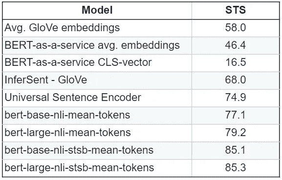

# 前沿语义搜索和句子相似度

> 原文：<https://towardsdatascience.com/cutting-edge-semantic-search-and-sentence-similarity-53380328c655?source=collection_archive---------10----------------------->

## 语义搜索是自然语言处理中一个值得解决的难题。


安东尼·马蒂诺在 [Unsplash](https://unsplash.com/s/photos/semantic-search?utm_source=unsplash&utm_medium=referral&utm_content=creditCopyText) 上的照片

我们通常花费大量时间在大型文档中查找特定的信息。我们通常发现，如果使用 CTRL + F，即众所周知的 Google-fu，有效地在 Google 上搜索信息的艺术在 21 世纪的工作场所是一项有价值的技能。人类的所有知识对我们来说都是可用的，这是一个提出正确的问题，并知道如何浏览结果以找到相关答案的问题。

我们的大脑执行语义搜索，我们查看结果并找到与我们的搜索查询相似的句子。在金融和法律行业尤其如此，因为文档变得很长，我们不得不求助于搜索许多关键字来找到正确的句子或段落。时至今日，人类在发现上所花费的努力是惊人的。

自 NLP 出现以来，机器学习一直在试图解决语义搜索的这个问题。一个完整的研究领域——语义搜索出现了。最近，由于深度学习的进步，计算机能够在最少的人工参与下准确地向我们提供相关信息。

## **句子嵌入方法**

自然语言处理(NLP)领域对此有一个术语，当提到一个词时，我们称之为“表面形式”，例如单词“*president”*本身就意味着国家的首脑。但根据背景和时间，这可能意味着特朗普或奥巴马。

NLP 的进步使我们能够有效地映射这些表面形式，并捕获这些单词的上下文，成为所谓的[“嵌入”](https://www.tensorflow.org/tutorials/text/word_embeddings)嵌入通常是具有某些特殊特征的数字向量。两个意思相似的单词会有相似的向量，这让我们可以计算向量相似度。

延伸这个想法，在向量空间中，我们应该能够计算任意两个句子之间的相似度。这就是句子嵌入模型所实现的。这些模型将任何给定的句子转换成向量，以便能够快速计算任何一对句子的相似性或不相似性。

## **最先进的语义搜索——寻找最相似的句子**

这个想法并不新鲜，早在 2013 年，这篇论文就提出了用向量来表示单个单词。然而，从那以后，我们用 BERT 和其他基于 Transformer 的模型走了很长的路，使我们能够更有效地捕捉这些单词的上下文。

这里我们比较了最近的嵌入模型和过去的 word2vec 或 GloVe。



[STS](https://ixa2.si.ehu.es/stswiki/index.php/STSbenchmark#STS_benchmark_dataset_and_companion_dataset) 是自然语言处理的句子意思相似度竞赛。越高越好。来自 [SBERT paper](https://arxiv.org/pdf/1908.10084.pdf) 的表格

这些经过修改和微调的 BERT NLP 模型在识别相似句子方面相当出色，比更老的前辈好得多。让我们看看这在实际意义上意味着什么。

我有几篇 2020 年 4 月的文章标题，我希望找到与一组搜索词最相似的句子。

这是我的搜索词—

```
1\. The economy is more resilient and improving.
2\. The economy is in a lot of trouble.
3\. Trump is hurting his own reelection chances.
```

我的文章标题如下—

```
Coronavirus:
White House organizing program to slash development time for coronavirus vaccine by as much as eight months (Bloomberg)
Trump says he is pushing FDA to approve emergency-use authorization for Gilead's remdesivir (WSJ)
AstraZeneca to make an experimental coronavirus vaccine developed by Oxford University (Bloomberg)
Trump contradicts US intel, says Covid-19 started in Wuhan lab. (The Hill)
Reopening:
Inconsistent patchwork of state, local and business decision-making on reopening raising concerns about a second wave of the coronavirus (Politico)
White House risks backlash with coronavirus optimism if cases flare up again (The Hill)
Florida plans to start reopening on Monday with restaurants and retail in most areas allowed to resume business in most areas (Bloomberg)
California Governor Newsom plans to order closure of all state beaches and parks starting Friday due to concerns about overcrowding (CNN)
Japan preparing to extend coronavirus state of emergency, which is scheduled to end 6-May, by about another month (Reuters)
Policy/Stimulus:
Economists from a broad range of ideological backgrounds encouraging Congress to keep spending to combat the coronavirus fallout and don't believe now is time to worry about deficit (Politico)
Global economy:
China's official PMIs mixed with beat from services and miss from manufacturing (Bloomberg)
China's Beige Book shows employment situation in Chinese factories worsened in April from end of March, suggesting economy on less solid ground than government data (Bloomberg)
Japan's March factory output fell at the fastest pace in five months, while retail sales also dropped (Reuters)
Eurozone economy contracts by 3.8% in Q1, the fastest decline on record (FT)
US-China:
Trump says China wants to him to lose his bid for re-election and notes he is looking at different options in terms of consequences for Beijing over the virus (Reuters)
Senior White House official confident China will meet obligations under trad deal despite fallout from coronavirus pandemic (WSJ)
Oil:
Trump administration may announce plans as soon as today to offer loans to oil companies, possibly in exchange for a financial stake (Bloomberg)
Munchin says Trump administration could allow oil companies to store another several hundred million barrels (NY Times)
Norway, Europe's biggest oil producer, joins international efforts to cut supply for first time in almost two decades (Bloomberg)
IEA says coronavirus could drive 6% decline in global energy demand in 2020 (FT)
Corporate:
Microsoft reports strong results as shift to more activities online drives growth in areas from cloud-computing to video gams (WSJ)
Facebook revenue beats expectations and while ad revenue fell sharply in March there have been recent signs of stability (Bloomberg)
Tesla posts third straight quarterly profit while Musk rants on call about need for lockdowns to be lifted (Bloomberg)
eBay helped by online shopping surge though classifieds business hurt by closure of car dealerships and lower traffic (WSJ)
Royal Dutch Shell cuts dividend for first time since World War II and also suspends next tranche of buyback program (Reuters)
Chesapeake Energy preparing bankruptcy filing and has held discussions with lenders about a ~$1B loan (Reuters)
Amazon accused by Trump administration of tolerating counterfeit sales, but company says hit politically motivated (WSJ)
```

在运行每个查询与每个嵌入的相似性后，以下是我的每个搜索词的前 5 个相似句子:

```
======================
**Query: The economy is more resilient and improving**.Top 5 most similar sentences in corpus:
Microsoft reports strong results as shift to more activities online drives growth in areas from cloud-computing to video gams (WSJ) (Score: 0.5362)
Facebook revenue beats expectations and while ad revenue fell sharply in March there have been recent signs of stability (Bloomberg) (Score: 0.4632)
Senior White House official confident China will meet obligations under trad deal despite fallout from coronavirus pandemic (WSJ) (Score: 0.3558)
Economists from a broad range of ideological backgrounds encouraging Congress to keep spending to combat the coronavirus fallout and don't believe now is time to worry about deficit (Politico) (Score: 0.3052)
White House risks backlash with coronavirus optimism if cases flare up again (The Hill) (Score: 0.2885)
======================
**Query: The economy is in a lot of trouble.**Top 5 most similar sentences in corpus:
Inconsistent patchwork of state, local and business decision-making on reopening raising concerns about a second wave of the coronavirus (Politico) (Score: 0.4667)
eBay helped by online shopping surge though classifieds business hurt by closure of car dealerships and lower traffic (WSJ) (Score: 0.4338)
China's Beige Book shows employment situation in Chinese factories worsened in April from end of March, suggesting economy on less solid ground than government data (Bloomberg) (Score: 0.4283)
Eurozone economy contracts by 3.8% in Q1, the fastest decline on record (FT) (Score: 0.4252)
China's official PMIs mixed with beat from services and miss from manufacturing (Bloomberg) (Score: 0.4052)
======================
**Query: Trump is hurting his own reelection chances.**Top 5 most similar sentences in corpus:
Trump contradicts US intel, says Covid-19 started in Wuhan lab. (The Hill) (Score: 0.7472)
Amazon accused by Trump administration of tolerating counterfeit sales, but company says hit politically motivated (WSJ) (Score: 0.7408)
Trump says China wants to him to lose his bid for re-election and notes he is looking at different options in terms of consequences for Beijing over the virus (Reuters) (Score: 0.7111)
Inconsistent patchwork of state, local and business decision-making on reopening raising concerns about a second wave of the coronavirus (Politico) (Score: 0.6213)
White House risks backlash with coronavirus optimism if cases flare up again (The Hill) (Score: 0.6181)
```

你可以看到这个模型能够非常准确地挑出最相似的句子。

我使用的代码可以在下面找到—

上面的例子很简单，但是阐明了语义搜索的一个重要观点。人类需要几分钟才能找到最相似的句子。它让我们能够在没有人类参与的情况下找到文本中的特定信息，这意味着我们可以以计算机速度在成千上万的文档中搜索我们关心的短语。

这项技术已经被用来在两个文档中寻找相似的句子。或者季度收益报告中的关键信息。例如，通过这种语义搜索，我们可以轻松找到 Twitter、脸书、Snapchat 等所有社交公司的日活跃用户。尽管他们对 metic 的定义和称呼不同——日活跃用户(DAU)或月活跃用户(MAU)或货币化活跃用户(mMAU)。由 BERT 支持的语义搜索可以发现所有这些表面形式在语义上意味着相同的东西——一种性能的衡量标准，它能够从报告中提取出我们感兴趣的句子。

对冲基金正在利用语义搜索来解析和揭示季度报告(10-Q/10-K)中的指标，并在报告发布后立即将其作为定量交易信号，这并不是一个遥不可及的想法。

上面的实验显示了语义搜索在过去的一年中变得多么有效。

## **寻找相似句子——聚类**

人们可以使用句子的这些向量嵌入的另一个主要方式是用于聚类。我们可以快速地将单个文档或多个文档中的句子聚集成相似的组。

使用上面的代码，人们可以利用 sklearn 的简单 k-means

```
from sklearn.cluster import KMeans
import numpy as npnum_clusters = 10
clustering_model = KMeans(n_clusters=num_clusters)
clustering_model.fit(corpus_embeddings)
cluster_assignment = clustering_model.labels_for i in range(10):
    print()
    print(f'Cluster {i + 1} contains:')
    clust_sent = np.where(cluster_assignment == i)
    for k in clust_sent[0]:
        print(f'- {corpus[k]}')
```

同样，结果对机器来说是精确的。这是几个集群—

```
**Cluster 2 contains:**
- AstraZeneca to make an experimental coronavirus vaccine developed by Oxford University (Bloomberg)
- Trump says he is pushing FDA to approve emergency-use authorization for Gilead's remdesivir (WSJ)

**Cluster 3 contains:**
- Chesapeake Energy preparing bankruptcy filing and has held discussions with lenders about a ~$1B loan (Reuters)
- Trump administration may announce plans as soon as today to offer loans to oil companies, possibly in exchange for a financial stake (Bloomberg)
- Munchin says Trump administration could allow oil companies to store another several hundred million barrels (NY Times)

**Cluster 4 contains:**
- Trump says China wants to him to lose his bid for re-election and notes he is looking at different options in terms of consequences for Beijing over the virus (Reuters)
- Amazon accused by Trump administration of tolerating counterfeit sales, but company says hit politically motivated (WSJ)
- Trump contradicts US intel, says Covid-19 started in Wuhan lab. (The Hill)
```

## **结论**

有趣的是，[elastics 现在每个都有一个密集的矢量场](https://www.elastic.co/blog/text-similarity-search-with-vectors-in-elasticsearch)，行业中的其他公司也有能力快速比较两个矢量，如[脸书的 faiss](https://github.com/facebookresearch/faiss) 。这项技术是尖端的，但操作性很强，可以在几周内推出。任何知道要寻找什么的人都可以找到尖端人工智能。

如果您有兴趣了解更多信息，请随时联系我，我随时为您提供电子咖啡。在外面注意安全。

感谢 Nils Reimers 关于拥抱脸讨论的内容丰富的帖子，这让我写了这篇文章。