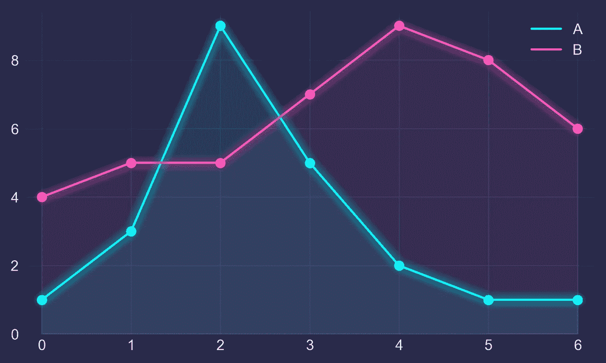
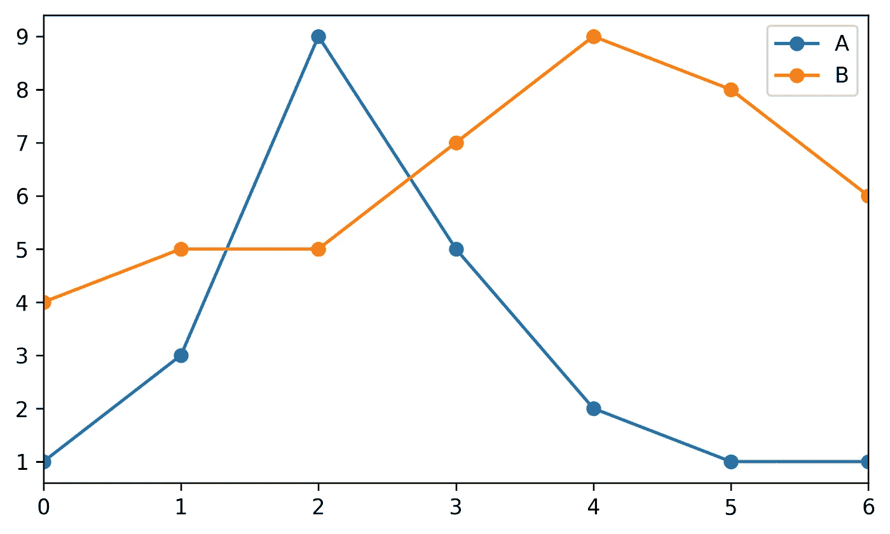
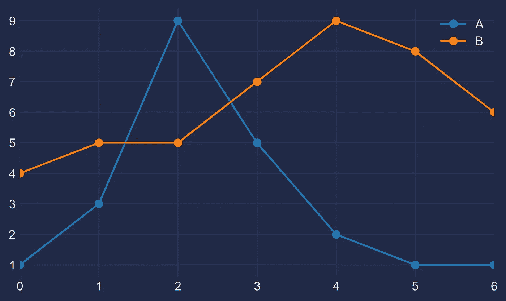
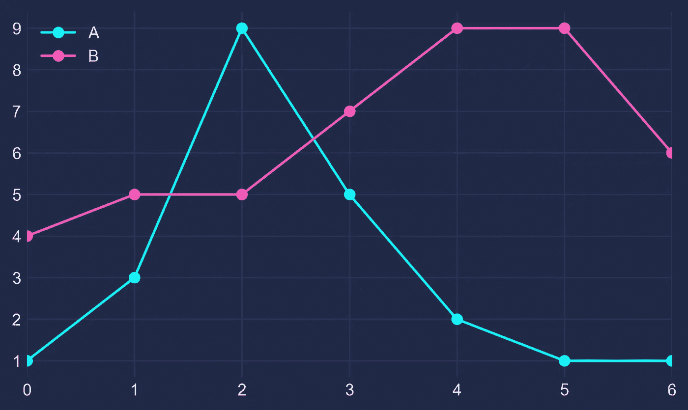
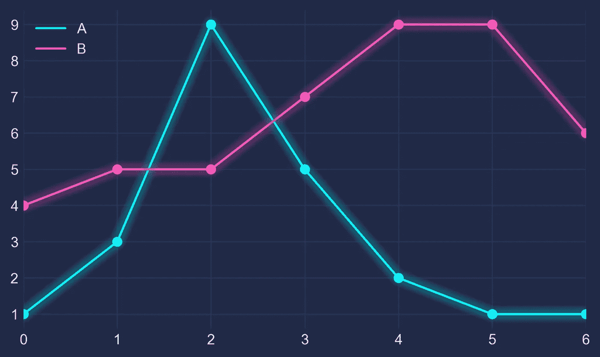

# 带有 Matplotlib 的赛博朋克风格

> 原文：<https://towardsdatascience.com/cyberpunk-style-with-matplotlib-f47404c9d4c5?source=collection_archive---------10----------------------->

为您的下一个数据可视化未来霓虹灯发光。



*更新 2020–03–29:现在有一个 Python 包可以方便地应用这种风格，这里* *见* [。通过 `pip install mplcyberpunk`安装](https://github.com/dhaitz/mplcyberpunk)

# 1 —基础

让我们编一些数字，把它们放进熊猫的数据框里，并把它们画出来:

```
import pandas as pd
import matplotlib.pyplot as pltdf = pd.DataFrame({'A': [1, 3, 9, 5, 2, 1, 1],
                   'B': [4, 5, 5, 7, 9, 8, 6]})df.plot(marker='o')
plt.show()
```



# 2 —黑暗

还不错，但是有些普通。让我们通过使用 Seaborn 的深色风格以及更改背景和字体颜色来定制它:

```
plt.style.use("seaborn-dark")for param in ['figure.facecolor', 'axes.facecolor', 'savefig.facecolor']:
    plt.rcParams[param] = '#212946'  # bluish dark greyfor param in ['text.color', 'axes.labelcolor', 'xtick.color', 'ytick.color']:
    plt.rcParams[param] = '0.9'  # very light greyax.grid(color='#2A3459')  # bluish dark grey, but slightly lighter than background
```



# 3 —灯光

现在看起来更有趣了，但我们需要我们的颜色在深色背景下更加闪亮:

```
fig, ax = plt.subplots()
colors = [
    '#08F7FE',  # teal/cyan
    '#FE53BB',  # pink
    '#F5D300',  # yellow
    '#00ff41', # matrix green
]
df.plot(marker='o', ax=ax, color=colors)
```



# 4 —发光

现在，如何获得霓虹灯的外观？为了让它发亮，我们用低 alpha 值和略微增加的线宽多次重画线条。重叠产生发光效果。

```
n_lines = 10
diff_linewidth = 1.05
alpha_value = 0.03for n in range(1, n_lines+1): df.plot(marker='o',
            linewidth=2+(diff_linewidth*n),
            alpha=alpha_value,
            legend=False,
            ax=ax,
            color=colors)
```



# 5 —终点

为了更好的调整，我们给线下的区域着色(通过`ax.fill_between`)并调整轴的限制。

以下是完整的代码:

```
import pandas as pd
import matplotlib.pyplot as plt plt.style.use("dark_background")for param in ['text.color', 'axes.labelcolor', 'xtick.color', 'ytick.color']:
    plt.rcParams[param] = '0.9'  # very light greyfor param in ['figure.facecolor', 'axes.facecolor', 'savefig.facecolor']:
    plt.rcParams[param] = '#212946'  # bluish dark greycolors = [
    '#08F7FE',  # teal/cyan
    '#FE53BB',  # pink
    '#F5D300',  # yellow
    '#00ff41',  # matrix green
] df = pd.DataFrame({'A': [1, 3, 9, 5, 2, 1, 1],
                   'B': [4, 5, 5, 7, 9, 8, 6]})fig, ax = plt.subplots()df.plot(marker='o', color=colors, ax=ax)# Redraw the data with low alpha and slighty increased linewidth:
n_shades = 10
diff_linewidth = 1.05
alpha_value = 0.3 / n_shadesfor n in range(1, n_shades+1): df.plot(marker='o',
            linewidth=2+(diff_linewidth*n),
            alpha=alpha_value,
            legend=False,
            ax=ax,
            color=colors)# Color the areas below the lines:
for column, color in zip(df, colors):
    ax.fill_between(x=df.index,
                    y1=df[column].values,
                    y2=[0] * len(df),
                    color=color,
                    alpha=0.1)ax.grid(color='#2A3459')ax.set_xlim([ax.get_xlim()[0] - 0.2, ax.get_xlim()[1] + 0.2])  # to not have the markers cut off
ax.set_ylim(0)plt.show()
```


如果这对你有帮助，或者你有建设性的批评，我很乐意听听！请通过此处的[或此处的](https://dhaitz.github.io/)或[联系我。谢谢！](https://twitter.com/d_haitz)