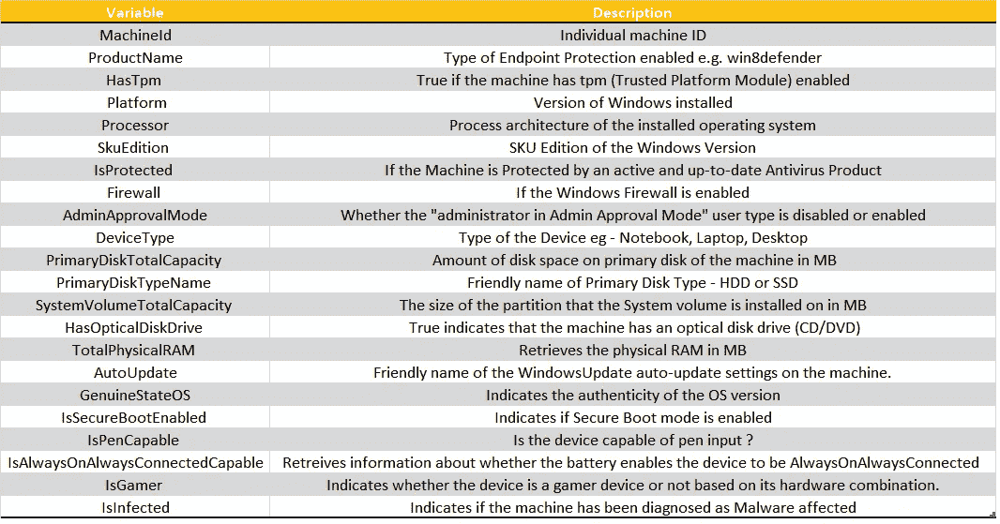
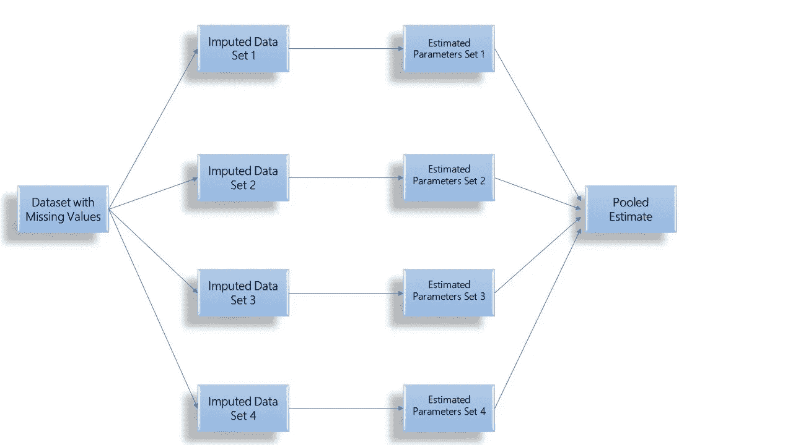
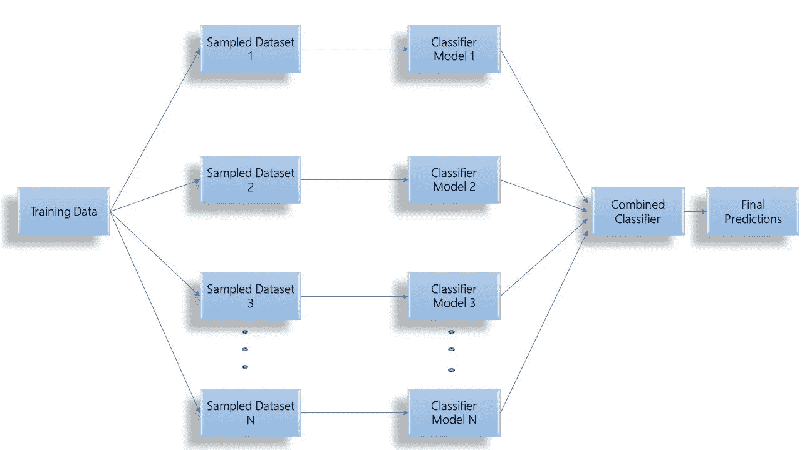
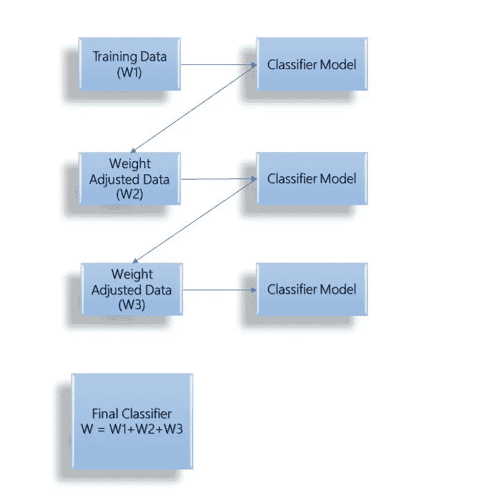
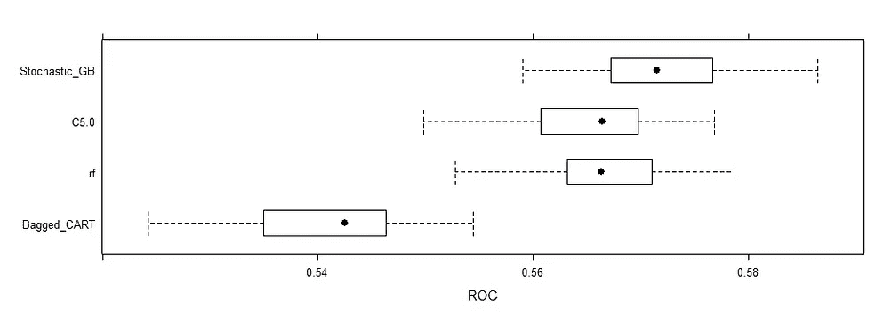
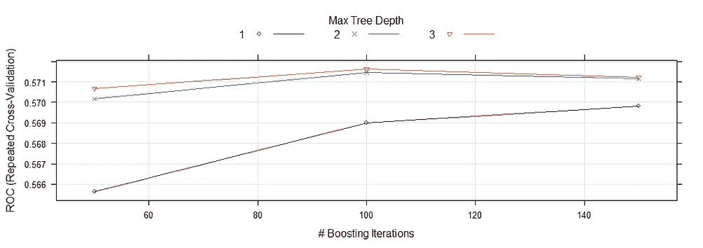

# 基于集成机器学习的网络安全威胁预测

> 原文：<https://towardsdatascience.com/cybersecurity-threat-prediction-using-ensemble-machine-learning-e1d61976664?source=collection_archive---------43----------------------->

## 使用多重插补处理缺失数据&实施集成学习算法来预测端点安全威胁。


[马太·亨利](https://unsplash.com/@matthewhenry?utm_source=medium&utm_medium=referral)在 [Unsplash](https://unsplash.com?utm_source=medium&utm_medium=referral) 上拍照

> 这个项目的数据集和代码可以在我的 GitHub 存储库中找到。在这个故事的结尾分享了相同的链接。

T 多年来，网络犯罪行业一直在发展壮大，尤其是由于越来越多的数据(个人和组织的)可以在数字媒体上获得。如今，网络犯罪带来的问题导致全球各地的公司损失了数百万美元。 [***在 Ponemon Institute 对 16 个国家和地区的 17 个行业的 507 个组织进行的一项研究***](https://securityintelligence.com/posts/whats-new-in-the-2019-cost-of-a-data-breach-report/) 中，定义了 2019 年数据泄露的全球平均成本为 392 万美元，比 2018 年的估计值增加了 1.5%。世界各地的组织都在大力投资使用机器学习和人工智能的预测分析能力，以缓解这些挑战。

[***根据凯捷研究院(2019)***](https://www.capgemini.com/research/reinventing-cybersecurity-with-artificial-intelligence/) 的一份报告，48%的组织表示他们在 2020 财年实施网络安全预测分析的预算将增加 29%。56%的高级管理人员表示，网络安全分析师超负荷工作，近四分之一的人无法成功调查所有确定的问题。64%的组织表示，预测分析降低了威胁检测和响应的成本，并将总体检测时间减少了多达 12%。


利亚姆·塔克在 [Unsplash](https://unsplash.com?utm_source=medium&utm_medium=referral) 拍摄的照片

> 考虑到上述情况，从长远来看，将预测分析应用于调查可能被恶意软件感染的终端对于组织来说变得势在必行。该研究利用组织端点(台式机、笔记本电脑、手机、服务器等)的某些硬件和软件方面的规格知识来探索这一目标。).

数据混合了分类变量和数字变量。在这项研究中，面临的主要挑战之一是数据集中存在大量缺失数据。进一步分析后的数据被归类为**随机缺失(MAR)。**数据集中的变量有:



# 缺失数据分类和多重插补技术

缺失数据或缺失值只不过是正在进行的研究中感兴趣的变量缺少数据值。在执行统计分析时，它会带来几个问题。


使用[gif gif](http://gifgifs.com/)创建

> **大多数统计分析方法都剔除了缺失值**，从而减少了要处理的数据集的大小。通常，**没有足够的数据来处理所创建的模型产生的结果在统计上并不显著**。此外，缺失的数据可能会导致结果误导。**结果往往偏向于在人群中代表性过高的某个/某些细分市场。**

## 缺失数据分类

缺失数据的分类最早是由 Rubin 在他的题为***'***[***推论和缺失数据***](https://academic.oup.com/biomet/article-abstract/63/3/581/270932?redirectedFrom=fulltext)***'***的论文中讨论的。根据他的理论，数据集中的每个数据点都有丢失的可能性。基于这种概率，Rubin 将缺失数据分为以下几种类型:

1.  **完全随机缺失(MCAR)** :在这种情况下，数据的缺失与数据中的其他响应或信息无关。对于所有其他数据点，数据集中任何数据点缺失的概率保持不变。简而言之，数据缺失没有可识别的模式。与 MCAR 打交道时，需要注意的一件重要事情是，对 MCAR 的分析会产生公正的结果。
2.  **随机缺失(MAR)** :与 MCAR 相比，MAR 是缺失数据的一种更广泛的分类，在某些方面也更现实。在 MAR 的情况下，对于为统计研究定义的某些数据子集，数据缺失的概率是相似的。数据的缺失可以归因于存在的其他数据，因此可以预测。同样，用更简单的话来说，在 MAR 的情况下，数据缺失是有模式的。
3.  **非随机缺失(NMAR)** :不归入 MCAR 和火星的数据归入 NMAR。

## **使用小鼠的多重插补(通过链式方程的多元插补)**

[***Rubin(1987)***](https://www.scirp.org/(S(lz5mqp453edsnp55rrgjct55))/reference/ReferencesPapers.aspx?ReferenceID=1374692)提出了估计缺失数据的多重插补方法。该方法从包含缺失值的数据集开始，然后使用线性回归等统计模型为缺失数据创建几组估算值。随后计算每个估算数据集的相关参数，最终汇集成一个估计值。下图显示了四阶多重插补方法的图示。



4 阶多重插补的步骤

单一插补方法，如均值插补、回归插补等。假设估算的估算值是真实值，忽略与估算值预测相关的不确定性。

**与单一插补相比，使用多重插补的优势在于:**

1.  在单一插补技术情况下太小的标准误差通过使用多重插补得到很好的缓解。
2.  多重插补不仅适用于 MCAR 数据，也适用于 MAR 数据。
3.  通过多个估算数据集获得的数据的变化有助于抵消任何种类的偏差。这是通过添加单一插补技术中缺失的不确定性来实现的。这反过来提高了精度，并产生了稳健的统计数据，从而可以对数据进行更好的分析。

在 R 中进行多重插补的最流行方法之一是使用 **MICE(通过链式方程进行多元插补)**软件包。在我们的数据集上实现鼠标的代码共享如下:

```
library(mice)
library(caret)df = read.csv('Data.csv')
View(df)#checking for NAs in the data
sapply(df, function(x) sum(is.na(x)))##############converting into factors(categorical variables)
df$HasTpm = as.factor(df$HasTpm)
df$IsProtected = as.factor(df$IsProtected)
df$Firewall = as.factor(df$Firewall)
df$AdminApprovalMode = as.factor(df$AdminApprovalMode)
df$HasOpticalDiskDrive = as.factor(df$HasOpticalDiskDrive)
df$IsSecureBootEnabled = as.factor(df$IsSecureBootEnabled)
df$IsPenCapable = as.factor(df$IsPenCapable)
df$IsAlwaysOnAlwaysConnectedCapable = as.factor(df$IsAlwaysOnAlwaysConnectedCapable)
df$IsGamer = as.factor(df$IsGamer)
df$IsInfected = as.factor(df$IsInfected)str(df)
ncol(df)###############REMOVING MachineId FROM DATA FRAME
df = df[,-c(1)]##############IMPUTATION OF MISSING DATA USING MICE
init = mice(df, maxit=0) 
meth = init$method
predM = init$predictorMatrix#Excluding the output column IsInfected as a predictor for Imputation
predM[, c("IsInfected")]=0#Excluding these variables from imputation as they don't have null valuesmeth[c("ProductName","HasTpm","Platform","Processor","SkuEdition","DeviceType","HasOpticalDiskDrive","IsPenCapable","IsInfected")]=""#Specifying the imputation methods for the variables with missing data

meth[c("SystemVolumeTotalCapacity","PrimaryDiskTotalCapacity","TotalPhysicalRAM")]="cart" meth[c("Firewall","IsProtected","IsAlwaysOnAlwaysConnectedCapable","AdminApprovalMode","IsSecureBootEnabled","IsGamer")]="logreg" meth[c("PrimaryDiskTypeName","AutoUpdate","GenuineStateOS")]="polyreg"#Setting Seed for reproducibility 
set.seed(103)#Imputing the data
class(imputed)
imputed = mice(df, method=meth, predictorMatrix=predM, m=5)
imputed <- complete(imputed)sapply(imputed, function(x) sum(is.na(x)))sum(is.na(imputed))
```

# 集成学习方法

集成学习方法使用多个模型的**组合计算能力来分类和解决手头的问题。当与只创建一个学习模型的普通学习算法相比时，集成学习方法**创建多个这样的模型，并将它们组合起来，以形成最终的模型，从而进行更有效的分类**。集成学习也被称为基于委员会的学习或学习多分类器系统。**

> 集成学习方法被使用和赞赏，因为它们的**能力可以提高弱学习者**的表现，弱学习者通常被称为基础学习者。这反过来产生具有更高精度和更强泛化性能的**预测**。所创建的模型在本质上也更加稳健，并且对数据中的噪声反应良好。

## Bagging 集成学习

Bagging 是 **Bootstrap Aggregating** 的缩写，用于解决分类和回归问题。装袋方法包括创建多个样本，这些样本在替换时是随机的。这些样本被用来创建模型，模型的结果被合并在一起。使用 Bagging 算法的优势在于，它们减少了预测模型过度拟合数据的机会。**由于每个模型都建立在不同的数据集上，因此模型中可约误差的方差误差分量较低，这意味着模型可以很好地处理测试数据中的方差。** 在这项研究中，我们使用了两种装袋算法，即装袋购物车算法和随机森林算法。



通用 Bagging 整体架构

## 推进集成学习

增强集成学习基于先前分类模型的性能，在调整训练数据集中存在的观察的权重的迭代方法上工作。如果分类不正确，则观察值的权重增加，如果分类正确，则权重减少。**在可归约误差的偏差误差分量高的情况下，增强集成学习具有优势。升压减少了这种偏差误差，并有助于建立更强的预测模型。** 在这项研究中，我们使用了两种 bagging 算法，即 C5.0 决策树 Boosting 算法&随机分级 Boosting 算法。



公共增强集成架构

所用各种型号的 R 代码如下所示:

```
# Example of Boosting Algorithms
control <- trainControl(method="repeatedcv", number=10, repeats=3, classProbs = TRUE, summaryFunction = twoClassSummary)
seed <- 7
metric <- "ROC"# C5.0
set.seed(seed)
fit.c50 <- train(IsInfected~., data=imputed, method="C5.0", metric=metric, trControl=control)# Stochastic Gradient Boosting
set.seed(seed)
fit.gbm <- train(IsInfected~., data=imputed, method="gbm", metric=metric, trControl=control, verbose=FALSE)# summarize results
boosting_results <- resamples(list(c5.0=fit.c50, gbm=fit.gbm))
summary(boosting_results)
dotplot(boosting_results)# Example of Bagging algorithmscontrol <- trainControl(method="repeatedcv", number=10, repeats=3, classProbs = TRUE, summaryFunction = twoClassSummary)seed <- 7metric <- "ROC"# Bagged CART
set.seed(seed)
fit.treebag <- train(IsInfected~., data=imputed, method="treebag", metric=metric, trControl=control)# Random Forest
set.seed(seed)
fit.rf <- train(IsInfected~., data=imputed, method="rf", metric=metric, trControl=control)# summarize results
bagging_results <- resamples(list(treebag=fit.treebag, rf=fit.rf))
summary(bagging_results)
dotplot(bagging_results)
```

## 结果呢

在应用各种集合模型之后，发现树深度为 3 且树数量为 100 的随机梯度增强模型给出了精确度和 ROC 曲线下面积的最佳值。



该研究旨在建立一个假设，即通过对组织端点规格的正确了解**(包括软件和硬件)**，可以预测端点受恶意软件攻击和其他网络安全威胁感染的可能性。**为了实现本研究的目的，我们面临了与数据相关的几个现实挑战，如了解缺失数据、使用多重插补技术对缺失数据进行插补、数据交叉验证的挑战以及模型的性能评估。**

> ****本研究中用于构建模型的变量列表并非详尽无遗，**可以根据各种组织的可用性和适用性添加一些新的指标和变量，以构建更准确、更稳健的模型。**

****

**Philipp Katzenberger 在 [Unsplash](https://unsplash.com?utm_source=medium&utm_medium=referral) 上的照片**

> ****邀请您查看 GitHub repo 进行上述分析！****

**[](https://github.com/vishakha-b18/Cybersecurity-Threat-Prediction) [## visha kha-b18/网络安全-威胁-预测

### 恶意软件行业的扩散是大量个人和机密信息的结果…

github.com](https://github.com/vishakha-b18/Cybersecurity-Threat-Prediction) 

> **在 LinkedIn 上与我联系！**

 [## Vishakha Bhattacharjee -哥伦比亚商学院助教| LinkedIn

### 目前在纽约哥伦比亚大学攻读商业分析硕士学位。前商业情报分析师在…

www.linkedin.com](https://www.linkedin.com/in/vishakha-bhattacharjee/)**