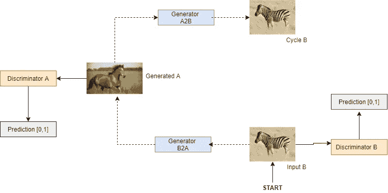
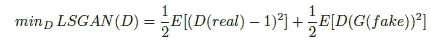
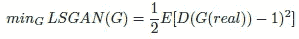
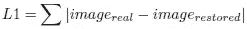
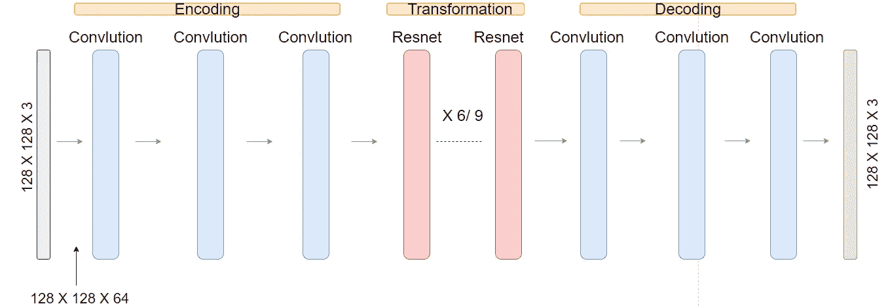
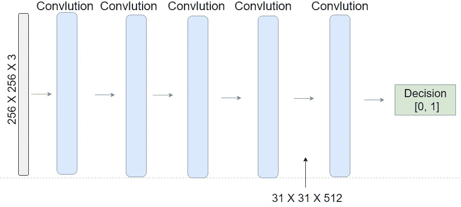
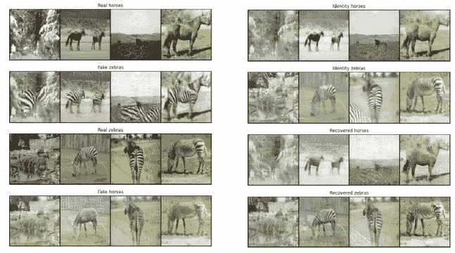

# 用 PyTorch 循环 GAN

> 原文：<https://towardsdatascience.com/cycle-gan-with-pytorch-ebe5db947a99?source=collection_archive---------19----------------------->

cycleGAN 的一般概念，展示了如何将输入斑马生成为马，然后循环返回并生成斑马。(图片由作者提供)

在这篇文章中，我将分享一个有趣的项目，我是其中的一部分，该项目的目标是建立一个循环甘，可以接受 A 类的图像，并将其转换为 B 类，在这种情况下，马和斑马。我将依次介绍以下主题:

*   周期 GAN 描述，主要特性。
*   在哪里以及如何找到图像数据。
*   PyTorch 中 GAN 循环的实现。
*   结果介绍。

# **循环甘描述**

圈 GAN(据我所知)在论文 [*中首次被介绍使用圈一致对抗网络*](https://arxiv.org/abs/1703.10593) *进行不成对的图像到图像翻译。*(我推荐任何对计算机视觉感兴趣的人阅读这篇论文，因为它不是很长，并且提供了周期 GAN 背后的直觉以及损失函数的重要数学公式。)使循环 GAN 有趣的是，它是并行学习的两个神经网络之间的组合/游戏。这两个网络被称为接收真实图像并输出虚假图像的发生器和分类图像是真实还是虚假的鉴别器。目标是随着时间的推移，生成器将变得更擅长欺骗鉴别器，而鉴别器将变得更擅长不被欺骗。为了相应地优化发生器和鉴别器，总共引入了八个损失函数。可以使用各种损失函数，但在这个项目中，我们使用基于最小二乘法的 LSGAN 损失函数和绝对平均值的 L1 损失函数。

**鉴别器:LSGAN 损耗**

如前所述，鉴别器的目标是将真实图像分类为真实图像，将虚假图像分类为虚假图像，为了对此进行优化，使用了以下最小平方损失函数:

这里的直觉是，在真实图像的情况下，完美的鉴别器将输出全 1，并且从第一项得到零损失。在伪图像的情况下，完美的鉴别器将输出全零，并且也获得零损失。LSGAN 用于模型中的每个鉴别器一次。

**发生器:特技鉴别器**

生成器的目标之一是欺骗鉴别者相信假图像是真的。为了让生成器在欺骗鉴别器方面做得更好，鉴别器应该为生成的图像输出全 1。在这种情况下，发电机的损耗为零。为了实现这一点，定义了与上述略有不同的 LS 损失函数定义:

**发电机:周期一致性**

我们对生成器施加约束，称为周期一致性。我们希望生成器能够首先从一个类域映射到另一个类域，然后在不对图像进行任何更改的情况下返回到第一个类域。该约束是通过在真实图像和恢复图像之间的像素到像素级别上使用 L1 损失函数来施加的:

**生成器:身份丢失**

当提供目标域的实像样本时，单位损失意味着将生成器正则化为接近单位映射。换句话说，如果一个输入图像已经看起来像目标域，那么生成器不应该将它映射到不同的图像中(例如，马不应该被重构为马)。这种特性是通过身份损失强加的，并且基于如上所示的相同的 L1 损失函数。在最初的 Cycle GAN 论文的第 5.2 节中讨论了通过 L1 正则化利用恒等函数的概念。

**发电机架构**

发生器结构(尺寸取决于图像大小)。(图片由作者提供)

如上图所示，生成器有三个主要组件，编码阶段、转换和解码。

编码:

编码阶段通过多个卷积层将图像中的特征转换成潜在空间表示。

转型:

转换阶段由六个或九个 resnet 块组成，用于组合在编码阶段捕获的适当潜在特征。resnet 块还具有跳过连接的好处，这有助于避免深度网络中的消失梯度。

解码:

解码阶段与编码阶段相反，通过转置卷积组装潜在表示。

**鉴别器架构**

鉴别器结构。(图片由作者提供)

鉴别器仅仅是由卷积层组成的网络，并且具有执行二元分类的功能，即图像是真的还是假的。

# 查找图像数据

对于任何对图像数据执行模式识别任务感兴趣的人来说，轻松快速地找到大量特定区域的图像是非常重要的。大多数深度学习框架，如 tensorflow、keras 和 PyTorch，都具有让用户轻松访问 cifar 10、mnist fasion/ digits 等流行数据集的功能。然而，找到个人图像数据需要更多的努力，但仍然不是很困难。我发现下面这个话题的论坛讨论很有参考价值: [**链接**](https://forums.fast.ai/t/tips-for-building-large-image-datasets/26688) 。我个人发现 ImageNet 在抓取图像数据方面既简单又可靠。根据我的经验，ImageNet 可以提供给定对象(如草莓)的大约 1000 张图像，对于深度学习应用程序来说，这可能是也可能不是足够的数据。

这个项目使用的数据是大小为 256 X 256 的马和斑马的图像。马/斑马数据集(不是我自己收集的)可以在以下链接找到: [**链接**](https://drive.google.com/uc?id=1jPelB2jzNZJq3ZU9Uk Mkt4MJtF3DRgg) 。

# 使用 PyTorch 循环 GAN 实施

发电机网络定义如下。

鉴频器网络定义如下。

分别用于发生器和鉴别器网络的上述损耗函数如下所示实现。

用于训练网络的完整代码可以在下面的[笔记本](https://colab.research.google.com/drive/1AcldVfgaalxLtBrXZqzBTvYpbuGawT5o?usp=sharing)中找到。通过 google corroboratory 使用 GPU 训练网络。

# 结果

下图显示了从上述实现中接收到的一些结果图像。

周期 GAN 结果。(图片由作者提供)

当我们查看从模型生成的图像时，结果的质量相差很大。一些图像结果通常是好的，而其他图像质量较低，例如图像中不包含任何被改变的动物的部分。通常，当从马图像生成假斑马时，如果有一匹棕色的马，并且马的身体的全部或大部分出现在图片中，并且马覆盖了图像的大部分，则获得最佳结果。如果图像中有大量噪声，即马的身体占据了图像的一小部分，那么发生器通常很难改变所产生的噪声。为什么会是这种情况的假设是，模型将图像解释为斑马，并且在这种情况下，由于来自身份损失函数的约束，生成器模型不改变输入图像。

一般来说，当模型要把斑马变成马时，它的表现比相反的情况要差。较差的表现最有可能归因于马的外观比斑马变化更大。注意到的另一个方面是，即使在训练数据图像中存在白色和黑色的马，在斑马转换图像上看到的变化是只有棕色被添加到斑马身体的较大或较小部分。这是因为数据集很可能包含更多棕色马的图像，因此模型过度适合棕色。