# 简单英语中的循环一致对抗网络

> 原文：<https://towardsdatascience.com/cyclegan-math-in-simple-english-d4cdd59f0f07?source=collection_archive---------72----------------------->

## CycleGAN 背后的数学损失函数分析

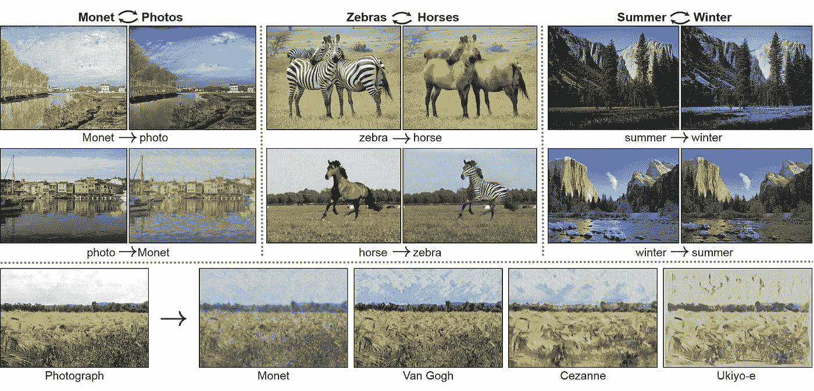

图片由[朱俊彦](https://www.cs.cmu.edu/~junyanz/)上传于 [Github](https://github.com/junyanz/pytorch-CycleGAN-and-pix2pix)

CycleGAN 是一种不成对图像到图像翻译的方法。不幸的是，在没有完全理解或欣赏其中的数学知识的情况下使用 CycleGAN 是可能的。这真是太遗憾了。

在本文中，我将介绍周期一致的敌对网络背后的数学原理。请阅读[论文](https://arxiv.org/pdf/1703.10593.pdf)获取更全面的解释。

# 不成对与成对

CycleGAN 的关键是我们没有前后图像。

让我们以上面显示的将斑马转换成马的例子为例(反之亦然)。

在配对的数据集中，马和斑马需要彼此“匹配”。我们实际上是把一匹马涂成黑色和白色。背景、闪电等。保持不变。

成对的数据集看起来像这样:

图片由[朱俊彦](https://www.cs.cmu.edu/~junyanz/)在 [Github](https://github.com/junyanz/pytorch-CycleGAN-and-pix2pix) 上拍摄

在不成对的数据集中，马和斑马不需要彼此“匹配”。这个数据集更容易创建。

不成对的数据集应该是这样的:

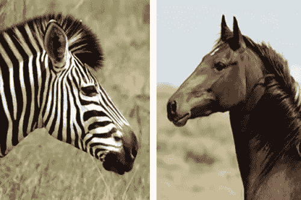

图片来自[达拉斯马术中心](http://www.dallasequestriancenter.com/zebra-and-horse-a-bit-similar/)

# 生成器和鉴别器

正如你可能对 GAN 的期望，我们有生成器和鉴别器。我们的生成器也被称为映射函数。

让我们列举几个变量:

*马和斑马*

*   `X`指斑马
*   `Y`指一匹马

*发电机*

*   `G`指的是将斑马转换成马的映射函数
*   `F`指的是将马转换成斑马的映射函数

*鉴别器*

*   `Dx`指善于识别斑马的鉴别器。
*   `Dy`指善于识别马匹的鉴别者

将所有这些放在一起，我们就有了这样的东西:

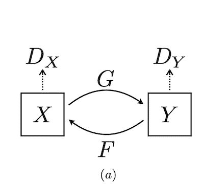

图片来自 [CycleGAN 论文](https://arxiv.org/pdf/1703.10593.pdf)

# 循环一致性损失

在[论文](https://arxiv.org/pdf/1703.10593.pdf)中，循环一致性图表如下:

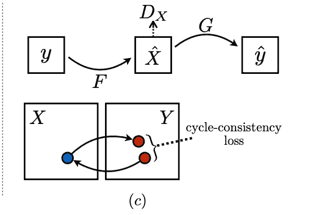

图片来自 [CycleGAN paper](https://arxiv.org/pdf/1703.10593.pdf)

下面是正在发生的事情:我们把一匹马的图像转换成斑马。然后在这个新创建的斑马上运行鉴别器。然后我们把新创建的斑马变成一匹马。

我们将这匹新造的马与我们现有的马进行比较。这就是`y^` vs `y`的本质含义。我们新创建的马应该看起来和原来的马几乎一样。

我制作了一个信息图来解释这是如何工作的。

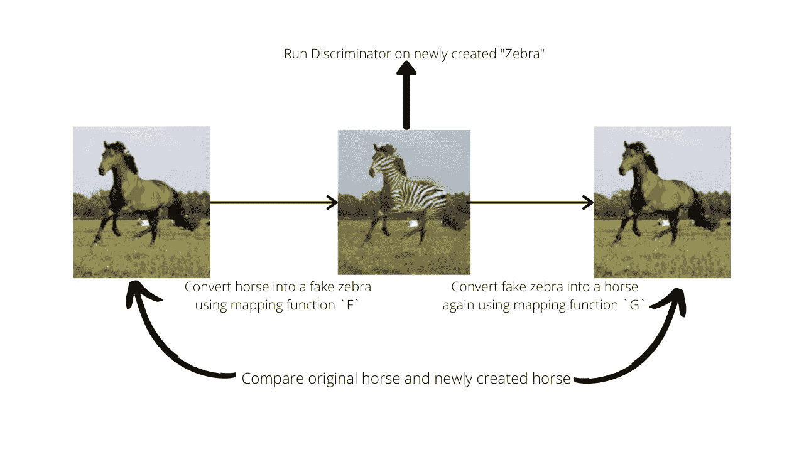

作者图片

现在我们重复这个过程。除了这一次，我们采取了一个斑马的形象，并试图转换成一匹马。数学术语中的损失函数

# 数学术语中的损失函数

对于我们的损失函数，我们有对抗性损失和周期一致性损失。

## 对抗性**损失:**

对抗性损失的损失函数如下:

图片来自 [CycleGAN paper](https://arxiv.org/pdf/1703.10593.pdf)

我们来分析一下。

左手边接收:

*   `Dy`(马识别者)
*   `G`(我们的斑马对马创作者)
*   `X`(一只斑马)
*   `Y`(一匹马)

RHS 包含以下术语:

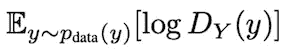

图片来自 [CycleGAN paper](https://arxiv.org/pdf/1703.10593.pdf)

这个术语测量我们识别我们创造的斑马是真是假的能力。我们从所有斑马中抽出一只斑马，让它通过鉴别器。

下一学期:

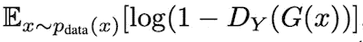

图片来自 [CycleGAN paper](https://arxiv.org/pdf/1703.10593.pdf)

这个术语衡量我们把一匹马变成斑马的能力。我们从所有生成的马中抽出一匹马，并将其通过鉴别器。

现在我们做第一项加上第二项。这给了我们上面看到的对抗性损失等式。

## **周期一致性丧失:**

这是循环一致性损失的损失函数:

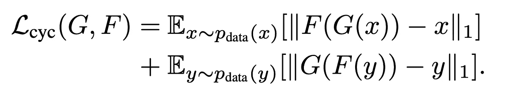

图片来自 [CycleGAN 论文](https://arxiv.org/pdf/1703.10593.pdf)

我们来看第一项:

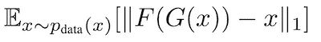

图片来自 [CycleGAN 论文](https://arxiv.org/pdf/1703.10593.pdf)

这意味着:

1.  我们从斑马数据集中随机抽取一只斑马。(`x~p(x)`)
2.  我们将斑马通过生成器(`G`)来创建一匹马。
3.  我们将生成的马通过另一个生成器(`F`)来创建斑马
4.  我们将步骤 3 中创建的斑马纹与步骤 1 中的随机斑马纹进行比较，并取差值的绝对值之和。

## 全面目标:

完整的损失函数如下:

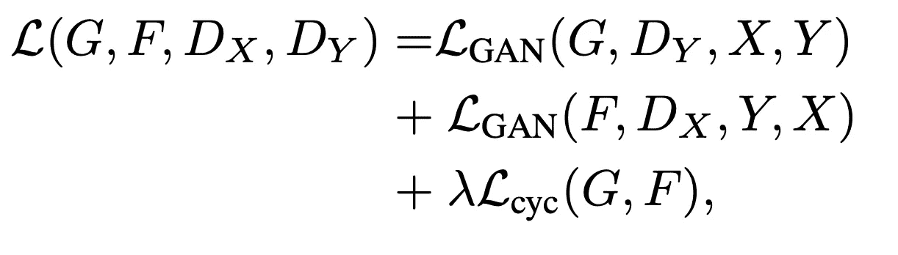

图片来自 [CycleGAN paper](https://arxiv.org/pdf/1703.10593.pdf)

只是我们之前看到的对抗性损失函数和周期一致性损失函数的和。其中λ控制每个目标的相对重要性。

最终，我们希望实现以下目标:

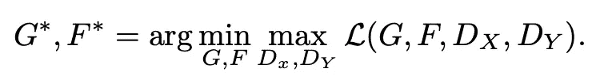

图片来自 [CycleGAN paper](https://arxiv.org/pdf/1703.10593.pdf)

我们试图最大化鉴频器的能力，最小化发电机的损耗。这使我们能够很好地区分斑马和马，同时也能很好地生成马和斑马。

# 结束

CycleGAN 背后的数学似乎有些令人生畏。但是我已经尝试在这篇文章中涵盖了大概的内容。我希望这能帮助到一些人。当我学习 CycleGAN 如何工作时，这篇文章肯定会对我有所帮助。

如果我犯了错误，请随时通过 [twitter](https://twitter.com/neeliyer11) 联系我，我会尽快修复。

非常感谢《CycleGAN》的作者:[朱俊彦](https://www.cs.cmu.edu/~junyanz/)、[朴泰成](https://taesung.me/)、[菲利普·伊索拉](http://web.mit.edu/phillipi/)和[阿列克谢·a·埃夫罗斯](https://people.eecs.berkeley.edu/~efros/)。我认为值得阅读他们的[论文](https://arxiv.org/pdf/1703.10593.pdf)来更详细地了解这种方法。

*原载于 2020 年 8 月 31 日*[*https://spiyer 99 . github . io*](https://spiyer99.github.io/Cyclegan-Simple-English/)*。*