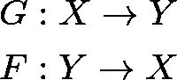
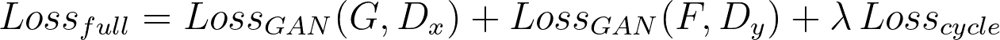

# 循环生成网络

> 原文：<https://towardsdatascience.com/cyclic-generative-networks-cyclegans-9b9526b2731c?source=collection_archive---------24----------------------->

## [生成网络解释](https://medium.com/tag/gans-explained)

## “其他人在他们的智慧的帮助下，将一个黄色的点变成了太阳”——巴勃罗·毕加索

将马的原始镜头转换为斑马的循环生成网络。

*本文旨在解释循环 gan 的内部工作原理，以及它们如何应用于解决现实世界的任务。*

## 介绍

C 循环生成对抗网络(简称**cycle gans**)【1】是强大的计算机算法，具有改善数字生态系统的潜力。它们能够将信息从一种表示转换成另一种表示。例如，当给定一幅图像时，他们可以模糊它，给它着色(例如，如果它原本是黑色的&白色的)，提高它的清晰度，或者填补缺失的空白。

它们比你传统的设计/生产/写作平台更强大。因为**cycle gan**是机器学习算法，它们原则上可以学习实现任何想要的转换。相反，传统的转换软件(如 Photoshop)通常是硬编码的，用于执行特定的任务。此外， **CycleGans** 可以实现比现有软件更高的性能，因为它们可以从数据中学习，并随着数据的收集而改进。

了解不同层次的 CycleGans 的工作方式和能力令人兴奋，并提供了人工智能如何以前所未有的方式影响我们日常生活的见解。

CycleGAN 基于 3d 草图渲染手绘图像

## 生成网络

在谈论 CycleGans 之前，我们先简单讨论一下正则生成对抗网络。

生成对抗网络(简称 GANs)[2]是能够创建数据的[机器学习算法](https://en.wikipedia.org/wiki/Machine_learning)。当他们得到图像、声音或文本等信息时，他们会学习产生新的看起来/听起来相似的输出。例如:给定一组人脸图像，算法可以*自学* ( *训练*，用机器学习的行话来说)人脸长什么样，并且能够创造新的人脸。**我鼓励你看一看** [**这篇文章**](https://medium.com/ai-society/gans-from-scratch-1-a-deep-introduction-with-code-in-pytorch-and-tensorflow-cb03cdcdba0f) **，我在其中旨在解释 GANs** 的基本面。

环状 GANs 是传统 GANs 的特殊变体。他们还可以创建新的数据样本，但他们是通过转换输入样本来实现的，而不是从头开始创建输出。换句话说，他们学习转换来自两个数据源的数据；为该算法提供数据集的科学家或开发人员可以选择这些分布。在两个数据源是狗的图片和猫的图片的情况下，该算法能够有效地将猫的图像转换成狗的图像，反之亦然。

# 他们是怎么做到的？

## 什么是 CycleGan？

CycleGan 是学习两个域之间的两个数据转换函数的神经网络。其中之一就是转型`**G**(x)`。它将给定的样本`x ∈ X`转换成域`Y`的元素。第二个是`**F**(y)`，将样本元素`y ∈ Y`转换成域`X` *的元素。*

变换函数 F 和 g 的定义。

## 两个甘，一个辛克莱甘

*考虑阅读* [*这篇文章*](https://medium.com/ai-society/gans-from-scratch-1-a-deep-introduction-with-code-in-pytorch-and-tensorflow-cb03cdcdba0f#0f72) *了解更多关于甘斯*的内容

为了学习`**F**`和`**G**`，使用了两个传统的甘。每个 GAN 内部都有一个**发生器**网络，学习如何根据需要转换数据。GAN 的第一个生成器学习计算`**F**`，GAN 的第二个生成器学习计算`**G**`。

生成函数 G 和 f 的定义。

此外，每个发生器都与一个鉴别器相关联，该鉴别器学习区分真实数据`y`和合成数据`**G**(x)`。

生成函数 G 和 f 的定义。

因此，CycleGAN 由学习变换函数`**F**`和`**G**`的两个发生器和两个鉴别器组成。该结构显示在下图中:

CycleGan 表示法。它由两个甘组成，甘学习两种转化。

## 单 GAN 损耗

每个 GAN 发生器将通过最小化损耗来学习其相应的变换函数(或者`**F**`或者`**G**`)。通过测量生成的数据与目标数据的不同程度(例如，生成的猫图像与真实的猫图像相比的不同程度)来计算发生器损耗。差距越大，发生器将受到的惩罚越高。

鉴别器损耗也用于训练鉴别器，使其善于区分真实数据和合成数据。

当这两个代理设置在一起时，它们将相互改进。生成器将被训练来欺骗鉴别器，而鉴别器将被训练来更好地从合成数据中区分真实数据。因此，生成器将变得非常擅长创建/转换所需的数据(学习所需的转换，例如`**F**` )。

总的来说，GAN 损耗如下:

单个 GAN 损耗的定义。d 是鉴别器功能，G 是发生器功能。

第二个发生器-鉴别器对也有类似的损耗:

作为学习所需转换`**F**`和`**G**`的一种方式，CycleGAN 将尝试最小化两个 GAN 损耗的总和。

## 循环转换一致性

理想情况下，我们希望我们的 CycleGAN 学习周期一致的转换函数`**F**`和`**G**`。这意味着，给定一个输入`x`，我们希望来回转换`**F(G(**x**))=** x'`准确地输出原始输入`x`。理论上这应该是可能的，因为在输入端`x`应用`**G**`将在`Y`域输出一个值，在输入端`y`应用`**F**`将在`X`域输出一个值。

循环一致性减少了这些网络可以学习的可能映射集，并迫使`**F**`和`**G**`成为相反的变换。想象一下，学会的函数`**F**`通过修改自己的*耳朵*将猫的图片转化为狗的图片，而`**G**` 通过修改自己的*鼻子*学会将狗的图片转化为猫的图片。虽然这些转换可以达到目标，但是它们并不协调，因为它们对数据应用了不同的更改。使用周期一致性迫使`**F**`和`**G**`彼此相反。这样猫的图片会通过修改耳朵转化为狗的图片，狗的图片会通过反过来修改耳朵转化为猫的图片。如果这两个函数是循环一致的，那么它们也是更有意义的映射。

左:输入 x 的循环一致性损失的直观表示。右:输入 y 的循环一致性损失的直观表示。

仅使用 GAN 损耗训练 CycleGAN 并不能保证保持**周期一致性**。因此，额外的**周期一致性损失**被用于实施该属性。这种损失被定义为输入值`x`与其前向周期预测值`**F**(**G**(x))`之间的绝对值差( [L1 范数](https://en.wikipedia.org/wiki/Uniform_norm))，以及输入值`y`与其前向周期预测值`**G**(**F**(y))`。差异越大，预测值与原始输入值的差距就越大。理想情况下，我们的网络会将这种损失降至最低。

循环一致性损失的定义。相当于上图中的可视化表示。

## 完全损失

用于训练网络的完整周期 Gan 损耗定义为两个 GAN 损耗和周期一致性损耗之和。

加权因子 **ƛ** (名为λ)用于控制周期一致性损失在全部损失中的权重。与其他损失相比，权重越高，减少循环一致性损失就越相关。

完全损失的定义

被优化以最小化该函数的 CycleGANs 将能够学习期望的变换`F`和`G`。机器学习培训的细节将留到我的后续文章中。

# 结果

CycleGans 已经在几个任务的完成情况上进行了测试，并且已经能够成功地解决它们。这些任务的几个例子是:

## **图像变换**

输入:鲜花原图。输出:应用了焦点和效果的改进的花卉图片。

**照片增强:**CycleGans 经过训练，可以生成专业的花卉照片，具有几个级别的聚焦和模糊，以及任何照片编辑工具。

输入:风景图片。输出:相同的风景，不同风格的艺术品。

**图像风格转换:** CycleGans 被训练来转换图片和艺术品的风格，例如，他们已经能够将照片转换成相同风景的梵高风格的画作。

风景图片从冬天变成了夏天。

**季节转换:**与风格转换类似，CycleGANs 已用于转换拍摄照片的季节。这里的结果令人惊讶，因为许多图像看起来像真实的照片。

## 音频转换

**音乐类型转换:**苏黎世 ETH 大学的研究人员已经能够训练 CycleGANs 人将古典流行音乐类型的歌曲转换成古典音乐作品[4]。

**语音转换:**日本 NTT 通信科学实验室的研究人员展示了令人印象深刻的结果，他们使用 CycleGANs 在不同性别的说话者之间转换语音注册表[5]。

这部作品的音频样本可以在[他们的网站](http://www.kecl.ntt.co.jp/people/kaneko.takuhiro/projects/cyclegan-vc2/index.html)找到。

## 其他人

CycleGan paper 官方网站[提供了在互联网不同地方发现的其他 CycleGan 用例的图库。我希望这些有趣的例子能鼓励您进一步了解 CycleGans，并提出更多有用和有趣的应用。](https://junyanz.github.io/CycleGAN/)

CycleGan 使用的图库可以在[这个网站](https://junyanz.github.io/CycleGAN/)找到。

# CycleGan 问题

尽管 CycleGANs 在上述许多任务中取得了明显的成功，但仍显示出 100%的成功率。以下是他们目前的一些陷阱:

1.  当 CycleGans 输入的数据来自他们接受训练的数据时，可能会产生意想不到的结果(见下图)。
2.  需要几何变化而不是颜色或对比度的任务对输入的影响很小。

用于变换马和斑马图像的 CycleGan 没有人类的输入，因此它可以生成任意的变换。

进一步的研究可能侧重于改进这些领域的工作。一些策略包括使用更广泛和更多样化的数据集，以及使用半监督学习方法。

# 最后的话

我要感谢并祝贺来自加州大学伯克利分校人工智能研究实验室的朱俊彦、朴泰成、菲利普·伊索拉和阿列克谢·a·埃夫罗斯为 CycleGans 所做的工作。在[他们的网站](https://junyanz.github.io/CycleGAN/.)你会找到更多与项目相关的信息。

我鼓励你去看看[我的 GANs 库](http://github.com/diegoalejogm/gans)，在那里你会发现不同类型的 GANs 在 Python 中的实现，以及一个正在从头开始在 PyTorch 和 TensorFlow 中的 CycleGan 实现。我将通过媒体发布一个教程，一旦我完成了。

感谢阅读这篇文章直到最后。我希望你在学习这个主题的过程中获得了乐趣，我将在下一期节目中与你见面。🎊

# 参考

*【1】*[*【朱俊彦】*](https://arxiv.org/search/cs?searchtype=author&query=Zhu%2C+J)*[*朴泰成*](https://arxiv.org/search/cs?searchtype=author&query=Park%2C+T)*[*菲力普·伊索拉*](https://arxiv.org/search/cs?searchtype=author&query=Isola%2C+P)*[*阿列克谢·阿弗罗斯*](https://arxiv.org/search/cs?searchtype=author&query=Efros%2C+A+A) *、不成对的图像到图像翻译使用循环一致的对抗网络、****

***【2】伊恩·j·古德菲勒、让·普盖-阿巴迪、迈赫迪·米尔扎、徐炳、大卫·沃德-法利、谢尔吉尔·奥泽尔、亚伦·库维尔、约舒阿·本吉奥，《生成性对抗性网络》，2014 年，*[*【https://arxiv.org/abs/1406.2661*](https://arxiv.org/abs/1406.2661)**

***【3】*[*泰罗卡拉斯*](https://arxiv.org/search/cs?searchtype=author&query=Karras%2C+T)*[*萨穆利莱恩*](https://arxiv.org/search/cs?searchtype=author&query=Laine%2C+S)*[*米卡艾塔拉*](https://arxiv.org/search/cs?searchtype=author&query=Aittala%2C+M)*[*简内赫尔斯滕*](https://arxiv.org/search/cs?searchtype=author&query=Hellsten%2C+J)*[*贾科莱蒂宁*](https://arxiv.org/search/cs?searchtype=author&query=Lehtinen%2C+J)******

***【4】[*吉诺·布鲁纳*](https://arxiv.org/search/cs?searchtype=author&query=Brunner%2C+G)*[*【王】*](https://arxiv.org/search/cs?searchtype=author&query=Wang%2C+Y)*[*罗杰·瓦滕霍夫*](https://arxiv.org/search/cs?searchtype=author&query=Wattenhofer%2C+R)*[*苏穆·赵*](https://arxiv.org/search/cs?searchtype=author&query=Zhao%2C+S) *【象征性音乐流派转移用 CycleGAN、*******

***[*金子拓广*](https://arxiv.org/search/cs?searchtype=author&query=Kaneko%2C+T)*[*龟冈博和*](https://arxiv.org/search/cs?searchtype=author&query=Kameoka%2C+H)*[*田中寇*](https://arxiv.org/search/cs?searchtype=author&query=Tanaka%2C+K)*[*信厚北藏*](https://arxiv.org/search/cs?searchtype=author&query=Hojo%2C+N) *。CycleGAN-VC2:改进的基于 CycleGAN 的非并行语音转换，*[*https://arxiv.org/abs/1904.04631*](https://arxiv.org/abs/1904.04631)******