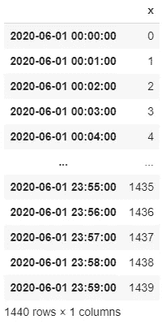
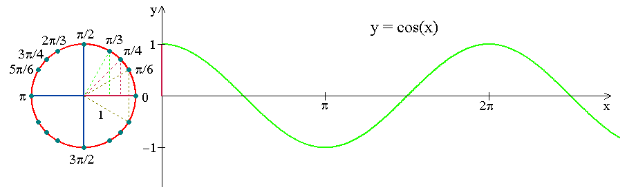
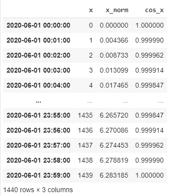
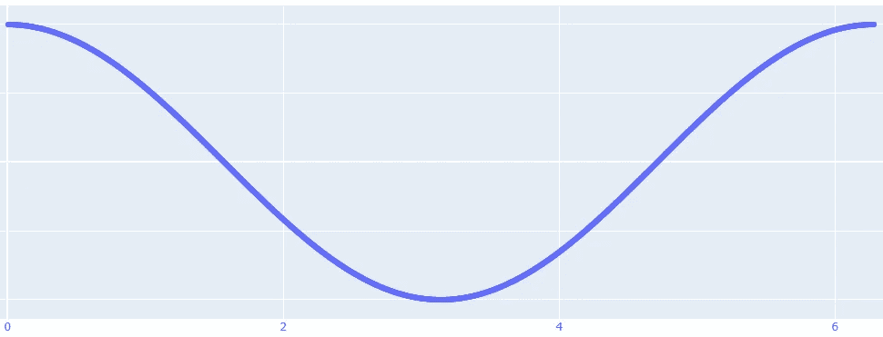
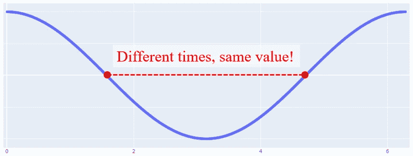
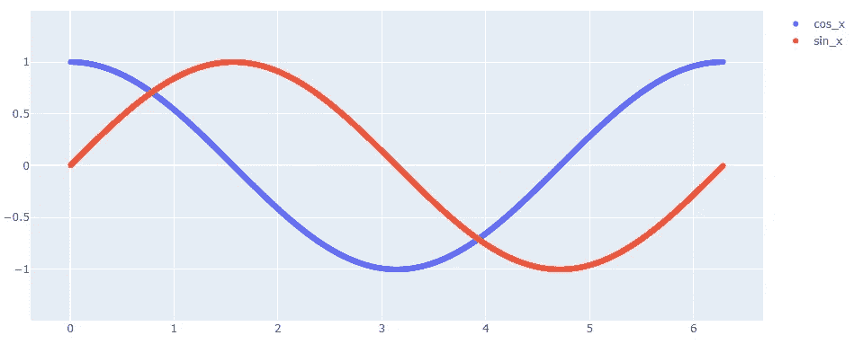
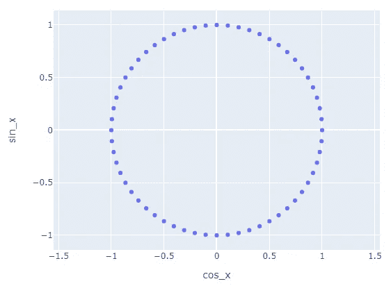
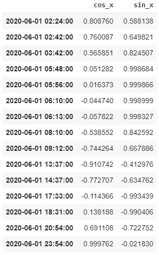
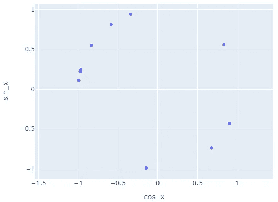
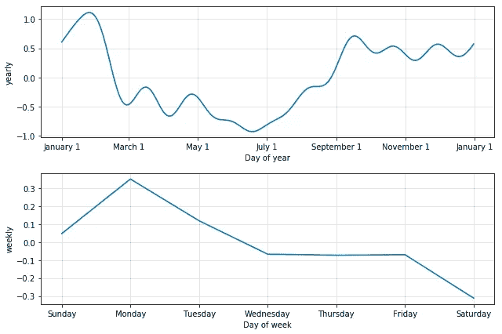

# 周期性特征编码，是时候了！

> 原文：<https://towardsdatascience.com/cyclical-features-encoding-its-about-time-ce23581845ca?source=collection_archive---------4----------------------->

找到一种简单的技术来转换时间、星期、月份或季节等特征，同时仍然保留它们的循环意义。

在 [Unsplash](https://unsplash.com?utm_source=medium&utm_medium=referral) 上由 [Fabrizio Verrecchia](https://unsplash.com/@fabrizioverrecchia?utm_source=medium&utm_medium=referral) 拍摄的照片

我总是发现关于特征工程的讨论很吸引人，因为它们揭示了数据科学家如何通过增加提供给算法的信息来改善建模过程。

即使您是数据科学的新手，您也可能知道有些变量不能直接输入到模型中。是的，我肯定是在谈论需要诸如 one-hot 或 get_dummies 编码方法之类的技术的分类特征。

当您处理时间序列数据时，您的数据帧索引通常具有日期时间格式(YYYY-MM-DD HH:MM:SS ),除了数据点的升序之外，您不会从中提取太多信息。

但是，您的数据集中可能存在一些隐藏的模式，这些模式不会被常规要素显示出来。我这里说的是循环模式，比如一天中的几个小时、一周中的几天、几个月、几个季节等等。

问题是，当涉及到将这些信息转换成可解释的特征时，我们通常会面临一个挑战。

# 让我们以建立一个能源消耗预测模型为例。

[马太·亨利](https://unsplash.com/@matthewhenry?utm_source=medium&utm_medium=referral)在 [Unsplash](https://unsplash.com?utm_source=medium&utm_medium=referral) 上拍照

我们肯定地知道，一天中的时间将对这种消耗有很大的影响。

为了将时间编码为从 00:00 到 23:59，我们的第一个猜测可能是将其转换为从 00:00 开始经过的分钟数，从 0 到 1439:

> **这里的问题是，模型会将 23:58 和 00:02 之间的差异视为 1336 间隙，而它们之间仅相隔 4 分钟！**

我们如何解决这个问题？

如果你还记得高中的一些事情，你可能知道一些具有循环行为的函数…最著名的是余弦，因为它根据 0-2π循环在-1 和 1 之间变化。

余弦函数([源](http://www.math.ust.hk/~machiang/1013/Notes/tri_func.html))

所以让我们通过余弦转换我们的时间，我们很好，不是吗？

我们将在 0 到 2π之间归一化 x 后运行余弦函数，这相当于一个余弦周期。作为一张图表胜过千言万语，我们就用 Plotly 来看看相应的结果:

1440 分钟标准化并通过余弦转换

所以我们现在有了比以前更接近的 00:00 和 23:59 的值，它们都在 1 左右！

但是你看到我们创造的新问题了吗？

**两个不同的时间会得到相同的值:**

《采访》中的詹姆斯·弗兰科

解决这个新问题的最好方法是添加另一个循环信息来区分具有相同余弦值的两个时间。我们可以把它想象成一个双轴坐标系统。

这大概是给余弦的哥哥打电话的恰当时机:正弦！

0-2π周期上的余弦和正弦函数(y)

通过将原来的时间转换为它们对应的余弦和正弦值，我们现在可以为 00:00 到 23:59 之间的每个时刻分配不同的坐标，使它们具有唯一性！

这样一个系统的可视化使它变得更加明显:

我们创造的余弦-正弦坐标系统

为了举例，让我们在一段时间内随机绘制 15 个点:

# 这种编码体系是否完美？不幸的是没有，以下是一些原因:

*   **你正在将一个信息转换成两个特征**，从算法的角度来看，这将在数学上赋予它更大的权重。
*   **基于决策树的算法**(随机森林，梯度提升树，XGBoost)一次根据一个特征建立它们的分割规则。这意味着它们**将无法同时处理这两个特征**，而 cos/sin 值将被视为一个单一坐标系。

然而，权衡有时是游戏的一部分，这仍然是编码周期性特征的好方法。

值得一提的是，开源算法(如脸书的 Prophet)确实允许您从时间序列中自动提取周期性信息，如年、月或日模式:

摘自脸书的《先知快速入门指南》

 [## 快速启动

### Prophet 遵循 sklearn 模型 API。我们创建一个 Prophet 类的实例，然后调用它的 fit 和 predict…

facebook.github.io](https://facebook.github.io/prophet/docs/quick_start.html#python-api)  [## 皮埃尔-路易·贝斯康德关于媒介的文章

### 数据科学、机器学习和创新

pl-bescond.medium.com](https://pl-bescond.medium.com/pierre-louis-besconds-articles-on-medium-f6632a6895ad)