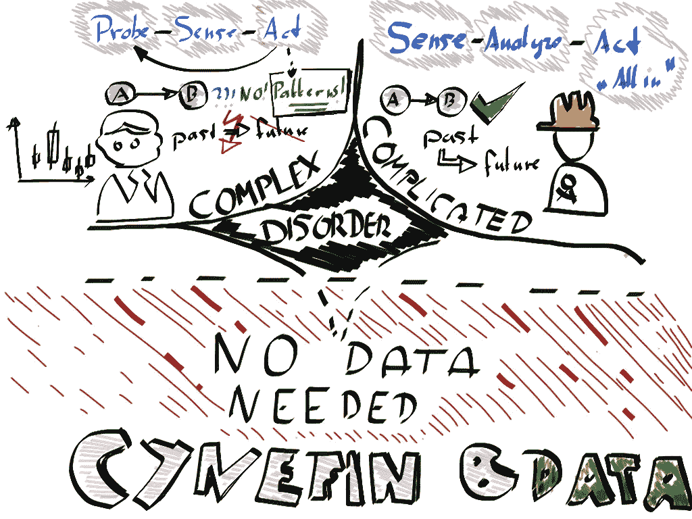
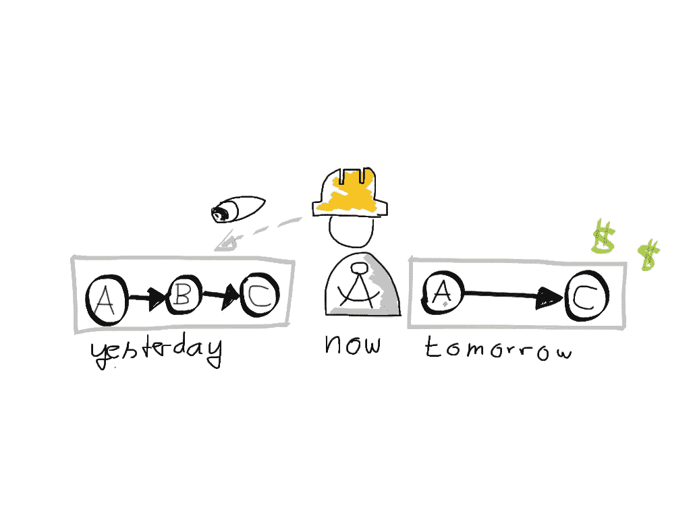
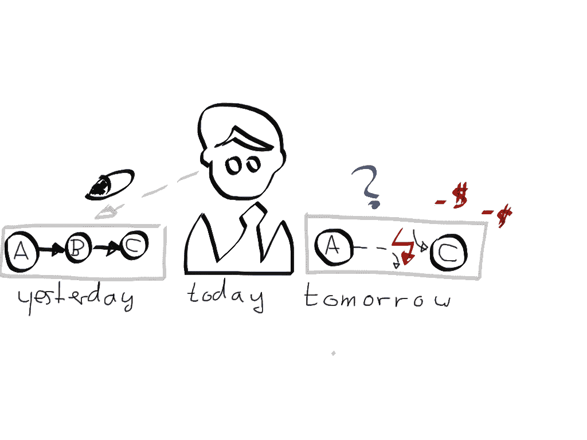
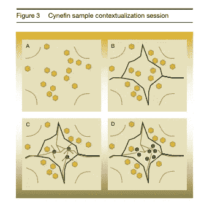
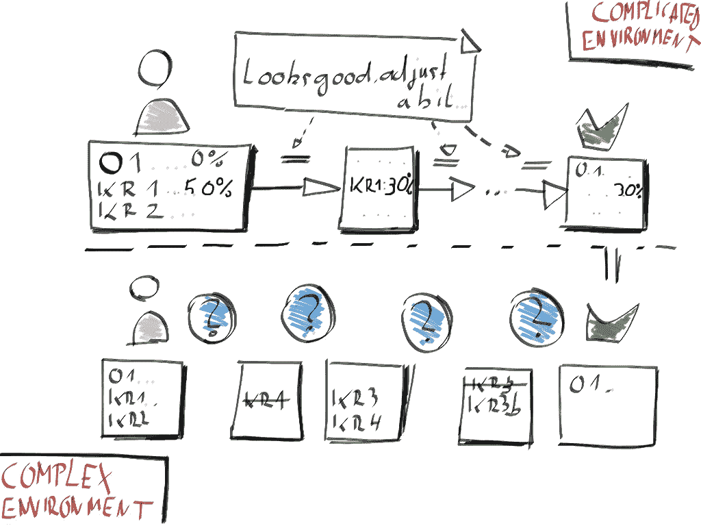

# Cynefin 和数据驱动的决策——了解您的领域

> 原文：<https://towardsdatascience.com/cynefin-and-data-driven-decision-making-understand-your-domain-544174f90c0a?source=collection_archive---------35----------------------->

## 有两种方法可以做出数据驱动的决策，分析方法和实验方法，在任何给定的时刻，只有一种方法适合你！

Cynefin &数据驱动的决策。作者写的。

## **动机**

我们需要更多的预测，更多的预测分析，通用的前后分析框架，更多的人工智能。然而 [65%的经理报告说这些努力没有带来可见的价值](https://www.forbes.com/sites/gilpress/2019/10/17/ai-stats-news-65-of-companies-have-not-seen-business-gains-from-their-ai-investments/#7a57728819f4)。我认为失败的分析项目的一个重要组成部分是公司未能理解何时使用**分析数据驱动的决策**，以及何时使用**实验数据驱动的决策**。

我认为，像网飞、Airbnb 和 Zynga 这样的公司非常成功，因为他们理解这两种“数据驱动”决策的方法，并且擅长于实验方法，而通常情况下，公司只关注分析方面。让我们来定义它们:

*   **分析**:我们分析*过去*的数据，然后得出最优决策，然后我们“最优”行动。这通常就是“数据驱动的决策”的含义。但这只是硬币的一面。
*   **实验**:考虑来自*未来*的数据。这是怎么回事？数据是产品的一部分，反馈是决策的一部分。对于两种产品的&决策，我们只是*试探*，我们不会“用我们所有的筹码行动”。我们感知数据反馈，推断模式，行动，然后一遍又一遍地重复这个紧密的循环，直到有一天我们可能会以分析方法而告终。

> 像网飞、Airbnb 和 Zynga 这样的公司更经常选择实验性的方法…

据我所知，像网飞、Airbnb 和 Zynga 这样的公司比其他公司更经常选择实验性方法。通过这样做，他们有效地导航 **cynefin 框架**，并决定他们是在事物的“复杂”还是“复杂”的一边。

因此，让我们来看看如何才能在这两种方法上都表现出色！

1.  让我们看看为什么以及什么时候分析方法起作用。
2.  让我们看看为什么和什么时候实验方法会起作用，而分析方法会是灾难性的。
3.  让我们回顾一下 cynefin 框架，它为这一点提供了一个很好的背景，并且可以看到，根据不同的情况，你必须能够使用这两种方法。
4.  让我们最后来看看，为什么 OKRs 与这两种方法配合得如此好，但是您也必须小心地了解您在 OKRs 中的领域！

## **分析数据驱动的决策制定**

让我们考虑一个建造桥梁的建筑师。他今年 40 岁，迄今为止在他的职业生涯中已经建造了 50 座桥梁。现在，他决定思考如何更好地建造桥梁，以使它们更具可持续性。

他收集他的*历史(过去)*数据，检查他建造的所有桥梁，检查天气数据，交通数据，并弄清楚一些事情。通过分析过程，他能够将恶化分解为以下主要驱动因素:

*   暴雨
*   繁重的交通负荷

根据他的观察，以及这些潜在原因在可预见的未来可能不会改变的知识，这位建筑师现在可以做出一个完全基于数据的**决策**，并再次建造许多具有特定据点的桥梁，无论是天气(在有大量暴雨的地区)还是针对他怀疑的交通负荷。

*建筑师通过分析过去，推断出他未来的蜜罐。他知道 A 比 B 更了解 C，所以他可以利用这一点。*

这是一个*分析数据驱动的决策*。它非常适合这个领域，在这个领域我们确实需要一个专业的架构师和大量的数据来正确地分析&建造更好的桥梁，但是在这个领域我们有“已知的未知”。我们有明确的限制，比如未来 50 年地球上的典型天气，这些限制内的一切都是物理的，因此是相对“稳定的&可预测的”。

**分析数据驱动的决策示例**

那么什么样的决定属于这一类呢？事实证明，虽然 Airbnb 这样的公司以实验思维著称，但他们确实有[整个数据科学家轨道](https://medium.com/airbnb-engineering/from-data-to-action-with-airbnb-plus-54f4d8f80361)转向分析数据驱动的决策。

所有属于“优化”范畴的东西都在这个领域。运营工作流程、搜索引擎优化、任何符合 5 sigma 思维模式的东西。所有这些事情都有明确的限制，我们都知道，而且是可以预测的。

产品负责人的日常业务也适用于此。从我的经验来看:我的团队经历了相当多的压力，抱怨太多的“冲刺阶段的噪音”。我们决定对此采取分析方法，获得了一系列“噪音”基准，在我们公司，噪音显然在 10–20%左右，并从我们的 sprints 中获得了一系列数据。根据观察结果，我们能够将“冲刺阶段的噪音”降低到 5–10%以下，这个数字到目前为止都保持得很好。这是一种经典的分析方法。

## **实验数据驱动的决策制定**

外汇交易员在一个完全不同的领域工作。想象一个日内交易者。他持有大量头寸，然后平仓，分析数据，分析盈亏。然后，他确定完美的交易，分析推断主要驱动因素，预测它们，然后进行下一次交易。

> 却看到他的位置转向南方。

*对建筑师有什么不同？*建筑师和交易者之间的关键区别是，建筑师实际上可以推断出因果关系，而交易者只能推断出*模式*，因此不得不*不断探索*，这与建筑师非常不同，建筑师一旦推断出因果关系，就可以以完全相同的方式为未来 20 年建造伟大的桥梁。

建筑师推断出因果关系:

> 暴雨= >造成大量潮湿和喷雾损坏= >损坏桥梁的钢部件= >损坏桥梁的整体状态。

交易者不能。他当然可以事后推断出因果关系，但他*不能用它来预测*，因为未来的事情不会是同样的关系，甚至第二天也不会。离晚上还很远。

*交易者努力成为建筑师。他认为 A = > C，并且花了很多钱，最后却糊涂了。*

那么交易者能做什么呢？毕竟，有相当多的交易者在市场上赚钱，甚至像 Bridgewater Associates 和 Renaissance Technologies 这样的大型对冲基金甚至自动/通过算法进行交易。交易者能做的是推断模式。他可以不断探索，调整和完善成为他的交易策略的模式。事实上，这在某种程度上是雷伊·达里奥描述 Bridgewater capital 创始故事的方式。

但为此，交易者不必采取行动，而是一直探索，并根据探索采取行动。他的过程更像这样:

*   **探针 T=0:** 尝试用一个 50 点的跟踪止损点&和一串均线的某个交叉点作为切入点，用 1%的资金。
*   **道岔 T=1:** 工作正常，200 点后停止。交易者可以推断出一些模式，他可以推断出 NFP 数据发布后对美元的强劲反弹往往会持续成对。
*   **再次探测 T=2:** 使用策略&继续探测，推导出更多模式，调整他的策略以包含这些模式。
*   探索，感觉，行动，探索，…
*   **T=5:** 现在连续 3 次被止损，损失 50 点，注意这里没有硬消息数据。因此，他看到了一个与新闻数据和他交易的反弹相关的模式，并将其纳入了策略。
*   …

这真的是，你在许多当前的科技公司看到的。

## **实验数据驱动的决策实例**

实验数据驱动工作的关键是“将数据构建到产品中”或“将反馈构建到决策中”，并以假设驱动的心态开始解决问题。

一个很好的例子是网飞个性化引擎，或者说今天的大多数机器学习产品。一个附有 [CD4ML](https://github.com/sbalnojan/cd4ml-example) 的机器学习产品正是这样做的:它进行实验，而不做任何假设。它推导出模式，然后采取行动，部署新的模型。在网飞，没有人试图猜测向谁推荐什么，相反，他们依靠大量的实验来找出答案。

另一个很好的例子是 Zynga 公司的大部分工作。他们“在每一个决策中建立数据”，他们甚至为他们的游戏发明了一种新的跟踪方式(ZTrack)来从他们的游戏中获得反馈。在一项实验中，他们开始让用户为他们的“*Ville”游戏中的*构建工具*的进度付费。然后他们评估数据，意识到用户并没有为所有事情付费，但是他们会为最后一部分的进展付费(这是一个*模式*)。基于这种认识，Zynga 为鼓励这种行为的构建工具进行了优化。

当然，原型和 SCRUM 或敏捷的本质都是基于这种工作的。没有将这一点结合到产品中会阻碍这种框架在您公司的成功。我工作中的一个很好的例子是，我缺少关于我们正在开发的产品的数据。我们开始在我们所有的版本中加入“追踪用户”的故事。在得到越来越多的反馈后，我们通过几个“探针”来看看如何改变方向，结果相当不错。产品的新方向现在完全不同了。

## **Cynefin &决策制定**

Cynefin 是由斯诺登和库尔茨开发的一个框架，发表在 2003 年的一篇文章中。Cynefin 大致是一个确定你“周围环境”的框架。它可以用在各种各样的环境中，但是我们关心的是这里的决策部分。

图片来自[埃德温·斯托普](https://commons.wikimedia.org/wiki/File:Cynefin_framework_by_Edwin_Stoop.jpg)

*cyne fin 框架的四个关键要点是(有关更多详细信息，请阅读* [*论文*](http://alumni.media.mit.edu/~brooks/storybiz/kurtz.pdf) *！):*

*   通常用于决策的三个假设并不总是有效，只是有时候:并不是所有涉及 *人类&市场的事情都是有序的；人类的理性选择经常是一种错觉，尽管它在大多数时候是一个很好的近似；不是每个“眨眼”都是“眨眼”，不是某人的每个信号实际上都是信号。*
*   *有五个领域管理着我们的世界，而不仅仅是上面通常假设的有序的“简单的&复杂的”领域，这意味着秩序。*
*   在所有这些方面，你都应该采取非常不同的方式。
*   有很多方法可以将事物从一个领域推进到另一个领域，比如探索、开发等等。

混乱和简单的领域都不属于数据驱动的决策领域，然而复杂和复杂是我们感兴趣的两个领域。

## **什么时候用什么？**

你的业务的一部分将落入未知领域，一部分将落入复杂领域。斯诺登和库尔茨在他们 2003 年的论文中描述了一种“情境练习”，这种练习将大致产生一种类似地图的东西，通过它你可以确定哪些决策应该是由分析数据驱动的，哪些应该是由实验数据驱动的。

**一个会话的流程为:**

*   专注于一个背景，也许是你的公司，公司的一部分，等等。让一群人进入一个房间。给他们一些准备材料让他们进入环境。
*   对你的“意义构建”过程中重要的事情进行一次有条理的头脑风暴。
*   画出一个 Cynefin 框架，只要标出四个角。
*   让小组成员一起将几乎不需要讨论的物品放在这些角落里。
*   人们把所有其他物品放在广场的某个地方。
*   人们一起划分界限，清楚地将事物划分到适当的领域；这将留下一个大的“无序”域，这将在下面讨论。
*   人们讨论所有的无序项目，并“拉近”边界，直到只有严重争议的项目留在无序域中。

页（page 的缩写）472、库尔茨&斯诺登"[战略的新动力:在复杂多变的世界中做出明智的选择](http://alumni.media.mit.edu/~brooks/storybiz/kurtz.pdf)

一旦你到了这里，你就知道用实验方法处理哪些部分，用分析方法处理哪些部分。等等，你在做 OKRs？让我们看看这是如何完美地融入这个框架的。

## **搭配 OKRs！**

那么，这如何与基于数据的控制机制协同工作呢？我认为它配合得很好。例如，OKRs 作为一个关注更大目标的框架，当正确应用时，实际上为分析和实验决策留下了恰到好处的空间。在制定 OKR 的过程中，你只需要知道你在哪个领域行动。这里有一个例子:

典型的销售目标可能是:

> **目标分析:**将产品 X 的销售收入增加 20%
> 
> KR1:大公司部门的销售收入增长了 5%
> 
> KR2:中小型公司市场增长 30%
> 
> KR3:每个销售代表都联系了 100 名 Q1 客户，询问产品 X
> 
> KR4:客户调查报告对产品 X 的满意度得分为 7.5+分

如果你经营公司已经有几年了，了解市场，并且有一个不错的销售团队，从某个特定产品中获得更多收入的问题可能会陷入复杂的领域。你可能会推断，要销售这样一个产品，你通常有 X%的成交率，所以你可以把事情分解成每个细分市场要联系的客户数量，最后可能还有一个质量指标。

另一方面，如果你的产品是新的，你不了解市场，客户是新的，或者你对它做了一些重大的改变，那么这个问题很可能会落入**的复杂领域**。目标有所改变，加入了探测&传感，但真正重要的变化是你应该定期进行的 OKR 检查！

> **目标实验:**将产品 X 的销售收入提高 20%
> 
> KR1:在 Q1 的第 1-2 周，每个销售代表都联系了 10 个客户，询问产品 X
> 
> KR2:客户调查报告在产品 X 测试版上的推荐分数为 7.5+。
> 
> KR3:每个联系人都接受了关于产品利弊的调查。
> 
> KR4:我们有 500 名新客户使用产品 X
> 
> KR5:每个销售代表都联系了 Q1 的 500 个客户

看出区别了吗？实验性意味着我们不知道应该关注哪个细分市场，所以我们只是简单地估计新的客户数量(KR4 代替 KR1，KR2)。但这意味着我们必须探索，以快速获得紧密的反馈，这就是为什么我们现在有 KR1 & KR5。对于新产品，我们需要的是推荐，而不仅仅是质量，所以我们更换了 KR2。KR3 专注于获得更多反馈。

但是，OKR 进程并没有达到这个目标！与“客观分析”不同，在“客观实验”中，我们不知道要去哪里，要关注哪些客户，我们甚至不知道我们是否需要对产品 x 进行进一步的开发。因此，在这里，我们将每两周检查一次，并改变 kr，希望在季度末达到类似“客观分析”的水平，即我们知道的目标群体、紧密的细分市场和可靠的数字。但是，这需要在整个季度中不断探索和感知。

分析与实验目标。以相同的成功状态结束，但是在这之间表现非常不同。

现在轮到你了。你知道你的哪些问题&决策适合复杂或复杂的领域吗？去把它们画出来吧！你的 okr 能弥补差额吗？你的数据驱动决策方法反映了你领域的现实吗？

## 资源

*   库尔茨和斯诺登，2003 [和他们的 cynefin 框架](http://alumni.media.mit.edu/~brooks/storybiz/kurtz.pdf)。
*   有一本很棒的书 J. Highsmith et。艾尔。来自名为 [EDGE](https://www.thoughtworks.com/books/edge) 的 ThoughtWorks。到目前为止，我只阅读了免费的一章，但想法是一致的。事实上，他们的论点是，今天，“实验数据驱动”是成功的关键。
*   关于 Airbnb 及其基于数据的决策的更多信息。
*   作者在 GitLab 上的一个 [CD4ML 实现，并附有一些解释，以及与 ThoughtWorks](https://github.com/sbalnojan/cd4ml-example) 的通用概念的[链接。](https://www.thoughtworks.com/insights/articles/intelligent-enterprise-series-cd4ml)
*   有关 OKRs 的更多信息，请阅读[衡量重要因素](https://www.whatmatters.com/resources/googles-okr-playbook)。