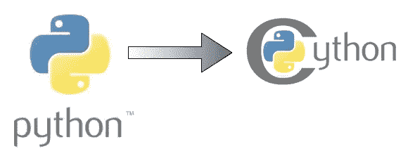
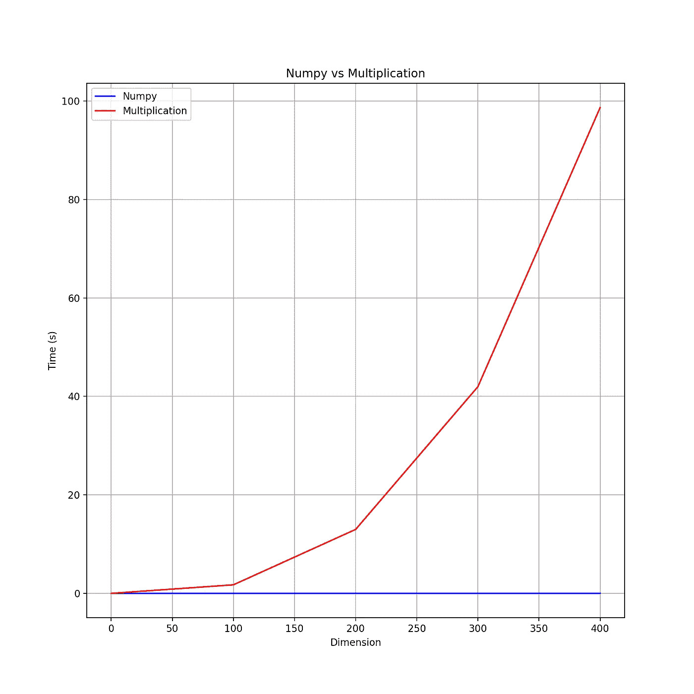
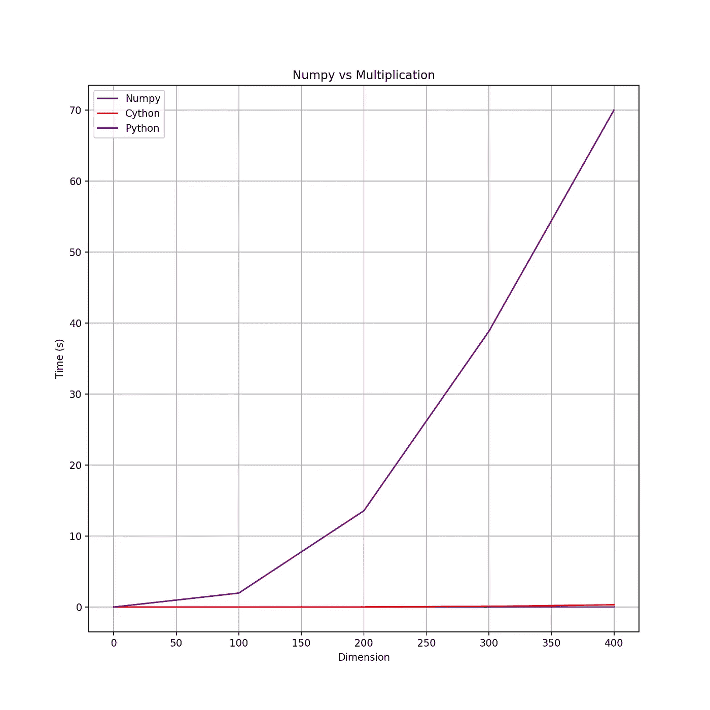

# cy thon——Python 函数的加速工具

> 原文：<https://towardsdatascience.com/cython-a-speed-up-tool-for-your-python-function-9bab64364bfd?source=collection_archive---------8----------------------->

## 当调整你的算法得到小的改进时，你可能想用 Cython 获得额外的速度，cyt hon 是 Python 的 C 扩展。

# 动机

如果你读了我的文章[如何用 Python](/how-to-build-a-matrix-module-from-scratch-a4f35ec28b56) 从头开始创建你自己的矩阵模块，你可能想用你自己的算法创建你自己的矩阵类。这是一个好主意，因为你可以灵活地创建你喜欢的模块。但是在创建多维数组函数之前，您可能想了解 Numpy 和 Python Matrix 类之间的区别。



从空闲编码中检索

# 你为一个矩阵创建一个函数。让我们测试一下

让我们从一个例子开始，帮助你理解 Numpy 和你用 Python 创建的模块之间的区别。

我们期望使用 Numpy 的矩阵乘法将给出与第一个相同的结果。让我们看看它们是否在相同的矩阵维数上给出相同的结果。

创建多个不同维度的矩阵:

```
nump= []
mult=[]
for i in range(0,500,100): nump.append(calculate(npAB,(i,i))) mult.append(calculate(mulAB,(i,i)))
```



Python 实现和 Numpy 之间的性能。在这里找到实现[的](https://github.com/khuyentran1401/Cython/blob/master/MatrixEntries/main01.py)

我们创建了维度为 100x100、200x200、…、500x500 的矩阵。我们可以看到，随着维度的增加，我们的 Python 函数的时间量**呈指数增长**，而 Numpy 可以在几秒钟内完成计算**。如果 Numpy 也是一个 Python 库，它的性能怎么会比我们的 Python 实现好这么多呢？**

# **numpy——不完全是 Python 库**

**Numpy 集成了 C/C++和 Fortran 代码，在处理多维数组而不是使用纯 Python 时提供了高性能。**

**如果你不知道 C 和 Python 的区别，C 是编译语言，Python 是解释语言。虽然变量是在 C 中声明的，但变量不是在 Python 中声明的。这使得 Python 更容易编写，但也带来了成本，Python 需要在每次执行代码时解释变量。因此，对于多维数组，Python 的运行速度比 C 慢得多。**

**如果有一种语言能让你在实现 C 性能的同时使用 Python 语法，那会怎么样？Cython 可以帮助你做到这一点。**

# **Cython 简介**

**Cython 是一个针对 Python 和扩展的 cy thon(T21)的优化静态编译器。最棒的是，它使得编写 C 扩展**的语法像 Python** 本身一样简单。Cython 结合了 Python 和 C 的优势，让您可以高效地与大型数据集进行交互。由于 Cython 将代码降到了机器级别，因此加快了 Python 代码的执行速度。你可以在这里找到 Cython 文档。**

**Cython 的编译扩展包含三个文件:**

*   **主文件**
*   **要在`.pyx`文件中编译的函数**
*   **一个`setup.py`包含制作扩展模块的指令**

## **用 Cython 创建函数文件**

**创建一个名为`mult_fast.pyx`的文件。`.pyx`扩展名用于 Cython 文件**

**通过在可读的 Python synta **x** 中添加静态类型声明，我们可以很容易地将 Python 代码调成普通的 C 性能。这可以简单地通过`cdef` `type` `name` `=` `value`来完成。另外，不要忘记在函数的参数中声明变量。**

```
def mulAB( double[:,:] A , double[:,:] B):
 cdef int Am  = A.shape[0]
 cdef int An  = A.shape[1]
 cdef int Bm  = B.shape[0]
 cdef int Bn  = B.shape[1] cdef int i = 0
 cdef int j = 0
 cdef int k = 0 cdef double temp = 0.0 cdef double[:,:] C = np.empty((Am,Bn), dtype=np.double)
```

**在我们的代码中声明变量之后，我们开始下一行`with nogil.`现在你只需要在这里复制并粘贴你之前创建的函数:**

```
with nogil:
  for i in range(Am):
   for j in range(Bn):
    temp=0.0
    for k in range(An):
     temp += A[i,k] * B[k,j] 
    C[i,j] = temp

 return np.array(C)
```

**将所有东西放在一起:**

**`mult_fast.pyx`文件**

## **建立**

**将该文件另存为`setup.py`。**

**`setup.py`**

**您可以复制并粘贴这个`setup.py`文件作为您未来的 Cython 文件。您唯一需要更改的是`extensions`和`setup` ( `mult_fast` & `[“mult_fast.pyx”]`)中的文件名。**

**在命令行上，键入:**

```
python3 setup.py build_ext --inplace
```

## **最后一次接触 Main.py 文件**

**导入`mult_fast.py`并写入`main02.py`文件**

## **准备好了吗？让我们发射**

****

**我们可以看到 Cython 的性能几乎和 Numpy 一样好。您可能不会选择在小数据集中使用 Cython，但是在处理大数据集时，使用 Cython 来快速完成我们的计算是值得的**

# **结论**

**通过在我们的 Python 代码中进行一点点修改来利用 Cython，我们已经使我们的函数运行得更快了。我希望这篇文章能给你一些想法，让你以更有效的方式创建自己的模块。在这个 [Github repo](https://github.com/khuyentran1401/Cython) 中，您可以随意使用本文的代码。**

**我喜欢写一些基本的数据科学概念，并尝试不同的算法和数据科学工具。你可以通过 [LinkedIn](https://www.linkedin.com/in/khuyen-tran-1401/) 和 [Twitter](https://twitter.com/KhuyenTran16) 与我联系。**

**如果你想查看我写的所有文章的代码，请点击这里。在 Medium 上关注我，了解我的最新数据科学文章，例如:**

**[](/maximize-your-productivity-with-python-6110004b45f7) [## 使用 Python 最大化您的生产力

### 你创建了一个待办事项清单来提高效率，但最终却把时间浪费在了不重要的任务上。如果你能创造…

towardsdatascience.com](/maximize-your-productivity-with-python-6110004b45f7) [](/how-to-build-a-matrix-module-from-scratch-a4f35ec28b56) [## 如何从头开始构建矩阵模块

### 如果您一直在为矩阵运算导入 Numpy，但不知道该模块是如何构建的，本文将展示…

towardsdatascience.com](/how-to-build-a-matrix-module-from-scratch-a4f35ec28b56) [](/choose-stocks-to-invest-with-python-584892e3ad22) [## 用 Python 选择要投资的股票

### 您计划在未来 3 年投资几只股票，每只股票的每一美元都有不同的预期回报…

towardsdatascience.com](/choose-stocks-to-invest-with-python-584892e3ad22)**