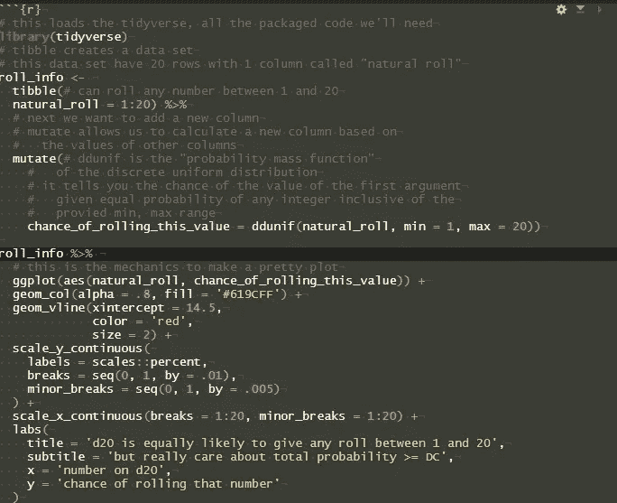
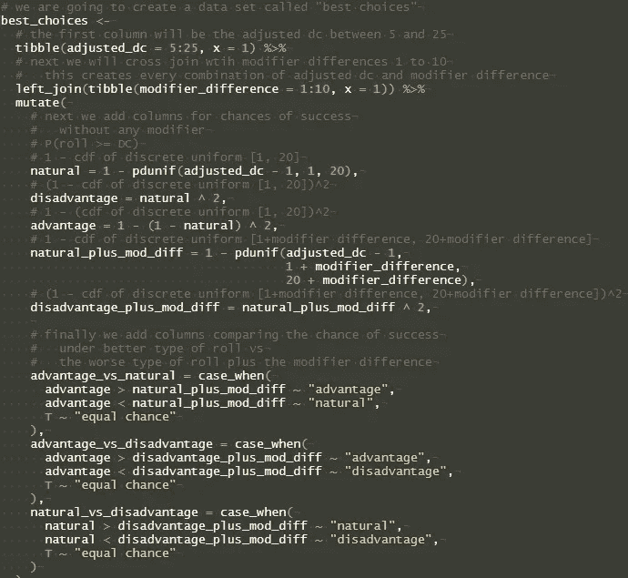
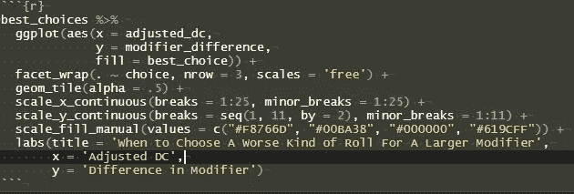
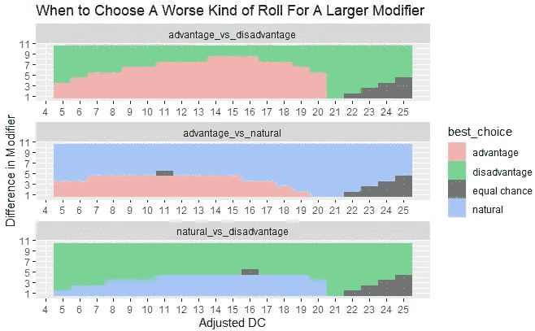

# D&D:什么时候为更大的修改器选择更差的辊型

> 原文：<https://towardsdatascience.com/d-d-when-to-choose-a-worse-roll-type-for-a-larger-modifier-b5a4eb37409d?source=collection_archive---------39----------------------->

## 一种利用 R 和概率的算法

在听 Matt Mercer DM 龙与地下城关于[关键角色](https://critrole.com/)的时候，我有时会听到他给玩家提供一个选择:

1.  使用自然滚动(一个 d20 并取值)+修改器，或
2.  使用一个不利辊(两个 d20，取较低的值)+不同的修改器。

例如，如果你是一个试图攀爬大堆岩石的僧侣，你可以掷出一个顺子运动检定(选项 1。)把自己拉起来。DM 也可能提供你可以滚动一个杂技检查(你有一个更高的杂技调整值，因为你有一个很高的敏捷)，不利条件是沿着岩石跳跃(选择 2。).成功通过检查所需的总值对于任何一次掷骰都是相同的:例如，15(该值称为 DC)。

你该如何选择？嗯，选择*应该*反映你的性格和他们*会*做什么。

但是，如果您想最大化检查成功的机会，那么使用下面的算法。请注意，您也可以想象您可以在 I)优势(两个 d20，取较高值)和自然掷骰之间进行选择，或者 ii)优势和劣势掷骰，因此算法也会考虑这一点。

1.  **估计支票的 DC。作为一名玩家，你可能不知道 DC，但你可以猜测打开沉船上的腐烂木箱可能比打开国王军械库中的坚硬箱子更容易。一般的指导是，简单任务的 DC 在 10 左右(即使不熟练的人也有很大的成功机会)，中等在 15 左右(熟练的人有很大的成功机会)，困难在 20 左右(熟练的人仍然需要一些运气才能成功)，非常困难在 25 左右(熟练的人仍然需要很多运气才能成功)。**
2.  **获得调整后的 DC** : 从检查的 DC 中减去较低的修正值(选择更好的辊型)。以蒙克为例，如果你的杂技成绩为+6，体育成绩为+3，从估计的 DC 15 减去较低的修正值(+3)，得到调整后的 DC 为 12。
3.  **获得不同掷骰类型之间的修改值的差异**:对于我们的僧侣来说是(+6)-(+3) = 3。
4.  **在下面的图表中查找最佳选择**:要找到要查找的地方，首先进入描述你正在做什么决定的面板。例如，和尚正在决定自然掷骰和劣势，这是第三个面板。其次，在 x 轴(12)上找到上一步中计算的调整后的 DC。第三，找出 y 轴上修改器值的差异(3)。找到他们相遇的颜色(在我们的和尚例子中是红点)，并在右边的图例中查找以确定最佳选择。此处为蓝色，表示自然竞技检查比有劣势的杂技检查更有可能成功。

一个很好的经验法则是，如果任务非常困难，你应该愿意降低一个(优势对自然或自然对劣势)或两个(优势对劣势)等级，因为没有额外的修正加成你就没有成功的机会。如果修改量相差 5 或更大，你也应该愿意降一级。

如果你想知道:“这个邪恶的魔法是什么:这个图表是如何创建的？”，请继续阅读。

R +概率=巫师魔法。

让我们从基础开始。当你掷出 d20 时，1 到 20 中的任何一个数字都有 5%的概率被掷出:掷出 d20 是从 1 到 20 之间的离散均匀分布中抽取的。这种分布如下图所示。

然而，我们真正关心的是我们成功的机会:大于或等于 DC 的总机会(例如，垂直红线右侧的条形总面积代表 DC 为 15)。数学上，我们真正关心的是:

如果右边< 0，它应该正好是 0，如果大于 100%，它应该是 100%

这是一个简单的滚动公式。对于两个卷，我们可以利用卷是独立的这一点(所以某件事在两个卷上发生的概率是它在一个卷上发生的概率的平方)代入简单的公式。

现在，我们可以在代码中使用这些公式来确定应该为每个修改器差异和调整后的 DC 选择哪种类型的滚转。

上面创建的数据集如下所示。前两列显示神奇图表的 x 轴和 y 轴(调整后的 DC 和修改器差异)。下面显示的接下来的 4 列是通过某种类型的滚动检查的概率。下面显示的最后 3 列告诉您选择哪种类型的掷骰子来最大化成功的概率。

然后，我们可以透视这些数据，使其更容易绘制。

最后，我们可以将数据送入图表。

神奇！