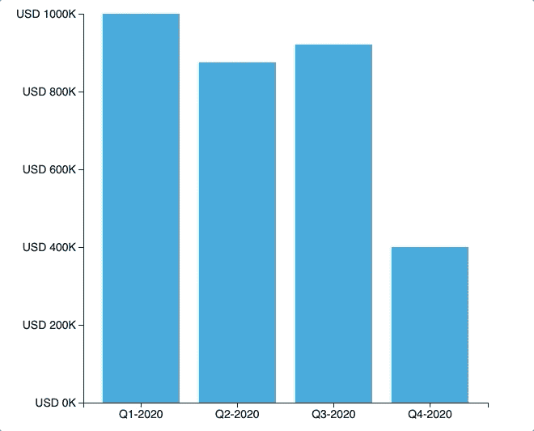
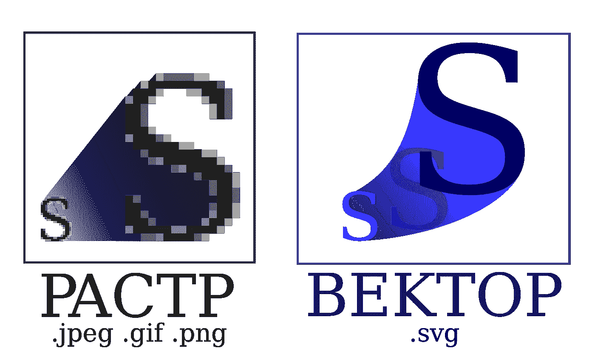
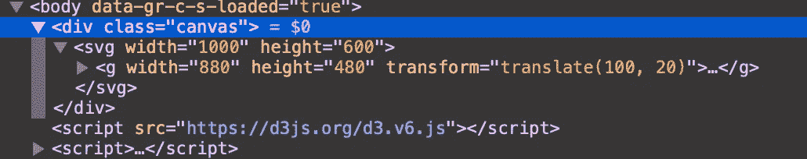

# D3.js —如何用最强大的可视化库制作漂亮的条形图

> 原文：<https://towardsdatascience.com/d3-js-how-to-make-a-beautiful-bar-chart-with-the-most-powerful-visualization-library-9bea4e00349a?source=collection_archive---------9----------------------->

## 让我们做一个你不会羞于展示的形象。

选择一个首选的数据可视化库比看起来要困难得多。有这么多可供选择，尤其是如果你考虑到不同的语言。我大部分时间都在使用 *Python* 中的 *Plotly* 和 *Matplotlib* ，但是今天我们将尝试一些不同的东西——[D3 . js](https://d3js.org)，用——你已经猜到了——*Javascript*编写。


由 [Kelly Sikkema](https://unsplash.com/@kellysikkema?utm_source=medium&utm_medium=referral) 在 [Unsplash](https://unsplash.com?utm_source=medium&utm_medium=referral) 上拍摄的照片

让我们解决几件事情。首先，我不是一个 JavaScript 专家，所以没有必要指出有些东西没有被优化。第二，这个库非常冗长，我花了将近 100 行代码来制作一个看起来不错的条形图。

这并不一定是一件坏事，因为你可以定制每一个可视化的地狱。在继续之前，让我们快速看一下最终结果:



作者图片

这种颜色变化发生在悬停时，所以不，这不是任何类型的故障。可视化相当简单，但需要大量的工作。在继续编写代码之前，让我们稍微讨论一下 *D3* 。

# 那么，D3.js 是什么？

*D3* 代表*数据驱动文档*。以下是来自[官方文档页面](https://d3js.org)的声明:

> D3 帮助您使用 HTML、SVG 和 CSS 将数据变得生动。D3 对 web 标准的重视使您可以获得现代浏览器的全部功能，而无需将自己束缚于专有框架，将强大的可视化组件和数据驱动的 DOM 操作方法结合起来。

厉害！那么，用它有什么意义呢？

我特别喜欢的一个特性是 *D3* 输出的是 SVG 而不是 Matplotlib 输出的 png。我的目的不是用三个字母的缩写来迷惑你，所以我不会深究 SVG 和 PNG 的区别。

这是你现在应该做的唯一一件事**(首先)——SVG 用于绘制矢量图形，这意味着没有像素，这进一步意味着我们在缩放时不会损失质量。但巴布亚新几内亚的情况并非如此。**

**以这张图片为例:**

****

**来源:[维基共享资源](https://commons.wikimedia.org/wiki/File:Bitmap_VS_SVG_ru.svg)**

**图像说明了一切。**

**现在让我们制作图表。请注意，这将是一个很大的工作量。**

# **让我们做一个图表**

**首先是数据。我们将以 *JSON* 格式存储一些虚拟数据。我把我的名字命名为`sales.json`，它看起来像这样:**

```
[
  {“Period”: “Q1–2020”, “Amount”: 1000000},
  {“Period”: “Q2–2020”, “Amount”: 875000},
  {“Period”: “Q3–2020”, “Amount”: 920000},
  {“Period”: “Q4–2020”, “Amount”: 400000}
]
```

**数据到此为止。接下来，我们需要 *HTML* 文件。如果你不知道 *HTML* ，不要担心，因为它相当简单，我们不会在它上面花太多时间。**

**为了简单起见，我决定将 *CSS* 和 *JavaScript* 嵌入到 *HTML* 文件中，但是如果您愿意，可以随意将它们分开。我的档案名为`barchart.html`:**

```
<!DOCTYPE html>
<html lang=”en”>
<head>
  <meta charset=”UTF-8">
  <meta name=”viewport” content=”width=device-width, initial-scale=1.0">
  <title>D3.JS Bar Chart</title>
</head>
  <style>
    rect.bar-rect { fill: #189ad3; }
    rect.bar-rect:hover { 
      fill: #107dac;
      transition: all .2s;
    }
  </style><body>
  <div class=”canvas”></div>
  <script src=”https://d3js.org/d3.v6.js"></script> <script>
    // Everything else will go here
  </script></body>
</html>
```

**这是一个入门模板。不要担心 *CSS* ，我只是用它来给正常状态和悬停状态的条着色。**

**我们现在可以从图表本身开始了！**

## **一点准备**

**让我们开始真正的交易。我们的图表部分需要一些维度信息，比如宽度和高度。此外，我们不想让图表占据整个图表部分，所以我们需要在顶部、右侧、底部和左侧添加一些边距。**

**为此，我们将设置几个常数:**

```
const width = 1000;
const height = 600;
const margin = {‘top’: 20, ‘right’: 20, ‘bottom’: 100, ‘left’: 100};
const graphWidth = width — margin.left — margin.right;
const graphHeight = height — margin.top — margin.bottom;
```

**我认为这些都是不言自明的。如果不是，这里有一个快速澄清:**

*   **整个图表区将占据 1000 x 600 像素**
*   **图表本身将位于图表区内，并且四周都有边距**
*   **底部和左侧的边距较大，因为我们将把轴放在那里**

**就这么简单。我们继续吧。**

## **初始设置**

**好了，我们准备好开始有趣的部分了。我们需要以某种方式选择类别为`canvas`的`div`，因为我们的图表将存储在那里。在其中，我们将创建一个`svg`(记住 *D3* 输出 SVG)并将它的高度和宽度设置为之前声明的值。**

**接下来，我们可以将图形元素插入到`svg`元素中，并将其尺寸设置为之前声明的尺寸。我们不希望它从`svg`的左上角开始，所以我们需要相应地`translate`它。**

**最后，我们可以为 X 和 Y 轴组声明常量(暂时不用担心这些)。**

**代码如下:**

```
const svg = d3.select(‘.canvas’)
  .append(‘svg’)
  .attr(‘width’, width)
  .attr(‘height’, height);const graph = svg.append(‘g’)
  .attr(‘width’, graphWidth)
  .attr(‘height’, graphHeight)
  .attr(‘transform’, `translate(${margin.left}, ${margin.top})`);const gXAxis = graph.append(‘g’)
  .attr(‘transform’, `translate(0, ${graphHeight})`);const gYAxis **=** graph.append('g')
```

**如果你现在打开 *HTML* 文件，你什么也看不到，但这并不意味着什么也没发生。只需弹出控制台，进入元素检查器。以下是您应该看到的内容:**

****

**厉害！接下来让我们完成这件事。**

## **绘制图表**

**现在你期待已久的时刻到了。我们还有很多事情要做，所以让我们开始吧。**

**首先，我们需要以某种方式读取我们的 *JSON* 数据。然后，我们将分别在常量`x`和`y`中声明比例，这些是为了确保单个的条不会意外溢出`svg`容器。**

**接下来，我们需要为数据集中的每个条目创建一个`rect`元素(矩形)。每个矩形都有它的高度和宽度，X 和 Y 值，我们还为它添加了一个自定义类，这样就可以更容易地使用 *CSS* 进行样式化。**

**在完成`enter`功能后，需要做几乎相同的事情，然后我们可以按照自己的意愿设置轴。**

**我们的图表在 Y 轴上只有 5 个刻度，同一轴上的值将被格式化为货币。是的，轴标签大小设置为 14。**

**要写的代码很多，所以要花时间去理解每个部分的作用:**

```
d3.json(‘sales.json’).then(*data* => {
  const y = d3.scaleLinear()
    .domain([0, d3.max(data, *d* => d.Amount)])
    .range([graphHeight, 0]); const x = d3.scaleBand()
    .domain(data.map(*item* => item.Period))
    .range([0, 500])
    .paddingInner(0.2)
    .paddingOuter(0.2); const rects = graph.selectAll(‘rect’)
    .data(data); rects.attr(‘width’, x.bandwidth)
    .attr(‘class’, ‘bar-rect’)
    .attr(‘height’, *d* => graphHeight — y(d.Amount))
    .attr(‘x’, *d* => x(d.Period))
    .attr(‘y’, *d* => y(d.Amount)); rects.enter()
    .append(‘rect’)
    .attr(‘class’, ‘bar-rect’)
    .attr(‘width’, x.bandwidth)
    .attr(‘height’, *d* => graphHeight — y(d.Amount))
    .attr(‘x’, *d* => x(d.Period))
    .attr(‘y’, *d* => y(d.Amount)); const xAxis = d3.axisBottom(x);
  const yAxis = d3.axisLeft(y)
    .ticks(5)
    .tickFormat(*d* => `USD ${d / 1000}K`); gXAxis.call(xAxis);
  gYAxis.call(yAxis); gXAxis.selectAll(‘text’)
    .style(‘font-size’, 14);

  gYAxis.selectAll(‘text’)
    .style(‘font-size’, 14);
});
```

**如果您现在刷新 HTML 页面，您会看到页面上显示了一个图表。不仅如此，我们还增加了不同的颜色。不错！**

**今天到此为止。让我们在下一部分总结一下。**

# **在你走之前**

**D3.js 需要大量代码——这一点毋庸置疑。但这正是它的特别之处——完全定制一切的能力。我们在这里仅仅触及了表面，调整的选项是无穷无尽的。**

**如果你喜欢这篇文章，请告诉我，因为我打算做一个关于图书馆的完整系列。**

**感谢阅读。**

## **加入我的私人邮件列表，获得更多有用的见解。**

***喜欢这篇文章吗？成为* [*中等会员*](https://medium.com/@radecicdario/membership) *继续无限制学习。如果你使用下面的链接，我会收到你的一部分会员费，不需要你额外付费。***

**[](https://medium.com/@radecicdario/membership) [## 通过我的推荐链接加入 Medium-Dario rade ci

### 作为一个媒体会员，你的会员费的一部分会给你阅读的作家，你可以完全接触到每一个故事…

medium.com](https://medium.com/@radecicdario/membership)**