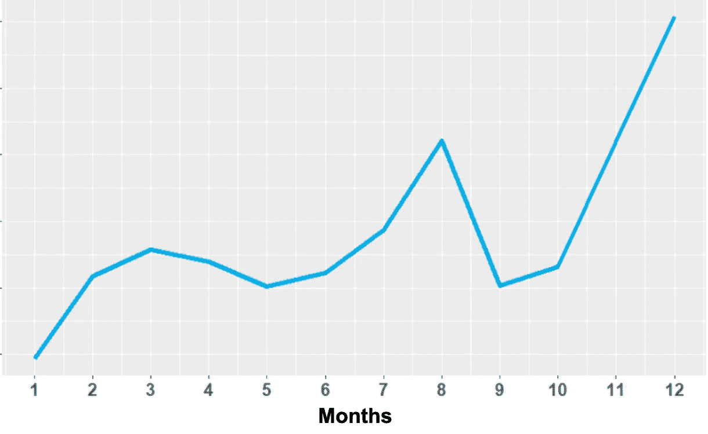
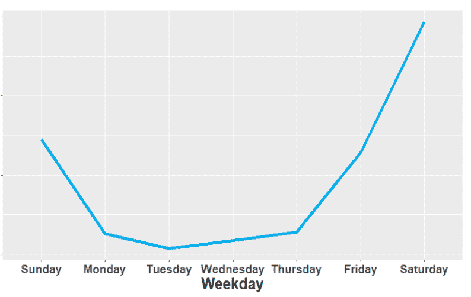
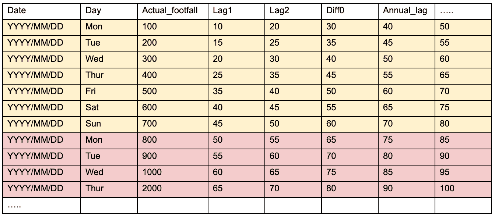
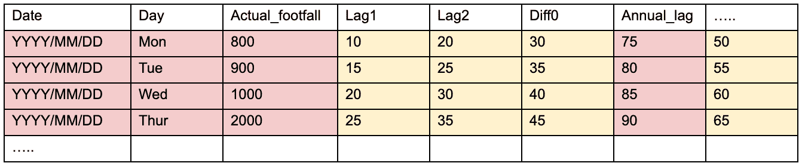

# 基于随机森林的日客流量预测

> 原文：<https://towardsdatascience.com/daily-footfall-prediction-with-random-forest-8c9ff5630a4c?source=collection_archive---------45----------------------->

探索时间序列预测 ML 模型的一种简单方法。

图片来源于[期限](https://tenor.com/view/klok-tijd-gif-10172314)

# 介绍

在搜索时间序列预测时，你一定遇到过许多传统的方法，如萨里玛，STLM，先知等。但是你知道吗，有强大的机器学习技术也可以很好地处理一些数据操作。

而随机森林和其他基于决策树的模型没有考虑时间序列数据的基本概念，如趋势、季节性等。，有一些方法可以生成捕捉这些模式的预测变量。

有无数的资源解释如何使用随机森林进行多步时间序列预测。在这篇博客中，我将解释(用简单的步骤)我如何使用特征工程和单变量时间序列数据的直接预测方法来实现我的项目目标——预测未来 91 天(即未来 13 周)零售店的客流量。我决定采用随机森林集合模型，因为它很健壮，在大多数情况下表现良好。

对于模型评估，我使用了两个误差指标——均方根误差(RMSE)和平均绝对百分比误差(MAPE)。

> 虽然 NDA 禁止我分享明确的数字结果和图表，但我将解释我采取的步骤，以建立一个工作模型，该模型后来包括在最终的预测工具中。

# 模型组成

## 数据处理

任何机器学习建模的第一步都是留出一个维持集。时间序列数据上的训练测试分割不能随机执行，因此我使用我的数据集中最近的 91 个日期作为测试数据，用于基于前述误差度量的最终评估。

RF 通过丢弃数据点或通过某种形式的插补来处理缺失值。平均似乎是一种自然的方式。然而，使用整个时间序列的平均值没有逻辑意义。因此，对于缺失值的处理，我使用了该周的平均客流量。

## 特征工程

时间序列预测使用按时间顺序排列的历史数据来预测未来可能的结果。我使用特征工程从历史数据中创建预测变量，这将帮助我捕捉数据中的趋势和季节性。

如图表所示，在零售商店数据中观察到年度和周末季节性，即周末客流量较高，节假日期间出现年度高峰(如预期)。

年度客流量趋势(示例)，来源于作者

每周客流量趋势(示例)，来源于作者

对在数据中观察到的这些模式进行编码的一种简单方法是建立一个学习函数模型，该学习函数将一周中任何给定的一天*和*的预期客流量预测为过去 N 周中在该天观察到的客流量的函数。例如，为了计算未来“星期五”的预期客流量，使用了过去 *N* 个星期五的数据。可以相应地选择超参数 *N* 的接近最优的值。我使用了基于网格搜索的方法，并选择了给出最佳 RMSE 的 N 值。用于此目的的验证数据是训练集中最近 91 天的数据。以下是我为此模型创建的预测变量:

***N-滞后周*** :在历史数据中找到要查看的最佳周数后，我创建了滞后变量(lag1，lag2…，lagN)来表示每周的滞后。这有效地捕捉到了工作日/周末对商店客流量的影响。 *N* 的值越大，创建的滞后变量的数量就越多，这直接抵消了训练数据点的数量。因此，我们可以使用多大的 N 是一个权衡。

1.  ***滞后的差异*** :我也创建了差异变量。这些是上面定义的连续周滞后之间的差异。它们捕捉特定一天的几周内的运动，并帮助稳定时间序列数据的平均值和方差。示例— diff0 = lag2 — lag1，…。
2.  ***滞后平均*** :我计算了滞后变量的移动平均窗口，并将其作为独立变量，以描述特定日期的平均客流量。
3.  ***年度滞后*** :为了捕捉数据中的季节性，即一年中的时间对预测日的预期客流量的影响，我计算了可用历史数据的平均每周客流量。例如，如果预测了属于一年中第*I*周的某一天的客流量，则年度滞后对应于过去所有年份中第*I*周观察到的平均客流量。我使用了周平均值，而不是过去几年的确切日期，因为一周中的某一天不会保持不变，我们观察到了零售业的周末效应。
4.  ***黑色星期五和感恩节虚拟变量*** :这是零售业中两个非常重要的节日，从历史数据中，人们很容易得出结论，这些日期每年都是明显的异常值。因此，它们需要分开处理，以免扭曲模型预测。我使用二进制指示变量来表示这种异常行为，以便允许被训练的模型推断出所述相关性。

## 直接预测

对于这个多步预测问题，我使用了“直接预测”技术，而不是递归预测。在递归预测中，创建单个模型，并将来自前一步骤的预测用作输入，而在直接预测中，为未来的每个范围创建单独的模型，即 *h* 单独训练的随机森林模型，用于预测未来的 *h* 范围。

虽然直接预测在计算上是昂贵的(并且随着预测时间范围的增加而更加耗时)，但是它不必处理预测误差的聚集或者在长时间范围内收敛到无条件的平均值。然而，建立一个直接预测模型并不简单。对于未来的每一步，都需要相应地设计培训数据，如下例所示:

对于 horizon = 1，我使用实际客流量作为目标结果，并使用其他变量以如下方式训练第一个模型:

训练矩阵示例(地平线=1)，来源于作者

对于 horizon = 2，我从 actual footfall 列中删除了最顶端一周的目标值，并根据以下内容训练模型，从而有效地增加了基于 horizon 的前瞻:

训练矩阵示例(地平线=2)，来源于作者

变量的这种移动背后的原因在于，通过用对应于新的范围步长的观察值，即在这种情况下下周的目标值，替换目标变量(actual_footfall ),来自一个模型(预测范围 h+1)的特征被用于训练下一个模型。

为每个层位重复创建预测值和目标变量的过程。为了便于使用，我在 13 个预测变量矩阵(x_train)和 13 个目标向量(y_train)上为 13 个层位中的每一个创建了迭代表。

为了预测未来的每个层位，还需要设计相应的测试数据集。直接预测的 X_test 矩阵特征保持不变(平均年度滞后除外)，这是 x_train 矩阵的最后 7 行。我使用这些最新观察到的日期和创建的特征来预测所有未来的步骤。为了便于使用，我在 x_test 矩阵上创建了一个 iterable，它对应于只改变年度滞后变量(如前所述，它是针对一年中的每一周进行预处理的)的每个时间范围。

现在，训练和测试数据以方便的数据结构的形式准备好了，我循环这些数据，并为每个地平线训练了一个随机森林集合。然后，这些模型被用于预测 7 天内目标时间段的商店客流量，并在测试集上进行评估。

# 结论

这个模型是经过严格的验证和调整而创建的，同时始终牢记客户目标。每一步都设计有意义的特征并提高模型效率，这是一种很好的学习体验。我们最终的工作原型是一个集成学习模型，包括 RF 和传统的时间序列分析技术。这种模型在现实世界中的应用非常广泛。它不仅可以扩展到预测健身房和餐馆等商业场所的客流量，还可以预测网站/网络应用程序的活动和流量。

## 参考

*   随机森林时间序列预测，[https://www . r-bloggers . com/time-series-forecasting-with-Random-Forest/](https://www.r-bloggers.com/time-series-forecasting-with-random-forest/)
*   对时间序列数据使用随机森林，[https://stats . stack exchange . com/questions/384924/using-a-random-forest-for-time-series-data](https://stats.stackexchange.com/questions/384924/using-a-random-forest-for-time-series-data)
*   直接预测 vs 递归预测，[https://insightr . WordPress . com/2018/01/10/direct-Forecast-x-Recursive-Forecast/](https://insightr.wordpress.com/2018/01/10/direct-forecast-x-recursive-forecast/)