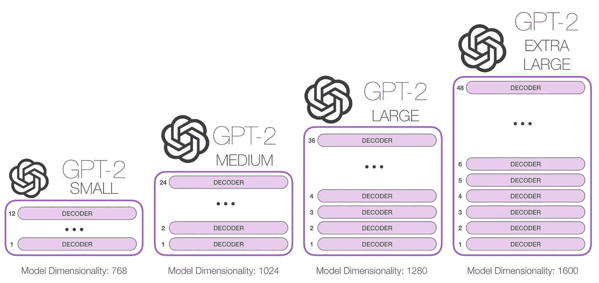
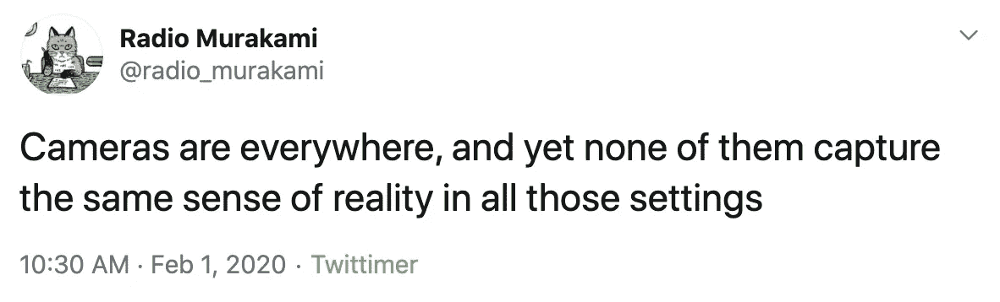
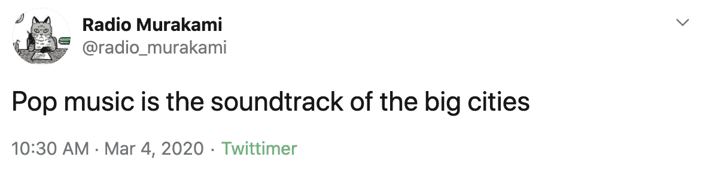
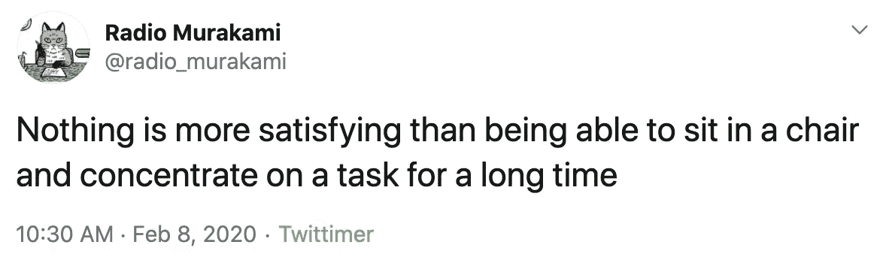
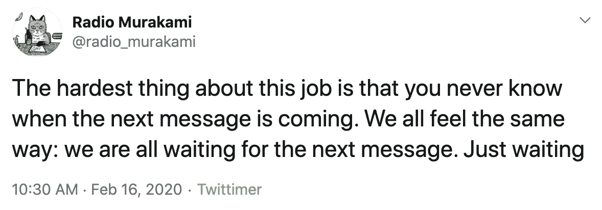
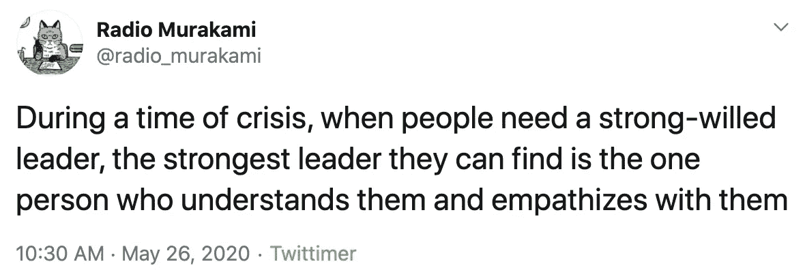
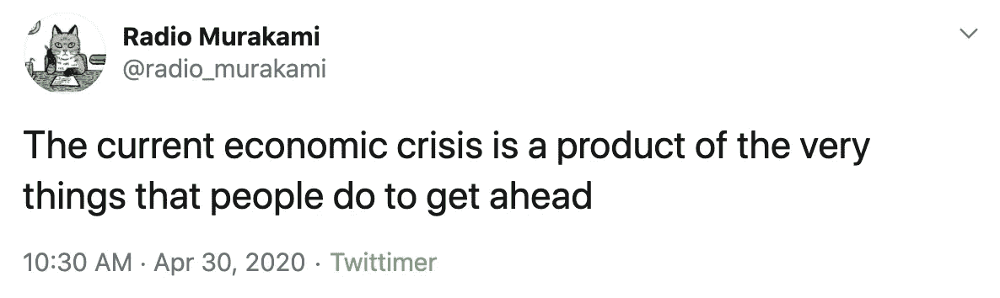

# 使用深度学习的你最喜欢的作者的每日励志语录

> 原文：<https://towardsdatascience.com/daily-inspirational-quotes-from-your-favorite-author-using-deep-learning-73534c55ed96?source=collection_archive---------26----------------------->

## 自然语言处理

## 这个字幕是从机器人的输入中生成的。你永远不知道你会得到什么！

机器人的印刷设计。更多详情请访问:[https://radiomurakami.live/](https://radiomurakami.live/)

我一直是日本文学的狂热爱好者，而[村上春树](https://en.wikipedia.org/wiki/Haruki_Murakami)作为当代最著名的日本作家在我脑海中浮现。

村上的故事经常有非常生动和巧妙的场景描述，尽管日常生活平淡无奇。这不仅体现在他的小说中，也体现在他的短篇小说和沉思中，比如他的系列丛书[村上广播](https://www.goodreads.com/search?q=%E6%9D%91%E4%B8%8A%E3%83%A9%E3%83%82%E3%82%AA&qid=)(巧合的是，我们的机器人名字的由来)。

对我来说，这是一种非常强烈的认同感:在他选择用来描述他的角色和他们所处的环境的词语中，有一种人性的本质。

让我思考的是他的风格是否可以被效仿。由于他的许多作品还没有被翻译成英语，尤其是他的幽默短文，如果我们能有一个机器人像你最喜欢的作者一样写作，每天都从谁那里得到灵感，那不是很好吗？如果村上自己能够发现自己的“日语风格”，用有限的一组单词和语法结构表达自己的感情和思想，但以熟练的方式有效地将它们联系起来，那么机器能从这种模式中学习并创作简单而美丽的短语吗？

我和我的朋友保罗·图恩(Paul Tune)认为，尝试使用 GPT 2 号来制作一个村上机器人，以捕捉他的语气和风格，这将是一个有趣的项目，所有这些都在 Twitter 的角色限制之内。

在介绍了这个想法的概述之后，在本文的剩余部分，我将详细介绍村上电台机器人的开发过程，从原始数据收集，使用 GPT-2 的训练，迭代和展示机器人的一些深刻和相关的推文。

还有，是真的:**字幕是我们 bot 生成的！**

# 村上春树小传

西方世界的大多数读者对村上春树并不熟悉。

村上于 1949 年出生在京都，当时正值二战后的经济繁荣时期。他一直热爱音乐，尤其是爵士乐，于是和妻子在东京开了一家爵士酒吧。他经营酒吧 7 年了。

作为一个孩子，村上阅读了许多西方作品，从卡夫卡，狄更斯到库尔特·冯内古特。他的短篇小说之一《恋爱中的萨姆莎》是卡夫卡的《T2》中的主人公格雷戈·萨姆莎的故事的续集。

村上的写作生涯在 29 岁才开始，正如他在文章《我成为小说家的那一刻》[中描述的那样。1978 年 4 月一个晴朗的下午，在养乐多燕子队和广岛鲤鱼队的棒球比赛中，他说](https://lithub.com/haruki-murakami-the-moment-i-became-a-novelist/)

> “球棒碰到球时令人满意的爆裂声响彻整个金谷体育馆。我周围响起了零星的掌声。在那一瞬间，没有任何理由，也没有任何理由，我突然想到:我想我可以写一本小说了。”

比赛结束后，他去新宿买了信纸和钢笔。半年后，他的第一部小说《听风吟》于 1979 年出版。

村上只是在 1988 年的作品《挪威的森林》中有了重大突破，这首歌是对约翰·列侬同名歌曲的引用。它很受年轻日本人的欢迎，并最终被翻译成英语，面向西方观众。

# 准备数据

可以说，任何数据科学项目中最乏味和最具挑战性的部分是数据的准备。在这种情况下，这没有什么不同。

我们几乎搜索了整个网络，寻找任何可用的英文采访，因为我们希望机器人能够直接接触村上来说话和写作。我们拥有的培训数据包括:

*   村上所有的小说都有，比如 [1Q84](https://www.goodreads.com/book/show/10357575-1q84) 和著名的[挪威的森林](https://www.goodreads.com/book/show/11297.Norwegian_Wood?from_search=true&from_srp=true&qid=33rRMLaJvl&rank=1)
*   发表在[纽约客](https://www.newyorker.com/contributors/haruki-murakami)上的短篇小说
*   村上的采访(这样机器人可以学习第一人称视角)
*   来自 [Goodreads](https://www.goodreads.com/author/quotes/3354.Haruki_Murakami) 和[报价目录](https://quotecatalog.com/communicator/haruki-murakami/)的 Twitter 格式报价(这是为了确保模型将学习适应 Twitter 风格的写作格式，而不是长格式文本)

这里有一个警告。村上的所有作品都被不同的人从日语翻译成英语。因此，日语中句子的原始含义和微妙的选词可能无法完全捕捉到，这可以说是日语的著名之处。

幸运的是，村上春树的风格比他的同行更西化，这意味着用英语捕捉意思可能不像其他日本作家那样困难。

为训练收集的整个数据集超过 10 MB，并通过从采访和引用中删除任何非英语、非村上相关的文本来进一步手动清理。Goodreads 上的用户选择的引用中也有很多重复，我们必须审查并删除。我们还有一套单独的培训报价，我们将在下面解释。

# 训练模型

这里我们使用由 [OpenAI](https://openai.com/) 开发的 [GPT-2](https://openai.com/blog/better-language-models/) 模型，这是一个因果(单向)转换器，在 800 万个网页和来自[普通抓取](https://commoncrawl.org/)的超过 15 亿个参数的数据集上进行预训练。GPT-2 经过训练，目标是预测句子中的下一个单词，这与我们手机上的自动完成功能非常相似，但方式更复杂。

因果方向意味着模型可以通过预测给定单词的下一个单词来按顺序生成文本！完美的机器人。

与自动完成功能不同，GPT-2 可以处理**句子上下文**，这允许它知道一个单词在句子中使用时的差异。以下列句子中的单词 **fly** 为例，

> “这只苍蝇掉进了餐馆的汤里。”

和

> 飞机的发明让人们能够飞行

在这种情况下，虽然单词 fly 拼写相同，但一个表示昆虫(名词)，而另一个表示动作(动词)。通过对整个句子和段落的训练，GPT-2 学习上下文，允许它区分像 **fly** 这样的词在不同上下文中的使用。这是一个同音异义词的例子，这个词听起来一样，但意思不相关。基于单词的模型(如 Word2Vec)无法捕捉这样的上下文。

我们使用具有 345M 参数的中等大小的 GPT-2 来训练村上广播机器人。下图显示了不同尺寸的 GPT-2 模型之间的区别:

来源:http://jalammar.github.io/illustrated-gpt2/

模型训练中最难的部分已经在预训练的模型中完成了，GPT-2 已经很好地掌握了英语。它将文本输入作为一个符号序列，并预测序列中的下一个输出符号，每个符号都有一个概率作为权重，这样以一种**自我监督的方式**学习。如果你有兴趣了解更多关于该模型如何工作的信息，[杰伊·阿拉姆马](https://twitter.com/JayAlammar)有一篇图文并茂的文章，可视化了 GPT-2 的底层机制。

最初，训练包括编写一个被 Max Woolf 的[作品破坏的脚本，但是随着从](https://github.com/minimaxir/gpt-2-simple)[拥抱脸](https://huggingface.co/)的[变形金刚](https://github.com/huggingface/transformers)包中逐渐改进的功能，我们使用这个[脚本](https://github.com/huggingface/transformers/blob/master/examples/language-modeling/run_language_modeling.py)进行训练。该包还具有使从训练模型中采样变得容易的功能。

训练模型很简单:我们所要做的就是将数据集加载到模型中。用了大约 8 个纪元左右，模型就被训练好了，可以部署了！

# 重复

其中一个主要的挑战是将报价降低到 Twitter 大小的报价。这比预期的要困难得多。一旦我们的初始模型在小说上得到训练，它就会学习如何从小说中生成散文，而不是我们想要的简洁的推文。

这是一个新训练模型的输出示例:

> 阳光照射下来，空气中弥漫着花香。我可以看到海岸平缓的曲线，白色的沙滩。海浪的声音，树叶的沙沙声，远处蝉的叫声。”

虽然这在村上小说中是一个很好的描述性填充，但它却是一个糟糕的引语生成器！我们必须生成、审查和管理更多的样本，以获得我们想要的使用这个初始模型的机器人。

为了做得更好，我们挑选了一组具有类似 tweet 特性的报价作为我们的数据集。通过在该数据集上训练模型，该模型能够产生更高质量的输出。在此之前，该模型用于生成看起来像村上小说中的散文样本的摘录。现在它产生了一个引用，有人会从小说中挑选出来。我们还通过将模型产生的最佳结果放入模型的下一次训练中进行了试验，这似乎有所帮助，尽管我们意识到了自我强化的偏差。

即便如此，要找到多少有些深刻的引语还是很难，更难的是要找到一个让村上引以为豪的引语。目前，我们仍然以人为本进行治疗，但目前仍在试验更先进的方法。

# 结果

目前，村上广播机器人的推文是由经过训练的 GPT-2 模型生成的。我们使用种子文本作为手动输入，然后由我们对完整的句子进行半策划。像村上一样，它在推特上发布有趣的日常生活描述和其他思考。

以下是我们最喜欢的一些:

来源:[https://Twitter . com/radio _ Murakami/status/1223388001100804099](https://twitter.com/radio_murakami/status/1223388001100804099)

来源:[https://Twitter . com/radio _ Murakami/status/1234984420278325248](https://twitter.com/radio_murakami/status/1234984420278325248)

来源:[https://Twitter . com/radio _ Murakami/status/1225924725437804544](https://twitter.com/radio_murakami/status/1225924725437804544)

来源:[https://Twitter . com/radio _ Murakami/status/1228823823916683264](https://twitter.com/radio_murakami/status/1228823823916683264)

它有时也能讨论时事，尽管是以一种微妙的方式:

来源:[https://Twitter . com/radio _ Murakami/status/1265077706053554178](https://twitter.com/radio_murakami/status/1265077706053554178)

来源:[https://Twitter . com/radio _ Murakami/status/125565622932074503](https://twitter.com/radio_murakami/status/1255655622932074503)

如果你想每天收到一些村上的美食，你可以点击这里的机器人[🤖！](https://twitter.com/radio_murakami)

# 未来的工作

还有一些我们想看的东西—

*   我们肯定可以在选择最佳推文方面实现更多自动化。做到这一点的一个方法是使用另一个模型，如 [BERT](https://github.com/google-research/bert) 作为鉴别器来改进 tweet 生成模型。我们目前正在对此进行试验。
*   我们将更具启发性的报价与设计捆绑在一起，这意味着必须引入与报价相关的图像，并相应地调整它们的大小。这需要一定程度的努力，但是这里的一些自动化也是可能的！
*   如果你想参与这个项目，或者对机器人引用的设计师质量的印刷品感兴趣，请在这里注册[在不久的将来获得更多更新！](https://radiomurakami.live/)

*另外，写这篇文章的时候，我正在欣赏这个* [*播放列表*](https://open.spotify.com/playlist/7LxqhxqClpyc76C85V7Zs2?si=uPpo5mSPQtmx58XRPu1ZbA) *。希望你也会喜欢🎧*

这首曲子是和[保罗·图恩](https://medium.com/u/3f15d28c014e?source=post_page-----73534c55ed96--------------------------------)合著的。你可以在 [Twitter](https://twitter.com/ptuls) 上关注他，或者查看他的个人[网站](http://paultune.com)！

# 参考

[1]a .，Wu J .，Child R .，Luan D .，Amodei D .，Sutskever I .，“语言模型是无监督的多任务学习器”，2019。([链接](https://d4mucfpksywv.cloudfront.net/better-language-models/language_models_are_unsupervised_multitask_learners.pdf))

[2] Alammar J .，“图解 GPT-2(可视化变压器语言模型)”，2019。([链接](http://jalammar.github.io/illustrated-gpt2/))

[3] Anderson A .，Maystre L .，Mehrota R .，Anderson I .，Lalmas M .，“算法对 Spotify 上消费多样性的影响”，WWW '20，2020 年 4 月 20–24 日，台湾台北，第 2155–2165 页。([链接](https://dl.acm.org/doi/pdf/10.1145/3366423.3380281))

[4] Devlin J .，Chang M. W .，Lee K .，Toutanova K .，“BERT:用于语言理解的深度双向转换器的预训练”，2018。([链接](https://arxiv.org/abs/1810.04805))