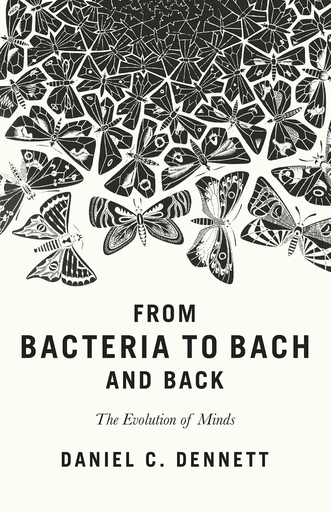
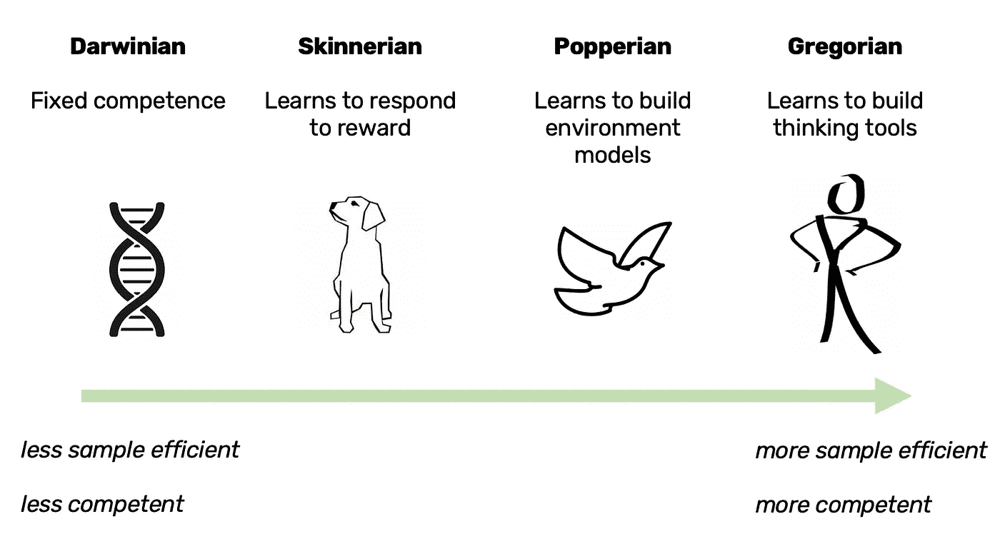

# 丹尼尔·丹尼特的四种能力

> 原文：<https://towardsdatascience.com/daniel-c-dennetts-four-competences-779648bdbabc?source=collection_archive---------31----------------------->

## 理解计算控制算法的一个有用的想法

2018 年，在安纳普尔纳赛道徒步旅行时，我读了丹尼尔·c·丹尼特(Daniel C. Dennett)的 [*从细菌到巴赫，再回到*](https://en.wikipedia.org/wiki/From_Bacteria_to_Bach_and_Back) *。*我后来仔细研究了它，我期待着重读它。

在书中，丹尼特介绍了能力的四个等级。他们描述了四种逐渐胜任的智能，这四种智能通过连续的试错学习来学习。

这四种能力并不是这本书的中心思想。我在这里介绍它们，因为我发现它们对我理解计算控制算法非常有价值。

它们对教学也很有用。他们通过渐近性能和采样效率来组织计算控制算法。这四种能力还允许对细胞、动物或人类等与不太熟悉的计算算法相关的例子进行分类。

但是我们所说的能力到底指的是什么呢？

# 什么是能力？

**能力就是表现良好的能力**。它是一个代理与它的环境交互以实现目标的能力。

**能力可以和理解力相对比，理解力是理解的能力**。两者一起形成了一个有用的智能分解。

能力允许代理人进行控制——与系统交互并产生结果。这种能力的来源是通过试错从经验中学习。我们称之为进化学习。

# 进化学习

> *也许黑客应该表现得更像画家，定期从头开始*
> 
> *保罗·格拉厄姆*

进化学习是试错学习。**这是使用生成、测试、选择循环的迭代改进**:

*   使用前面步骤中的信息生成群体
*   **通过与环境的相互作用来测试人口**
*   **为下一步选择**当前世代的群体成员

它是我们宇宙中的驱动力，不依赖于底物。它发生在生物进化、商业、训练神经网络和个人发展中。

从进化学习中可以学到很多东西:

*   低层次的失败推动更高层次的改进
*   迭代改进的有效性
*   二元(代理人和环境)观点的需要使它起作用，与非二元性的真理不一致

这些都是以后要探索的课程。目前，我们关注的是能力的四个等级。

# 四种能力

**四种能力是进化学习的连续应用**。每个代理都拥有能力较差的代理所拥有的所有能力。

**第一等级是达尔文式的**。该代理具有预先设计和固定的能力。它在其生命周期内不会改善。通过选择，通常基于单个数字，在代理的整个生命周期中聚合，改进在全局范围内发生。

生物学的例子包括细菌和病毒。计算实例包括 [CEM](https://en.wikipedia.org/wiki/Cross-entropy_method) ，进化算法如 [CMA-ES](https://en.wikipedia.org/wiki/CMA-ES) 或遗传算法。

**第二个是 Skinnerian** 。这种代理通过学习对强化做出反应来改善其行为。

生物学的例子包括神经元和狗。计算实例包括无模型强化学习，如 [DQN](https://en.wikipedia.org/wiki/Q-learning#Deep_Q-learning) 或[彩虹](https://arxiv.org/abs/1710.02298)。

**第三个是波普尔主义**。这个代理学习其环境的模型。改进是通过离线测试计划及其环境模型来实现的。

生物学的例子包括乌鸦和灵长类动物。计算示例基于模型的强化学习，如 [AlphaZero](https://en.wikipedia.org/wiki/AlphaZero) 或[世界模型](https://worldmodels.github.io/)和经典最优控制。

**最后一级是公历**。这个代理构建思维工具，如算术、约束优化、民主和计算机。改善是通过系统的探索和对精神搜索的高阶控制来实现的。

我们唯一拥有格里高利智能的生物学例子是人类。我不知道有哪种计算方法可以建立自己的思考工具。现在我们已经介绍了我们的四个代理商，我们可以对它们进行比较。

# 比较四种能力

有几个指标可以用来比较我们的智能代理。

**渐近绩效衡量代理在给定的无限机会下如何表现，以获取经验**。这是一个代理人在极限下能有多好，并随着我们的代理人获得更复杂的能力而提高。

**样本效率衡量代理需要多少经验才能达到一定的绩效水平**。随着我们的代理变得越来越复杂，这种情况也会得到改善。采样效率的重要性取决于计算成本。如果计算很便宜，你就不太关心采样效率。

四个代理中的每一个都与相同的环境交互。与代理交互允许代理通过经验生成数据。代理如何处理这些数据决定了它需要多少数据。代理从每次交互中挤出的越多，需要的数据就越少。

例如，达尔文主义者通过由单个数字决定的选择来改进。对于生物进化来说，这是动物交配的次数。对于计算进化来说，这是一个适应度，比如每集平均奖励。这些都是微弱的学习信号。这解释了具有达尔文能力的代理人的低样本效率。

与 Skinnerian 试剂相比，它可以通过选择和强化来提高。能够对强化作出反应使得终生学习成为可能。它有能力从环境的时间结构中学习。Skinnerian 代理使用这些数据来学习预测未来回报的函数。

波普尔代理可以在其生命周期内通过学习其世界的模型来进一步改进。从这些模型生成的数据可用于规划，或生成环境的低维表示。

这些维度(从哪些数据中学到了什么)有助于理解智能代理的不同方法。

# 摘要

在本文中，我们快速浏览了丹尼尔·c·丹尼特的四个能力等级。他们描述了四种逐渐胜任的智能，这四种智能通过连续的试错学习来学习。

这种思想将通过试错法学习的代理组织起来，并应用于生物学和计算方法。

它允许理解学习算法的渐近性能和样本效率。它强调了智能代理的两个有用的方面——他们使用什么数据以及他们从这些数据中学到什么。

在我们最能干的特工中，人类是唯一的生物样本。我们没有计算的例子。

感谢阅读！

*原载于 2020 年 2 月 26 日*[*【https://adgefficiency.com】*](https://adgefficiency.com/four-competences/)*。*