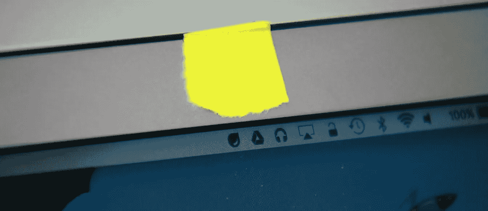
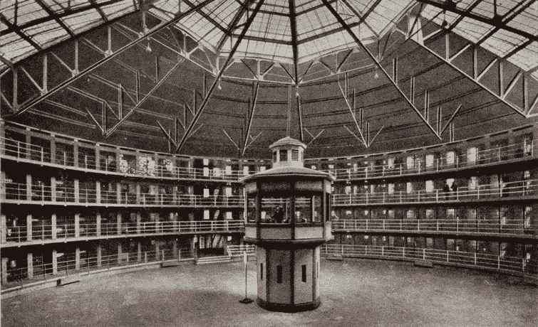
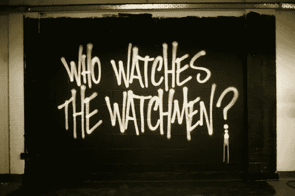

# 数据的阴暗面:隐私

> 原文：<https://towardsdatascience.com/dark-side-of-data-privacy-ba2850de512?source=collection_archive---------35----------------------->

## 我们都很欣赏 **AI** 和**机器学习**的价值，但是 **w** 关于隐私方面呢？

一张盖着摄像头的[照片](https://livedoor.blogimg.jp/zap2/imgs/9/f/9f78b428.jpg)。

你认识最近在日常生活中使用**谷歌眼镜**的人吗？也许几年后这个问题会演变成一个新的问题问谁还记得它。关于谷歌眼镜的故事的普遍观点承认它是一个商业失败，如果我们不陷入忽视这一失败的隐私方面的错误，这是一个合理的推断。

与 10 年前相比，如今对个人数据隐私的关注程度更高，并且还在继续增加。但它是否达到了可以瓦解巨型公司的大量产品的水平，尽管它们的功能很有吸引力？

我非常怀疑社会中的隐私观念是否达到了令人满意的程度。技术发展很快，其后续影响在多年后才显现出来。我们都很欣赏 **AI** 和**机器学习**的价值，但是 **w** 关于所有这些数据的隐私方面呢？我称之为**数据的阴暗面**尤其是那些工作基于数据的人，在这件事上负有重大责任。

## 现代世界中的隐私

1890 年，沃伦·布兰代斯 T20 首次描述了隐私。在他们的文章中，隐私被定义为“不受打扰的权利”。在那个时代，世界是一个不同的地方，因此他们引用摄影设备和报纸，而主张这个定义。它今天仍然有效，但是它肯定不足以表达当代隐私概念的所有方面。

在现代社会，定义隐私要复杂得多。事实上，它比以往更加模糊。除了技术带来的好处之外，我们还面临着近期发展带来的副作用。正如在**福柯**的 ***纪律与惩罚:监狱的诞生*** 中所解释的那样，处于监视之下会使人们无法创造新的想法，并使人们质疑自己，在社会中发起自我审查运动，这有助于创造一个适当的环境，让暴虐的政权轻松地统治社会。

圆形监狱(杰里米·边沁设计的监狱，他启发了福柯)

那么，为了保护自己，我们应该停止使用技术吗？在这样一个技术成瘾的世界里做到这一点绝对不是那么简单的。让我们考虑一些例子，就侵犯隐私而言，您会如何应对以下设备:

*   你家周围的闭路电视摄像头。*-如果它阻止了恐怖袭击呢？*
*   **移动设备中的位置跟踪器**。如果它在自然灾害中救了你的命呢？
*   **手表中的心率测量器**。如果它在心脏病发作前警告你怎么办？
*   电视机上的一个**音频收听器**。*-如果它推荐了你正在搜索的产品呢？*

是的，我知道最后一个看起来不是那么不可或缺，但每件事都有利弊，每个人都有不同的重要程度，要对自己的数据做出有意识的决定，必须有一定程度的意识。除了技术在我们日常生活中的众多优势，问题仍然存在:谁将保护我们的敏感个人数据免受自私的科技公司、令人不快的政府或功利主义黑客的侵害？

> 保护你的隐私是很难的，因为如果你失足一次，它将永远存在。
> 
> —艾伦·施瓦茨

很明显，最近的一些案例如**剑桥分析**有助于让社会关注数据的伦理方面。马特图尔克在他的 [**2019 数据&艾景观**](https://mattturck.com/data2019/) 报告中解释道:

> 或许比以往任何时候都更重要的是，隐私问题在 2019 年跃升至公共辩论的最前沿，现在处于前沿、左侧和中心位置。我们与隐私的关系仍然很复杂，充满了混杂的信号。人们说[他们关心](https://www.internetsociety.org/wp-content/uploads/2019/05/CI_IS_Joint_Report-EN.pdf) [的隐私](https://www.internetsociety.org/wp-content/uploads/2019/05/CI_IS_Joint_Report-EN.pdf)，但是继续购买各种具有不确定隐私保护的连接设备。他们说他们对脸书的隐私泄露感到愤怒，但脸书继续增加用户并超出预期(2018 年第四季度和 2019 年 Q1)。

## 你的客户是谁？

上面这个奇特的标题是罗马诗人尤维纳利斯的，可以翻译成“谁看着守望者？”。我用这句话来强调政府和公共机构等隐私机构之间的相互依赖性。

在这一点上，各种数据相关的行动都以某种方式依赖于法律法规，如 **GDPR** ，可以肯定的是，这些立法是隐私保护工作的一大进步，但它们不是确切的解决方案。

另一方面，像[**Privacy International**](https://www.privacyinternational.org)这样的基金会在组织人员和建立共同的数据伦理方面发挥着关键作用。此外，由于数据相关领域越来越受欢迎，一些其他机构正在发布自己的道德准则，以明确这种卡夫卡式的环境。

然而，这些致力于隐私权的机构和群众运动本身是不够的。在我看来，这些努力需要来自数据行业中间的人的实际和道义上的支持。所有类型的数据从业者都对他们在这个领域的工作负责。

Dj 帕蒂尔用 5 C 解释了 [**数据科学的伦理规则**](https://medium.com/@dpatil/ethics-data-science-ff21d0c29346) :

*   同意
*   清楚
*   一致性
*   控制和透明度
*   后果和危害

无论你涉及多少数据，关注这样的数据科学伦理是建立数据隐私和使你的工作尊重普遍人权的关键。

[**可信人工智能伦理准则**](https://ec.europa.eu/futurium/en/ai-alliance-consultation)**欧盟**报告强调人权的价值及其与人工智能的关系:

> 必须确保平等尊重所有人的道德价值和尊严。这超出了不歧视的范围，不歧视允许根据客观理由区分不同的情况。

此外，在同一份报告中还提到了人工智能的隐私方面:

> 人工智能系统必须在系统的整个生命周期中保证隐私和数据保护。…人类行为的数字记录可能让人工智能系统不仅可以推断个人的偏好，还可以推断他们的性取向、年龄、性别、宗教或政治观点。为了让个人信任数据收集过程，必须确保收集到的关于他们的数据不会被用于非法或不公平地歧视他们。

## 人类最古老最强烈的情感

在这篇文章中，我不打算提及侵犯隐私的危害，相反，我旨在提及一些有意识的人的道德责任。我知道很难确定哪种行为是道德的，因为它会因情况而异。无论如何，道德准则为我们提供了路线图，我们有责任让我们的工作尊重人权和数据隐私。我认为，这种责任优先于金钱，因此，如果有人要求你打破你的原则，你必须有能力拒绝。

> 人类最古老、最强烈的情感是恐惧，而最古老、最强烈的恐惧是对未知的恐惧
> 
> ——惠普·洛夫克拉夫特

## 结论

我们都在使用强大的机器学习工具，访问大量的数据源，并轻松地充分利用这些技术机会。然而，应该记住，所有这些权力都伴随着责任，数据伦理是这个领域不可分割的一部分。这样我们就能最大限度地减少未知，并与最强烈的恐惧作斗争。

## 这一领域的一些其他来源:

*   [经合组织人工智能原则](https://www.oecd.org/going-digital/ai/principles/)
*   [申报—蒙特利尔负责人艾](https://www.montrealdeclaration-responsibleai.com/the-declaration)
*   [**人工智能伦理:七个陷阱**](https://freedom-to-tinker.com/2019/03/25/ai-ethics-seven-traps/) 安妮特·齐默曼和本德特·泽文伯根著
*   隐私是新的数字鸿沟，作者夏羽·拉沃伊
*   我强烈推荐关注 Zeynep tüfek ci，因为她在这个主题上的文章非常出色。