# DataViz 系列:仪表板 KPI 基本模板

> 原文：<https://towardsdatascience.com/dashboard-kpi-essential-template-hands-on-tableau-b02703bceca6?source=collection_archive---------4----------------------->


在 [Unsplash](https://unsplash.com/photos/hGV2TfOh0ns) 上由 [Austin Distel](https://unsplash.com/@austindistel) 拍摄的照片

## [实践教程](https://towardsdatascience.com/tagged/hands-on-tutorials)

## 仪表板中 KPI 模板可视化的剖析。带 Tableau 的动手演示，从零开始。

关键绩效指标(KPI)是任何业务领域中任何仪表板的基石。制造这些砖块的一个聪明的方法是开发一个 KPI 模板，这是一组混合数据来解释业务的表达式和参数。好的，但是我们如何制作 KPI 模板呢？

# 介绍

在本文中，我将解释并展示如何在专业仪表板中开发干净的 KPI 可视化的底层对象。这个想法是建立一个可以应用于任何业务领域的 KPI 模板。

我将通过 Tableau 来完成，但它可以很容易地适应其他 dashboarding 工具，如 Qlik 或 Power BI。如果您希望以演示的方式重复这些步骤，您可能希望创建一个 Tableau 公共登录(免费)，并下载我使用的数据集([链接](https://drive.google.com/file/d/1nra_8PiQ7huIyjAtM6-qNh259Qwx6SJR/view?usp=sharing))。

如果你读了我的另一篇文章“仪表板设计的灵感”(下面的链接)，我将在这里解释如何准确地开发驾驶舱中显示的任何 KPI。

[](https://medium.com/analytics-vidhya/inspiring-ideas-for-dashboards-design-172b31ca9620) [## 仪表板设计的灵感来源

### 如何将业务指标和故事塑造成仪表板

medium.com](https://medium.com/analytics-vidhya/inspiring-ideas-for-dashboards-design-172b31ca9620) 

关于 Tableau 的详细信息，我已经在下面链接的另一篇文章的“*报告或仪表板:Tableau Public* ”一节中谈到了它的公共版本

[](https://medium.com/analytics-vidhya/create-a-real-world-data-science-environment-at-home-7a4255ff6fa5) [## 在家创建“真实世界”的数据科学环境

### 我在家里的“真实世界”数据科学环境:数据库，ETL，数据分析，仪表板，9 个步骤。

medium.com](https://medium.com/analytics-vidhya/create-a-real-world-data-science-environment-at-home-7a4255ff6fa5) 

# **KPI 要求**

我们的目标是通过构建 KPI 的 3 个核心元素:KPI 值、趋势和绩效，来构建所有的对象，以制作一个标准的 KPI 模板。

例如，下面的可视化使用了我们将要开发的模板的 8 倍。


来自 Tableau Public 的截图

我们的 KPI 模板的输入是一个数据集，其中包含一个随时间变化的业务度量(例如，ID_DATE 上的月销售额)。

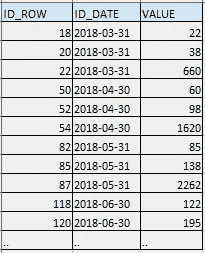

作者截图

我们希望 KPI 模板可视化能够动态响应时间和性能范围的选择器。

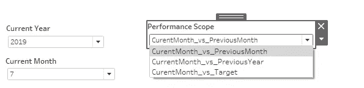

作者截图

KPI 模板的输出需要提供 3 个信息

**a)所选期间内业务指标的 KPI 值**

**b) KPI 绩效**定义为 KPI 值与基准

**c) KPI 在一年滑动期内的趋势**

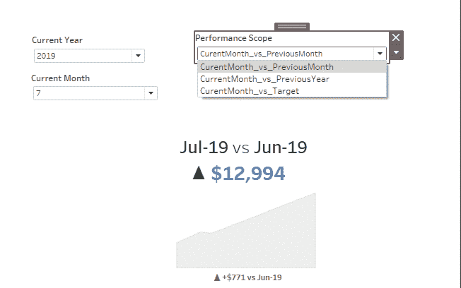

作者截图

# 动手操作:Tableau 的 KPI 开发

在接下来的 6 个段落中，我将带您一步步地了解 KPI 模板可视化的实际开发过程。

## **1。创建数据源**

你可以从这个[链接](https://drive.google.com/file/d/1nra_8PiQ7huIyjAtM6-qNh259Qwx6SJR/view?usp=sharing)下载源数据集。

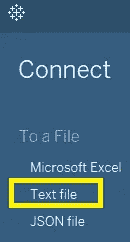

作者截图

创建一个 Tableau 工作簿，并将“数据源”选项卡配置为连接到一个文本文件(该文件在示例中是一个. csv 文件)。

完成后，您应该会看到导入的数据:每一行都给出了一段时间内业务度量的值(例如，它可以是利润、利润，..，如果您处理销售领域、净推销商分数、参与度，..，在数字营销等方面。).

“值”是业务度量，“Id 日期”是它所引用的日期。

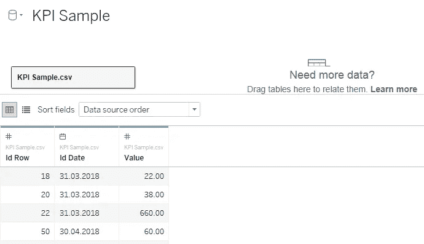

作者截图

数据类型是自动选择的，但是您总是需要检查它。


在这种情况下，它们是正确的:#表示数字列，Date 表示“Id Date”。您将始终需要检查这一点，以防手动更改数据类型。

我们现在需要创建所有的 Tableau 对象，它们将成为我们可视化的基础。这一切都是通过底部的选项卡创建一个 **Tableau Sheet** 开始的。

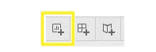

Tableau 表是 Tableau 中最详细的可视化级别。在这里您可以定义包含数据表达式(计算、转换、过滤等)的对象。)和可视化(图表、视图、地图等)。).通常，仪表板由几个 Tableau 表组成。

在左侧，您可以看到源文件的 3 列。Tableau 已经为它们添加了一些智能:它将“Id 日期”和“Id 行”归类为维度对象(蓝色)，将“值”归类为度量(绿色)。

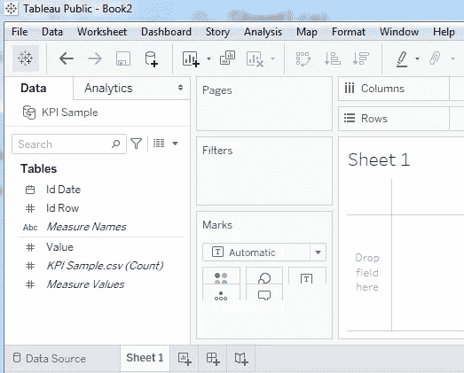

作者截图

## 2.构建参数和选择器

参数可用于向尺寸或度量对象传播值。在 Tableau 中(其他工具不同)，使用参数的方法之一是通过选择器设置其值。另一种方法是存储一个常量值。对于我们的 KPI 模板，我们决定显示 3 个选择器:当前月份、年份和绩效范围。

*   C **当前月份:**将其定义为整数列表，取值范围为 1 到 12。

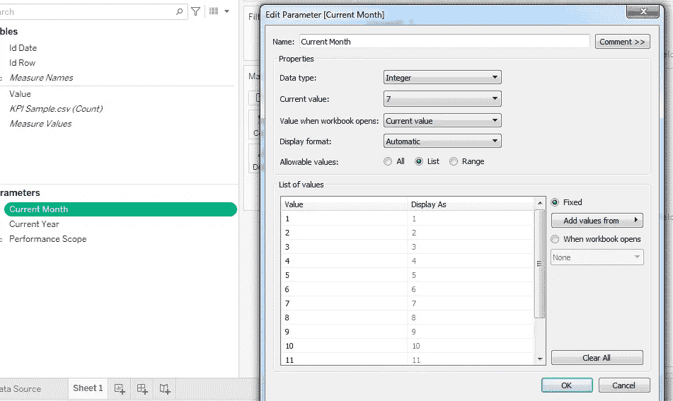

作者截图

*   **当前年份**:定义为整数列表，有你需要的年份(2018，2019，2020)。

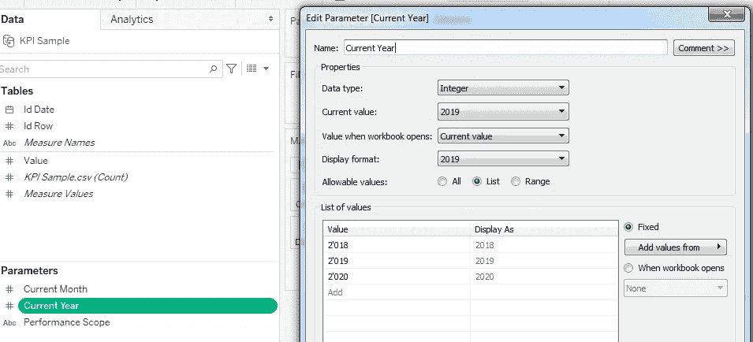

作者截图

*   **性能范围**:定义为一个字符串列表，包含您想要允许的性能。在此模板中，我们提供了显示 3 个范围，但您可能希望添加更多范围:

*当前月份与目标值的比较*

*当月与上月相比*

*当前月份与去年当前月份的对比*


作者截图

现在我们已经创建了 3 个参数，接下来我们可以构建实际的用户选择器:右键单击每个参数并选择“Show Parameter ”,这样它们就会出现在您的工作表中，并且可以被更改。

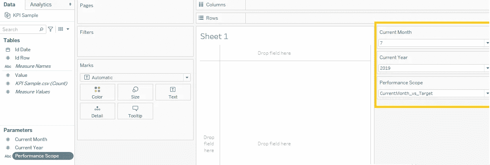

作者截图

要像我一样显示选择器，您需要右键单击参数并选择紧凑列表视图模式。

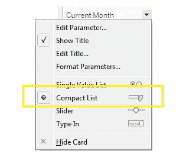

作者截图

最后，我们需要创建一个新参数来定义我们希望用于性能范围“当前月份与目标值”的目标值。我们可以将其定义为 10000(这可能代表期望的月销售利润、新客户数量或任何其他目标基准)。

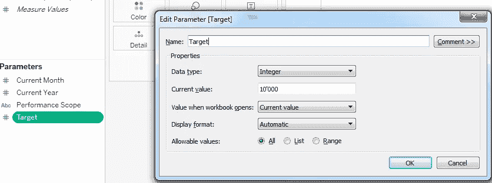

作者截图

## 3.创建公用设施维度

基于上面定义的选择器“当前年份”和“当前月份”，我们需要通过构建一些维度来解释它们所代表的实际日期，我称之为效用维度。即使用户只选择一对“当前年份”和“当前月份”，这些维度也允许计算几个度量值，每个度量值在不同的时间段进行计算。

创建以下 4 个对象维度

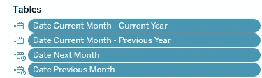

作者截图

用下面的表达式

```
**Date Current Month - Current Year 
=** MAKEDATE([Current Year],[Current Month],1)**Date Current Month - Previous Year** 
= MAKEDATE([Current Year]-1,[Current Month],1)**Date Next Month** 
= DATEADD('month',1,[Date Current Month - Current Year])**Date Previous Month**
= DATEADD('month',-1,[Date Current Month - Current Year])
```

解释:函数 MAKEDATE 根据提供的年、月和日建立一个日期。在我们的模板中，年和月是我们的参数，日被设置为 1。

函数 DATEADD 递增(或递减)所提供的日期。在这里，我们通过在当前月份上加 1 来计算下个月的日期。

然后我们创建一些维度，以文本格式很好地显示日期，比如

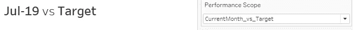

作者截图

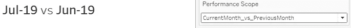

作者截图

为此，我们创建了以下两个维度

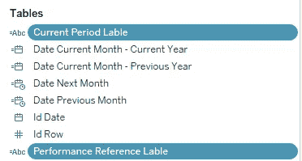

作者截图

由下面的表达式定义。

```
**Current Period Lable**
= LEFT(DATENAME(“month”, [Date Current Month — Current Year]),3)
 + “-” + RIGHT(DATENAME(“year”,[Date Current Month — Current Year]),2)**Performance Reference Lable**
= CASE [Performance Scope]
WHEN   'CurrentMonth_vs_PreviousMonth' THEN LEFT(DATENAME("month", [Date Previous Month]),3)
        + "-" + RIGHT(DATENAME("year",[Date Previous Month]),2)
WHEN 'CurrentMonth_vs_PreviousYear' THEN LEFT(DATENAME("month", [Date Current Month - Previous Year]),3)
        + "-" + RIGHT(DATENAME("year",[Date Current Month - Previous Year]),2)
WHEN 'CurrentMonth_vs_Target' THEN "Target" 
END
```

正如您所注意到的，它们基于我们之前构建的对象，而这些对象又是基于参数构建的。

## **4。在时间范围内建立 KPI 指标**

这里是最有趣的部分:实际的 KPI 计算。对于任何 KPI，我们都需要两个成分:一个**业务** **度量**，以及一个**业务规则**来将度量转化为 KPI。例如，来自电信公司:电话呼叫的持续时间将是业务度量，KPI“每日平均持续时间”的业务规则将是:每天电话呼叫的平均持续时间。

在我们的 KPI 模板中，我们的业务度量对应于 Tableau 对象“Value”，它表示名为 Value 的源列。我选择按月计算总值作为业务规则。

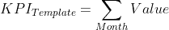

可以通过改变聚合函数来改变规则。例如，每笔交易的平均金额如下:

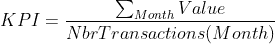

让我们构建相应的 Tableau 对象:


作者截图

为什么我们需要 3 个度量？因为我们考虑 3 个不同的时期:当月，上月，上年的当月。稍后当我们计算 KPI 绩效时，您会更好地理解原因。

他们的表达如下:

```
**KPI (Current Month)**
=SUM(IF (YEAR([Id Date]) = [Current Year] 
         AND MONTH([Id Date]) = [Current Month]) 
    THEN [Value]
    ELSE NULL
    END)**KPI (Previous Month)**
=SUM(IF (YEAR([Id Date]) = YEAR([Date Previous Month])
         AND MONTH([Id Date])= MONTH([Date Previous Month]) )
    THEN [Value]
    ELSE NULL
    END)**KPI (Current Month Previous Year)** =SUM(IF (YEAR([Id Date]) = [Current Year] - 1
         AND MONTH([Id Date]) = [Current Month]) 
    THEN [Value]
    ELSE NULL
    END)
```

让我们解释一下第一个表达式 **KPI(当月)**，其他的遵循相同的概念。我们需要保留属于当前月份的源“**值**，并在其他地方强制为空。

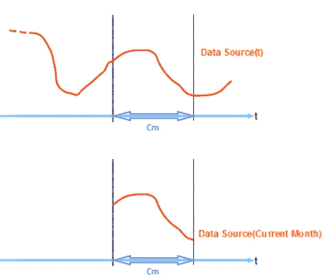

作者截图

这个过滤是由蓝色突出显示的表达式部分完成的，它逐行测试我们的数据源的日期(“Id Date”)是否属于“当前年份”和“当前月份”期间。

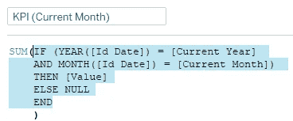

作者截图

例如，如果日期选择器设置为 2018 年 4 月，KPI 将只考虑绿色的源数据:

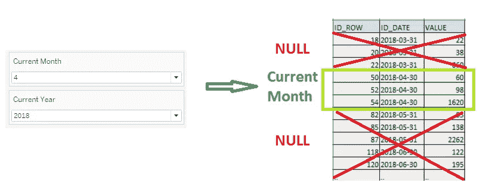

作者截图

下面突出显示的表达式的剩余部分聚合了 KPI 定义范围内的所有值(即 Sum)。

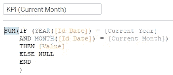

作者截图

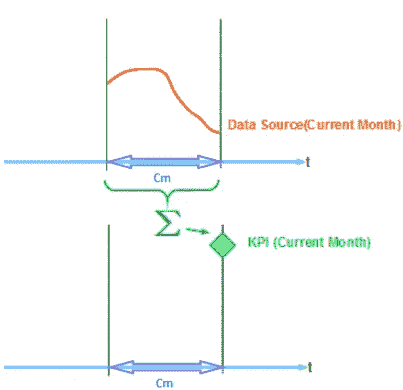

作者截图

最后，我们可以构建另一个度量，读取之前构建的参数“**性能范围”**。创建对象

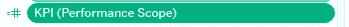

带着表情:

```
**KPI (Performance Scope)**
=CASE [Performance Scope]
WHEN 'CurrentMonth_vs_PreviousMonth' THEN  [KPI (Current Month)]
WHEN 'CurrentMonth_vs_PreviousYear' THEN  [KPI (Current Month)]
WHEN 'CurrentMonth_vs_Target' THEN  [KPI (Current Month)]
END
```

您可以看到，根据性能范围选择器，该对象充当一个开关，选择一个 KPI(t)。在我们的模板中，我们决定只查看当前月份，因此在任何情况下我们的开关都是“KPI(当前月份)”，但是您可能希望将其扩展到其他范围(例如，当前年度、季度、周等)。).

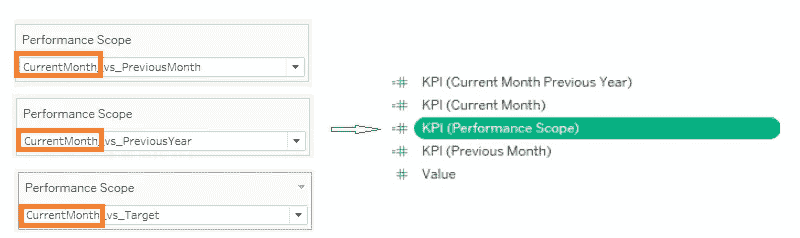

作者截图

为了可视化我们的 KPI 的趋势，我们希望显示它在滑动年份的值。为此，我们可以构建以下对象和表达式，它利用了我们之前计算的日期。

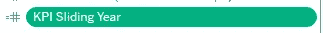

```
**KPI Sliding Year**
=SUM(IF ([Id Date] > [Date Current Month - Previous Year] 
         AND [Id Date] < [Date Next Month] )
    THEN [Value]
    ELSE NULL
    END)
```

## 5.构建参考度量

为了显示 KPI 性能，我们需要将一个时间范围内的 KPI 与一个基准进行比较。对于我们的 KPI 模板，我们设置了 3 个不同的基准:目标值、上个月的 KPI 值和上一年的同一个月。

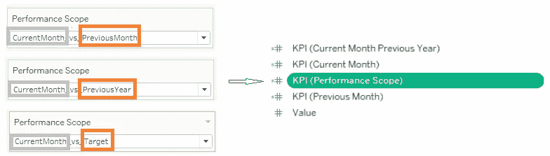

作者截图

为了允许引用的动态行为，我们需要构建以下 4 个对象，我将在下面解释。

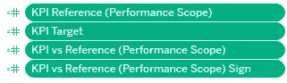

作者截图

```
**KPI Target**
=[Target]
```

这个对象只是从之前创建的参数 Target 派生而来。

```
**KPI Reference (Performance Scope)**
=CASE [Performance Scope]
WHEN 'CurrentMonth_vs_PreviousMonth' 
      THEN  [KPI (Previous Month)]
WHEN 'CurrentMonth_vs_PreviousYear' 
      THEN  [KPI (Current Month Previous Year)]
WHEN 'CurrentMonth_vs_Target' THEN  [KPI Target]
END
```

根据选择器**绩效范围**的值，选择三个基准 **KPI(上月)、KPI(当月上年)**或 **KPI 目标**中的一个作为参考。

```
**KPI vs Reference (Performance Scope)**
=[KPI (Performance Scope)] - [KPI Reference (Performance Scope)]
```

该对象通过计算差异，将所选范围的 KPI 与 **KPI 参考(绩效范围)**进行比较。在其他情况下，表达式也可以是比率或%。

然后，我们创建另一个(相同的)度量，该度量仅用于以不同的方式显示其值。当我们构建实际的可视化时，我们将看到如何配置一些额外的属性。

```
**KPI vs Reference (Performance Scope) Sign**
=[KPI (Performance Scope)] - [KPI Reference (Performance Scope)]
```

## **6。将一切放在一起:KPI 可视化**

我们现在需要结合 Tableau 维度和度量来制作我们的动态 KPI 可视化。

简而言之:我们将把维度和度量合并到 5 个 Tableau 工作表中，定义如何可视化它们中的每一个，最后使用工作表组成一个仪表板部分来呈现 3 个 KPI 的基本元素:值、趋势和绩效。

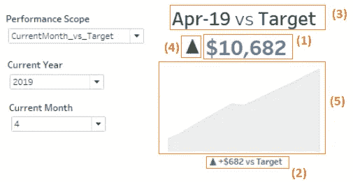

作者截图

*   (1) KPI 值
*   (2)标题
*   (3)期间标签
*   (KPI 值与参考值的符号
*   (5) KPI 趋势

我将在下面介绍如何制作每张工作表。

## (1) KPI 值

让我们从 KPI 值开始:您需要将对象 **KPI (Performance Scope)** 作为文本拖放(只需将其拖放到文本标记中，参见下面的黄色箭头)。

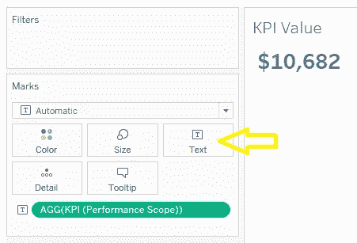

作者截图

要像我一样设置文本格式，您需要单击文本标记并设置如下属性

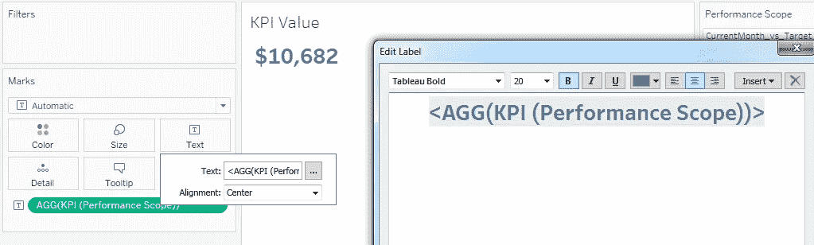

作者截图

有几种方法可以显示$符号。一种是右键单击 KPI(绩效范围)对象，格式化，并编辑数字格式如下:

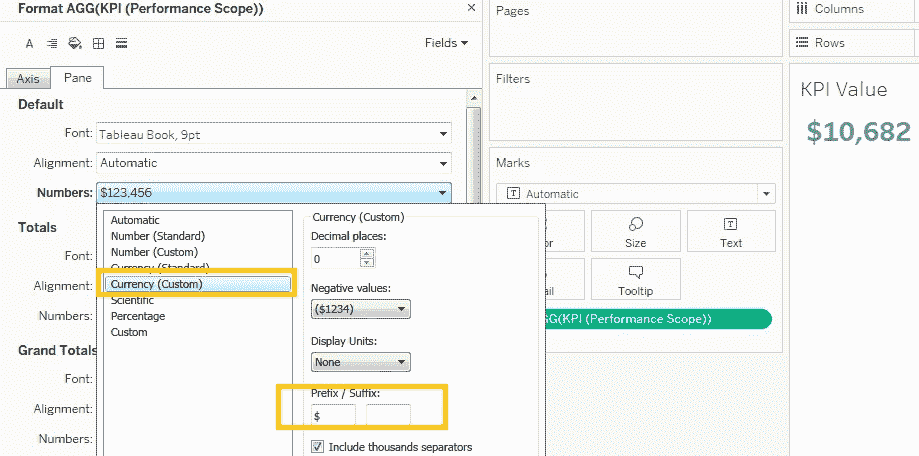

作者截图

**(2)字幕**

标题区域显示 KPI 值与所选绩效值的比较。

您需要创建一个新的 Tableau 工作表，拖放 **KPI vs Reference(绩效范围)**和**Performance Reference Lable**作为工具提示(只需将它们拖放到工具提示标记中，参见下面的橙色箭头)。

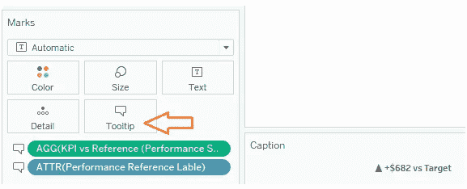

作者截图

使“标题”窗口在 Tableau 画布的底部可见，单击顶部菜单“工作表”，然后选择“显示标题”。

然后双击标题区域和“插入”，添加两个对象如下

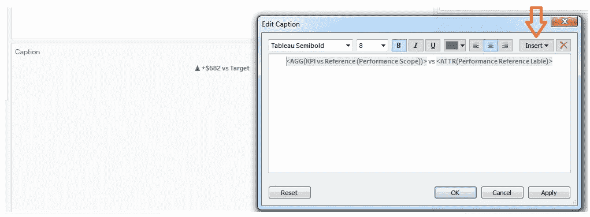

作者截图

要设置为 **KPI vs Reference(绩效范围)**显示的格式，您需要编辑其格式，如下所示

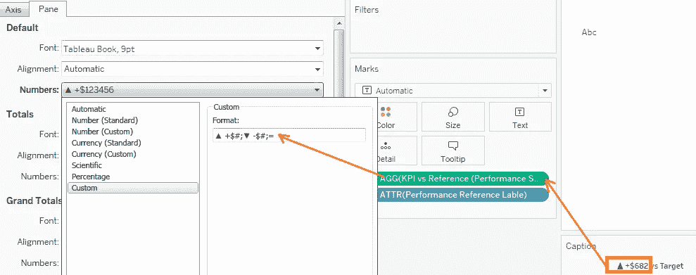

作者截图

我用的表达是

```
▲ +$#;▼ -$#;=
```

## (3)期间标签

周期标签显示了我们分析的周期和比较的基准。

要构建可视化，您需要创建一个新的工作表，并将对象**绩效参考标签**和**本期标签**作为文本拖放

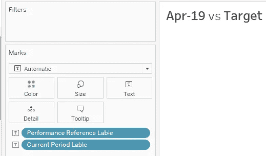

作者截图

**(4)KPI 值与参考值的符号**

为了直观地显示 KPI 值与参考值的比较，我们可以将其符号显示为彩色的▲或▼。它显示当前周期是比参考周期更好(绿色▲)还是更差(红色▼)。

要实现这一点，创建一个新的工作表，然后拖放对象**KPI vs Reference(Performance Scope)Sign**作为文本和颜色标记。

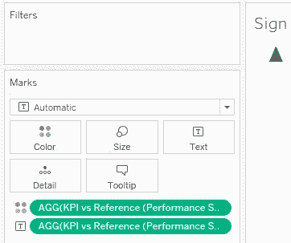

作者截图

要设置形状，请使用表达式编辑文本对象的格式

```
▲;▼;=
```

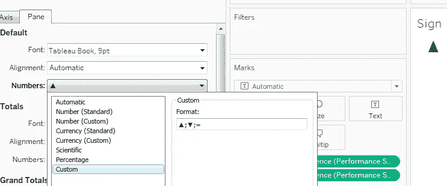

作者截图

要设置颜色，单击颜色选项卡，并选择红绿发散，以零为中心。这样正值将以绿色显示，负值以红色显示。

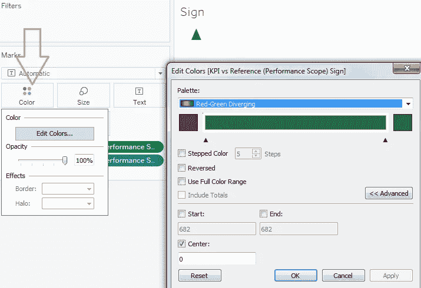

作者截图

**(5) KPI 趋势**

要显示去年的趋势，创建一个新的工作表，将 **KPI 滑动年份**拖放到区域**行中，**并在**列中定义以下表达式。**

```
DATETRUNC('month', [Id Date])
```

然后在标记编辑器中选择“区域”,你会看到类似下面的东西。

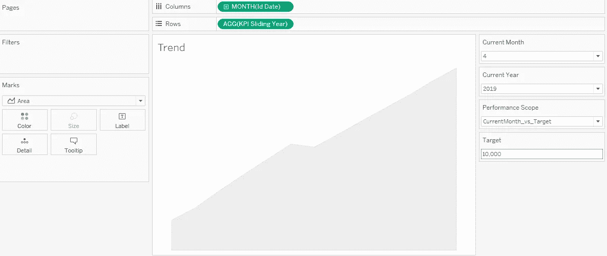

作者截图

然后，您应该自定义颜色和隐藏轴标签，以完全如上所示。

## 撰写仪表板节

您刚刚创建的所有工作表都可以合并到一个仪表板(部分)中。在真实的仪表板中，我们会一起显示许多 KPI 可视化，所有这些都基于相同的模板，以提供和谐和一致性，因此这里我们只使用一个 KPI 进行演示，以介绍这个概念。

让我们创建一个新的仪表板(通过单击下面的橙色框)并导入我们创建的所有工作表(参见黄色框)，然后将它们排列如下

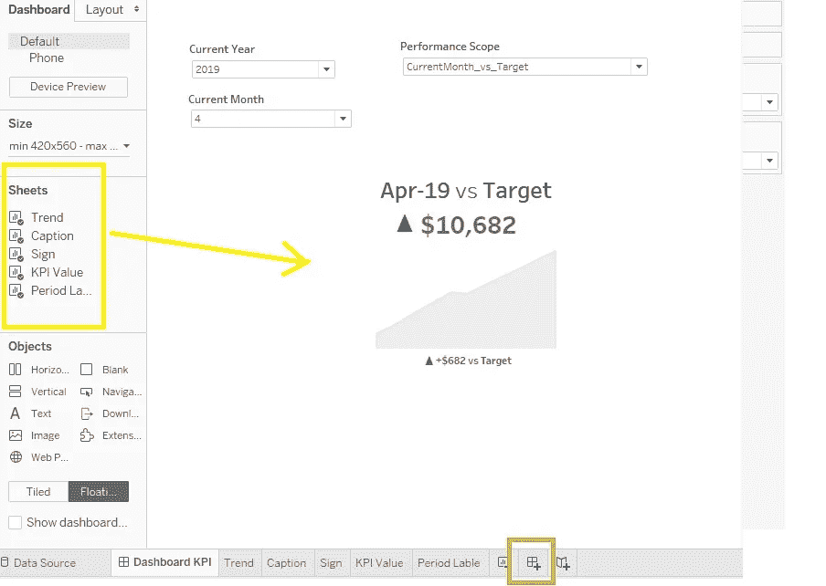

作者截图

如果您尝试更改选择器的值，您将看到 KPI 值和性能发生变化。


作者截图

## 努力

您可能认为仅仅为了一个 KPI 可视化，您就必须构建相当多的对象，对吗？。在真实的仪表板中，我们通常一起呈现许多 KPI(见下图)，并且所有 KPI 共享相同的参数和效用维度。因此，您需要进行的实际开发不到我们在此演示中所做的一半。

此外，一旦您有了 KPI 模板，您可以通过复制我们通过 4 和 5 创建的度量来创建新的模板，如果基于不同的业务规则，只需替换基本的源度量和计算。这使得开发变得快速而简单，因此我毫不怀疑使用这个或类似的 temples 所带来的优势，而不是为每个可视化构建一组自定义的对象。


来自 Tableau Public 的截图

# 简而言之…

在这个故事中，我通过一个实际操作的场景，与您分享了我构建 KPI 模板可视化的方法。KPI 模板使得仪表板开发比非结构化开发更简单、更快速、更易于维护。

该方法可轻松应用于任何其他工具(例如 Qlik、Power BI 等)。)和业务领域，只要我们有一个随时间变化的度量标准。

我还提供了我使用的源数据，并一步一步地描述了我是如何实现 KPI 模板的每个部分的，这样，无论您的技能水平如何，如果您愿意，您都可以自己重做。

[随时订阅我的**《分享数据知识》**简讯**。**](http://eepurl.com/humfIH)

