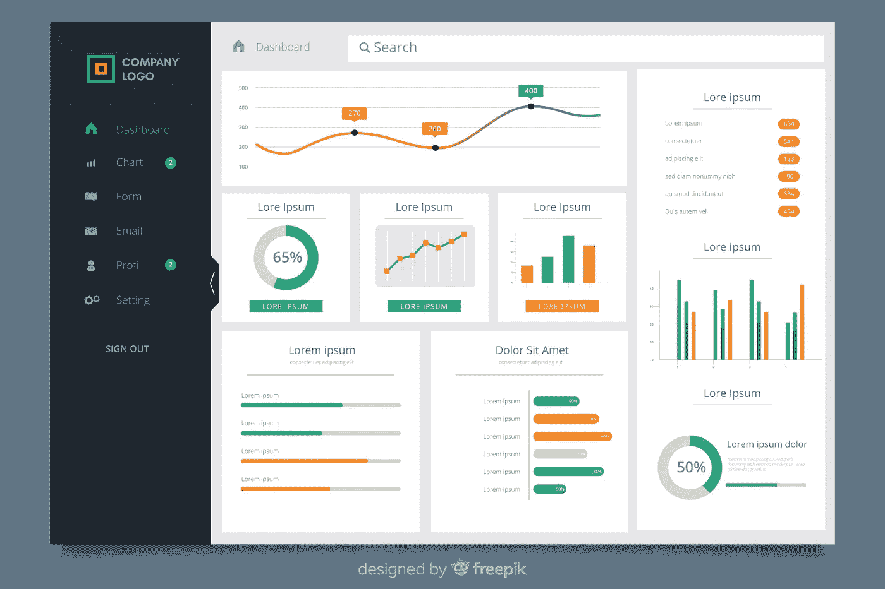
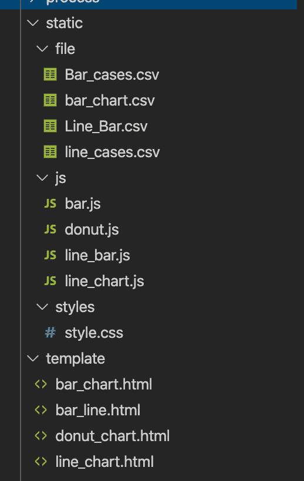

# 仪表板教程(二):HTML，CSS，PHP 和 Heroku

> 原文：<https://towardsdatascience.com/dashboard-tutorial-ii-html-css-php-and-heroku-e8bdb7f26783?source=collection_archive---------13----------------------->



照片由[freepik.com](https://www.freepik.com/free-photos-vectors/design)拍摄

网页的布局通常是通过 CSS 选择器来显示内容的元素。通过 CSS，您可以确定文本颜色、内容显示以及网页背景和图像。当在服务器上部署 web 页面时，Heroku 通常是常见的部署平台。在 Heroku 平台，可以免费托管网站，管理多个 app 文件夹，轻松与终端协同工作。在这篇博客中，我们将浏览 web 布局、文件结构和到 Heroku 的 web 部署的 CSS 选择器。

在本文中，您将学习在 Heroku 服务器上创建一个基本的仪表板和部署:

(CSS 布局介绍

(HTML、Javascript 和 CSS 文件的文件夹结构

⑶部署到 Heroku

# CSS 布局介绍

CSS 是一种装饰网页的样式表语言。CSS 使网页能够显示定制的演示文稿，包括块布局、边距、填充、字体等。在本教程中，我们将深入图表的布局。用导航条绘制 JS。

## CSS 网格布局

CSS Grid 是一个带有水平线和垂直线的二维元素——一组定义列，另一组定义行。

> 首先，我们创建一个网格容器

通过声明`display: grid`或`display: inline-grid.`该元素的所有*直接子元素*成为*网格项目*来创建网格容器。在下面的例子中，有 4 个单独的图表是用 canvas 标签和 h3 作为图的描述创建的。这 4 个图被包装在类包装器的< div >元素中，这些子元素成为网格项。

```
<div class="wrapper"><div><h3>Bar Chart of COVID active cases count in June</h3><canvas id="myChart" width="500" height="300"></canvas></div><div><h3>Line Chart of COVID cumulative cases in Canada</h3><canvas id="myChart1" width="500" height="300"></canvas></div><div><h3>Doughnut Chart of cumulative COVID cases count in Canada</h3><canvas id="myChart2" width="500" height="300"></canvas></div><div><h3>Bar Line Chart of COVID cases in Canada</h3><canvas id="myChart3" width="500" height="300"></canvas></div></div>
```

下面的例子展示了如何为网格容器创建一个包装器的选择器。接下来，我们定义网格轨迹，它是网格中显示的 2 条线的空间。在网格容器中，**网格模板列**和**网格模板行**用于定义行和列。属性的`grid-template-columns`可以定义列轨道的大小。Grid-template-columns 设置为 800 像素宽的列轨道。另外，我在行和列上都创建了一个 50 像素的间隙。

```
 .wrapper {display: grid;grid-template-columns: 800px 800px;column-gap: 50px;row-gap: 50px;}
```

## 链接 CSS 文件和外部资源

下面的例子展示了在 CSS 文件中嵌入的方法。外部和内部 CSS 源都应该包含在<link>元素中，<link>元素需要放在`<head>`和`</head>`标签之间。因此，HTML 网页将从< link >元素链接到样式表。

```
<link rel="stylesheet" href="https://stackpath.bootstrapcdn.com/bootstrap/4.3.1/css/bootstrap.min.css" integrity="sha384-ggOyR0iXCbMQv3Xipma34MD+dH/1fQ784/j6cY/iJTQUOhcWr7x9JvoRxT2MZw1T" crossorigin="anonymous"><link rel="stylesheet" href="../static/styles/style.css">
```

# HTML、Javascript 和 CSS 文件的文件夹结构

对于仪表板，有几个不同的文件，如数据集 CSV 文件、绘图 javascript 文件、样式表 CSS 文件和网页 HTML 文件。最好将不同的文件存放在项目主目录下的每个文件夹中。通常，子目录中有一个静态文件夹来存储各种文件。例如，我的所有数据集都存储在文件夹中，js 文件存储在 js 文件夹中，CSS 文件存储在 styles 文件夹中，HTML 文件存储在 template 文件夹中。



## Javascript 和 HTML 文件的交互

下面显示了在 HTML 文件中创建的 ChartJS 图，其画布 id 为“myChart”。

```
<div><h3>Bar Chart of COVID active cases count in June </h3><canvas id="myChart" width="500" height="300"></canvas></div>
```

在 Javascript 文件中，我们将通过使用**document . getelementbyid()**函数调用调用“myChart”id 来呈现绘图。

```
var ctx = document.getElementById("myChart");
```

在 html 文件中，我们可以通过使用

```
<script src="../static/js/bar.js"></script><script src="../static/js/line_chart.js"></script><script src="../static/js/donut.js"></script><script src="../static/js/line_bar.js"></script>
```

## CSS 文件选择器

现在，我们深入研究 CSS 选择的字体和文本。我们通过使用属性`font-family.`来定义文本的字体。文本对齐被指定为以`text-align: center.`为中心。也可以选择为网页指定字体大小为`font-size: 10px;`。就边距而言，它显示了文本周围的空间。使用`margin: 0 0 0.1em`，文本显示为上、下、左、右边距，后跟顺序。因为`<body>`是内容页面的父元素，所以它里面的所有元素都继承了相同的`text-align`和`font-family`。

```
body {font-family: Helvetica Neue, Arial, sans-serif;
text-align: center;
font-size: 10px;
margin: 0 0 0.1em 0;
color: rgb(89, 112, 240);}
```

接下来，我们研究 CSS 选择器中的块概念。在 HTML 文件中，我们使用标签`<a>`来定义一个超链接，用于从一个页面链接到另一个页面。在 CSS 文件中，block 元素可以应用边距和其他间距值。然而，<标签是一个没有边距值的内嵌元素。为了对超链接标签应用边距，我们需要添加显示参数`display: block;`。然后，我们可以通过`margin-top: 50px;`给出顶部的保证金值

```
a {margin-top: 50px;display: block;color: #3e95cd;}
```

# **Heroku 部署**

要在 web 服务器而不是本地主机上部署仪表板，Heroku 通常是一个流行的部署选项。从 Heroku 开始，支持 Ruby，Node.js，Clojure，Python，Java，Gradle，Grails，Scala，Play，PHP，Go。然而，编程语言并不是为典型的 HTML、CSS、Javascript 语言提供的。好的解决方案是为网页构建一个 **PHP 应用**。我将向您介绍 Heroku 设置、git 设置、PHP 文件创建和项目部署到 Heroku 平台的步骤。和 tada，项目显示有一个 HTML 链接，外部访问可以共享该链接。

(1)注册一个帐户并安装 Heroku。( [link1](https://www.heroku.com/) ， [link2](https://toolbelt.heroku.com/) )

(2)在终端中，输入 **Heroku 登录**所需的凭证。

(3)初始化一个本地 Git 存储库并提交您的应用程序代码。
在终端中，键入下面列出的命令行

```
cd your_project
git config --global user.email “you@example.com”
git config --global user.name "Your Name"
```

(4)准备 PHP 文件来呈现 HTML 页面。前往包含 index.html 的项目根目录

(5)在这个目录下，运行`touch composer.json`创建一个文件:composer.json，在 json 文件中，添加{}。

(6)在同一个目录下，运行`touch index.php`创建一个文件:index.php。在 PHP 文件中，添加`<?php include_once("index.html"); ?>`

(7)在终端，我们初始化 git 库，将项目文件夹推送到 Heroku 服务器进行部署。在终端中，键入下面列出的命令行

```
cd your_project
# Create a local git repository
git init 
# Add all your local files to repository
git add .
# Commit your files
git commit –m “First commit”
# Create an empty Heroku app, make sure the app name is unique with your own creation
heroku create php-dashboard-tutorial 
# push our application to Heroku
git push heroku master
# check one instance of the app is running
heroku ps:scale web=1
```

神奇的事情发生了。现在，您的仪表板已经成功部署到 Heroku 服务器上，并且可以通过外部 web 链接进行访问。

# 总之:

*   CSS 选择器可以用来设置用类定义的 HTML 标签元素的样式。网格容器可以显示网页项目的列和行的布局。<link>元素用于在 HTML web 文件中嵌入内部和外部 CSS 样式表。
*   最好将不同的文件存储在静态目录下的特定文件夹中。在 HTML 文件中，我们可以通过使用
*   Heroku 作为一个 web 服务器平台，支持 Ruby、Node.js、Clojure、Python、Java、Gradle、Grails、Scala、Play、PHP、Go。作为一种选择，带有 HTML、CSS、Javascript 的仪表板可以通过一个额外的 PHP 文件为 Heroku 部署工作。此外，Heroku 需要一个 git 存储库来将项目文件夹推送到 web 服务器。

> **我的简单 COVID 仪表盘链接:** [【https://dd-dashboard-3.herokuapp.com/】](https://dd-dashboard-3.herokuapp.com/)

> 希望您能从教程中获得一个仪表板！


# 参考:

1.  CSS 基础知识:[https://developer . Mozilla . org/en-US/docs/Learn/Getting _ started _ with _ web/CSS _ basics](https://developer.mozilla.org/en-US/docs/Learn/Getting_started_with_the_web/CSS_basics)

2.网格布局的基本概念:[https://developer . Mozilla . org/en-US/docs/Web/CSS/CSS _ Grid _ Layout/Basic _ Concepts _ of _ Grid _ Layout](https://developer.mozilla.org/en-US/docs/Web/CSS/CSS_Grid_Layout/Basic_Concepts_of_Grid_Layout)

3.将您的 Python web 应用程序部署到 Heroku cloud:[https://Python how . com/deploying-your-web-application-to-the-cloud/](https://pythonhow.com/deploying-your-web-application-to-the-cloud/)

4.如何在 Heroku 上运行简单的 HTML/CSS/Javascript 应用:[https://medium . com/@ Winnie Liang/how-to-Run-a-Simple-HTML-CSS-Javascript-Application-on-Heroku-4 e 664 c 541 b0b](https://medium.com/@winnieliang/how-to-run-a-simple-html-css-javascript-application-on-heroku-4e664c541b0b)

5.Heroku 用 Git 部署:[https://devcenter.heroku.com/articles/git](https://devcenter.heroku.com/articles/git)